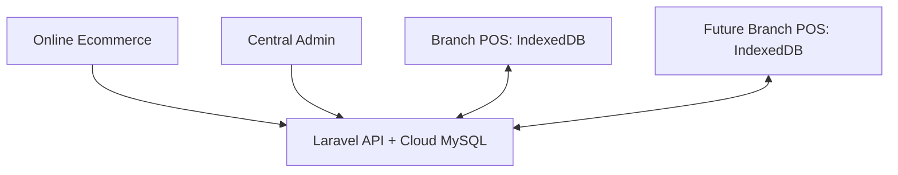

# DataPOS Ecommerce + Offline POS Project — Source of Truth

> **Document status:** Approved baseline for planning and implementation  
> **Version:** 1.0  
> **Baseline date:** 2026-07-31  
> **Decision owner:** Project Owner  
> **Purpose:** Prevent scope drift, incorrect assumptions, and conflicting implementations when humans or AI Agents work on this project.

---

## 1. How to Use This Document

This file is the primary project reference for architecture, business rules, data integrity, offline behavior, and implementation order.

Every developer or AI Agent must:

1. Read this document before proposing or changing code.
2. Inspect the existing Laravel repository and database before implementation.
3. Treat items marked **Confirmed** as requirements, not suggestions.
4. Treat items marked **Open Decision** as questions for the owner; do not invent an answer.
5. Keep existing Ecommerce behavior working unless a change is explicitly approved.
6. Update this document whenever the owner approves a material requirement or architecture change.

If code, old spreadsheets, AppSheet configuration, and this document disagree, stop and report the conflict before changing production data.

### Decision priority

1. The owner's latest explicit instruction
2. This Source of Truth
3. Approved Architecture Decision Records (ADRs)
4. Current application behavior and automated tests
5. Legacy AppSheet/Google Sheets behavior
6. Developer or AI assumptions

---

## 2. Business Goal — Confirmed

Build a reliable multi-branch system for DataPOS with:

- An online Ecommerce website.
- An installable, offline-first POS for Windows PCs and Android devices.
- Inventory, purchasing, returns, exchanges, adjustments, transfers, service jobs, debt, expenses, finance, and daily closing.
- Support for branches in different cities.
- Support for future branches without redesigning the database.
- Safe temporary migration from AppSheet and Google Sheets to Laravel.

The system must continue selling during unreliable internet service and synchronize safely after connectivity returns.

---

## 3. Confirmed System Boundary

### 3.1 One Laravel application

Use the existing Laravel Ecommerce repository as the foundation. Do **not** create a second independent Laravel POS codebase at this stage.

| URL | Responsibility |
|---|---|
| `shop-domain.com` | Public Ecommerce storefront |
| `shop-domain.com/admin` | Ecommerce and central management |
| `shop-domain.com/pos` | Installable offline-first POS PWA |
| `shop-domain.com/pos/admin` | POS, Inventory, Service, Finance, and operational management |

Use one cloud MySQL database as the central source of truth. POS devices also maintain a branch-scoped local IndexedDB store for offline operation.

### 3.2 Existing project foundation

The supplied Ecommerce project already contains useful foundations such as stores, store-user access, products, orders, order items, and store-context middleware. Reuse compatible foundations after an audit; do not assume they already satisfy POS requirements.

### 3.3 PWA scope

The POS service worker and offline cache must be scoped to `/pos/`. It must not cache or intercept the Ecommerce storefront.



---

## 4. Ecommerce and POS Relationship — Confirmed

> **Amendment (2026-08-10, Owner Approved):** Ecommerce and POS share the **same Inventory Ledger** as the source of truth (§10). `products.stock_status` is **derived** from the ledger — it may remain only as a cache/compatibility field during migration and must never be an independent competing source of truth.

- Ecommerce remains online-only.
- Online-order lifecycle enters the ledger through an **adapter/service** using `online_reserve` / `online_confirm` / `online_cancel` movement types (§10.1) — part of the Phase 1 foundation.
- Online orders may still be confirmed through Viber/Telegram using the current business process; a confirmed order is posted to the ledger via a confirmation movement, not a manual POS entry.
- POS and Ecommerce share the same stock, so overselling must be prevented.
- POS sales include a `sale_source` field:
  - `Walk-in`
  - `Ecommerce`
  - `Viber`
  - `Telegram`
  - `Facebook`
  - `Other`
- An optional Ecommerce order reference and customer details may be recorded.
- Manual, separate Ecommerce stock maintenance is discontinued — the inventory adapter (Phase 1 foundation) feeds the ledger automatically.

Do not reuse the Ecommerce `orders` table as the only POS sales table. Ecommerce orders and completed POS sales have different lifecycle, offline, payment, stock, and audit requirements.

---

## 5. Branch Model — Confirmed

Do not hardcode Shop 1, Shop 2, or a fixed branch type into business logic. Store branches as data and assign capabilities.

Examples:

| Branch profile | Enabled capabilities |
|---|---|
| Service-only | Service, service-parts inventory, debt, finance, daily closing |
| Sales-only | POS sales, inventory, purchasing, returns, exchanges, finance, daily closing |
| Sales + Service | All applicable sales and service capabilities |

Minimum capability keys:

- `pos_sales`
- `inventory`
- `service`
- `purchasing`
- `customer_debt`
- `stock_transfer`
- `online_fulfillment`
- `daily_closing`
- `finance`

Recommended normalized tables:

- `branches`
- `capabilities`
- `branch_capabilities`
- `user_branch_roles`
- `warehouses`

A user may act only when all three conditions are true:

`branch access AND branch capability AND role permission`

Hiding a menu is not authorization. Every API endpoint and server-side action must enforce the same rules.

---

## 6. Roles and Permissions — Confirmed Baseline

Minimum roles:

| Role | Baseline responsibility |
|---|---|
| Owner | Full business and configuration access |
| Admin | Operational administration across assigned branches |
| Manager | Approvals and operational control for assigned branches |
| Cashier | Add/update permitted transactions within assigned branch |
| Read-only | View permitted branch data; no mutation |

Exact permissions must be expressed as policies/permissions, not scattered email checks or role-name checks in UI code.

Sensitive actions requiring Manager or higher approval include:

- Inventory adjustments entered by a cashier.
- Voiding or reversing posted transactions.
- Exceptional price/discount overrides above an approved limit.
- Device handoff when unsynchronized work exists.
- Backdated operational changes where allowed.

---

## 7. Offline Device Policy — Confirmed

### 7.1 Supported devices

- Windows PC: primary POS device.
- Android: backup POS device.

### 7.2 One active offline writer per branch

Only one POS device may be the active offline sales device for a branch at a time. Windows and Android must not both create offline sales simultaneously for the same branch.

Device handoff requires:

1. The current device synchronizes all pending transactions.
2. The server confirms zero pending items and no unresolved error.
3. A Manager activates the replacement device.
4. The previous device is revoked or changed to non-writing mode.

If the current device is lost or damaged with unsynchronized transactions, the Manager must use an exceptional recovery workflow. The system must warn that unsynchronized local transactions may not be recoverable.

### 7.3 Local data

- Use IndexedDB for durable offline operational data.
- Cache only data needed by the assigned branch.
- Display connection, last-sync time, pending count, failed count, and active-device status prominently.
- Do not store passwords, server secrets, or privileged API credentials in the client.
- Devices must be registered, identifiable, and revocable.

---

## 8. Identifiers and Voucher Numbers — Confirmed

Every transaction needs two different identifiers:

1. **Internal immutable ID:** ULID or UUID generated safely offline.
2. **Human-readable voucher number:** used on receipts and by staff/customers.

Example voucher format:

`S1-20260731-W01-000001`

- `S1`: branch code
- `20260731`: local transaction date
- `W01`: registered Windows device code
- `000001`: device-local sequence

An Android backup may use a different registered code such as `A01`.

Requirements:

- A voucher number is unique within the whole business.
- The internal ID is the database primary reference.
- A manually supplied paper voucher number may be recorded as a separate optional reference.
- `client_transaction_id` must be globally unique and used as an idempotency key.
- Identifiers become immutable after creation.
- A staff member may enter an optional voucher number on initial service creation, but `Job_ID` and internal IDs must not be editable later.

Never use spreadsheet row number, auto-increment alone, timestamp alone, or `MAX(number)+1` across offline devices as the unique transaction identity.

---

## 9. Required Operational Modules — Confirmed

1. POS Sales
2. Purchases / Goods Receiving
3. Purchase Returns
4. Sales Returns
5. Exchanges
6. Inventory Adjustments
7. Stock Transfers
8. Stock Counts
9. Service Jobs
10. Customer Receivables
11. Supplier Payables
12. Expenses and other finance transactions
13. Daily Closing
14. Audit Logs and Approval History
15. Reports

Modules may be disabled per branch through capabilities; they must not require different application builds.

---

## 10. Inventory Architecture — Confirmed

### 10.1 Ledger is the source of truth

Do not use only `products.quantity` as inventory truth. Every stock change creates an immutable stock movement.

The ledger is the source of truth for **both POS and Ecommerce** (not a POS-only stock system). Ecommerce orders are integrated through an adapter/service so both channels cannot oversell the same stock.

Recommended core entities:

- `products`
- `product_variants` or SKUs where required
- `warehouses`
- `inventory_movements`
- `inventory_balances` as a derived/cache table
- `stock_counts` and `stock_count_lines`
- `stock_transfers` and `stock_transfer_lines`

Minimum movement types:

| Movement | Quantity effect |
|---|---:|
| `opening_balance` | + |
| `purchase_received` | + |
| `purchase_returned` | − |
| `pos_sale` | − |
| `sales_return` | + |
| `exchange_return` | + |
| `exchange_sale` | − |
| `service_consumption` | − |
| `service_part_return` | + |
| `transfer_out` | − |
| `transfer_in` | + |
| `adjustment_in` | + |
| `adjustment_out` | − |
| `internal_use` | − |
| `online_reserve` | − (reserve hold — removes from available) |
| `online_confirm` | 0 (reserve → committed; no double decrement) |
| `online_cancel` | + (releases reserve — back to available) |

Every movement should include at least:

- immutable ID
- branch and warehouse
- product/SKU
- signed quantity or direction + quantity
- unit cost where applicable
- source document type and ID
- reason code
- creator, approver where required
- offline creation and server sync timestamps

### 10.2 Warehouses and inventory states

Each branch has one or more warehouses. Future states may include:

- Retail stock
- Service parts
- Damaged
- Warranty
- Quarantine
- Scrap

Do not represent these states with ad hoc negative quantities or unstructured notes.

### 10.3 Negative stock

Default behavior: block a sale that would cause negative available stock. Any approved exception must be an explicit business setting, logged, and restricted to authorized roles.

### 10.4 Inventory valuation — weighted-average costing (2026-08-10 Owner Approved)

- Unit cost uses **weighted-average** costing.
- Receiving recalculates the average: `(current qty × current avg cost + incoming qty × incoming unit cost) ÷ (total qty)`
- Returns and adjustments are valued at the **current average cost**.
- Serial/IMEI-specific items may retain **specific cost** where necessary.
- **Negative stock must define its effect on average-cost calculation** — negative stock is blocked by default (§10.3). A specifically authorized manager override may be designed later; every override must be audited and visibly reported.
- Never use floating point for money or inventory quantities — store MMK as integer kyat and quantities as DECIMAL (Open Decision #6 — partially resolved 2026-08-10).

---

## 11. Transaction Rules — Confirmed

### 11.1 Posted documents are immutable

Drafts may be edited according to permission. Once posted:

- Do not edit or delete financial/stock-impacting lines directly.
- Correct mistakes through void, reversal, return, exchange, or adjustment documents.
- Preserve the original transaction and link the corrective document.
- Require a reason and audit event.

### 11.2 Sales

A posted sale atomically creates:

- sale header
- sale lines
- payment records
- inventory movements
- finance transaction/ledger entries
- audit record

### 11.3 Returns

- Reference the original sale when available.
- Record item condition and destination warehouse/state.
- Refund or credit must match the approved business rule.
- Returning an item to damaged/quarantine stock must not increase sellable stock.

### 11.4 Exchanges

An exchange is not a direct overwrite of the original sale. It contains:

- returned item movement (`exchange_return`)
- replacement item movement (`exchange_sale`)
- price difference payment or refund
- reference to the original sale
- reason, user, and approval where required

### 11.5 Purchases and purchase returns

- A purchase order alone does not increase stock.
- Goods receipt increases stock.
- Purchase return reduces stock and creates/updates supplier settlement records as applicable.
- Partial receiving and partial returns must be supported.

### 11.6 Inventory adjustments

- Require reason, counted quantity, expected quantity, and difference.
- Cashier-submitted adjustments require Manager approval.
- Approval creates stock movements; rejected requests do not change stock.

### 11.7 Stock transfers

Required workflow:

`Requested → Approved → Dispatched → In Transit → Partially Received/Received → Completed`

- Dispatch creates `transfer_out` from the source.
- Receipt creates `transfer_in` at the destination.
- Shortage, damage, and excess must be recorded and resolved, never silently hidden.
- Different-city branches require explicit in-transit quantity.

---

## 12. Service Module — Confirmed

A service job represents a customer-owned device and repair/service work. The customer-owned device is **not inventory**.

Minimum service concepts:

- immutable `service_job_id`
- optional human/paper `voucher_no`
- branch
- customer and contact information
- device type/model/serial or IMEI where applicable
- reported problem and intake condition
- accessories received
- diagnosis
- technician
- status history
- estimated and final charges
- payments and outstanding debt
- used parts
- warranty/return notes
- created/updated user and timestamps
- change reason and audit history

Suggested status flow:

`Received → Diagnosing → Awaiting Approval/Parts → In Repair → Ready → Delivered`

Cancellation and unrepairable states should be explicit.

Service parts consumed create `service_consumption`. An unused part returned to sellable/service stock creates `service_part_return`. These movements must reference the service job.

The optional `Voucher_No` is visible during initial creation when a paper voucher is provided. The internal service ID is always generated automatically. IDs must not be editable after creation.

---

## 13. Debt and Finance — Confirmed

Finance must use transaction/ledger records, not manually edited totals.

Required transaction categories include:

- Income
- Expense
- Salary advance
- New customer debt
- Customer debt collection
- Supplier payable and payment
- Refund
- Account/branch transfer
- Opening balance

Initial payment methods/accounts should accommodate:

- Cash
- KBZ
- Wave
- CB
- MMQR
- Bank or other configured accounts

Requirements:

- Customer receivables and supplier payables remain separate ledgers.
- Each debt entry references its source sale/service/purchase when applicable.
- A collection/payment reduces a ledger balance through a new transaction; staff do not edit the current balance directly.
- Branch accounts and central accounts are distinguishable.
- Cross-branch or account transfers require paired, traceable entries.
- Refunds reference the source transaction.
- Opening balances are imported once with migration batch metadata.
- Posted finance entries are corrected by reversal, not destructive editing.

### Daily closing

Daily closing should capture:

- branch, business date, and closing user
- opening amount
- expected totals by payment method
- counted totals by payment method
- difference and explanation
- pending offline transaction count
- approval status and approver
- closed and approved timestamps

Do not approve a final closing while unresolved pending offline sales exist, unless an Owner-approved exceptional procedure is used and logged.

---

## 14. Offline Synchronization Contract — Confirmed

### 14.1 Required metadata

Every offline-created operational record must carry:

- `store_id` where applicable
- `branch_id`
- `device_id`
- `created_by`
- `client_transaction_id`
- `created_offline_at`
- `synced_at`
- local payload/schema version
- server record version/status

### 14.2 Idempotency

Repeating the same sync request must not create duplicate sales, payments, stock movements, finance records, or audits.

The server must enforce a unique constraint on `client_transaction_id` in the proper tenant/store scope. A retry returns the already-created server result.

### 14.3 Atomic server commit

For a sale, the server must persist all related records in one database transaction. Conceptually:

```php
DB::transaction(function () {
    // sale header and lines
    // payments
    // inventory movements
    // finance entries
    // audit event
});
```

Partial posting is forbidden.

### 14.4 Queue states

Recommended local states:

`draft → ready → syncing → synced`

Error states:

- `retryable_error`
- `validation_error`
- `conflict`
- `manual_review`

Do not silently discard a failed queue item. Staff must see the failure and Manager/Admin must have a recovery path.

### 14.5 Conflict policy

- Immutable posted transactions use append-only correction, so field-level merging should normally be unnecessary.
- Master data updates use server versioning and explicit conflict handling.
- Server authorization is rechecked at sync time.
- A locally accepted action may be rejected if permission/device status was revoked; keep it for review and do not duplicate it.

---

## 15. Audit and Change Reasons — Confirmed

The owner must be able to know who changed what, when, where, and why.

Record audit events for:

- create, update, submit, approve, reject
- post, void, reverse, return, exchange
- payment/refund/debt collection
- stock adjustment and transfer status changes
- service status/charge/parts changes
- permission and device changes

Minimum audit fields:

- actor user ID
- actor role at the time
- branch and device
- action
- entity type and ID
- before/after values or a structured diff
- required change reason where applicable
- offline event time and server time
- approval actor and time where applicable

`Change_Reason` must be required when an existing operational record is materially changed. It should not be required for the normal initial creation unless the business process explicitly requires it.

Audit logs are append-only and unavailable for ordinary staff edits/deletes.

---

## 16. Suggested Domain/Table Groups

Exact names may change after the repository audit, but responsibilities must remain separated.

| Domain | Suggested tables/entities |
|---|---|
| Organization | stores, branches, warehouses, capabilities, branch_capabilities |
| Identity | users, roles, permissions, user_branch_roles, devices |
| Catalog | products, variants/SKUs, barcodes, categories, brands, prices |
| POS | sales, sale_lines, payments, returns, exchanges |
| Inventory | inventory_movements, inventory_balances, stock_counts, transfers |
| Purchasing | suppliers, purchases, receipts, purchase_returns |
| Service | service_jobs, service_status_history, service_parts, service_payments |
| Debt | customer_receivables, supplier_payables, settlements |
| Finance | financial_accounts, finance_transactions, transfers, daily_closings |
| Sync | sync_batches, sync_items, idempotency records, device checkpoints |
| Governance | approvals, audit_logs, reason_codes, migration_batches |

Avoid a single giant transaction table containing unrelated nullable fields for every module.

---

## 17. Data Migration from AppSheet and Google Sheets

AppSheet and the supplied spreadsheets are temporary/legacy sources during migration. Laravel becomes the single master only after reconciliation and cutover.

Relevant legacy concepts include:

- `Sales_Tran`
- `Service_Tran`
- voucher/job identifiers
- customer debts and collections
- purchases and expenses
- transfers
- daily closings
- users/staff/branch access
- opening balances
- multiple payment accounts
- change reasons and approvals

Required migration process:

1. Freeze and back up source files.
2. Profile columns, types, blank keys, duplicate keys, orphan references, invalid dates, and inconsistent branch/user names.
3. Define explicit source-to-target mappings.
4. Create immutable migration batch IDs.
5. Import master data first.
6. Import opening inventory and finance balances through ledger entries.
7. Import open debts and active service jobs with source references.
8. Import historical transactions only to the approved depth.
9. Reconcile totals per branch, product, customer, supplier, account, and date.
10. Obtain owner sign-off.
11. Set AppSheet to read-only, then retire it after a stabilization period.

Never allow AppSheet and Laravel to act as simultaneous writable masters for the same transaction set.

### Migration checks

- No blank or duplicated immutable IDs.
- No sale/service/payment without a valid branch.
- No line item without a valid parent and product/service reference.
- Opening stock totals reconcile by branch/warehouse/SKU.
- Receivables and payables reconcile by party.
- Cash/payment-account balances reconcile by branch.
- Historical edits retain actor and reason where available.
- Unknown or invalid source rows go to a review report; they are not silently dropped.

---

## 18. Security Baseline — Confirmed

- Authenticate every POS user and registered device.
- Authorize on the server, not only in the UI.
- Scope all operational queries by store/tenant and permitted branch.
- Never trust client-supplied prices, roles, branch access, totals, or approval status without validation.
- Protect against mass assignment and cross-branch record access.
- Use encrypted transport and secure token storage appropriate to PWA limitations.
- Do not embed database credentials, API secrets, or administrator tokens in frontend code.
- Revoke lost devices and sessions.
- Keep backups and test restoration.
- Audit privileged configuration and permission changes.

---

## 19. Implementation Phases — Approved Order

### Phase 0 — Architecture decisions and risk removal

- Tenancy/deployment decision (Cloud SaaS vs Local install — 02-target-design §2.3).
- Store/domain resolver fix (`CHANGELOG.md`).
- Shared Ecommerce/POS inventory source of truth design (§4, §10).
- Money and rounding policy (Open Decision #6 — resolved).
- Weighted-average inventory valuation (§10.4).
- Negative-stock policy (§10.3).
- Offline-mode separation (Cloud PWA queue vs Local LAN — §14, 02-target-design §2.12).
- Permission matrix — store modules / branch capabilities / user roles / approvals (§6).
- Data-quality audit.
- Architecture Decision Records (ADR).
- Detailed acceptance tests.
- Do not begin broad refactoring before owner review.

### Phase 1 — Minimum shared foundation

- Default branch/warehouse (auto-created per store — 02-target-design §2.11)
- Store module middleware — static routes + module/capability enforcement (route:cache compatible)
- Branch roles and policies
- Device registration/revocation
- SKU/barcode/UOM normalization
- Customers and suppliers
- Inventory movement ledger and derived balances
- Opening stock (`opening_balance`)
- Ecommerce inventory adapter (`orders` → ledger: reserve / confirm / cancel)
- Audit and approval foundations
- Concurrency and idempotency tests

### Phase 2 — Usable Online POS MVP

- Cashier shifts and opening cash
- Barcode/HID scanner input
- Product and variant search
- Cart with hold/resume
- Retail and wholesale pricing
- Split payments — Cash / KPay / WavePay / CB Pay / MMQR
- **Customer credit/debt**
- Receipt and reprint
- Sale return/refund/reversal
- Simple stock receiving
- Opening stock
- Inventory adjustment (manager approval)
- **Daily closing** (expected vs actual cash)
- Minimal sales/cash/stock reports
- Audit trail
- Atomic posted sale (sale + payments + movements + finance in one transaction)
- Initially online to validate core integrity before offline complexity

### Phase 2.5 — AlinnThit production pilot

- Clean product/customer/supplier data
- Opening-stock reconciliation
- Debt opening balances
- AppSheet/Google Sheets parallel validation
- Real cashier workflow
- Returns/refunds, customer debt, and daily closing
- Backup and restore test
- Performance and store-isolation tests
- Several weeks of observed real usage
- Written recovery/cutover runbook

Do not sell to external customers before the pilot workflow is stable.

### Phase 3 — Cloud PWA offline queue (Cloud SaaS only)

- Installable `/pos` application
- IndexedDB branch dataset
- Offline queue and status UI
- Idempotent sync API
- Conflict/error recovery
- Active-device handoff
- Windows and Android field testing

### Phase 4 — Operations modules

- Full purchasing and purchase returns
- Supplier payables
- Adjustments and stock counts
- Inter-branch transfers
- Service jobs and parts
- Expenses and finance ledger
- Finance/accounting period closing
- Advanced reports

### Phase 5 — Local LAN/SQLite edition and resale readiness

**5a. Local installation, backup, restore, update**
- SQLite single-tenant install (Model B — 02-target-design §2.3)
- Browser devices over LAN/Wi-Fi
- Versioned backup/restore — WAL checkpoint, consistent snapshot, assets, manifest, checksums, integrity verify, restore dry-run, pre-restore backup, version compatibility
- Versioned update workflow
- No central cloud sync in the first Local release

**5b. Provisioning, plans, licensing, support, monitoring**
- Offline license — signed payload verified by public key; never include the private signing key in customer installations
- Tenant provisioning tooling (Cloud) + plan gating
- Store Support Mode — reason/time/audit (02-target-design §2.13)
- Monitoring, error reporting, and measurable upgrade triggers (02-target-design §2.16)
- Resale documentation and training

### Phase 6 — Customer-driven industry packs

Build only for validated customer demand — Pharmacy / Gold Shop / Grocery / Restaurant / Fuel / Fashion matrix.

> Cloud PWA offline sync (§14) and Local LAN/SQLite mode are **two different systems** — do not combine them into one phase.

---

## 20. Testing Requirements

Minimum automated coverage:

- Unit tests for totals, taxes/discounts if used, stock effects, debt balances, and permissions.
- Feature tests for every posting workflow and unauthorized cross-branch request.
- Database tests for unique idempotency keys and balanced/linked ledger records.
- Sync tests for duplicate delivery, reordered delivery, timeout after server commit, validation failure, revoked device, and retry.
- Offline browser tests for install, reload, device restart, pending queue, reconnect, and update migration.
- Return/exchange/transfer/service workflow tests.
- Migration reconciliation tests.

Critical scenarios:

1. Internet fails immediately before sync.
2. Internet fails after the server commits but before the client receives the response.
3. The same sale is submitted repeatedly.
4. A device is revoked while offline.
5. Stock changed centrally before an offline sale syncs.
6. Android backup attempts to write while Windows is active.
7. Partial transfer receipt has shortage/damage.
8. Cashier attempts a forbidden adjustment or cross-branch access.
9. Daily closing starts with pending sync items.
10. Database restore and reconciliation are performed successfully.

---

## 21. Definition of Done

A feature is not done until:

- Business rules and permissions are documented.
- Database migration and rollback behavior are safe.
- API validation and branch scope are enforced.
- Stock/finance side effects are atomic and auditable.
- Offline behavior is defined where relevant.
- Idempotency is proven for offline writes.
- Automated tests pass.
- Errors are visible and recoverable.
- Existing Ecommerce behavior is regression-tested.
- User-facing Burmese/English labels are reviewed where applicable.
- Operational documentation and migration notes are updated.
- The owner accepts the workflow on actual Windows and Android devices.

---

## 22. Prohibited Shortcuts

AI Agents and developers must not:

- Create a separate Laravel POS project without a new approved architecture decision.
- Treat `products.quantity` as the sole stock source of truth.
- Use Ecommerce orders as the entire POS transaction model.
- Directly edit/delete posted stock or finance transactions.
- Allow ordinary staff to overwrite balances.
- Hardcode Shop 1/Shop 2, staff emails, or branch types in business logic.
- Rely only on hidden views or frontend checks for security.
- Run two offline-writing devices concurrently in one branch.
- Generate offline IDs with `MAX()+1` or timestamp alone.
- Retry synchronization without an idempotency key.
- Silently ignore failed sync or migration rows.
- Cache Ecommerce pages in the POS service worker.
- Automate Ecommerce stock in Phase 1.
- Make AppSheet and Laravel simultaneous writable masters.
- Perform an unreviewed bulk rewrite of the existing Ecommerce application.
- commit secrets, credentials, production data, or personal customer information into source control or AI prompts.

---

## 23. AI Agent Working Protocol

Every AI Agent task must state:

- Target phase and module
- Confirmed requirement being implemented
- Files/tables affected
- Data migration impact
- Offline impact
- Stock/finance impact
- Security/permission impact
- Tests and acceptance criteria

### Before editing

1. Read this document and repository instructions.
2. Check the working tree and preserve unrelated user changes.
3. Inspect relevant code, schema, tests, and existing conventions.
4. Report conflicts or missing decisions.
5. Propose the smallest coherent change.

### During implementation

- Use database transactions for multi-ledger posting.
- Add constraints and indexes that enforce invariants.
- Reuse existing conventions only when they are safe.
- Keep branch/tenant scope explicit.
- Add tests with each behavior change.
- Avoid unrelated refactoring.

### After implementation

- Run focused and relevant regression tests.
- Report exactly what changed, assumptions made, and remaining risks.
- Provide migration/rollback and deployment notes.
- Update this document or create an ADR for approved architectural changes.

### Required stop conditions

Stop and ask the owner when:

- A requirement marked Open Decision affects schema or user workflow.
- Existing production behavior contradicts this document.
- Historical data cannot be mapped without loss.
- A change could corrupt stock, finance, debt, or audit history.
- The requested work would expand beyond the approved phase.

---

## 24. Open Decisions — Owner Input Required

Do not guess these values during implementation:

1. Final production domain and canonical application/business name.
2. Exact branch codes, names, addresses, and initial capabilities.
3. Exact warehouse layout for each branch.
4. Receipt printer model, paper width, connection method, and cash drawer requirements.
5. Barcode scanner and label printer models.
6. Whether taxes are used and how prices/discounts are calculated. — **PARTIALLY RESOLVED 2026-08-10 (Owner):** money/rounding policy defined — no floats, MMK integer (kyat), DECIMAL quantity, discount → tax → grand-total order, receipt rounding only at the final step, immutable posted-sale totals (02-target-design §2.6, §10.4). Whether taxes are used at all remains open.
7. Negative-stock exception policy, if any.
8. Return/exchange time limits and item-condition rules.
9. Service warranty rules and required intake fields.
10. Customer-credit limits and debt approval rules.
11. Supplier payable workflow.
12. Historical migration depth and official cutover date.
13. Exact daily-closing approval and discrepancy thresholds.
14. Offline retention duration and local-device privacy policy.
15. Hosting/server capacity, backup frequency, and recovery targets. — **RESOLVED 2026-08-04 (Owner):** **Hostinger Unlimited Web Hosting**, 48-month term on the owner's own account (~$181.92 upfront ≈ $3.79/mo; renews at $16.99/mo) with MySQL. Backup: Hostinger daily backups plus the documented restore procedure (`docs/ops/DEPLOYMENT.md`). This plan covers Phase 1–3 (single Laravel app serving storefront + `/pos` PWA + sync API; offline devices sync in bursts which suits shared hosting). **Planned upgrade path: switch to a VPS when the 48-month term expires** (or earlier if Phase 4–5 multi-branch workload requires it) — the Laravel + MySQL stack is portable and `docs/archive/deployment-runbook.md` is repeatable.
16. Burmese/English terminology and final receipt layout.

Record each approved answer in this document or an ADR before building the dependent feature.

---

## 25. First AI Agent Assignment

The first implementation assignment is **Phase 0: Audit only**.

Expected deliverables:

1. Existing Laravel architecture and dependency inventory.
2. Current database schema map.
3. Reusable versus replace/refactor assessment.
4. Security and data-integrity risk list.
5. AppSheet/Google Sheets data-quality report.
6. Proposed target migrations in dependency order.
7. Phase 1 task breakdown with acceptance tests.

The audit Agent must not implement the full POS, rewrite Ecommerce, or modify production data.

---

## 26. Change Log

| Version | Date | Summary | Approved by |
|---|---|---|---|
| 1.0 | 2026-07-31 | Initial approved architecture and implementation baseline | Project Owner |
| 1.1 | 2026-08-04 | Hosting decision recorded — Hostinger Unlimited 48-month shared plan + MySQL, VPS upgrade path after expiry (Open Decision #15 resolved); MySQL compatibility verified (suite green on SQLite and MySQL) | Project Owner |
| 1.2 | 2026-08-08 | Performance + admin redesign shipped: fonts→WOFF2 subsets (793KB→180KB), favicon 207KB→11KB + iOS PNG, admin CSS bundle split (226KB→112KB), admin clean/full-width/borderless redesign (33 pages), admin font-size 12px+, post-deploy stale-asset cleanup in deploy-datapos.sh, live deploy to datapos.com verified (HTTP 200, new assets live) | Project Owner |
| 1.3 | 2026-08-08 | Admin UI refactor shipped + live: shell breakpoint md→lg (tablet drawer, desktop visible sidebar + collapse), mobile header overflow → "More actions" menu, 44×44px touch targets, safe-area insets, drawer :inert/Escape/backdrop, dashboard grouped KPI hierarchy (Primary/Order Status/Inventory/Business) with hairline-divided grids, compact empty chart state, calm quick actions (1 violet primary), recent-activity natural heights, quiet dividers, toolbar 44px controls, admin design system classes (admin-hairline-*, admin-stat-*, admin-empty-*, admin-primary/secondary-btn, admin-section-*); tests 268 pass (3 pre-existing storefront failures); deploy #2 DEPLOY_OK with manifest hash match + cleanup verified | Project Owner |


---

# Design Decision — Customer Model: shared ecommerce + POS list (2026-08-17)

**Decision (confirmed):** One shared customer identity per phone number, with
**per-store membership** — NOT a separate database per store, and NOT a separate
customer table for POS vs ecommerce.

## Model

```
users (one person = one record; phone is the identity key)
  └─ store_user pivot (store_id, user_id, role, status)
       ├─ retail_customer / wholesale_customer → visible in that store's POS
       └─ store_manager / staff → never claimable as a customer
       └─ customer_ledger_entries (store_id + customer_id) → per-store debt
       └─ pos_sales / orders (store_id) → per-store history
```

## Rules (implemented)

1. **Ecommerce registration** (`/register`) resolves the store and attaches a
   `retail_customer, active` membership — an online shopper immediately appears
   in that store's POS customer list (previously invisible: no pivot was created).
2. **POS quick-add** (`POST /store/{slug}/pos/customers`) creates the user (or
   reuses by normalized phone) and attaches a membership for **that store only**.
3. **Phone dedup is normalized**: `09 123 456 789` / `09123456789` /
   `+95 912 345 6789` → the same person (`User::normalizePhone()` +
   `findByNormalizedPhone()`). One user record, multiple per-store memberships.
4. **No cross-store list leak**: store B's POS only shows store B members; a
   store-A customer becomes a store-B customer only when store B's cashier
   quick-adds them (same user, new pivot).
5. **Merge on register**: an account first created by a POS quick-add (random
   password) is claimed on online registration — password set, still one record.
6. **Staff guard**: staff / manager / owner phone numbers are never claimable as
   customers (422 / validation error).

## Why not separate databases

- Per-store isolation is already achieved by the `store_user` pivot — each store
  sees only its own list, while the platform keeps one identity per person.
- Debt and sales ledgers are already per-store (`store_id`), so cross-store
  money is never mixed; a store-A receivable is not visible at store B.
- A separate DB per store would force rebuilding auth, the shared users table
  and every ledger join, and would make cross-store analytics/loyalty impossible.
- Exception that WOULD justify separate DBs: franchise contracts legally
  requiring absolute data isolation — not the case for this project.
