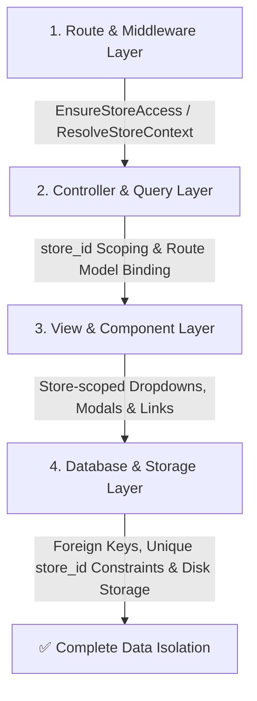

# 01 Core Architecture

> Consolidated edition. Each embedded source is preserved below with its original path and SHA-256 digest.


---

## Source 1: `architecture/Source_of_Truth_Master_MM.md`

**SHA-256:** `c6ba6a4064d09ddafec0af4bde0dc3485489f9bb415188a9d1d16cf154915309`

# DataPOS Single-Codebase Platform — Master Source of Truth (MM)

> **Document Type:** Master Domain Architecture & Business Rules Reference
> **Status:** Canonical Master Source of Truth (Active Multi-Store Single-Codebase Baseline)
> **Language:** Burmese (မြန်မာဘာသာ) with English technical terms
> **Verified Branch / Target:** `feature/reports-daily-closing-xz` @ `31d0ca92b7e35ce08881b2a944869d59f68d5f5f`
> **Project Path:** `D:\xmapp\htdocs\DataPOS`
> **Predecessor References (Archived):**
> - `archive/source-of-truth-history/Source_of_Truth_MM_v2.md` (`../archive/source-of-truth-history/Source_of_Truth_MM_v2.md`; see consolidated index)
> - `archive/source-of-truth-history/DataPOS_Mobile_Offline_POS_Project_Source_of_Truth_v1_EN.md` (`../archive/source-of-truth-history/DataPOS_Mobile_Offline_POS_Project_Source_of_Truth_v1_EN.md`; see consolidated index)
> - `archive/source-of-truth-history/AlinnThit_Mobile_Offline_POS_Project_Source_of_Truth_20260731.md` (`../archive/source-of-truth-history/AlinnThit_Mobile_Offline_POS_Project_Source_of_Truth_20260731.md`; see consolidated index)

---

## ၁။ ရည်ရွယ်ချက်နှင့် စည်းမျဉ်းများ (Objective & Non-Negotiables)

လူ Developer များ၊ AI Coding Agent များနှင့် Project Owner တို့အကြား Scope Drift၊ Incorrect Assumption၊ Duplicate Architecture နှင့် Conflicting Implementations မဖြစ်ပေါ်စေရန် ဤဖိုင်ကို DataPOS ပလက်ဖောင်းတစ်ခုလုံး၏ **Master Source of Truth** အဖြစ် သတ်မှတ်သည်။

### အဓိက မဏ္ဍိုင် (Core Invariants)
1. **Single Codebase, Multi-Store:** မတူညီသော စတိုးဆိုင်များနှင့် လုပ်ငန်းခွဲများ (Retail, Mobile/Electronics, Repair/Service, Wholesale, Ecommerce) အားလုံးသည် သီးခြား Codebase ခွဲထုတ်စရာမလိုဘဲ Single Laravel Application (`D:\xmapp\htdocs\DataPOS`) ပေါ်တွင် စနစ်တကျ run မည်။
2. **Tenant Isolation:** ဆိုင်တစ်ဆိုင်၏ Data (Staff, Products, Inventory, Sales, Customers, Reports, Settings) သည် အခြားဆိုင်သို့ လုံးဝ မပေါက်ကြားစေရ (`StoreContext` မှတစ်ဆင့် Query-level စစ်ဆေးသည်)။
3. **Double-Entry Inventory Ledger:** စတော့လက်ကျန်သည် ကိန်းဂဏန်းတစ်ခုကို တိုက်ရိုက် update လုပ်ခြင်းမဟုတ်ဘဲ `inventory_movements` ledger record ဖြင့်သာ အတိုး/အလျော့ မှတ်တမ်းတင်ရမည်။
4. **Offline-Capable Desktop Runtime:** Windows စက်များတွင် Internet မရှိဘဲ Offline POS အဖြစ် ချောမွေ့စွာ အသုံးပြုနိုင်ရန် SQLite WAL Mode ဖြင့် runtime တည်ဆောက်ထားသည်။

---

## ၂။ Source-of-Truth ဦးစားပေးအဆင့် (Hierarchy)

သတင်းအချက်အလက် ကွဲလွဲမှုများရှိလာပါက အောက်ပါ အဆင့်အတိုင်း ဆုံးဖြတ်ရမည်-

1. **`AGENTS.md` နှင့် Project Owner ၏ နောက်ဆုံးအတည်ပြုချက်များ:** အမြင့်ဆုံး စည်းကမ်းသတ်မှတ်ချက် ဖြစ်သည်။
2. **လက်ရှိ Target Branch ရှိ Executable Code၊ Migrations၊ Routes နှင့် Configs:** လက်ရှိ run နေသော ကုဒ်သည် အမှန်တရားဖြစ်သည်။
3. **Automated Test Suites (196 test files) နှင့် CI Results:** အောင်မြင်ပြီးသော tests များသည် verified facts များဖြစ်သည်။
4. **Active Architecture & Standards Documents (`docs/` အောက်ရှိ ဖိုင်များ):**
   - `docs/README.md` (`../README.md`; see consolidated index) — Documentation index
   - `docs/DATAPOS_SINGLE_CODEBASE_GROWTH_PLAN_MM.md` (`../plans/DATAPOS_SINGLE_CODEBASE_GROWTH_PLAN_MM.md`; see consolidated index) — Growth strategy
   - `docs/SMART_PRODUCT_AND_STORE_ARCHITECTURE_SPEC.md` (`SMART_PRODUCT_AND_STORE_ARCHITECTURE_SPEC.md`; see consolidated index) — Domain design
   - `docs/reports_implementation_plan_v2.md` (`../plans/reports_implementation_plan_v2.md`; see consolidated index) — Reports suite master plan
   - `docs/windows_offline_installer_plan_v2.md` (`../plans/windows_offline_installer_plan_v2.md`; see consolidated index) — Installer roadmap
   - `docs/windows_runtime_and_storage_architecture.md` (`windows_runtime_and_storage_architecture.md`; see consolidated index) — Storage spec
   - `docs/prompts/ADMIN_UI_UX_STANDARD_GUIDE_v4_1.md` (`../guides/ADMIN_UI_UX_STANDARD_GUIDE_v4_1.md`; see consolidated index) — Admin UI standard
   - `docs/STOREFRONT_UI_UX_STANDARD_GUIDE_v1_0.md` (`../guides/STOREFRONT_UI_UX_STANDARD_GUIDE_v1_0.md`; see consolidated index) — Storefront UI standard
   - `docs/prompts/AI_AGENT_QA_PLAYBOOK.md` (`../prompts/AI_AGENT_QA_PLAYBOOK.md`; see consolidated index) — QA playbook
5. **ဤ Master Source of Truth ဖိုင် (`docs/Source_of_Truth_Master_MM.md`)**
6. **`docs/archive/` ရှိ သမိုင်းဝင် အထောက်အထားများ:** Snapshot သာဖြစ်ပြီး implementation ညွှန်ကြားချက်အဖြစ် မသုံးရ။

---

## ၃။ Single Codebase & Store Architecture

DataPOS သည် URL Structure အားဖြင့် Scope နှစ်ခု ခွဲခြားထားသည်-

### က။ Platform Scope (`/admin/...` သို့မဟုတ် `/platform/...`)
- Super Admin / Platform Owner များအတွက်ဖြစ်ပြီး Store အသစ်များ တည်ဆောက်ခြင်း၊ Store Status စီမံခြင်းနှင့် System-wide Settings များကို ကိုင်တွယ်သည်။

### ခ။ Store Scope (`/store/{store_slug}/...`)
- သက်ဆိုင်ရာ Store တစ်ခုချင်းစီ၏ သီးသန့်နယ်ပယ်ဖြစ်သည်-
  - **Storefront:** `/store/{store_slug}` (Catalog, Products, Cart, Service Tracking)
  - **Store Admin:** `/store/{store_slug}/admin/...` (Dashboard, Inventory, Purchases, Staff, Settings)
  - **POS Counter:** `/store/{store_slug}/pos/...` (Counter checkout, Cashier Shifts, Daily Closing X/Z, Web Orders)

### ဂ။ Modular Store Capabilities (ဆိုင်အလိုက် ဖွင့်/ပိတ်နိုင်သော စွမ်းဆောင်ရည်များ)
Store တိုင်းတွင် feature အားလုံး ဖွင့်ပေးရန်မလိုဘဲ `stores.capabilities_override` အရ လိုအပ်သလို ဖွင့်/ပိတ်နိုင်သည်-
- `storefront` (Online Catalog & Order Builder)
- `catalog` (Brands, Categories, Variants, SKU management)
- `inventory` (Stock Ledger, Stock In, Adjustment, Supplier Purchases)
- `service` (Repair/Service intake, Ticket status, Technician tracking)
- `commerce` (POS, Wholesale pricing, Customer ledgers)
- `operations` (Cashier shifts, Drawer events, Daily Closing X/Z reports)

---

## ၄။ Store Membership နှင့် Authorization Boundary

UI တွင် Menu သို့မဟုတ် ခလုတ် ဖျောက်ထားရုံဖြင့် လုံခြုံရေး မမြောက်ပါ။ Route၊ Controller နှင့် Policy အဆင့်တိုင်းတွင် အောက်ပါ စစ်ဆေးမှု ၇ ဆင့်လုံး ပြည့်စုံမှသာ ခွင့်ပြုသည်-

```text
၁။ မှန်ကန်သော Platform/Store Scope ဖြစ်ခြင်း
AND ၂။ အဆိုပါ Store တွင် အကောင့်ရှိပြီး Active Membership ဖြစ်ခြင်း
AND ၃။ လုပ်ငန်းစဉ်အတွက် လိုအပ်သော Store Capability ဖွင့်ထားခြင်း
AND ၄။ သက်ဆိုင်ရာ Sales Channel ဖွင့်ထားခြင်း
AND ၅။ User ရာထူး၏ Role Permission (ဥပမာ- pos.checkout, inventory.adjust, pos_closing.approve) ရရှိထားခြင်း
AND ၆။ Target Resource သည် လက်ရှိ Active Store ၏ ပိုင်ဆိုင်မှုအစစ်အမှန်ဖြစ်ခြင်း (store_id isolation)
AND ၇။ Record သည် အခြား Store မှ Manipulated ID မဟုတ်ခြင်း
```

---

## ၅။ POS နှင့် Ecommerce တာဝန်ခွဲဝေမှုနှင့် ဆက်စပ်မှု

### က။ POS တာဝန်များ (Counter & In-Store Operations)
- **Offline-First Resilience:** Local loopback တွင် အင်တာနက်မလိုဘဲ ကောင်တာရောင်းချနိုင်ခြင်း။
- **Hardware Integration:** 58mm/80mm ESC/POS Thermal Receipt Printing နှင့် Barcode Scanning။
- **Cashier Shifts & Closing:** Shift Open/Close၊ Cash-in/Cash-out drawer events၊ X-Report (စစ်ဆေးရန်) နှင့် Z-Report (နေ့စဉ်စာရင်းပိတ် အတည်ပြုရန်)။
- **Sales & Returns:** Cart checkout၊ Split payment၊ Discount၊ Tax၊ Immutable receipts၊ Void နှင့် Returns/Refunds။

### ခ။ Storefront / Ecommerce တာဝန်များ (Online Customer Journey)
- **Public Browsing:** Mobile-responsive catalog၊ Category browser၊ Brand filtering၊ Search suggestions (XSS-safe)။
- **Ordering Suite:** Shopping cart၊ Direct Viber Order modal (`.sf-btn-3d-viber`)၊ Order Builder။
- **Service Tracking:** Customer အနေဖြင့် Repair Token ဖြင့် မိမိ service status အား online တွင် စစ်ဆေးနိုင်ခြင်း။

### ဂ။ Shared Inventory Ledger (လက်ကျန်စတော့ စည်းမျဉ်း)
- **Single Source of Truth:** POS ရောင်းချမှုနှင့် Online Orders များသည် သီးခြားစတော့မခွဲဘဲ တူညီသော `inventory_movements` ledger ပေါ်တွင် မူတည်သည်။
- **Online Order Lifecycle:**
  - Online Order တင်ချိန်တွင် `online_reserve` ဖြင့် စတော့ကြိုပွိုင့်မှတ်သည်။
  - Cashier မှ `/store/{store_slug}/pos/web-orders` တွင် စစ်ဆေးအတည်ပြုပြီး ရောင်းချပြီးစီးပါက `online_confirm` ဖြင့် ledger တွင် အပြီးသတ် စတော့နုတ်သည်။
  - ပယ်ဖျက်ပါက `online_cancel` ဖြင့် reserved စတော့ကို ပြန်လွှတ်ပေးသည်။
- `products.stock_status` သည် manual စာရင်းမဟုတ်ဘဲ Inventory Ledger Balance မှ အလိုအလျောက် တွက်ချက်ပြသသော dynamic status ဖြစ်သည်။

---

## ၆။ Financial & Quantity Calculations စံသတ်မှတ်ချက်

1. **Bcmath Precision for MMK:** ပလက်ဖောင်းအတွင်းရှိ မည်သည့် ကျပ်ငွေ၊ စျေးနှုန်း၊ Tax၊ Discount နှင့် Total ပမာဏကိုမျှ PHP Float ဖြင့် သိမ်းဆည်းတွက်ချက်ခြင်း လုံးဝ မပြုလုပ်ရ။ စနစ်ကျသော `bcmath` string operations သို့မဟုတ် Integer Cents/MMK စံနှုန်းဖြင့်သာ တွက်ချက်ရမည်။
2. **Clean Quantity Formatting:** စတော့လက်ကျန်နှင့် အရေအတွက်များတွင် `.000` မပါစေဘဲ `format_quantity($qty, $store)` (သို့မဟုတ် `$fmtQty`) ဖြင့်သာ သန့်ရှင်းစွာ ပြသရမည် (ဥပမာ- `10` အစား `10.000` မပြရ)။
3. **Dynamic Currency:** မည်သည့် Blade view သို့မဟုတ် JS တွင်မျှ Hardcoded `Ks` လုံးဝ (လုံးဝ) မရေးရ။ `/admin/settings/currency` Setting အတိုင်း `format_currency($amount, $store)` သို့မဟုတ် `window.formatCurrency(val)` ဖြင့်သာ Dynamic ပြသရမည်။

---

## ၇။ Windows Runtime & Storage Architecture

1. **Canonical Database Path:** `storage/database/datapos.sqlite` ဖြစ်သည် (Laravel မူလ `database/database.sqlite` ကို မသုံးရ)။
2. **SQLite WAL Mode & Locking:**
   - `journal_mode = WAL`
   - `busy_timeout = 5000` (5 စက္ကန့်)
   - `foreign_keys = ON`
   - `synchronous = NORMAL`
3. **App & Storage Separation:** Read-only application files နှင့် Writable user data (`storage/`, `database/`) တို့ကို ခွဲခြားထားပြီး Windows Non-Admin standard users များအတွက် `Access Denied` အမှားအယွင်းများ မဖြစ်စေရန် စီမံထားသည်။

---

## ၈။ သမိုင်းဝင်ယူဆချက်ဟောင်းများနှင့် လက်ရှိအခြေအနေ နှိုင်းယှဉ်ချက် (Historical vs Current)

| အကြောင်းအရာ | မူလယူဆချက်ဟောင်း (Historical v1) | လက်ရှိခိုင်မာသောအခြေအနေ (Current Verified Reality) |
|---|---|---|
| **Architecture** | POS တစ်ခုစီတွင် SQLite ခွဲထားပြီး Cloud DB သို့ API ဖြင့် sync လုပ်ရန် | Single Codebase Multi-Store Ledger ဖြစ်ပြီး Local/Cloud တစ်ပြေးညီ run သည် |
| **Online Orders** | Viber မှလာသော order ကို POS ထဲသို့ cashier က လက်ဖြင့် manual ပြန်ရိုက်ထည့်ရန် | Online Order Builder၊ Direct Viber Modal နှင့် POS `/web-orders` ချိတ်ဆက်မှု အပြည့်အစုံ ပါဝင်သည် |
| **Project Path** | `D:\xmapp\htdocs\data_ecommerce` (အစောပိုင်း standalone ecommerce) | `D:\xmapp\htdocs\DataPOS` (ပူးပေါင်းပြီးစီးသော single repository) |
| **Database** | `database/database.sqlite` | Canonical path: `storage/database/datapos.sqlite` (WAL enabled) |
| **Currency Display** | Static `Ks` hardcoded စာသားများ | Centralized dynamic currency formatting (`format_currency`) |
| **Reporting Suite** | Phase 2 Review အဆင့်သာရှိခဲ့သည် | Phase 2 Daily Closing, X-Report, Z-Report အားလုံး ပြီးစီးပြီး immutable snapshot စနစ် တပ်ဆင်ပြီးဖြစ်သည် |

---

## ၉။ ဆက်စပ်အသုံးပြုရမည့် Active Documents

- **Documentation Master Index:** `docs/README.md` (`../README.md`; see consolidated index)
- **Growth & Product Strategy:** `DATAPOS_SINGLE_CODEBASE_GROWTH_PLAN_MM.md` (`../plans/DATAPOS_SINGLE_CODEBASE_GROWTH_PLAN_MM.md`; see consolidated index)
- **Product Domain & Architecture:** `SMART_PRODUCT_AND_STORE_ARCHITECTURE_SPEC.md` (`SMART_PRODUCT_AND_STORE_ARCHITECTURE_SPEC.md`; see consolidated index)
- **AlinnThit Mobile SKU Logic Guide:** `guides/ALINN_THIT_MOBILE_SKU_LOGIC_MM.md` (`../guides/ALINN_THIT_MOBILE_SKU_LOGIC_MM.md`; see consolidated index)
- **Reporting Suite Architecture:** `reports_implementation_plan_v2.md` (`../plans/reports_implementation_plan_v2.md`; see consolidated index)
- **Windows Offline Installer Plan v2:** `windows_offline_installer_plan_v2.md` (`../plans/windows_offline_installer_plan_v2.md`; see consolidated index)
- **Runtime & Storage Architecture:** `windows_runtime_and_storage_architecture.md` (`windows_runtime_and_storage_architecture.md`; see consolidated index)
- **Quality Assurance & Fix Playbook:** `prompts/AI_AGENT_QA_PLAYBOOK.md` (`../prompts/AI_AGENT_QA_PLAYBOOK.md`; see consolidated index)

---

## Source 2: `architecture/MULTI_STORE_DATA_ISOLATION_AUDIT_PLAN.md`

**SHA-256:** `646cf2e8251c90dd5d5600607d7f92493933df028fdbb02c9733ab465d7dc50e`

# Multi-Store Data Isolation Master Audit & Execution Plan 🛡️

> **ရည်ရွယ်ချက် (Objective)**:
> DataPOS စနစ်အတွင်း ဆိုင်ခွဲတစ်ခုချင်းစီ (Tenant Stores) ၏ ဒေတာများ (ပစ္စည်း၊ အရောင်း၊ စတော့၊ စာရင်း၊ ငွေကြေး၊ ဝန်ထမ်းနှင့် သုံးစွဲသူများ) သည် အခြားဆိုင်ခွဲများနှင့် **လုံးဝရောထွေးမှုမရှိစေဘဲ (Zero Cross-Store Data Leakage)** သက်ဆိုင်ရာဆိုင်မှသာ လုံခြုံစိတ်ချစွာ ကြည့်ရှု/ပြင်ဆင်နိုင်စေရန် အပိုင်းလိုက်စစ်ဆေးပြင်ဆင်မည့် Master Checklist ဖြစ်ပါသည်။

---

## 🏗️ Data Isolation စစ်ဆေးရမည့် အဓိက အဆင့် ၄ ဆင့် (The 4 Isolation Layers)

စနစ်အတွင်း မည်သည့် Module/Feature မဆို အောက်ပါ အဆင့် ၄ ဆင့်ဖြင့် လုံခြုံရေး စစ်ဆေးရပါမည်-



1. **Route & Middleware Layer**: URL slug မှ `store_id` ကို မှန်ကန်စွာဖမ်းယူပြီး အခွင့်မရှိသူများအား `403 Forbidden` / `404 Not Found` ဖြင့် ပိတ်ပင်ထားခြင်း။
2. **Controller & Query Layer**: Query တိုင်းတွင် `where('store_id', $store->id)` ပါဝင်ခြင်းနှင့် အခြားဆိုင်မှ ID များကို Parameter အဖြစ် ပေးပို့လာပါက `findOrFail` ဖြင့် Block ခြင်း။
3. **View & UI Layer**: Dropdowns (Categories, Brands, Warehouses, Staff, Suppliers) များတွင် မိမိဆိုင်၏ ဒေတာများသာ ရွေးချယ်နိုင်ရန် စစ်ထုတ်ထားခြင်း။
4. **Database & File Storage Layer**: File Uploads, Database Backups, Barcode Templates များကို Store ID အလိုက် သီးခြား ခွဲခြားထားခြင်း။

---

## 📋 အပိုင်းလိုက် စစ်ဆေးပြင်ဆင်မည့် Roadmap (Phase-by-Phase Checklist)

### 🔹 အပိုင်း ၁: ကုန်ပစ္စည်းနှင့် Master Data (Phase 1: Catalog & Master Data) — ✅ စစ်ဆေးပြင်ဆင်ပြီး (100% Verified)
- [x] **Products CRUD & Search**: အခြားဆိုင်၏ Product ID ဖြင့် URL မှ လှမ်းခေါ်ခြင်း/ပြင်ဆင်ခြင်းကို တားဆီးထားခြင်း (Details/Edit/Update 403 Forbidden စစ်ဆေးပြီး)။
- [x] **Categories & Brands**: Quick Create နှင့် Dropdown များတွင် မိမိဆိုင်ခွဲဆိုင်ရာ အုပ်စုများသာ ပေါ်ခြင်း၊ Parent Category ကို အခြားဆိုင်သို့ မချိတ်ဆက်နိုင်အောင် တားဆီးထားခြင်း။
- [x] **Suppliers & Warehouses**: ပစ္စည်းသွင်းသူစာရင်းနှင့် ဂိုဒေါင်စာရင်း သီးခြားစီ ခွဲထားခြင်း၊ အခြားဆိုင်၏ ဂိုဒေါင်/ပစ္စည်းသွင်းသူ ID မသုံးနိုင်ရန် `Rule::exists(...)->where('store_id', ...)` ဖြင့် တားဆီးထားခြင်း။
- [x] **Units & Barcode Templates**: ဆိုင်ခွဲအလိုက် သတ်မှတ်ထားသော ဘားကုဒ်ဒီဇိုင်းနှင့် အတိုင်းအတာများ သီးခြားဖြစ်ခြင်း၊ Ajax search တွင် မိမိဆိုင် ပစ္စည်းများသာ ရှာဖွေနိုင်ခြင်း။
- [x] **Product Import / CSV & Bulk Operations**: CSV တင်သွင်း/ထုတ်ယူမှုနှင့် Bulk Stock/Delete/Price wizard များတွင် လက်ရှိ `store_id` သို့သာ တိကျစွာ သက်ရောက်စေခြင်း။

---

### 🔹 အပိုင်း ၂: အရောင်းကောင်တာနှင့် ဘောက်ချာစနစ် (Phase 2: POS & Sales Operations) — ✅ စစ်ဆေးပြင်ဆင်ပြီး (100% Verified)
- [x] **POS Sales & Orders**: ကောင်တာအရောင်းဘောက်ချာများ၊ ဘောက်ချာနံပါတ် (Voucher No.) ပြေးပုံများ ဆိုင်ခွဲအလိုက် သီးခြားဖြစ်ခြင်း၊ Web Order Fulfillment တွင် အခြားဆိုင်၏ Order ID ချိတ်ဆက်မရအောင် `Rule::exists('orders', 'id')->where('store_id', ...)` ဖြင့် တားဆီးထားခြင်း။
- [x] **Held Carts (ဆိုင်းငံ့ဘောက်ချာများ)**: Cashier ဆိုင်းငံ့ထားသော ခြင်းတောင်းများသည် အခြားဆိုင်ခွဲသို့ မရောက်ရှိခြင်း၊ Resume/Void ခေါ်ယူရာတွင် `store_id` တိုက်ဆိုင်စစ်ဆေးခြင်း။
- [x] **Cash Register / Shift Closing**: တစ်နေ့တာ ငွေစာရင်းပိတ်မှု (Opening/Closing Cash, Drawer Shift) များ ဆိုင်ခွဲအလိုက် သီးခြားစီ တွက်ချက်ခြင်း၊ Cashier Shift ဖွင့်ရာတွင် အခြားဆိုင်၏ `branch_id` မသုံးနိုင်ရန် တားဆီးထားခြင်း၊ Daily Closing Approval တွင် `store_id` စစ်ဆေးခြင်း။
- [x] **Returns & Buybacks**: အရောင်းပြန်သွင်းခြင်းနှင့် အဝယ်ပြန်သွင်းခြင်းများတွင် မူလဆိုင်ခွဲ၏ ဘောက်ချာမှသာ ပြန်သွင်းခွင့်ရှိခြင်း (`$sale->store_id !== $store->id` 404 စစ်ဆေးပြီး)။
- [x] **E-load Top-up & Commissions**: ဖုန်းငွေဖြည့်သွင်းမှုနှင့် အကောင့်ဖြည့်သွင်းမှု (Refill) များတွင် အခြားဆိုင်၏ `eload_account_id` အသုံးမပြုနိုင်ရန် `Rule::exists('eload_accounts', 'id')->where('store_id', ...)` ဖြင့် တားဆီးထားခြင်း။

---

### 🔹 အပိုင်း ၃: စတော့နှင့် ဂိုဒေါင် စီမံခန့်ခွဲမှု (Phase 3: Inventory & Logistics) — ✅ စစ်ဆေးပြင်ဆင်ပြီး (100% Verified)
- [x] **Stock Balance & Ledger**: ပစ္စည်းတစ်ခုချင်းစီ၏ လက်ကျန်နှင့် အဝင်/အထွက် စာရင်း (Movement Ledger) ဆိုင်ခွဲအလိုက် တိကျခြင်း၊ `inventory_balances` နှင့် `inventory_movements` တွင် `store_id` စစ်ဆေးမှု အပြည့်အဝရှိခြင်း။
- [x] **Stock Adjustments & Counts**: စတော့ အတိုး/အလျှော့ ညှိနှိုင်းခြင်း (Adjustments) နှင့် စတော့စစ်ဆေးမှု (Stock Count Sheets) များတွင် အခြားဆိုင်၏ Category, Warehouse, Branch မသုံးနိုင်ရန် `Rule::exists(...)->where('store_id', ...)` ဖြင့် တားဆီးထားခြင်း။
- [x] **Purchase Orders (အဝယ်ဘောက်ချာများ)**: ကုန်ပစ္စည်း အဝယ်စာရင်းနှင့် ကုန်သည်ပေးရန်ကျန်စာရင်း (Payables) များတွင် အခြားဆိုင်၏ Supplier နှင့် Product မသုံးနိုင်ရန် `Rule::exists(...)->where('store_id', ...)` ဖြင့် တားဆီးထားခြင်း။
- [x] **Inter-Store/Branch Transfers**: ဆိုင်ခွဲနှင့် ဂိုဒေါင်အချင်းချင်း ပစ္စည်းလွှဲပြောင်းရာတွင် `from_warehouse_id` နှင့် `to_warehouse_id` တို့အား လက်ရှိစတိုးပိုင်ဖြစ်ကြောင်း စစ်ဆေးထားခြင်း၊ အခြားစတိုး၏ Transfer ID အား ကြည့်ရှု/လွှဲပြောင်း/လက်ခံခွင့် မရှိအောင် `403 Forbidden` ဖြင့် တားဆီးထားခြင်း။

---

### 🔹 အပိုင်း ၄: သုံးစွဲသူ/ဖောက်သည်၊ အကြွေးစာရင်းနှင့် လက်ကားစနစ် (Phase 4: Customer Directory & Debt Isolation) — ✅ စစ်ဆေးပြင်ဆင်ပြီး (100% Verified)
- [x] **Customer Directory Isolation**: ဖောက်သည်စာရင်း (Retail & Wholesale) သည် ဆိုင်ခွဲအလိုက် သီးခြားဖြစ်ပြီး အခြားဆိုင်ခွဲ၏ ဖောက်သည်စာရင်း၊ ဖုန်းနံပါတ်၊ လိပ်စာများကို လုံးဝမမြင်ရခြင်း၊ `update()` တွင် စတိုး membership ရှိမှသာ ပြင်ဆင်ခွင့်ရှိအောင် စစ်ဆေးထားခြင်း။
- [x] **Customer Phone & Profile Scoping**: ဖောက်သည်တစ်ဦးသည် ဆိုင်ခွဲ ၂ ခု (ဥပမာ- Pharmacy နှင့် Mobile Shop) တွင် အကောင့်တစ်ခုတည်း ရှိနိုင်သော်လည်း မိမိဆိုင်ခွဲအတွင်း ဝယ်ယူထားသော မှတ်တမ်းနှင့် အချက်အလက်ကိုသာ သီးခြားခွဲထုတ်ထားခြင်း။
- [x] **Customer Receivables & Arrears Ledger (အကြွေးစာရင်း သီးခြားဖြစ်မှု)**: ဆိုင် A တွင် တင်ရှိသော ဖောက်သည်၏ အကြွေးစာရင်းသည် ဆိုင် B ၏ စာရင်းဇယားတွင် လုံးဝမပေါ်ဘဲ သီးခြားဖြစ်ခြင်း၊ `show`, `collect`, `statement` အားလုံးတွင် အခြားဆိုင်ဖောက်သည်အား `404 Not Found` ဖြင့် တားဆီးထားခြင်း။
- [x] **Customer Loyalty Points & Membership Tiers**: Point ရမှတ်များ၊ Tier အဆင့်များ (Silver, Gold, VIP) နှင့် အထူးလျှော့စျေးများသည် သက်ဆိုင်ရာ ဆိုင်ခွဲအတွင်း၌သာ သီးခြားသက်ရောက်ခြင်း၊ `assignTier` တွင် အခြားဆိုင်၏ tier ID မသုံးနိုင်ရန် `Rule::exists('membership_tiers', 'id')->where('store_id', ...)` ဖြင့် တားဆီးထားခြင်း။
- [x] **Wholesale Applications & Approval**: လက်ကားဖောက်သည် လျှောက်ထားမှုများနှင့် လက်ကားစျေးနှုန်း သတ်မှတ်ချက်များကို သက်ဆိုင်ရာ ဆိုင်ပိုင်ရှင်/မန်နေဂျာကသာ သီးခြားခွင့်ပြုနိုင်ခြင်း (`application->store_id !== store->id` 403 စစ်ဆေးပြီး)။

---

### 🔹 အပိုင်း ၅: ဝန်ဆောင်မှုနှင့် စက်ပြင်ဌာန (Phase 5: Services & Repairs) — ✅ စစ်ဆေးပြင်ဆင်ပြီး (100% Verified)
- [x] **Repair Job Tickets**: စက်ပြင်လက်ခံဘောက်ချာများနှင့် Serial Number မှတ်တမ်းများ ဆိုင်ခွဲအလိုက် သီးခြားဖြစ်ခြင်း၊ `ServiceJobController` တွင် `show`, `print`, `edit`, `update`, `status`, `payments`, `deduct` အားလုံး store isolation 404 စစ်ဆေးထားခြင်း။
- [x] **Spare Parts Usage**: စက်ပြင်ရာတွင် သုံးစွဲသော အပိုပစ္စည်းများ မိမိဆိုင်စတော့မှသာ အလိုအလျောက် နှုတ်ယူခြင်း (`product_id` store-scoped validation ထည့်သွင်းထားပြီး `SparePartController` မှ အခြားဆိုင်၏ စက်ပြင်ပစ္စည်းအား deduct မလုပ်နိုင်အောင် တားဆီးထားခြင်း)။
- [x] **Technician Assignment**: စက်ပြင်ဆရာ တာဝန်ပေးအပ်မှုများ မိမိဆိုင်ရှိ ဝန်ထမ်းများ (`store_user` role 'store_manager'/'staff') ထဲမှသာ ရွေးချယ်နိုင်ခြင်း။
- [x] **Public Tracking Token**: Customer ဘက်မှ Token ဖြင့် စစ်ဆေးရာတွင် မိမိအပ်နှံထားသော ဆိုင်၏ အချက်အလက်ကိုသာ ဖော်ပြခြင်း (`/store/{store_slug}/track/service/{token}` တွင် ဆိုင်မှားယွင်းလျှင် 404 ပြန်ခြင်း)။
- [x] **Device Warranty Tracker**: စက်ပစ္စည်း အာမခံမှတ်တမ်းများ (Warranties) ဆိုင်ခွဲအလိုက် သီးခြားဖြစ်ပြီး `product_id` store validation နှင့် claim, edit, certificate အားလုံး store scoped ဖြစ်ခြင်း။

---

### 🔹 အပိုင်း ၆: ငွေကြေး၊ အသုံးစရိတ်နှင့် စာရင်းရှင်းတမ်း (Phase 6: Finance & Accounting) — ✅ စစ်ဆေးပြင်ဆင်ပြီး (100% Verified)
- [x] **Daily Expenses & Categories**: နေ့စဉ် အသုံးစရိတ်များနှင့် ကဏ္ဍခွဲများ ဆိုင်ခွဲအလိုက် သီးခြားဖြစ်ခြင်း (`ExpenseController` & `ExpenseCategoryController` store-scoped validation & 404 access control)။
- [x] **Profit & Loss (အရှုံး/အမြတ် ရှင်းတမ်း)**: ဝင်ငွေ၊ ထွက်ငွေ၊ ကုန်ကျစရိတ်နှင့် အသားတင်အမြတ် ဆိုင်ခွဲအလိုက် သီးခြားစီ တွက်ချက်ခြင်း (`ProfitLossService` strictly scoped to `$store->id`)။
- [x] **Cash & Bank Accounts (KPay/Wave) & Shifts**: ဆိုင်ခွဲအလိုက် သတ်မှတ်ထားသော ဘဏ်အကောင့်နှင့် KPay နံပါတ်များ၊ Cashier Shifts & Cash Events များ သီးခြားဖြစ်ခြင်း။
- [x] **Sales Analytics & Cash Flow Reports**: အရောင်းဇယားနှင့် ငွေစီးဆင်းမှု မှတ်တမ်းများ သီးခြားဖြစ်ခြင်း (`SalesAnalyticsService` & `PosReportService` strictly scoped to `$store->id`)။

---

### 🔹 အပိုင်း ၇: eCommerce Storefront နှင့် အွန်လိုင်းအရောင်း (Phase 7: eCommerce Storefront & Public Online Ordering) — ✅ စစ်ဆေးပြင်ဆင်ပြီး (100% Verified)
- [x] **Storefront Catalog & Search Isolation**: Online Shop တွင် လက်ရှိဆိုင်ခွဲ၏ Active ကုန်ပစ္စည်းများ၊ Brand များနှင့် အမျိုးအစားများသာ ပေါ်ပြီး အခြားဆိုင်ခွဲမှ ပစ္စည်းများ ရှာမရခြင်း (`CatalogController` & `BrowseController` strictly scoped by `$store->id`)။
- [x] **Shopping Cart & Session Isolation**: ဆိုင်ခွဲ A (ဥပမာ- ဆေးဆိုင်) တွင် ခြင်းတောင်းထဲ ပစ္စည်းထည့်ထားပါက ဆိုင်ခွဲ B (မိုဘိုင်းဆိုင်) သို့ သွားရောက်ကြည့်ရှုရာတွင် မရောထွေးစေဘဲ Store Context အလိုက် ခြင်းတောင်း သီးခြားဖြစ်ခြင်း။
- [x] **Online Order Checkout & Placement**: Customer များ အွန်လိုင်းမှ အော်ဒါတင်သည့်အခါ သက်ဆိုင်ရာ ဆိုင်ခွဲ၏ `orders` စာရင်းထဲသို့သာ တိကျစွာ ရောက်ရှိခြင်း (`OrderController` `product_id` store-scoped validation)။
- [x] **Storefront Home Banners & Sliders**: Online Store ပင်မစာမျက်နှာရှိ ကြော်ငြာ Banner များ၊ Promotion ပုံများသည် သက်ဆိုင်ရာ ဆိုင်ခွဲအတွက်သာ သီးခြားပေါ်ခြင်း (`HomeBannerController` store isolation)။
- [x] **Product Reviews & Ratings (သုံးသပ်ချက်များ)**: ကုန်ပစ္စည်း Review များနှင့် Rating ကြယ်ပွင့်များသည် သက်ဆိုင်ရာ ဆိုင်ခွဲ၏ ပစ္စည်းများ၌သာ သီးခြားဖော်ပြခြင်း။
- [x] **Checkout Payment Methods (KPay/Wave/Cash)**: အော်ဒါတင်ရာတွင် ငွေလွှဲရမည့် KPay / CB / AYA / Wave အကောင့်အမည်နှင့် နံပါတ်များသည် သက်ဆိုင်ရာ ဆိုင်ခွဲ၏ အကောင့်များသာ ပေါ်ခြင်း။
- [x] **Shipping Rates & Delivery Zones**: ပို့ဆောင်ခ နှုန်းထားများနှင့် ပို့ဆောင်သည့် မြို့နယ်ဇယားများ ဆိုင်ခွဲအလိုက် သီးခြားဖြစ်ခြင်း။
- [x] **Floating Chat & Contact Channels**: Storefront ရှိ Viber, Telegram, Phone, Facebook Messenger ခလုတ်များသည် သက်ဆိုင်ရာ ဆိုင်ခွဲ၏ ဆက်သွယ်ရန်လိပ်စာသို့သာ တိုက်ရိုက်ရောက်ရှိခြင်း။
- [x] **Storefront Branding & SEO Meta**: ဆိုင်ခွဲအလိုက် ဆိုင်အမည်၊ Logo၊ Favicon၊ Tagline နှင့် Social Share (OpenGraph) ပုံရိပ်များ သီးခြားဖြစ်ခြင်း။

---

### 🔹 အပိုင်း ၈: လုံခြုံရေး၊ ဝန်ထမ်းရာထူးနှင့် ဒေတာထိန်းသိမ်းမှု (Phase 8: Security & Maintenance) — ✅ စစ်ဆေးပြင်ဆင်ပြီး (100% Verified)
- [x] **Store Owner vs Manager Rights**: ဆိုင်ပိုင်ရှင်နှင့် မန်နေဂျာ လုပ်ပိုင်ခွင့်များ တိကျစွာ ခွဲခြားထားခြင်း (`UserManagementController` store_owner guard)။
- [x] **Staff Roles & Permissions**: ဝန်ထမ်းရာထူးများနှင့် ခွင့်ပြုချက်များ ဆိုင်ခွဲအလိုက် သီးခြားစီ သတ်မှတ်နိုင်ခြင်း (`StaffRoleController` store isolation)။
- [x] **System Alert Center**: စတော့နည်းခြင်းနှင့် အရေးကြီးသတိပေးချက်များ မိမိဆိုင်ခွဲအတွက်သာ တက်လာခြင်း (`SystemAlertCenterController` store queries)။
- [x] **Audit Trail Logs**: ဝန်ထမ်းများ၏ လုပ်ဆောင်ချက်မှတ်တမ်း (Activity Logs) များ ဆိုင်ခွဲအလိုက် သီးခြားဖြစ်ခြင်း (`AuditLogController` 403 authorization guard)။
- [x] **Database & Backup Files**: ဒေတာ Backup ဖိုင်များနှင့် Maintenance Tools များသည် သက်ဆိုင်ရာ ဆိုင်ခွဲ၏ မန်နေဂျာ/ပိုင်ရှင်သာ ထိန်းသိမ်းခွင့်ရှိခြင်း (`BackupController` & `DatabaseToolController`)။

---

## 🛠️ စစ်ဆေးဆောင်ရွက်မည့် နည်းလမ်း (Testing & Validation Workflow)

အပိုင်းတစ်ခုချင်းစီ စစ်ဆေးသည့်အခါ အောက်ပါအချက် ၃ ချက်ဖြင့် အတည်ပြုပါမည်-
1. **Automated Feature Test**: Cross-store access ကို တားဆီးထားကြောင်း Unit/Feature Test ရေးသားစစ်ဆေးခြင်း။
2. **Browser Subagent Test**: ဆိုင်ခွဲ A မှ အကောင့်ဖြင့် ဝင်ရောက်ပြီး ဆိုင်ခွဲ B ၏ ဒေတာ URL/API သို့ လှမ်းတောင်းကြည့်၍ ပိတ်ပင်မှု ရှိ/မရှိ စစ်ဆေးခြင်း။
3. **Database Assertion**: Database table များတွင် `store_id` ကော်လံများ ပြည့်စုံစွာ ပါဝင်ပြီး မှန်ကန်စွာ ချိတ်ဆက်မှု ရှိ/မရှိ စစ်ဆေးခြင်း။

---

*မှတ်ချက် - ဤ Roadmap အတိုင်း အပိုင်းလိုက် စနစ်တကျ တစ်ခုချင်းစီ ဆက်လက်စစ်ဆေးပြင်ဆင်သွားပါမည်။*

---

## Source 3: `architecture/windows_runtime_and_storage_architecture.md`

**SHA-256:** `433bd38ca23e841d82507cfed9027a6edd462de38b964c36b3468e44f22a461b`

# DataPOS — Windows Runtime and Storage Architecture (Prompt 3)

**Architecture Version:** 1.0 (Canonical)
**Date:** 2026-09-09
**Audited Git Commit:** `c476db95274d807a07285c14e27fd9077c339673` (Prompt 2 HEAD)
**Status:** Implementation-Ready Specification
**Auditor / Agent:** Antigravity (Prompt 3 — Runtime, SQLite Database & Writable Storage Canonicalization)

---

## 1. Executive Summary & Problem Statement

Prior to this audit, DataPOS documentation and configuration contained path and runtime discrepancies:
1. **Historical Database Path Mismatch:** Root `README.md` referenced `database/database.sqlite` (Laravel framework default), while archived `archive/superseded-plans/windows_offline_installer_plan_v1.md` referenced `storage/database/datapos.sqlite`.
2. **Read-Only vs. Writable Data Collision:** In standard Windows deployments, putting writable files in `C:\Program Files\DataPOS` causes `Access Denied` (`EACCES`) errors for standard non-administrator users, blocking SQLite writes, session storage, and log appending.
3. **SQLite Concurrency & Locking:** Default SQLite configuration without Write-Ahead Logging (WAL) and busy timeout leads to intermittent `Database is locked` crashes when a cashier executes a POS checkout while background tasks or reports are running.
4. **Launcher Lifecycle Ambiguity:** The built-in server launcher lacked an evidence-based specification for loopback binding, duplicate process prevention, and health checks.

This document establishes the **Canonical Windows Runtime & Storage Architecture** to resolve all discrepancies before any installer script or executable is built.

---

## 2. Canonical Path Matrix

To guarantee clean upgrades, simple backups, and zero permission issues, program binaries and writable application state are strictly separated:

| Component | Canonical Location (Relative) | Recommended Windows Path (`C:\DataPOS`) | Access Type | Backup Policy |
| :--- | :--- | :--- | :--- | :--- |
| **Application Binaries** | `app/`, `bootstrap/`, `config/`, `routes/`, `resources/` | `C:\DataPOS\app`, etc. | Read-Only | Included in Source / Installer |
| **PHP Runtime** | `php/` | `C:\DataPOS\php` | Read-Only | Included in Installer |
| **Vendor Packages** | `vendor/` | `C:\DataPOS\vendor` | Read-Only | Pre-bundled in Installer |
| **Compiled Web Assets** | `public/build/` | `C:\DataPOS\public\build` | Read-Only | Included in Source / Installer |
| **Front Controller Router** | `server.php` / `public/index.php` | `C:\DataPOS\server.php` | Read-Only | Included in Source / Installer |
| **Environment Configuration** | `.env` | `C:\DataPOS\.env` | Writable | Dynamic per machine (Excluded from Git) |
| **Primary SQLite Database** | `storage/database/datapos.sqlite` | `C:\DataPOS\storage\database\datapos.sqlite` | **Writable (Active)** | **Backed up in Customer Data ZIP** |
| **Media & Uploads** | `storage/app/public/` | `C:\DataPOS\storage\app\public` | **Writable** | **Backed up in Customer Data ZIP** |
| **System Backups** | `storage/app/private/backups/` | `C:\DataPOS\storage\app\private\backups` | **Writable** | Retains last 14 snapshots |
| **Portable Store Backups** | `storage/app/backups/` | `C:\DataPOS\storage\app\backups` | **Writable** | Verified portable store packages |
| **Framework Cache/Sessions**| `storage/framework/{cache,sessions,views}` | `C:\DataPOS\storage\framework` | **Writable (Temp)** | Excluded from Backups |
| **Application Logs** | `storage/logs/` | `C:\DataPOS\storage\logs` | **Writable (Append)**| Excluded from Backups |
| **Process PID File** | `storage/framework/server.pid` | `C:\DataPOS\storage\framework\server.pid`| Writable | Ephemeral runtime state |

---

## 3. Canonical SQLite Database Path Resolution & Backward Compatibility

### 3.1 Three-Tier Path Resolution
`config/database.php` was updated to implement automatic fallback and path normalization:

```php
'sqlite' => [
    'driver' => 'sqlite',
    'url' => env('DB_URL'),
    'database' => env('DB_DATABASE')
        ? (in_array(env('DB_DATABASE'), [':memory:', 'sqlite::memory:']) || preg_match('/^([A-Za-z]:[\\\\\/]|\/)/', env('DB_DATABASE'))
            ? env('DB_DATABASE')
            : base_path(env('DB_DATABASE')))
        : (file_exists(storage_path('database/datapos.sqlite'))
            ? storage_path('database/datapos.sqlite')
            : (file_exists(database_path('database.sqlite'))
                ? database_path('database.sqlite')
                : storage_path('database/datapos.sqlite'))),
    'prefix' => '',
    'foreign_key_constraints' => env('DB_FOREIGN_KEYS', true),
    'busy_timeout' => env('DB_BUSY_TIMEOUT', 5000),
    'journal_mode' => env('DB_JOURNAL_MODE', 'WAL'),
    'synchronous' => env('DB_SYNCHRONOUS', 'NORMAL'),
    'transaction_mode' => 'DEFERRED',
],
```

### 3.2 Non-Destructive Migration & Fallback Rules
1. **Clean Fresh Install:** Creates `storage/database/datapos.sqlite` and runs migrations.
2. **Existing Legacy Installation (`database/database.sqlite`):**
   - If `storage/database/datapos.sqlite` does NOT exist but legacy `database/database.sqlite` DOES exist, the application seamlessly connects to the legacy database. **Zero data loss.**
   - When the Windows Installer upgrades an existing installation, it copies `database/database.sqlite` to `storage/database/datapos.sqlite`, preserving the original file as `database/database.sqlite.bak`.
3. **Explicit `.env` Configuration:** If an administrator or developer specifies `DB_DATABASE=storage/database/datapos.sqlite` or any custom path, it is automatically resolved relative to `base_path()`, guaranteeing consistency across CLI, web server, and background workers.
4. **Under no circumstances is an existing SQLite file overwritten during setup or startup.**

---

## 4. Windows Permissions & Installation Directory Selection

| Directory Option | Privileges Required | Windows ACL / Sandboxing | Multi-user Support | Evaluation for DataPOS v1 |
| :--- | :--- | :--- | :--- | :--- |
| **`C:\Program Files\DataPOS`** | Administrator (UAC elevation) | Read-only for standard users. Writing to SQLite or logs throws `EACCES` unless manual ACL permissions are modified via `icacls`. | System-wide | **Not Recommended for v1:** Causes permission failures on non-admin cashier accounts. |
| **`%PROGRAMDATA%\DataPOS`** (`C:\ProgramData`) | Admin to install, User to write | Shared across all machine users. Separates program files (`Program Files`) from data files (`ProgramData`). | System-wide | **Overkill for v1:** Adds path complexity and multi-directory management. |
| **`%LOCALAPPDATA%\DataPOS`** | None (User-level) | Full write access for the current logged-in user. No UAC prompts. | Single user only | **Good for Personal Apps:** However, if two cashiers log into separate Windows accounts, they cannot share the same database. |
| **`C:\DataPOS` (Standalone Root)** | Admin once during install, User thereafter | **Full Control granted to `Users` group.** Self-contained, portable, immune to UAC elevation blocks. | Machine-wide shared | **RECOMMENDED FOR V1 (Commercial SME):** Follows proven standards used by Myanmar tech shops, accounting software, and XAMPP. Allows shop owners to easily copy the entire `C:\DataPOS` folder to a USB drive for disaster recovery. |

---

## 5. SQLite Concurrency, Durability and Shutdown Recovery

To support high-speed POS checkouts without database lock crashes:

1. **Write-Ahead Logging (`journal_mode=WAL`):**
   - In WAL mode, SQLite writes changes to `datapos.sqlite-wal`.
   - **Readers do not block writers, and writers do not block readers.** Cashiers can record sales while managerial dashboards or inventory valuation queries are executing.
2. **Busy Timeout (`busy_timeout=5000`):**
   - If a write transaction is in progress, any concurrent write attempt waits up to 5,000 milliseconds (5 seconds) instead of immediately failing with `SQLSTATE[HY000]: General error: 5 database is locked`.
3. **Durability & Sudden Power-Loss Recovery (`synchronous=NORMAL`):**
   - Under WAL mode, `NORMAL` synchronous ensures ACID durability against application and operating system crashes.
   - On Windows, if power is abruptly lost, SQLite automatically detects the `-wal` file on the next connection and rolls forward/recovers uncommitted transactions with zero database corruption.
4. **Foreign Key Integrity (`foreign_key_constraints=true`):**
   - Enforced by default on every SQLite connection.

---

## 6. PHP Built-in Server Launcher Technical Specification

The Windows desktop launcher (`DataPOS.exe` or launcher script) must adhere to the following lifecycle state machine:

```
[User Launches DataPOS]
       │
       ▼
[Check Stale PID in storage/framework/server.pid]
       │
       ├──► (PID Alive & /up returns 200) ──────────► [Bring Browser to Front / Open URL] ──► [EXIT LAUNCHER]
       │
       └──► (PID Dead or /up unreachable)
                 │
                 ▼
          [Clean Stale PID File]
                 │
                 ▼
          [Check Port 8501 Availability]
                 │
                 ├──► Port 8501 Free ────────► Use 8501
                 │
                 └──► Port 8501 Busy ────────► Fallback to 8502 (or next available)
                             │
                             ▼
             [Spawn Background PHP Built-in Server]
             Command: php.exe -S 127.0.0.1:<PORT> server.php
             Binding: Loopback ONLY (127.0.0.1 — Never 0.0.0.0)
             Cwd:     C:\DataPOS
             Output:  Redirect to storage/logs/php-server.log
                             │
                             ▼
             [Write New PID to storage/framework/server.pid]
                             │
                             ▼
             [Poll Health Check: http://127.0.0.1:<PORT>/up]
             Max Retries: 30 (3 seconds total, 100ms interval)
                             │
                             ├──► (HTTP 200 OK) ────► [Launch Default Browser to http://127.0.0.1:<PORT>]
                             │
                             └──► (Timeout) ────────► [Display Diagnostic Error Dialog & Log Link]
```

### Key Launcher Requirements:
- **Loopback-Only Binding:** Must bind exclusively to `127.0.0.1`. Never bind to `0.0.0.0` in single-user offline mode to prevent unauthenticated network exposure on local Wi-Fi.
- **Multiple Launcher Clicks:** If a user double-clicks the desktop shortcut while DataPOS is already running, the launcher detects the healthy server via `/up` and simply opens/focuses the browser, avoiding duplicate server instances.
- **Front-Controller Router (`server.php`):** The repository root already contains a specialized `server.php` router script that serves versioned build assets (`public/build/*`) with far-future immutable cache headers, ensuring instant offline page reloads.

---

## 7. Automated Test Verification

All requirements specified in Prompt 3 have been implemented and verified via automated tests:

- **Test Suite:** [`tests/Feature/Runtime/WindowsStorageCanonicalizationTest.php`](../tests/Feature/Runtime/WindowsStorageCanonicalizationTest.php)
- **Verified Tests:**
  1. `test_sqlite_configuration_resolves_canonical_path_or_custom_env` — **PASS**
  2. `test_wal_and_foreign_key_configuration_settings` — **PASS**
  3. `test_existing_database_is_preserved_and_never_overwritten` — **PASS**
  4. `test_fresh_database_directory_can_be_created_safely` — **PASS**
  5. `test_backup_packages_include_database_and_media` — **PASS**
  6. `test_restore_extracts_media_to_canonical_public_storage` — **PASS**
  7. `test_writable_storage_directories_are_valid` — **PASS**
  8. `test_missing_or_invalid_directory_detected_gracefully` — **PASS**
- **Test Summary:** **8 passed (39 assertions), Duration: 1.00s.**
