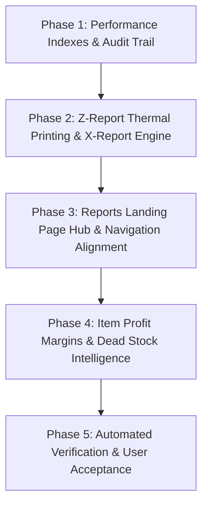

# 04 Roadmaps And Implementation Plans

> Consolidated edition. Each embedded source is preserved below with its original path and SHA-256 digest.


---

## Source 1: `plans/ADMIN_MODULES_EXECUTION_ROADMAP.md`

**SHA-256:** `d34aafe22284a7f06ea2a547fcf830654bccf16b607b2e60926e6998d149d1f3`

# DataPOS - Admin Modules Execution Roadmap

**Document Version:** 3.0.0
**Last Updated:** 2026-08-27
**System Base:** Laravel 12.64.0, PHP 8.2, Blade, Alpine.js, Tailwind CSS 4, SQLite/MySQL-ready
**Status Meaning:** “Implemented” means route/controller/view/test coverage exists. It does not automatically mean sale-ready, hardware-tested, or production-deployed.

## Current Summary

The previous roadmap described 22 high-priority admin modules. In the current codebase, these modules are no longer just sidebar placeholders. They have real route-backed implementation across admin, POS, finance, inventory, service, and storefront areas.

The remaining work is not “build all modules from zero.” The real remaining work is:

1. verify commercial demo flow end-to-end,
2. polish the most-used screens,
3. prepare safe demo data,
4. add backup/restore and installer workflow,
5. run pilot-shop testing before production deployment.

`store.admin.coming-soon` still exists for future roadmap modules, but it should not be treated as evidence that the 22 high-priority modules are missing.

## Module Readiness Matrix

| No | Module | Main Route | Current Status | Commercial Readiness Note |
|---:|---|---|---|---|
| 1 | Customer Receivables & Debt Ledger | `store.admin.receivables.index` | Implemented | Needs pilot debt workflow QA |
| 2 | Barcode & QR Label Printing | `store.admin.barcode.index` | Implemented | Needs real printer/sticker test |
| 3 | Profit & Loss Statement | `store.admin.profit_loss.index` | Implemented | Needs pilot data accuracy check |
| 4 | Warranty / Serial / IMEI Tracker | `store.admin.warranty.index` | Implemented | Needs mobile-shop demo data |
| 5 | Stock Ledger / Bin Cards | `store.admin.stock_ledger.index` | Implemented | Needs ledger reconciliation spot-check |
| 6 | Physical Stock Count | `store.admin.stock_count.index` | Implemented | Needs barcode scanner workflow test |
| 7 | Bulk Price Wizard | `store.admin.price_wizard.index` | Implemented | Needs permission and audit review |
| 8 | Cash & Bank Transactions | `store.admin.transactions.index` | Implemented | Needs cash closing reconciliation test |
| 9 | Thermal Receipt Printers | `store.admin.printers.index` | Implemented | Needs real 58mm/80mm hardware test |
| 10 | Voucher Designer | `store.admin.vouchers.index` | Implemented | Needs print layout QA |
| 11 | Branch Management | `store.admin.branches.index` | Implemented | Needs multi-branch pilot scenario |
| 12 | Currency Exchange Rates | `store.admin.exchange_rates.index` | Implemented | Needs pricing/accounting policy decision |
| 13 | Membership / Loyalty | `store.admin.membership.index` | Implemented | Optional for first pilot |
| 14 | Promotions / Coupons | `store.admin.promotions.index` | Implemented | Optional for first pilot |
| 15 | Web Catalog Visibility | `store.admin.web_products.index` | Implemented | Needed for online catalog demo |
| 16 | E-Load Register | `store.admin.eload.index` | Implemented | Useful for phone shops |
| 17 | Sales Analytics | `store.admin.sales_analytics.index` | Implemented | Needs realistic demo sales data |
| 18 | Inventory Valuation | `store.admin.inventory_valuation.index` | Implemented | Needs cost data correctness review |
| 19 | Debt Aging Report | `store.admin.debt_aging.index` | Implemented | Needs receivables sample data |
| 20 | Staff Roles | `store.admin.roles.index` | Implemented | Needs owner/staff permission audit |
| 21 | Audit Logs | `store.admin.audit-logs.index` | Implemented | Needs critical action coverage review |
| 22 | Database Tools / Alerts | `store.admin.database.index`, `store.admin.alerts.index` | Implemented | Needs safe-operation guard review |

## Sidebar Architecture

The current admin sidebar is organized into 11 practical business groups:

1. `POS & In-store Sales`
2. `Inventory & Products`
3. `Purchasing & Transfers`
4. `Ecommerce Storefront`
5. `Customers & CRM`
6. `Repairs & Service`
7. `Finance & Accounts`
8. `Reports & Analytics`
9. `Security & Access`
10. `System Maintenance`
11. `Business Setup`

This grouping is suitable for Myanmar SME users because daily cashier work, inventory work, purchasing work, finance work, and settings are separated clearly.

## Priority for Next Implementation Work

Do not start another large module batch before commercial readiness work. The codebase already has enough modules for a strong demo.

### Priority 1 - Sale Demo Path

Polish only the screens that appear in the first 5-minute sales demo:

- POS sale screen
- Products list/import
- Customer receivables
- Stock ledger/count
- Daily closing
- Profit and loss
- Settings / voucher / printer

### Priority 2 - Data Integrity Path

Verify data flow across:

- product opening stock to inventory ledger,
- sale to stock decrease and cash movement,
- return to stock restoration and refund,
- purchase receiving to stock increase and payable,
- debt sale to receivable,
- debt collection to receivable reduction and cash/bank transaction.

### Priority 3 - Permission and Store Isolation

For every module, confirm:

- route has `EnsureStoreAccess`,
- query is scoped to the current `StoreContext`,
- route-model-bound records cannot cross stores,
- manager-only actions are not available to ordinary staff,
- destructive actions have validation and clear confirmation.

### Priority 4 - UI Consistency

Use Admin UI/UX Standard Guide (`../guides/ADMIN_UI_UX_STANDARD_GUIDE_v4_1.md`; see consolidated index) as the standard for pages touched during new work. Avoid full-site redesign until pilot workflow is stable.

## Definition of Done for a Module

A module should be called “sale-ready” only when all items pass:

- route/controller/view exists,
- store scoping is enforced,
- authorization is tested,
- validation and error messages are practical,
- list/search/filter/pagination are usable,
- create/update/destructive paths are covered,
- Burmese labels are natural,
- light/dark mode is readable,
- low-end screen and tablet layout are usable,
- relevant export/print flows are tested if the module promises them,
- targeted feature tests pass.

## Commercial Readiness Gates

Before first paid pilot:

- [ ] Run full test suite or document exact failures.
- [ ] Run one mobile-shop demo from empty/fresh demo data.
- [ ] Verify receipt printing with real hardware or clearly mark printing as unverified.
- [ ] Verify backup and restore.
- [ ] Verify permissions for owner, manager, staff, customer.
- [ ] Verify no production secrets are committed.
- [ ] Verify `SHOW_QUICK_LOGIN=false` for any production/staging deployment.

Before public/resale release:

- [ ] Installer or setup script is repeatable.
- [ ] Support checklist exists.
- [ ] License/demo mode decision is implemented or explicitly deferred.
- [ ] Data migration/backup plan is documented.
- [ ] At least one real pilot shop has completed a full operating day.

## Recommended Next Step

Build and verify `Commercialization Phase C1`:

1. Mobile shop demo preset.
2. Admin demo preset switcher.
3. 5-minute demo script.
4. Backup/restore workflow.
5. Targeted tests for the above.

After that, use this roadmap as a QA checklist, not as a request to add more modules.

---

## Source 2: `plans/DATAPOS_SINGLE_CODEBASE_GROWTH_PLAN_MM.md`

**SHA-256:** `60324aa34b451c156d5ca7f3f8a0a1cbaacdb55b14fc51c570e2d892736b8cad`

# DataPOS Single-Codebase Growth Plan (Myanmar Market)

**Document type:** Product architecture and implementation master plan
**Status:** Proposed for owner approval
**Created:** 2026-08-29
**Primary constraint:** One owner/developer working with AI agents
**Primary goal:** DataPOS ကို repository တစ်ခုတည်းအတွင်း မြန်မာနိုင်ငံရှိ လုပ်ငန်းအမျိုးအစားများအတွက် ရောင်းချနိုင်သော၊ ထိန်းသိမ်းရလွယ်သော software product အဖြစ် တိုးချဲ့ရန်

---

## 1. Executive Decision

DataPOS ကို လုပ်ငန်းအမျိုးအစားတစ်ခုစီအတွက် project copy များခွဲပြီး မတည်ဆောက်ရ။ အောက်ပါ product model ကို အသုံးပြုမည်။

```text
One Repository
└── DataPOS Core
    ├── Capability System
    ├── Business Profiles
    ├── Optional Vertical Packs
    ├── Storefront Theme Engine
    ├── Cloud Deployment
    └── Local/LAN Deployment (later)
```

ဖောက်သည်ကို ရောင်းချရာတွင် edition အမည်များကွဲနိုင်သော်လည်း source code နှင့် core database rules သည် တစ်ခုတည်းဖြစ်ရမည်။

```text
DataPOS Mobile & Electronics Edition
DataPOS General Retail Edition
DataPOS Repair & Service Edition
DataPOS Pharmacy Edition (after batch/expiry foundation)
DataPOS Agriculture Supply Edition (after batch/UOM foundation)
DataPOS Restaurant Edition (separate vertical pack, demand-gated)
```

### Non-negotiable rules

1. Authentication, tenant isolation, sales, inventory ledger, finance, audit, backup နှင့် reporting core ကို edition တစ်ခုချင်း copy မလုပ်ရ။
2. Long-lived `mobile`, `pharmacy`, `restaurant` Git branches မဖန်တီးရ။
3. Store Owner ကို PHP, Blade, JavaScript သို့မဟုတ် arbitrary CSS upload လုပ်ခွင့်မပေးရ။
4. Theme နှင့် Business Profile ကို မရောရ။
5. New vertical တစ်ခုကို label ပြောင်းရုံဖြင့် supported ဟု မရောင်းရ။ Required workflow နှင့် data integrity tests ပြည့်မှသာ ရောင်းရမည်။
6. တစ်ချိန်တည်းတွင် major vertical တစ်ခုထက်ပို၍ မဆောက်ရ (WIP limit = 1 vertical).

---

## 2. Product Layers

### 2.1 DataPOS Core

လုပ်ငန်းအမျိုးအစားအားလုံးအသုံးပြုနိုင်ရမည့် shared foundation ဖြစ်သည်။

- Store/tenant isolation
- Users, roles and permissions
- Branches and warehouses
- Products, categories, brands and variants
- Barcode/SKU foundation
- Inventory movements and balances
- POS sales, returns and reversals
- Purchasing and supplier payables
- Customers, membership and debt
- Cashier shifts and daily closing
- Payments and financial transactions
- Audit logs
- Reports and exports
- Backup, restore and migration safety
- Localization (Myanmar/English/Chinese as currently supported)
- Storefront catalog, ordering and customer account

Core rule တစ်ခုကို vertical module က bypass မလုပ်ရ။ ဥပမာ Restaurant sale, Pharmacy sale နှင့် Mobile sale အားလုံးသည် shared posting, payment, audit နှင့် inventory transaction rules ကို ဖြတ်သန်းရမည်။

### 2.2 Capability System

Boolean fields များစွာကို `stores` table ထဲထည့်ခြင်းထက် named capabilities အသုံးပြုမည်။

```text
catalog.variants
inventory.serial_tracking
inventory.batch_tracking
inventory.expiry_tracking
inventory.multi_uom
service.repair_jobs
service.warranty_tracking
commerce.wholesale_pricing
restaurant.tables
restaurant.kitchen_orders
restaurant.recipe_inventory
```

Capability တစ်ခုသည် အောက်ပါနေရာအားလုံးတွင် server-side enforce ဖြစ်ရမည်။

- Routes/middleware
- Policies/authorization
- Admin sidebar and dashboard
- Form fields and validation
- Service-layer business rules
- Reports
- Storefront navigation and sections
- Imports/exports

UI ကိုဖျောက်ထားခြင်းတစ်ခုတည်းကို permission enforcement ဟု မယူဆရ။

### 2.3 Business Profiles

Business Profile သည် capabilities, labels, default settings, navigation နှင့် demo configuration ကို စုပေးသော preset ဖြစ်သည်။ Code package မဟုတ်ပါ။

ဥပမာ `mobile_electronics` profile:

```text
Enable:
- catalog.variants
- inventory.serial_tracking
- service.warranty_tracking
- service.repair_jobs
- commerce.wholesale_pricing

Default storefront content:
- Brand/model discovery
- Warranty messaging
- Compatibility filters
- Repair tracking
```

Profile apply လုပ်ရာတွင် existing business data ကို မဖျက်ရ။ Capability disable လုပ်ခြင်းသည် historical records ကို မဖျက်ရ၊ hidden/readonly access policy ကို သတ်မှတ်ရမည်။

### 2.4 Vertical Packs

Vertical Pack သည် data model နှင့် workflow အမှန်တကယ်ကွဲသော domain feature ဖြစ်သည်။

- Mobile/Electronics Pack
- Repair/Service Pack
- Pharmacy/Agriculture Batch Pack
- Restaurant Operations Pack

Pack တစ်ခုစီတွင် အနည်းဆုံး အောက်ပါအရာများပါရမည်။

- Models and migrations
- Domain services
- Validation and authorization
- Admin/POS views
- Reports
- Import/export rules
- Audit coverage
- Automated tests
- Demo seed data
- Upgrade/rollback notes

### 2.5 Storefront Theme Engine

Theme သည် “ဘယ်လိုမြင်ရမလဲ” ကိုသာ ဆုံးဖြတ်သည်။ Business Profile သည် “ဘာတွေပါရမလဲ၊ ဘယ်လိုအလုပ်လုပ်ရမလဲ” ကို ဆုံးဖြတ်သည်။

Theme တစ်ခုရွေးလိုက်လျှင် customer-facing storefront အားလုံး အတွဲလိုက်ပြောင်းရမည်။

- Header and navigation
- Homepage
- Category/browse page
- Product listing
- Product detail
- Search and filters
- Cart/order builder
- Customer account
- Blog and guidance pages
- Contact/service tracking presentation
- Footer
- Mobile navigation
- Empty, loading and error states

Store Owner သည် Platform Owner enable လုပ်ထားသော themes များထဲမှရွေးနိုင်ပြီး safe branding values ကိုသာပြောင်းနိုင်မည်။

---

## 3. Myanmar Market Priority

### 3.1 Tier A - Build and sell first

#### A1. Mobile and Electronics

DataPOS ၏ လက်ရှိ feature set နှင့် အကိုက်ဆုံးဖြစ်သည်။ ပထမဆုံး production reference customer နှင့် case study ကို ဒီ vertical မှရယူရမည်။

Required capabilities:

- Retail/wholesale pricing
- Product variants
- SKU and barcode scan
- IMEI/serial tracking
- Warranty tracking
- Customer debt
- Repair/service jobs
- Spare parts consumption
- Supplier purchasing and payables
- Branch/warehouse transfer
- Returns/exchanges

#### A2. General Retail and Wholesale

ကုန်စုံအသေးစား၊ အထွေထွေပစ္စည်းဆိုင်၊ အလှကုန်၊ အိမ်သုံးပစ္စည်းနှင့် ဖြန့်ချိရေးလုပ်ငန်းများကို ရည်ရွယ်သည်။

Required capabilities:

- Fast barcode POS
- Retail/wholesale price tiers
- Customer/supplier debt
- Stock receiving and transfer
- Cashier shift and daily closing
- Basic promotions
- Purchase and sales reports
- Low-stock alerts

#### A3. Repair and Service

Mobile/computer/CCTV repair, installation and maintenance businesses ကို ရည်ရွယ်သည်။ လက်ရှိ service/repair foundation ကို shared pack အဖြစ် တည်ငြိမ်စေရမည်။

Required capabilities:

- Device/customer intake
- Job number and status workflow
- Technician assignment
- Diagnosis and estimate
- Deposit and balance payment
- Spare-parts consumption
- Service warranty
- Customer-facing tracking
- Job profitability report

### 3.2 Tier B - Build only after foundation and customer validation

#### B1. Pharmacy and Agriculture Supply

Pharmacy နှင့် စိုက်ပျိုးရေးဆေး/မြေသြဇာဆိုင်တို့သည် shared batch foundation အသုံးပြုနိုင်သော်လည်း labels နှင့် regulatory workflow ကွဲနိုင်သည်။

Required foundation before sale:

- Batch/lot tracking
- Manufacture and expiry dates
- FEFO stock issuing option
- Multi-unit/UOM conversion
- Expiring/expired stock blocking and alerts
- Batch-aware purchase receiving and returns
- Batch recall/history report
- Supplier traceability
- Safe product warnings/notes

Pharmacy-ready ဟု မကြေညာမီ actual pharmacist/store workflow ဖြင့် pilot ပြုလုပ်ရမည်။

#### B2. Fashion and Boutique

General Retail core ပေါ်တွင် relatively low-cost extension ဖြစ်နိုင်သည်။

- Size/color matrix
- Variant image management
- Exchange workflow
- Visual storefront theme
- Optional season/collection fields

### 3.3 Tier C - Separate demand-gated vertical pack

#### C1. Restaurant and Food Service

Restaurant ကို retail labels ပြောင်းထားသော edition အဖြစ် မဆောက်ရ။ အောက်ပါ workflow များကြောင့် သီးခြား vertical pack လိုသည်။

- Tables and zones
- Dine-in/takeaway/delivery order types
- Kitchen Order Ticket (KOT)
- Menu modifiers/add-ons
- Course/kitchen status
- Split/merge bill
- Recipe and ingredient consumption
- Kitchen printer routing
- Waste and void control

အနည်းဆုံး paying pilot customers 2 ယောက် သို့မဟုတ် signed requirements ရှိမှ development စရန် အကြံပြုသည်။ Restaurant pack က shared core နှင့် 50% အောက်သာ share နိုင်ကြောင်း prototype က သက်သေပြမှသာ separate repository/product ကို ပြန်စဉ်းစားရမည်။

### 3.4 Do not prioritize yet

- Gold/jewelry weight and daily price systems
- Fuel station pump integration
- Hotel/property management
- Full manufacturing/MRP
- Hospital/clinic records
- Payroll/HR suite

ဤလုပ်ငန်းများသည် domain risk မြင့်ပြီး လက်ရှိ DataPOS core မှ အလွန်ကွဲသည်။ Customer demand နှင့် domain expert မရှိဘဲ မဆောက်ရ။

---

## 4. Storefront Theme Product Plan

### 4.1 Initial theme catalog

ပြင်ပ brand များ၏ design ကို တိုက်ရိုက် clone သို့မဟုတ် trademark နာမည်ဖြင့် မရောင်းရ။ Familiar ecommerce interaction patterns ကို DataPOS ၏ကိုယ်ပိုင် theme names နှင့်တည်ဆောက်မည်။

| Theme | Design direction | Recommended use |
|---|---|---|
| `Marketplace Pro` | Dense marketplace discovery | Mobile, electronics, large catalogs |
| `Retail Trust` | Clear search and trust-focused retail | General retail, pharmacy |
| `Visual Boutique` | Image-led catalog | Fashion, beauty, lifestyle |
| `Quick Shop` | Lightweight mobile-first ordering | Small Myanmar shops, unstable internet |
| `Wholesale Catalog` | Dense B2B pricing and MOQ | Wholesale/distribution |

Delivery order:

1. Build engine plus `Marketplace Pro`.
2. Build `Retail Trust` and prove cross-theme compatibility.
3. Stop and run pilot/QA.
4. Add remaining themes only after the first two pass all storefront journeys.

### 4.2 Theme permissions

| Action | Platform Owner | Store Owner |
|---|---:|---:|
| Create/register theme | Yes | No |
| Install/update/deprecate theme | Yes | No |
| Enable theme for stores/plans | Yes | No |
| Select an enabled theme | Yes | Yes |
| Change colors/logo/font/banner | Yes | Yes |
| Change approved section visibility/order | Yes | Limited |
| Edit executable templates/scripts | No web upload | No |
| Preview/publish own store | Yes | Yes |
| Roll back own store theme | Yes | Yes |

### 4.3 Safe customization fields

- Primary/accent/background colors
- Contrast-safe text color derived by system
- Approved font presets with Myanmar glyph support
- Logo, favicon and banners
- Button/card style presets
- Homepage section visibility and approved ordering
- Store-specific headings and descriptions
- Light/dark preference where theme supports it

Do not accept:

- Raw PHP/Blade/JavaScript
- Arbitrary remote scripts
- Unvalidated HTML
- Unrestricted CSS
- Theme assets outside controlled storage paths

### 4.4 Theme lifecycle

```text
Installed -> Enabled -> Draft customization -> Preview -> Published
                                         \-> Discard
Published -> New revision -> Rollback
Theme version -> Upgrade check -> Migrate config -> Publish
```

Required records:

- Theme registry/manifest
- Store draft configuration
- Store published configuration
- Revision history
- Theme asset references
- Theme engine/app compatibility version

Theme in-use ဖြစ်နေချိန် hard delete မလုပ်ရ။ `deprecated` status ထားပြီး replacement path ပေးရမည်။

---

## 5. Admin Product Strategy

Admin Panel ကို vertical တစ်ခုစီအတွက် design အသစ်မခွဲရ။ Stable admin shell တစ်ခုတည်းထားပြီး capabilities အလိုက် menu, dashboard widgets, fields နှင့် workflow များပြောင်းမည်။

### Platform Owner responsibilities

- Stores, subscriptions/plans and capabilities
- Business profile catalog
- Theme catalog and rollout
- Vertical pack availability
- Support-mode access with reason and audit
- Global compatibility and migration status
- Usage/health monitoring

### Store Owner responsibilities

- Own-store users and permissions
- Branches, warehouses and operational settings
- Enabled optional modules within allowed plan
- Store branding and enabled theme selection
- Store-level workflow settings
- Publish/rollback own storefront

### Staff responsibilities

- Role-authorized operational actions only
- No theme/package/profile administration
- No cross-store access

Admin color branding may be allowed later, but navigation structure and workflow layout must remain platform-controlled to reduce training and support cost.

---

## 6. Target Technical Boundaries

ဒီ section သည် implementation စတင်ချိန်တွင် repository conventions နှင့် ထပ်မံစစ်ပြီးမှ final class/table names သတ်မှတ်ရန် architecture target ဖြစ်သည်။

### 6.1 Suggested services

```text
App\Capabilities\CapabilityRegistry
App\Capabilities\StoreCapabilityResolver
App\BusinessProfiles\BusinessProfileRegistry
App\Themes\ThemeRegistry
App\Themes\ThemeConfigValidator
App\Themes\ThemeRenderer
App\Themes\ThemePublisher
App\Themes\ThemeAssetManager
```

### 6.2 Suggested persistence concepts

```text
business_profiles
capabilities
business_profile_capabilities
store_capabilities
storefront_themes
store_theme_configs
store_theme_revisions
store_theme_assets
```

Exact tables မဖန်တီးမီ current schema နှင့် JSON-vs-normalized tradeoff ကို ADR ဖြင့်ဆုံးဖြတ်ရမည်။ Store-specific operational data အားလုံးတွင် `store_id` isolation နှင့် required indexes ရှိရမည်။

### 6.3 Rendering strategy

- Controllers မှ business data ကို theme-independent view models ဖြင့်ပေးရန်
- Theme files မှ database queries မပြုလုပ်ရန်
- Shared UI contracts သတ်မှတ်ရန် (`ProductCardData`, `StoreHeaderData`, etc.)
- Theme fallback ရှိရန်
- Missing/incompatible theme ကြောင့် storefront 500 error မဖြစ်စေရန်
- Published config ကို cache လုပ်ပြီး publish/update တွင် targeted invalidation ပြုလုပ်ရန်
- Preview ကို signed, expiring, store-scoped token ဖြင့်သာကြည့်ရန်

### 6.4 Theme package policy

First release တွင် themes ကို application source အတွင်း reviewed code အဖြစ်သာ ဖြန့်ဝေရန်။ Theme upload installer ကို business demand မရှိမချင်း မဆောက်ရ။

Installer တည်ဆောက်ရပါက Platform Owner only ဖြစ်ပြီး အနည်းဆုံးအောက်ပါတို့လိုသည်။

- Signed/approved package policy
- Strict `manifest.json` schema
- File count and size limits
- MIME and extension allowlist
- Zip path traversal protection
- No executable server-side files
- Asset scan and safe extraction path
- Engine/app compatibility check
- Atomic install and rollback
- Audit log

---

## 7. Implementation Roadmap

Calendar estimates မဟုတ်ဘဲ exit criteria ဖြင့် phase ပြီး/မပြီးဆုံးဖြတ်မည်။ AI agent speed သည် production readiness ကို မအစားထိုးနိုင်။

### Phase 0 - Baseline, Decisions and Safety Freeze

**Goal:** လက်ရှိ project ကို feature ထပ်မတိုးမီ ယုံကြည်ရသော baseline ပြုလုပ်ရန်။

Tasks:

- Current automated test baseline ကို run/record
- Dirty worktree changes ကို owner-approved commits အဖြစ်ခွဲ
- Current production/pilot workflows inventory ပြုလုပ်
- Existing store isolation audit completion status စစ်
- Theme/Profile/Capability terminology ကို ADR ဖြင့် lock
- Supported editions and non-goals approve
- Current schema backup and restore drill status confirm
- Critical user journeys list ပြုလုပ်

Exit criteria:

- Test baseline documented
- No unknown migration failures
- Store isolation blockers resolved or explicitly tracked
- Architecture decisions owner-approved
- Rollback point/tag available

### Phase 1 - Capability Foundation

**Goal:** Modules ကို UI hide/show ထက်ပိုသော server-enforced capability system ဖြင့်ထိန်းရန်။

Tasks:

- Capability registry/resolver
- Store capability persistence
- Business profile definitions in code first
- Middleware/policy enforcement pattern
- Sidebar/dashboard visibility integration
- Platform Owner management UI (minimal)
- Audit capability changes
- Migration defaults preserving current behavior

Initial profiles:

- `mobile_electronics`
- `general_retail`
- `repair_service`

Exit criteria:

- Existing stores retain current access after migration
- Disabled capability cannot be reached by direct URL/API
- Cross-store capability writes fail
- Profile changes do not delete historical data
- Feature tests cover manager/staff/platform roles

### Phase 2 - Storefront Decoupling

**Goal:** လက်ရှိ mobile-specific storefront ကို industry-neutral data and component contracts အဖြစ်ခွဲရန်။

Tasks:

- Mobile-specific hardcoded sections inventory
- Industry content and module navigation separation
- Shared storefront view models
- Header/footer/product card/search component boundaries
- Profile-driven section availability
- Neutral fallback copy
- Pharmacy store တွင် Glass Finder/mobile copy မပေါ်စေရန်

Exit criteria:

- General Retail profile shows no mobile-only features
- Storefront pages render without theme-specific queries
- Current Mobile storefront behavior remains supported
- Myanmar/English localization parity passes

### Phase 3 - Theme Engine MVP

**Goal:** Complete storefront theme bundle selection with safe per-store branding.

Tasks:

- Theme registry and manifests
- Draft/published theme configuration
- `Marketplace Pro` implementation
- `Retail Trust` implementation
- Real storefront preview at desktop/tablet/mobile sizes
- Color/logo/font/banner customization
- Publish transaction and cache invalidation
- Revision history and rollback
- Theme fallback and compatibility errors

Exit criteria:

- One store can preview without affecting public storefront
- Publishing one store never changes another store
- Rollback restores exact previous published revision
- Both themes pass all customer-facing routes
- Mobile viewport has no horizontal overflow/overlap
- Theme selection survives app restart/deploy

### Phase 4 - Mobile/General Retail/Repair Productization

**Goal:** ပထမဆုံးရောင်းချမည့် editions သုံးခုကို reliable product packages အဖြစ်ပြင်ရန်။

Tasks:

- Edition onboarding wizard/preset
- Demo stores and role-based demo accounts
- Import templates and validation
- Printer/barcode hardware test matrix
- Customer debt and opening-balance workflow validation
- Repair workflow completion and profitability reporting
- Sales demo script and owner training guide
- Backup/restore runbook
- Release checklist and support checklist

Exit criteria:

- At least one real pilot shop completes daily workflow
- Daily closing and stock reconciliation match manual records
- Backup restore drill passes
- Owner can onboard a store without editing source code
- Critical defects have documented resolution/rollback

### Phase 5 - Cloud Resale Hardening

**Goal:** Multi-tenant cloud sales ကို လုံခြုံတည်ငြိမ်အောင်လုပ်ရန်။

Tasks:

- Provisioning and plan/capability assignment
- Platform support-mode workflow with audit
- Scheduler/queue/backup monitoring
- Rate limits and upload quotas
- Store data export and deletion workflow
- Operational metrics and incident runbook
- Update/deployment rollback process
- Customer-facing release notes

Exit criteria:

- Tenant isolation test suite passes
- Provisioning and offboarding are repeatable
- Restore point objectives documented and tested
- Support access is reason-bound and audited
- Deployment rollback tested

### Phase 6 - Pharmacy/Agriculture Foundation

**Entry gate:** Tier A editions stable and at least one validated customer requirement set.

Tasks:

- UOM and unit conversion foundation
- Batch/lot inventory model
- Manufacture/expiry dates
- FEFO option and expiry blocking policy
- Batch-aware receiving/sales/returns/transfers
- Expiry and recall reports
- Pharmacy/Agriculture profiles and demo data
- `Retail Trust` industry adaptation

Exit criteria:

- Batch quantity reconciles through full lifecycle
- Expired stock policy is enforced server-side
- Returns and transfers preserve batch identity
- Real pilot owner verifies daily workflow
- No unsupported medical claims are shown by default

### Phase 7 - Local/LAN Edition

**Entry gate:** Cloud edition operationally stable and paying demand for offline/local installation confirmed.

Tasks:

- Supported local database decision and compatibility tests
- Installer/provisioning
- LAN access and firewall guide
- Versioned backup package with checksums
- Restore preflight and automatic pre-restore backup
- Signed offline license (public-key verification)
- Upgrade and rollback tool
- Remote support procedure with owner consent

Exit criteria:

- Clean-machine install test passes
- Power/network interruption recovery tested
- Backup/restore and upgrade/rollback pass
- Private signing key is absent from customer installations
- Support runbook usable by non-developer operator

### Phase 8 - Restaurant Discovery and Prototype

**Entry gate:** At least two serious prospects/pilots or funded implementation request.

Tasks:

- Field interviews and workflow mapping
- Table/KOT/modifier/recipe prototype
- Shared-core reuse measurement
- Printer and kitchen latency test
- Data model ADR
- Go/no-go decision

Exit criteria:

- Requirements signed off by pilot users
- Prototype proves operational flow
- Repository strategy is decided using measured shared-code ratio
- Full build is separately approved

---

## 8. Solo Developer + AI Agent Operating Model

### 8.1 Work-in-progress limits

- One active vertical pack maximum
- One active architecture migration maximum
- Theme count maximum two until engine is stable
- No new major feature while a production blocker is open
- Every AI task must have explicit scope and acceptance criteria

### 8.2 Required workflow for each feature

```text
1. Read repository and related docs
2. Define problem and non-goals
3. Write/update ADR or implementation plan
4. Add/adjust tests for expected behavior
5. Implement smallest safe slice
6. Run focused tests
7. Run broader regression tests
8. Review tenant isolation/security/data integrity
9. Browser-test critical UI on desktop/mobile
10. Update changelog/runbook
11. Commit one coherent change
12. Pilot before expanding scope
```

### 8.3 AI agent rules

- Agent တစ်ခုစီကို overlapping files မပေးရ။
- Architecture decision ကို agents အလိုအလျောက်မဆုံးဖြတ်စေရ။ Owner-approved ADR ကို source of truth သုံးရမည်။
- Generated migrations and destructive operations ကို manual review မရှိဘဲ မ run ရ။
- Agent claim “tests passed” ကို command output နှင့် changed files review မရှိဘဲ မယုံရ။
- Security, money, inventory and tenant-scope changes ကို second review pass ပြုလုပ်ရမည်။
- Large refactor ကို feature development နှင့် commit တစ်ခုထဲမရောရ။

### 8.4 Definition of Done

Feature တစ်ခုသည် အောက်ပါတို့ပြည့်မှ Done ဖြစ်သည်။

- Acceptance criteria pass
- Validation and authorization present
- Tenant scope verified
- Failure/edge cases handled
- Audit/logging included where material
- Focused and regression tests pass
- Mobile/desktop UI checked where relevant
- Migration rollback/recovery considered
- Documentation updated
- No unrelated file churn

---

## 9. Commercial Packaging for Myanmar

### 9.1 Recommended offers

အစပိုင်းတွင် pricing ကို feature အလွန်များစွာခွဲမည့်အစား support/deployment scope ဖြင့် ရိုးရှင်းစွာစမ်းသပ်ရန်။ Exact prices ကို customer interviews နှင့် operating cost မတိုင်းမီ ဒီ plan တွင် lock မလုပ်ပါ။

- **Starter:** Single store, core POS, basic reports
- **Business:** Purchasing, debt, advanced inventory, storefront
- **Operations:** Multi-branch, repair/vertical capabilities, advanced reports
- **Local/LAN:** One-time setup plus maintenance agreement (after Phase 7)

### 9.2 Myanmar-specific selling requirements

- Myanmar language first, English technical fallback
- MMK formatting and configurable currency display
- Viber/Telegram/phone ordering links
- Customer and supplier credit/debt
- Cashier shift and daily closing
- Barcode scanner support
- 58mm/80mm receipt support with tested printers
- Excel import/export with clear error report
- Unstable internet considerations
- Low-end device performance
- Backup ownership and restore explanation
- Simple owner training materials

### 9.3 Do not promise before verified

- “Works fully offline” without tested offline queue/local edition
- Bluetooth printing across all Android devices
- Pharmacy compliance without pilot validation
- Restaurant readiness without KOT/table workflow
- Automatic cloud/local synchronization
- Any integration not tested on the customer's actual hardware

---

## 10. Quality Gates

### Security

- Tenant isolation on every store-owned record
- Server-side capability and role enforcement
- CSRF/authentication protection
- Safe uploads and storage paths
- No executable theme uploads
- Support access audit
- Secrets never stored in client code or repository

### Data integrity

- Money avoids floating-point storage/calculation errors
- Inventory changes are transactional and auditable
- Posted documents are corrected through reversal, not destructive edits
- Import retries are idempotent where relevant
- Historical records survive profile/capability changes
- Backup/restore tested before production migration

### Performance and connectivity

- Avoid loading all products into initial POS/storefront response
- Paginate/search server-side
- Optimize and size-limit images
- Cache published theme/profile resolution
- Keep storefront JavaScript lightweight
- Test on mid/low-range Android and weak network profiles

### UX

- Myanmar labels understandable to non-technical owners
- Destructive actions have explicit confirmation
- Forms preserve input after validation failure
- Empty states tell the user what action is possible
- Theme preview never modifies live storefront
- Admin navigation shows only relevant capabilities

---

## 11. Decision Gates and Stop Rules

A new vertical must satisfy all of the following before full implementation:

1. At least one real customer workflow has been observed and documented.
2. Required data model differences are known.
3. Existing core reuse is assessed.
4. Pilot customer or commercial demand exists.
5. Current production blockers are under control.
6. Backup/rollback path is available.
7. The feature can be maintained by one owner after launch.

Stop or postpone when:

- A vertical requires duplicating core sales/inventory/finance code.
- Customer demand is only hypothetical.
- Existing pilot data does not reconcile.
- Automated tests are becoming less reliable.
- Support workload is already above solo capacity.
- A feature requires paid infrastructure that revenue cannot support.

---

## 12. First 90-Day Execution Sequence (Order, Not Fixed Dates)

ဒီ sequence သည် calendar promise မဟုတ်ပါ။ Step တစ်ခု၏ exit criteria ပြည့်မှ နောက်တစ်ခုသို့သွားရန်ဖြစ်သည်။

1. Stabilize current worktree and record full test baseline.
2. Approve capability/profile/theme ADRs.
3. Implement capability foundation preserving all current stores.
4. Create `mobile_electronics`, `general_retail`, `repair_service` profiles.
5. Remove mobile-only assumptions from neutral storefront paths.
6. Implement Theme Engine draft/publish/revision foundation.
7. Deliver `Marketplace Pro` end-to-end.
8. Deliver `Retail Trust` to prove multiple themes.
9. Run desktop/mobile/browser regression on every storefront route.
10. Pilot Mobile/General Retail/Repair editions with real workflows.
11. Fix pilot blockers and complete backup/restore drill.
12. Decide next investment using evidence: Pharmacy/Agriculture foundation or Cloud/Local resale hardening.

The next vertical must not start merely because theme work looks complete. Operational correctness and pilot evidence come first.

---

## 13. Immediate Deliverables Before Coding the New Architecture

Create and approve these small documents before implementation:

1. `ADR: Capability and Business Profile Model`
2. `ADR: Storefront Theme Rendering and Security Boundary`
3. `Storefront Route and Component Inventory`
4. `Mobile-specific Assumption Audit`
5. `Edition Capability Matrix`
6. `Theme Acceptance Test Matrix`
7. `Pilot Store Exit Checklist`

Recommended first implementation slice:

```text
Capability registry
-> three code-defined profiles
-> server-side route enforcement
-> sidebar visibility
-> backward-compatible defaults
-> focused tenant/role tests
```

Theme UI redesign should start only after the profile/capability boundary is stable enough that a theme does not accidentally expose an unsupported industry module.

---

## 14. Relationship to Existing Project Documents

ဒီ plan သည် ရှိပြီးသား documents များကို အစားထိုးခြင်းမဟုတ်ဘဲ product expansion layer အဖြစ် ဖြည့်စွက်သည်။ Conflict ဖြစ်ပါက owner-approved Source of Truth နှင့် newer ADR ကို ဦးစားပေးပြီး conflict ကို document နှစ်ဖိုင်လုံးတွင် ပြင်ရမည်။

- `docs/pos-resale-plan/ROADMAP.md` - POS/resale phases and current-state history
- `docs/pos-resale-plan/02-target-design.md` - single-codebase, inventory and deployment target design
- `docs/MYANMAR_SME_COMMERCIALIZATION_GUIDE.md` - commercialization and pilot guidance
- `docs/SMART_PRODUCT_AND_STORE_ARCHITECTURE_SPEC.md` - product/store architecture direction
- `Source_of_Truth_Master_MM.md` (`../architecture/Source_of_Truth_Master_MM.md`; see consolidated index) - approved project-level rules and decisions

---

## 15. Owner Approval Checklist

Implementation မစမီ အောက်ပါတို့ကို owner မှ approve/revise လုပ်ရန်။

- [ ] One repository + shared core strategy
- [ ] Initial sellable editions: Mobile, General Retail, Repair
- [ ] Pharmacy/Agriculture is Tier B, foundation-gated
- [ ] Restaurant is demand-gated separate vertical pack
- [ ] Initial themes: Marketplace Pro and Retail Trust
- [ ] Store Owner may select enabled themes and safe branding only
- [ ] Platform Owner controls themes, profiles and capabilities
- [ ] No executable theme upload
- [ ] WIP limit: one major vertical at a time
- [ ] Pilot and backup/restore gates before wider sales

---

## Final Recommendation

DataPOS ၏ ရေရှည်အားသာချက်သည် feature အများဆုံး software ဖြစ်ခြင်းမဟုတ်ဘဲ shared core တည်ငြိမ်ပြီး မြန်မာ SME တစ်မျိုးချင်းလိုအပ်ချက်ကို controlled profiles, vertical packs နှင့် storefront themes ဖြင့် လုံခြုံစွာပေါင်းစပ်ပေးနိုင်ခြင်းဖြစ်ရမည်။

တစ်ယောက်တည်း AI agents နှင့်တည်ဆောက်နေသောအခြေအနေတွင် project copy များ၊ long-lived edition branches များနှင့် vertical များကိုတစ်ပြိုင်နက်ဆောက်ခြင်းသည် အကြီးဆုံး maintenance risk ဖြစ်သည်။ Mobile/General Retail/Repair ကို ပထမဆုံးအရည်အသွေးမြင့်အောင်လုပ်ပြီး pilot evidence အပေါ်မူတည်၍ Pharmacy/Agriculture သို့တိုးခြင်းက အချိန်၊ ငွေကြေးနှင့် product reputation အတွက် အကောင်းဆုံးလမ်းကြောင်းဖြစ်သည်။

---

## Source 3: `plans/myanmar_business_commercial_readiness_plan_v1.md`

**SHA-256:** `0e62234c32f85b3418442b6beb269419bfa632f9b92ef47e8ff60510fbdc8f07`

# DataPOS — Myanmar Business Commercial Readiness Plan v1

## Document Status

- **Purpose:** DataPOS ကို Windows Offline Installer/EXE မထုတ်မီ မြန်မာနိုင်ငံရှိ retail၊ mobile/electronics၊ repair/service၊ wholesale နှင့် ecommerce လုပ်ငန်းများတွင် ရောင်းချအသုံးပြုနိုင်သောအဆင့်အထိ ပြင်ဆင်ရန် implementation plan
- **Status:** Approval Draft — v1
- **Rule:** ဤ plan ကို Store Owner/Project Owner က approval မပေးမီ production code၊ migrations၊ database records သို့မဟုတ် installer ကို မပြင်ရ။ Read-only audit၊ test baseline နှင့် documentation ပြုလုပ်ခြင်းသာ ခွင့်ပြုသည်။
- **Next document:** ဤ plan အောင်မြင်ပြီး UAT approval ရမှ active `windows_offline_installer_plan_v2.md` ကို current evidence နှင့်အညီ update လုပ်ရန် (`v1` သည် archive ထဲရှိ historical plan ဖြစ်သည်)

---

## 1. Primary Goal

DataPOS ကို programmer မဟုတ်သော ဆိုင်ရှင်နှင့်ဝန်ထမ်းများက—

- အင်တာနက်မရှိဘဲ Windows ကွန်ပျူတာပေါ်တွင် အသုံးပြုနိုင်ခြင်း
- ရောင်းအား၊ လက်ခံငွေ၊ ပြန်အမ်းငွေ၊ ကုန်ကျစရိတ်၊ အကြွေးနှင့် stock စာရင်းများ အပြန်အလှန်ကိုက်ညီခြင်း
- Receipt၊ Invoice၊ Voucher နှင့် Reports များကို မြန်မာစာမှန်ကန်စွာ Print/PDF ထုတ်နိုင်ခြင်း
- Excel/CSV ဖြင့် data import/export လုပ်ရာတွင် data မပျောက်၊ မပွား၊ မမှားခြင်း
- Backup ကို အလွယ်တကူသိမ်းပြီး ကွန်ပျူတာအသစ်တွင် Restore ပြန်လုပ်နိုင်ခြင်း
- Cashier၊ Manager၊ Accountant၊ Inventory Staff နှင့် Technician တို့အား သီးခြား permission ပေးနိုင်ခြင်း

တို့ကို ယုံကြည်စိတ်ချစွာ လုပ်နိုင်စေရန်ဖြစ်သည်။

## 2. Non-Goals

ဤ phase တွင်—

- Windows EXE/Installer မထုတ်သေးရ။
- မရှိသေးသော cloud synchronization architecture ကို ခန့်မှန်း၍ မတီထွင်ရ။
- Accounting/legal compliance အောင်မြင်သည်ဟု professional verification မရှိဘဲ မကြေညာရ။
- Scope နှင့်မသက်ဆိုင်သော storefront redesign သို့မဟုတ် business module အသစ် မတီထွင်ရ။
- Existing sales၊ stock၊ customer၊ finance နှင့် repair records မဖျက်ရ။

---

## 3. Mandatory Pre-Implementation Audit

### 3.1 Repository Baseline

1. Repository ရှိ `AGENTS.md` နှင့် project documentation အားလုံးကို အပြည့်အစုံဖတ်ပါ။
2. Local checkout၊ GitHub default branch နှင့် deployment commit မတူပါက source of truth commit တစ်ခုကို ရွေးချယ်ပြီး full SHA မှတ်တမ်းတင်ပါ။
3. `git status`၊ current branch၊ full commit SHA နှင့် remotes ကို report လုပ်ပါ။
4. Existing unrelated changes ကို မဖျက်၊ overwrite သို့မဟုတ် commit မလုပ်ရ။
5. Audit စတင်ချိန် `php artisan test` နှင့် `npm run build` ကို baseline အဖြစ် run ပြီး exact output သိမ်းပါ။

### 3.2 Current-State Inventory

Module တစ်ခုစီကို အောက်ပါ status သုံးမျိုးဖြင့် ခွဲပါ—

- **Complete:** UI၊ backend၊ permission၊ validation၊ tests နှင့် offline behavior ပြည့်စုံ
- **Partial:** Feature ရှိသော်လည်း workflow/test/consistency မပြည့်စုံ
- **Missing:** အသုံးချနိုင်သော implementation မရှိ

အနည်းဆုံး အောက်ပါတို့ကို route → controller/service → model/database → UI → permission → automated test အထိ mapping ပြုလုပ်ပါ—

- POS/Sales/Returns/Refunds/Shift Closing
- Products/Categories/Brands/Variants/Barcode
- Inventory/Opening Stock/Ledger/Adjustment/Count/Reconciliation
- Customers/Receivables/Statements
- Suppliers/Purchasing/Payables/Returns
- Expenses/Cash/Bank/Profit & Loss
- Repair/Service/Warranty/IMEI/Spare Parts
- Ecommerce/Online Orders
- Receipt/Invoice/Voucher/Printing
- CSV/XLSX Import and Export
- PDF/Print
- Backup/Restore
- Audit Logs
- User Roles and Permissions

### 3.3 Known Existing Foundations to Preserve

Current repository audit တွင် အောက်ပါအခြေခံများ ရှိနေသည်ဟု တွေ့ရှိထားသဖြင့် duplicate implementation မတည်ဆောက်ဘဲ ပြန်သုံးပါ—

- Laravel-based POS application
- `Asia/Yangon` timezone default
- MMK currency configuration
- 58mm/80mm/A4/A5 printer and voucher structures
- POS receipt print/PDF behavior
- Ecommerce order invoice view
- PHPSpreadsheet-based XLSX reader/writer
- Products၊ Categories၊ Suppliers၊ Customers စသည့် import flows
- POS Sales/Cash/Stock/Service reports
- Profit & Loss၊ Inventory Valuation၊ Debt Aging reports
- Backup/Restore controllers and services
- Audit log foundation

ဤအချက်များကို code inspection နှင့် tests ဖြင့် ပြန်အတည်ပြုရမည်။

---

## 4. Commercial Readiness Priority

| Priority | Meaning | Release Rule |
| --- | --- | --- |
| P0 | Data loss၊ wrong money၊ wrong stock၊ unusable offline operation ဖြစ်စေနိုင် | အားလုံး PASS မဖြစ်မနေ |
| P1 | နေ့စဉ်လုပ်ငန်းနှင့် ဆိုင်ရှင်ဆုံးဖြတ်ချက်အတွက် အရေးကြီး | Installer မတိုင်မီ အဓိကအားဖြင့် PASS |
| P2 | Commercial support၊ convenience နှင့် scale | Pilot မတိုင်မီ သို့မဟုတ် documented limitation ဖြင့် defer |

---

## 5. P0 — Sales, Stock and Finance Integrity

### 5.1 Single Source of Truth

- Posted sale၊ return၊ refund၊ purchase receipt၊ purchase return၊ stock adjustment နှင့် stock transfer တိုင်းသည် inventory ledger နှင့် ချိတ်ဆက်ရမည်။
- Report တစ်ခုချင်းစီက duplicate calculation မလုပ်ဘဲ centralized reporting/accounting services ကို အသုံးပြုရမည်။
- Completed transaction ကို hard delete မလုပ်ရ။ Void၊ reversal သို့မဟုတ် correction entry ဖြင့်သာပြင်ရမည်။
- Money တွက်ချက်ရာတွင် float မသုံးဘဲ decimal/minor-unit policy ကို တစ်ပြေးညီ အသုံးပြုရမည်။
- Store၊ warehouse၊ channel နှင့် transaction source အားလုံးကို records/report filters တွင်ရှင်းလင်းစွာ သိရှိနိုင်ရမည်။

### 5.2 Mandatory Reconciliation Equations

```text
Opening Stock
+ Purchases Received
+ Sales Returns
+ Positive Adjustments
+ Transfers In
- POS/Offline Sales
- Online Fulfilled Sales
- Purchase Returns
- Negative Adjustments
- Transfers Out
= Closing Stock
```

```text
Opening Cash
+ Cash Sales
+ Customer Debt Collections
+ Other Cash In
- Cash Refunds
- Expenses Paid
- Supplier Payments
- Other Cash Out
= Expected Closing Cash
```

Expected Closing Cash နှင့် Actual Closing Cash ကွာခြားချက်ကို variance အဖြစ် record လုပ်ပြီး reason နှင့် approver ပါရမည်။

### 5.3 Period and Backdate Control

- Daily cashier shift close
- Store daily close
- Month/accounting period lock
- Closed period ကို backdate create/update/delete မလုပ်နိုင်ခြင်း
- Reopen လုပ်ရာတွင် owner-level permission၊ reason နှင့် audit log
- Client/system clock ပြောင်း၍ locked period ကိုကျော်လွှားမရခြင်း

### 5.4 Approval Controls

အောက်ပါတို့ကို configurable threshold နှင့် permission ဖြင့်ကာကွယ်ပါ—

- Discount
- Price override
- Return/refund
- Sale void
- Stock adjustment
- Negative stock sale
- Expense approval
- Customer credit limit override
- Closed-period reopen

---

## 6. Invoice, Receipt and Business Document Architecture

### 6.1 Centralized Document Settings

Store Owner အတွက် `Business Setup > Documents & Printing` သို့မဟုတ် project convention နှင့်ကိုက်ညီသော centralized page ထားပါ။ အနည်းဆုံး—

- Store name in Myanmar and English
- Logo variants
- Address၊ phone၊ Viber၊ Telegram
- Business/Tax registration number
- Receipt/Invoice/Voucher prefix
- Store-scoped sequential numbering
- Financial-year reset rule or continuous numbering
- Paper size: 58mm၊ 80mm၊ A4၊ A5
- Default printer and copy count
- Header၊ subtitle၊ footer၊ terms and return policy
- Warranty policy
- Cashier/customer/payment detail visibility
- Discount/tax/payment breakdown visibility
- Barcode/QR/payment QR visibility
- Customer and cashier signature fields
- Original/Copy/Reprint/Void watermark
- Myanmar/English document language
- Live preview and test print

တို့ကို support လုပ်ပါ။

### 6.2 Required Business Documents

| Business Area | Required Documents |
| --- | --- |
| Sales | POS Receipt၊ Sales Invoice၊ Tax Invoice၊ Quotation၊ Delivery Note |
| Returns | Return Voucher၊ Refund Voucher၊ Exchange Voucher |
| Purchasing | Purchase Order၊ Goods Received Voucher၊ Purchase Return |
| Credit | Customer Statement၊ Supplier Statement၊ Payment Receipt |
| Cash | Cash In/Out Voucher၊ Shift Closing၊ Daily Closing |
| Service | Intake Ticket၊ Job Card၊ Estimate၊ Payment Receipt၊ Delivery/Warranty Certificate |
| Inventory | Stock Adjustment Voucher၊ Transfer Note၊ Stock Count Variance Report |

### 6.3 Numbering and Audit Rules

- Store တစ်ခုအတွင်း document number duplicate မဖြစ်ရ။
- Concurrent transactions ဖြစ်သော်လည်း sequence collision မဖြစ်ရ။
- Failed transaction တစ်ခုကြောင့် posted document နှစ်ခု နံပါတ်တူမဖြစ်ရ။
- Reprint count၊ actor၊ timestamp၊ reason ကို audit log မှတ်ပါ။
- Void document ကို number ပြန်သုံးခြင်း မရှိရ။
- Offline device မှထုတ်သော number နှင့် future sync conflicts ကို architecture အလိုက်ကာကွယ်ပါ။

---

## 7. PDF and Printing Standardization

### 7.1 Required Architecture

လက်ရှိ `html2pdf.js`၊ `window.print()` နှင့် HTML download behavior များကို inventory ပြီး centralized strategy သတ်မှတ်ပါ။

- Reliable server/local PDF generation ကို primary option အဖြစ်သုံးရန် feasibility စစ်ပါ။
- Browser print ကို optional fallback အဖြစ်ထားနိုင်သည်။
- PDF ဟုခေါ်သော download သည် `.html` content မဖြစ်ရ။
- PDF generation သည် internet၊ CDN သို့မဟုတ် system-installed programming tools မလိုရ။

### 7.2 Myanmar Font Requirements

- Unicode-compliant Myanmar font ကို application/installer assets ထဲ embed လုပ်ပါ။
- Font license ကို စစ်ပြီး redistribution ခွင့်ရှိကြောင်း report လုပ်ပါ။
- Myanmar text၊ English text၊ numbers နှင့် currency ကို PDF/print အားလုံးတွင်စစ်ပါ။
- Line wrapping၊ combining marks၊ table clipping နှင့် page break မပျက်ရ။

### 7.3 Print QA

- 58mm thermal
- 80mm thermal
- A4 portrait/landscape
- Long invoice across multiple pages
- Very long Myanmar product name
- 100+ line items
- Windows default printer missing/offline
- Reprint and duplicate-print prevention

တို့ကိုစမ်းသပ်ပါ။

---

## 8. Excel and CSV Import

### 8.1 Supported Import Domains

Existing implementation ကိုပြန်သုံးပြီး အနည်းဆုံး—

- Products and variants
- Categories and brands
- Opening stock
- Customers
- Customer opening debt
- Suppliers
- Supplier opening payable — domain support ရှိပါက
- Price lists
- Spare parts

တို့အတွက် import coverage ရှိ/မရှိ inventory ပြုလုပ်ပါ။

### 8.2 Standard Import Flow

1. Versioned XLSX template download
2. File upload
3. Sheet and column mapping
4. Dry-run validation
5. Preview valid/invalid/duplicate rows
6. Duplicate strategy: Skip/Update/Reject
7. Explicit confirmation
8. Database transaction import
9. Success/failure summary
10. Error workbook download
11. Import history and audit
12. Safe rollback where technically possible

### 8.3 Data Safety Rules

- `.xlsx` နှင့် UTF-8 CSV ကို support လုပ်ပါ။
- Phone numbers၊ SKU၊ barcode၊ IMEI တို့၏ leading zero မပျောက်ရ။
- Excel scientific notation ကြောင့် barcode/IMEI မပြောင်းရ။
- Excel dates ကို locale/timezone မှန်ကန်စွာဖတ်ရ။
- Unknown category၊ unit၊ supplier နှင့် invalid relation ကို reject သို့မဟုတ် explicit mapping လုပ်ရ။
- Duplicate SKU/barcode/IMEI/customer/supplier policy ရှင်းလင်းရ။
- Negative quantity၊ invalid cost/price နှင့် wholesale > retail rule များကို configurable validation ဖြင့်စစ်ရ။
- Formula injection (`=`, `+`, `-`, `@`) ကို CSV/XLSX export နှင့် import နှစ်ဖက်လုံးကာကွယ်ရ။
- Same file retry သည် duplicate records မဖန်တီးရ။
- 1,000၊ 10,000 နှင့် practical maximum rows performance စမ်းရ။

---

## 9. Excel and CSV Export

### 9.1 Standard Export Options

သက်ဆိုင်သည့် list/report တစ်ခုစီတွင်—

- Current filtered rows
- Selected rows
- All permitted rows
- CSV
- XLSX
- Print/PDF — သက်ဆိုင်ပါက

ကို တစ်ပြေးညီပြုလုပ်ပါ။

### 9.2 Export Metadata and Formatting

Exported workbook/report တွင်—

- Store name and branch
- Report title
- Date/time range
- Generated at in Asia/Yangon
- Generated by
- Applied filters
- Currency and number format
- Totals/subtotals
- Data snapshot timestamp

ပါရမည်။ Freeze header၊ auto filter၊ readable column width နှင့် Myanmar Unicode ကိုစစ်ပါ။

### 9.3 Security

- `*.view` နှင့် `*.export` permissions ကို သီးခြားစစ်ပါ။
- Staff သည် အခြား store data export မလုပ်နိုင်ရ။
- Cost၊ profit၊ customer balance စသည့် sensitive columns ကို permission အလိုက်ပဲထုတ်ပါ။
- Export action ကို audit log မှတ်ပါ။
- Large export များ memory exhaustion မဖြစ်စေရ။

---

## 10. Required Report Catalogue

### 10.1 Owner Dashboard

- Today/Yesterday/This month sales
- Gross sales၊ net sales၊ refunds၊ discounts၊ tax
- Gross profit and margin
- Cash/bank/mobile payment totals
- Receivables/payables
- Low/out/negative stock
- Pending repairs
- Pending online orders — ecommerce enabled ဖြစ်မှသာ
- Last backup and last closing status

### 10.2 Sales Reports

- Daily/weekly/monthly sales
- Product/category/brand
- Cashier/staff
- Store/branch/warehouse
- POS/online/manual source channel
- Payment method
- Discount/price override
- Return/refund/exchange
- Void/cancelled sale
- Tax summary
- Gross profit and margin

### 10.3 Inventory Reports

- Stock balance
- Stock ledger/bin card
- Stock valuation
- Opening/received/sold/returned/adjusted/closing movement
- Low/out/negative stock
- Fast/slow/dead stock
- Stock aging
- Physical count variance
- Damage/loss/expiry — supported domain ရှိပါက
- Transfer/warehouse/location
- Serial/IMEI and warranty status

### 10.4 Purchasing and Supplier Reports

- Purchase orders
- Goods received
- Purchase returns
- Purchase by supplier/product/category
- Supplier payable aging
- Supplier statement
- Supplier payment history
- Purchase cost movement

### 10.5 Customer and Finance Reports

- Customer receivable aging
- Customer statement
- Credit sales and collections
- Partial payment history
- Cash/bank book
- Income and expenses
- Expense category analysis
- Daily closing and cash variance
- Payment-method reconciliation
- Profit & Loss
- Channel profitability
- Tax summary

### 10.6 Repair/Service Reports

- Open/pending/completed jobs
- Technician workload
- Turnaround time
- Service income
- Parts usage and cost
- Repair profit
- Warranty returns
- Uncollected devices
- Outstanding repair payments

### 10.7 Report Consistency Requirements

- Report filters ကို date/time၊ store၊ branch၊ warehouse၊ user၊ channel၊ payment method၊ product နှင့် status အလိုက် support လုပ်ပါ။
- Summary total မှ detail records သို့ drill-down လုပ်နိုင်ရမည်။
- Sales report၊ cash report၊ stock report နှင့် P&L တို့၏ source transactions ကို trace လုပ်နိုင်ရမည်။
- Same filters ဖြင့် screen၊ XLSX၊ CSV နှင့် PDF totals တူရမည်။

---

## 11. Myanmar Payment Methods and Reconciliation

Default presets သို့မဟုတ် easy setup အဖြစ်—

- Cash
- KBZPay
- WavePay
- AYA Pay
- CB Pay
- MMQR
- Bank Transfer
- Card
- Cash on Delivery
- Customer Credit

ကို project conventions နှင့်အညီ ထည့်နိုင်ရမည်။ Provider branding/licensing ကို စစ်ပါ။

အောက်ပါ behavior များ လိုအပ်သည်—

- Split payment
- Transaction/reference number
- Optional payment proof
- Payment method အလိုက် shift closing
- Refund ကို original payment နှင့် trace လုပ်ခြင်း
- Payment edit/void approval
- Cash received/change amount
- Mobile payment settlement reconciliation

---

## 12. Myanmar Currency, Tax and Localization

### 12.1 Currency

- MMK default decimal places = 0 ဖြစ်နိုင်သော်လည်း database precision မဆုံးရှုံးရ။
- Quantity decimals ကို unit/product policy အလိုက်ထားပါ။
- `Ks` ကို views တွင် hardcode မထားဘဲ centralized formatter သုံးပါ။
- Receipt၊ invoice၊ reports၊ exports နှင့် dashboard တို့တွင် format တူရမည်။
- Large values၊ negative values နှင့် zero values ကိုစမ်းပါ။

### 12.2 Tax

- Tax enabled/disabled
- Inclusive/exclusive
- Line-level and document-level calculation
- Discount-before/after-tax business rule
- Rounding rule
- Tax-exempt product/customer — လိုအပ်ပါက
- Tax ID and tax invoice label
- Tax summary report

Tax rates သို့မဟုတ် statutory invoice requirements ကို hardcode မလုပ်ဘဲ configurable ထားပါ။ Release မတိုင်မီ Myanmar accountant/tax professional ဖြင့် current legal requirements ကို သီးခြားအတည်ပြုပါ။

### 12.3 Localization

- Myanmar၊ English နှင့် existing Simplified Chinese key parity
- User-facing hardcoded English/Burmese strings မကျန်ရ
- Myanmar Unicode search/sort/export/import/print အလုပ်လုပ်ရ
- Asia/Yangon date/time
- Configurable date format
- Error၊ validation၊ confirmation၊ empty states၊ print labels အားလုံး translation keys သုံးရ

---

## 13. Backup, Restore and Data Portability

### 13.1 Backup Requirements

- One-click manual backup
- Automatic daily backup
- Configurable backup location
- USB/external drive support
- Retention policy
- Backup success/failure notification
- Application/database version metadata
- Integrity checksum
- Optional encryption with documented recovery process
- Last successful backup display

### 13.2 Restore Requirements

- Restore preview and compatibility check
- Restore မတိုင်မီ automatic safety backup
- Wrong/corrupted/version-incompatible backup rejection
- Explicit confirmation
- Transactional/safe restore process
- Restore audit log
- Post-restore integrity verification
- Fresh Windows PC တွင် end-to-end restore test

### 13.3 Export Ownership

Store Owner သည် မိမိ store ၏ business data ကို documented archive format ဖြင့် export ထုတ်နိုင်ရမည်။ Archive တွင် schema/app version၊ store ID နှင့် export timestamp ပါရမည်။

---

## 14. Fully Offline Readiness

### 14.1 Zero-Internet Dependency

Internet cable/Wi-Fi ဖြုတ်ထားချိန်—

- Login
- POS sale
- Product/barcode search
- Stock deduction
- Receipt printing
- Return/refund
- Shift closing
- Reports
- PDF generation
- Excel import/export
- Backup/restore

တို့အလုပ်လုပ်ရမည်။

### 14.2 Local Assets

- JavaScript၊ CSS၊ icons၊ fonts နှင့် PDF dependencies အားလုံး local ဖြစ်ရမည်။
- CDN၊ Google Fonts၊ remote analytics နှင့် external API failure ကြောင့် core workflow မပိတ်ရ။
- Offline mode တွင် unnecessary background network retries မဖြစ်ရ။

### 14.3 Reliability

- Windows restart ပြီး application/database service auto-start
- Power loss/forced shutdown during sale test
- Database lock/corruption recovery guidance
- Disk-full handling
- Low-memory handling
- Printer disconnected/paper out behavior
- Clock rollback/forward detection for audit-sensitive transactions
- Offline license grace/activation design — commercialization phase တွင်လိုအပ်ပါက
- Update မတိုင်မီ backup နှင့် rollback

“POS-only/Offline-only sales channel” နှင့် “No-internet fully local operation” ကို UI/documentation တွင် မရောဘဲ သီးခြားသတ်မှတ်ပါ။

---

## 15. Hardware and Windows Compatibility

အနည်းဆုံး အောက်ပါ hardware ကို brand-independent interface ဖြင့်စမ်းပါ—

- 58mm thermal printer
- 80mm thermal printer
- USB barcode scanner
- Bluetooth barcode scanner — supported ဖြစ်ပါက
- A4 printer
- Cash drawer
- Label printer
- Windows 10 64-bit
- Windows 11 64-bit
- Low-spec PC target defined by project owner

Printer မတပ်ထားခြင်း၊ default printer မမှန်ခြင်း၊ paper width မမှန်ခြင်းတို့အတွက် programmer မလိုသော setup wizard နှင့် test print ပေးပါ။

---

## 16. Roles, Permissions and Audit

Granular permission architecture နှင့် ချိတ်ဆက်၍ အနည်းဆုံး—

- `reports.view`
- `reports.export`
- `sales.refund`
- `sales.void`
- `sales.discount`
- `inventory.adjust`
- `inventory.export`
- `finance.view`
- `finance.export`
- `settings.documents.manage`
- `settings.printers.manage`
- `imports.manage`
- `backups.manage`
- `periods.close`
- `periods.reopen`

သို့မဟုတ် project existing naming convention နှင့်ကိုက်ညီသော equivalent များကို inventory/implement လုပ်ပါ။ Duplicate permission naming မဖန်တီးရ။

အောက်ပါတို့အားလုံး audit log မှတ်ရမည်—

- Import/export
- Print/reprint
- Refund/void/discount override
- Stock adjustment
- Period close/reopen
- Setting/tax/numbering changes
- Backup/restore
- Permission changes

---

## 17. Automated Test Requirements

### 17.1 Data Integrity

1. Sale posts correct stock and payment entries
2. Return/refund reverses correct quantities and money
3. Purchase receipt and return update ledger correctly
4. Adjustment and transfer preserve ledger equation
5. Cash closing equation and variance
6. P&L agrees with source transactions
7. Same report filters return same totals across UI/CSV/XLSX/PDF
8. Cross-store data isolation
9. Closed-period mutation rejected
10. Concurrent receipt/invoice numbering has no duplicates

### 17.2 Documents/PDF/Printing

11. 58mm receipt
12. 80mm receipt
13. A4 multi-page invoice
14. Myanmar Unicode renders correctly
15. Long item names do not clip
16. Reprint is audited
17. Void watermark appears
18. PDF generated without internet

### 17.3 Import/Export

19. Valid XLSX import
20. Valid UTF-8 CSV import
21. Invalid row rejected with useful error
22. Duplicate strategy behavior
23. Leading-zero phone/SKU/barcode preserved
24. Scientific-notation IMEI/barcode protected
25. Formula injection protected
26. Partial failure does not leave inconsistent data
27. Retry does not duplicate records
28. Export permission enforced
29. Cross-store export blocked
30. 10,000-row practical performance test

### 17.4 Backup/Offline

31. Manual backup and checksum
32. Automatic backup
33. Restore into fresh database/PC
34. Corrupted backup rejected
35. Version mismatch handled
36. Core workflow passes with network disabled
37. No external requests during offline UAT
38. Forced shutdown recovery
39. Disk-full/error messaging
40. Restart auto-start behavior

---

## 18. Browser and Manual UAT

### 18.1 Roles

- Store Owner
- Store Manager
- Cashier
- Inventory Staff
- Accountant
- Technician
- Custom StaffRole

### 18.2 Viewports

- 1440×900 desktop
- 1366×600 short laptop
- 768×1024 tablet
- 390×844 mobile where applicable
- Light and dark mode

### 18.3 Real Pilot Workflow

Demo data သာမက လက်တွေ့ဆိုင် workflow ဖြင့်—

1. Store first-time setup
2. Currency/document/printer setup
3. Products/customers/suppliers import
4. Opening stock and opening debt
5. Purchase receiving
6. Cash and credit POS sales
7. Split mobile payment
8. Return/refund/exchange
9. Stock count and adjustment
10. Customer debt collection
11. Expense and supplier payment
12. Repair intake/payment/completion
13. Daily closing
14. Owner reports and reconciliation
15. PDF/XLSX export
16. Backup
17. Restore on a clean Windows machine

တို့ကို programmer မဟုတ်သော staff ဖြင့်လုပ်ခိုင်းပြီး step တစ်ခုစီ PASS/FAIL evidence မှတ်ပါ။

---

## 19. Release Gates Before Windows Installer

အောက်ပါအားလုံး PASS မဖြစ်မနေ ဖြစ်ရမည်—

- [ ] Source-of-truth Git commit fixed and clean
- [ ] Full automated test suite passes
- [ ] Production frontend build passes
- [ ] Sales/stock/cash/P&L reconciliation difference = 0 or documented valid rounding
- [ ] No duplicate document numbers
- [ ] Receipt/Invoice/PDF Myanmar text correct
- [ ] 58mm/80mm/A4 printing passes
- [ ] XLSX/CSV round-trip does not lose data
- [ ] Import errors are recoverable and understandable
- [ ] Backup restores successfully on a clean PC
- [ ] Seven-day no-internet pilot passes
- [ ] Power-loss/restart tests pass
- [ ] No required CDN/external network requests
- [ ] Role and export permissions pass
- [ ] Cross-store isolation passes
- [ ] Known limitations approved in writing
- [ ] Store Owner signs UAT acceptance

Gate တစ်ခု FAIL ဖြစ်ပါက active `windows_offline_installer_plan_v2.md` implementation မစရ။

---

## 20. Recommended Implementation Phases

### Phase A — Audit and Baseline

- Exact commit and environment inventory
- Current-state module/report/document/import/export matrix
- Baseline tests and build
- Gap and risk report

### Phase B — P0 Integrity and Controls

- Sales/stock/cash reconciliation
- Closing/locking/reversal/audit
- Document numbering
- Backup/restore correctness

### Phase C — Documents, PDF and Excel

- Centralized settings/templates
- Myanmar-safe PDF/printing
- Standard XLSX/CSV import/export

### Phase D — Reports and Myanmar Business UX

- Required report catalogue
- Payment-method reconciliation
- Localization and currency consistency
- Staff-friendly error/help states

### Phase E — Offline and Hardware UAT

- Network-disabled pilot
- Power-loss/restart tests
- Printer/scanner tests
- Fresh-PC restore

### Phase F — Approval for Installer Planning

- Completion report
- Known limitations
- UAT sign-off
- Then review/update `windows_offline_installer_plan_v2.md`

---

## 21. Scope Control

- Existing unrelated changes မဖျက်ရ။
- Phase တစ်ခုစီကို သီးခြား commit ပြုလုပ်ပါ။
- Database migration တိုင်း rollback/data-preservation strategy ပါရမည်။
- Existing POS/Ecommerce/Repair workflows မတော်တဆပိတ်မသွားရ။
- Feature မရှိပါက ရှိသည်ဟု မရေးရ။
- Test မ run နိုင်ပါက PASS ဟု မရေးရ။
- Browser/hardware QA မလုပ်နိုင်ပါက limitation အဖြစ်တိတိကျကျ report လုပ်ရ။
- Current Myanmar tax/legal compliance ကို professional verification မရှိဘဲ certified/compliant ဟု မကြေညာရ။

---

## 22. Required Completion Report

Implementation ပြီးသည့်အခါ အောက်ပါတို့ကို တစ်ပါတည်းပေးရမည်—

1. Source-of-truth branch and full Git commit SHA
2. Changed files list and reason per file
3. Database migrations and rollback/data-preservation summary
4. Before/after current-state capability matrix
5. Final report catalogue
6. Final document/template catalogue
7. Invoice/receipt numbering design
8. PDF/font/printing design
9. Import/export mapping and validation rules
10. Reconciliation results
11. Permission-to-route/action/export mapping
12. Audit log coverage
13. Backup and clean-PC restore evidence
14. Exact `php artisan test` output and counts
15. Exact `npm run build` output
16. Browser UAT checklist
17. Printer/scanner/hardware checklist
18. Seven-day offline pilot result
19. Network request audit
20. Power-loss/restart result
21. Screenshots/sample PDFs/sample XLSX files
22. Known limitations and deferred items
23. Unrelated files were not modified confirmation
24. Clean project ZIP or GitHub commit/branch link
25. Store Owner UAT approval status

---

## 23. Approval Checkpoint

ဤ `myanmar_business_commercial_readiness_plan_v1.md` ကို review ပြုလုပ်ပြီး Project Owner က approval ပေးပြီးမှ implementation စရမည်။

Approval မရမီ—

- Code မပြင်ရ
- Migration မဖန်တီးရ
- Production database မပြင်ရ
- Installer/EXE မထုတ်ရ
- Existing records မပြောင်းရ

Approval ရပြီး implementation၊ automated tests၊ real-store UAT နှင့် offline pilot အားလုံး Release Gates ဖြတ်ပြီးမှ `windows_offline_installer_plan_v2.md` ကို ဆက်ရေးရမည်။

---

## Source 4: `plans/MYANMAR_SME_COMMERCIALIZATION_GUIDE.md`

**SHA-256:** `edb29c9cb550ac2f11498e630e0db86e686a54881bced2544493a09020e81802`

# DataPOS - Myanmar SME Commercialization Guide

**Document Version:** 2.0.0
**Last Updated:** 2026-08-27
**Target Market:** Myanmar micro, small, and medium businesses
**System Base:** Laravel 12.64.0, PHP 8.2, Blade, Alpine.js, Tailwind CSS 4, Vite, SQLite/MySQL-ready
**Current Scope:** Local/UAT commercialization preparation. Not yet a production resale release.

## Purpose

DataPOS ကို Myanmar SME ဆိုင်ရှင်တွေရှေ့မှာ ရောင်းချနိုင်တဲ့ product အဖြစ်ပြင်ဆင်ရန် ဒီ guide ကိုသုံးပါ။ Feature ထပ်တိုးတာထက် ပထမဦးစားပေးမှာ:

1. 5 မိနစ်အတွင်း နားလည်လွယ်တဲ့ live demo ပြနိုင်ခြင်း။
2. ဆိုင်တစ်ဆိုင်မှာ data မပျက်ဘဲ နေ့စဉ်သုံးနိုင်ခြင်း။
3. Internet မကောင်း/မီးပျက်/low-end PC အခြေအနေတွေမှာလည်း လုပ်ငန်းမရပ်ခြင်း။
4. Installation, backup, support ကို Boss တစ်ယောက်တည်း လိုက်လုပ်နိုင်လောက်အောင် ရိုးရှင်းခြင်း။

## Commercialization Principle

မြန်မာ SME ဆိုင်ရှင်အများစုက software feature list ထက် လက်တွေ့မြင်ရတဲ့ workflow ကိုပိုယုံကြည်တယ်။ အဲဒါကြောင့် DataPOS ကို အရင်ဆုံး “Mobile Shop Demo Pack” နဲ့ရောင်းပြသင့်သည်။

အရင်လုပ်ရန်:

- ဖုန်း/အပိုပစ္စည်းဆိုင် data preset
- POS sale demo
- Barcode/QR label demo
- Customer debt and collection demo
- Stock count / low stock demo
- Daily closing and profit report demo
- Local backup demo

နောက်မှလုပ်ရန်:

- Pharmacy, grocery, restaurant, hardware, agro, gold shop presets
- License activation
- Android APK
- Cloud sync/offline queue

## Release Phases

| Phase | Goal | Output | Priority |
|---|---|---|---|
| C1 | Demo-ready mobile shop package | Demo seeder, demo switcher, 5-minute script | Must do first |
| C2 | Pilot-shop safety | Backup/restore, import workflow, daily closing checklist | Must do before sales |
| C3 | Installer readiness | Start/stop scripts, desktop shortcuts, local setup notes | Do after pilot flow passes |
| C4 | Sales material | Burmese user guide, price package sheet, demo deck | Do before field sales |
| C5 | Anti-piracy | Offline licensing, feature flags, grace period | Do after first paying pilot |
| C6 | Mobile/tablet | PWA polish, Capacitor/TWA APK, Bluetooth printer experiments | Later |

## Phase C1 - Mobile Shop Demo Pack

This is the first practical commercial release target.

### Demo Data

Create one safe preset for `datapos-mobile`:

- Categories: Phones, Screen Protectors, Chargers, Cables, Earbuds, Powerbanks, Spare Parts, Repair Services
- Brands: Apple, Samsung, Xiaomi, Oppo, Vivo, Remax, Baseus, Anker
- Products: 30-50 realistic items with SKU/barcode, retail price, wholesale price, purchase cost, reorder level
- Customers: retail customer, wholesale customer, debt customer
- Suppliers: 2-3 realistic suppliers
- Opening stock: enough sample stock for POS and reports

### Demo Workflow

The demo must work without explaining database theory:

1. Scan/search product in POS.
2. Sell with cash/KPay.
3. Print or show receipt.
4. Show stock reduced automatically.
5. Add one debt sale or collect debt.
6. Show low-stock alert.
7. Show P&L/report page.
8. Run backup.

### Safe Implementation Rules

- Demo preset must be blocked outside `local`, `testing`, or explicitly approved UAT mode.
- Demo seed must target one store only and never wipe unrelated stores.
- Use transactions around destructive demo reset actions.
- Demo switcher UI must clearly say whether it will add data or replace demo data.
- Never put production/customer real data in demo seeders.

## Phase C2 - Pilot-Shop Safety

Before selling to a real shop, verify one complete business day:

| Workflow | Must Pass |
|---|---|
| Product import | CSV/XLSX preview, confirm, failure report |
| Opening stock | Stock balance and ledger agree |
| POS sale | Cash and KPay sale works |
| Return/refund | Stock and cash impact is correct |
| Customer debt | Debt creation and collection works |
| Purchase order | Receiving updates inventory and payable |
| Stock transfer | Ship and receive workflow works |
| Daily closing | Cash expected vs actual is clear |
| P&L | Sales, COGS, expenses, net profit are understandable |
| Backup/restore | Boss can restore from backup without data loss |

## Phase C3 - Local Installer Strategy

Keep the first installer simple. Avoid heavy packaging until pilot workflow is stable.

Recommended first version:

- `DataPOS_Start.bat` - starts Laravel server on `127.0.0.1:8501`
- `DataPOS_Backup_Today.bat` - copies SQLite DB and important storage files to a dated folder
- Desktop shortcut to open POS/admin in browser
- A simple README for the shop PC operator

Later installer:

- Inno Setup or portable package
- bundled PHP/runtime if XAMPP dependency becomes painful
- automatic `.env` creation
- setup wizard for store name, phone, logo, currency, printer size

Standard local URL:

```text
http://127.0.0.1:8501/store/datapos-mobile/pos
```

## Phase C4 - Sales Package

Use simple package names. Do not overpromise advanced cloud/offline sync until tested.

| Package | Good For | Include |
|---|---|---|
| Starter POS | small mobile accessory, grocery, pharmacy starter shop | POS, products, stock, receipt, daily closing, local backup |
| Business POS | mobile shop, repair shop, wholesale small business | Starter + debt, purchasing, warranty/IMEI, repair/service, reports |
| Business Online | shops that also want online catalog/order | Business + storefront, order handling, promotions, web push |

Hardware bundle options:

- Software + 80mm thermal printer + barcode scanner
- Mini PC or existing laptop setup + printer + scanner + cash drawer
- Optional local router for LAN access inside the shop

## Phase C5 - Licensing Strategy

Do not start licensing before the pilot shop is stable. Licensing adds support burden and can lock out honest customers if implemented poorly.

Recommended model:

- 14-day demo mode for evaluation
- offline activation key for one PC
- feature flags for Starter / Business / Business Online
- grace period for hardware replacement
- manual support override for trusted customers

Security direction:

- Use signed license payloads, not plain text flags.
- Do not store private signing keys in client code.
- Avoid relying only on motherboard UUID; some low-cost PCs expose unstable IDs.

## Phase C6 - Android / Tablet Direction

DataPOS already has web app assets such as `public/sw.js` and `public/manifest.webmanifest`, but APK release should be treated as a later phase.

Recommended path:

1. Make browser/PWA layout reliable on tablets.
2. Test local Wi-Fi access from Android devices to the shop PC.
3. Verify printing options: browser print, LAN printer, Bluetooth printer bridge.
4. Only then package with Capacitor or TWA.

Do not promise Bluetooth direct printing until it is tested with real Myanmar-market printers.

## Field Demo Script

Use this 5-minute flow:

1. Show POS and scan/search 2 products.
2. Complete one sale and show receipt.
3. Show stock balance changed.
4. Show one customer debt and collection.
5. Show today sales and P&L.
6. Show backup button/script.
7. Explain support package and hardware bundle.

Do not show too many admin pages. The goal is trust and clarity, not feature overload.

## Commercial Readiness Checklist

- [ ] Mobile shop demo preset exists.
- [ ] Demo preset is safe for local/UAT only.
- [ ] Demo reset cannot touch real production data.
- [ ] POS sale, return, stock count, debt, purchase, daily closing, P&L tested in one flow.
- [ ] Backup and restore documented and tested.
- [ ] Printer/scanner tested with available hardware.
- [ ] Burmese quick-start guide written for cashier and owner.
- [ ] Pricing/package sheet prepared.
- [ ] Known limits clearly listed before client demo.

## Current Recommended Next Step

Build `Commercialization Phase C1` first:

1. Mobile shop demo seeder.
2. Admin demo preset switcher.
3. 5-minute demo checklist.
4. Backup script and restore note.

After C1, run one pilot-day simulation before adding licensing or APK work.

---

## Source 5: `plans/reports_implementation_plan_v2.md`

**SHA-256:** `9b19b2838db7492b52d12c0645f2f8d9129627d3f4ee6756137006d99b4cc8d2`

# DataPOS — Comprehensive Reporting Suite Architectural Review & Implementation Plan v2

**Document Reference:** `docs/reports_implementation_plan_v2.md`
**Repository:** `https://github.com/shwepyithit568-commits/DataPOS`
**Target Market:** Myanmar Retail, Mobile/Electronics, Repair/Service, Wholesale & SME Businesses
**Review Date:** 2026-09-10
**Baseline Git Branch:** `main`
**Baseline Git HEAD SHA:** `2728c477c6670e159df779773bc6b03ab49430d2`
**Working Tree Status:** Clean (`git status --short` = 0 uncommitted files)
**Lead Architect:** Antigravity (Senior Laravel Architect & Myanmar SME Systems Specialist)
**Status:** Approved master plan with Phase 2 Daily Closing/X–Z implementation partially delivered after this historical baseline
**Current-use note:** The baseline SHA and test output below are point-in-time planning evidence. Before further implementation, compare this plan with current code and tests. Do not treat planned Reports Hub, profitability, dead-stock or consolidation work as implemented.

---

## Baseline Verification Commands & Evidence

Targeted automated reporting test baseline executed in the local PHP 8.2 environment:

```text
$ .\vendor\bin\phpunit tests\Feature\PosReportsRevampTest.php tests\Feature\SalesAnalyticsTest.php tests\Feature\Admin\DebtAgingTest.php tests\Feature\Admin\InventoryValuationTest.php tests\Feature\POS\CashierShiftTest.php tests\Feature\POS\CommercialTaxTest.php tests\Feature\POS\DailyClosingTest.php tests\Feature\POS\PaymentMethodReconciliationTest.php tests\Feature\POS\PosReportTest.php

PHPUnit 11.5.56 by Sebastian Bergmann and contributors.
Runtime:       PHP 8.2.12
Configuration: D:\xmapp\htdocs\DataPOS\phpunit.xml

................................................................. 65 / 81 ( 80%)
................                                                  81 / 81 (100%)

Time: 00:06.793, Memory: 76.00 MB
OK (81 tests, 332 assertions)
```

---

## 1. Current-State Inventory of Reports

| Report Name | Route Name | Current Status | Findings & Deficiencies |
|:---|:---|:---:|:---|
| **POS Sales Invoices** | `pos.reports.sales` | **Implemented** | Functional listing of sales invoices, cashier filter, and date ranges. Includes an embedded `$methods` payment summary array, overlapping with the payments report. |
| **Payment Method Reconciliation** | `pos.reports.payments` | **Duplicate / Overlapping** | Reconciles payments across sales and refunds. 80% redundant with `pos.reports.sales` summary. |
| **Cashier Shifts / Register** | `pos.reports.cash` | **Implemented** | Lists shift open/close times, opening float, cash sales, cash-in, cash-out, and drawer discrepancy. |
| **Stock Balances** | `pos.reports.stock` | **Duplicate / Overlapping** | Lists on-hand inventory, unit cost, and retail price. Heavily overlaps with `inventory_valuation`. |
| **Service & Repairs** | `pos.reports.services` | **Implemented** | Displays repair job tickets, parts used, labor charge, and technician revenue. Gated by `service.repair_jobs`. |
| **Commercial Tax** | `pos.reports.tax` | **Implemented** | Calculates taxable sales, tax-exempt sales, total tax collected, and net sales with TIN badge and Excel/CSV export. |
| **Business Reconciliation** | `pos.reports.reconciliation` | **Implemented** | Single-Source-of-Truth audit verifying stock equation ($\Delta = 0$) and cash drawer equation. |
| **Sales Analytics & Charts** | `store.admin.sales_analytics.index` | **Implemented** | Hourly peak sales heatmap, category breakdowns, day-of-week trends, and CSV export. |
| **Inventory Valuation** | `store.admin.inventory_valuation.index` | **Implemented** | Moving-average/WAC cost valuation, potential retail revenue, unrealized profit margin, and category/brand breakdown. |
| **Debt Aging (AR)** | `store.admin.debt_aging.index` | **Implemented** | Customer receivables aging (Current, 31-60, 61-90, 90+ days), debt collection history, and print view. |
| **Profit & Loss (P&L)** | `store.admin.profit_loss.index` | **Implemented** | Revenue, COGS, gross profit, operating expenses, and net profit. Currently isolated in Finance sidebar group. |
| **Daily Closing (Z-Report)** | `pos.closing.index` | **Partial** | Backend service (`DailyClosingService`) and drawer math are robust, but lacks 80mm/58mm ESC/POS thermal printing and is hidden in POS sales submenu instead of Reports. |
| **Item-wise Profit Margins** | *None* | **Missing** | No report currently breaks down Gross Profit and Margin % per individual SKU/Product. |
| **Dead Stock & Reorder** | *None* | **Missing** | No report identifies dead stock (items with zero sales over 30/60/90 days) tying up capital, or low stock reorder advice. |

---

## 2. Exhaustive Route → Controller → Model → View → Permission → Test Mapping

| Route URI | Named Route | Controller & Action | Service / Domain Layer | Primary Models & Tables | Blade View | Required Permission / Capability | Test Suite |
|:---|:---|:---|:---|:---|:---|:---|:---|
| `/store/{s}/pos/reports/sales` | `pos.reports.sales` | `PosReportController@sales` | `PosReportService@salesReport` | `PosSale`, `PosPayment`, `PosSaleItem` | `pos.reports.sales` | `reports_sales.view` | `PosReportTest` |
| `/store/{s}/pos/reports/payments` | `pos.reports.payments` | `PosReportController@payments` | `PosReportService@paymentMethodReconciliation` | `PosPayment`, `PosReturnPayment` | `pos.reports.payments` | `reports_sales.view` | `PaymentMethodReconciliationTest` |
| `/store/{s}/pos/reports/cash` | `pos.reports.cash` | `PosReportController@cash` | `PosReportService@cashReport` | `CashierShift`, `CashMovement` | `pos.reports.cash` | `reports_cash.view` | `PosReportTest` |
| `/store/{s}/pos/reports/stock` | `pos.reports.stock` | `PosReportController@stock` | `PosReportService@stockReport` | `InventoryBalance`, `Product` | `pos.reports.stock` | `stock_balance.view` | `PosReportTest` |
| `/store/{s}/pos/reports/services` | `pos.reports.services` | `PosReportController@services` | `PosReportService@serviceJobsReport` | `ServiceJob`, `ServiceJobItem` | `pos.reports.services` | `reports_services.view`<br>`cap:service.repair_jobs` | `PosReportTest` |
| `/store/{s}/pos/reports/tax` | `pos.reports.tax` | `PosReportController@tax` | `PosReportService@taxReport` | `PosSale`, `PosSaleItem` | `pos.reports.tax` | `reports_sales.view` | `CommercialTaxTest` |
| `/store/{s}/pos/reports/reconciliation` | `pos.reports.reconciliation` | `PosReportController@reconciliation` | `BusinessReconciliationService` | `InventoryMovement`, `CashierShift` | `pos.reports.reconciliation` | `stock_reconciliation.view` | `PosReportTest` |
| `/store/{s}/admin/reports/sales-analytics` | `store.admin.sales_analytics.index` | `SalesAnalyticsController@index` | Direct Eloquent Query | `PosSale`, `PosSaleItem`, `Category` | `admin.sales_analytics.index` | `sales_analytics.view` | `SalesAnalyticsTest` |
| `/store/{s}/admin/reports/inventory-valuation` | `store.admin.inventory_valuation.index` | `InventoryValuationController@index` | `InventoryValuationService` | `InventoryBalance`, `Product`, `Category` | `admin.inventory_valuation.index` | `inventory_valuation.view` | `InventoryValuationTest` |
| `/store/{s}/admin/reports/debt-aging` | `store.admin.debt_aging.index` | `DebtAgingController@index` | `CustomerDebtService` | `CustomerDebt`, `CustomerDebtPayment` | `admin.debt_aging.index` | `debt_aging.view` | `DebtAgingTest` |
| `/store/{s}/admin/profit-loss` | `store.admin.profit_loss.index` | `ProfitLossController@index` | `ProfitLossService` | `PosSale`, `Expense`, `InventoryMovement` | `admin.profit_loss.index` | `profit_loss.view`<br>`role:store_owner,store_manager` | `PosReportsRevampTest` |
| `/store/{s}/pos/closing` | `pos.closing.index` | `DailyClosingController@index` | `DailyClosingService`<br>`PeriodLockService` | `DailyClosing`, `CashierShift`, `PosPayment` | `pos.closing` | `pos_closing.view`<br>`cap:operations.cashier_shifts` | `DailyClosingTest` |

---

## 3. Single Source-of-Truth Financial Definitions

All financial calculations must utilize PHP `bcmath` with strict 2-decimal precision (4-decimal for unit cost) in Myanmar Kyats (MMK):

$$\begin{aligned}
\text{Gross Sales} &= \sum_{\text{posted sales}} \left( \sum_{\text{items}} (\text{unit\_price} \times \text{quantity}) \right) \\
\text{Order Discounts} &= \sum_{\text{posted sales}} \text{pos\_sales.discount} \\
\text{Price Override Discounts} &= \sum_{\text{posted items}} \left( (\text{original\_unit\_price} - \text{unit\_price}) \times \text{quantity} \right) \quad \text{where } \text{unit\_price} < \text{original} \\
\text{Total Discounts} &= \text{Order Discounts} + \text{Price Override Discounts} \\
\text{Returns / Refunds} &= \sum_{\text{posted returns}} \text{pos\_returns.total} \\
\text{Commercial Tax (Exclusive)} &= \sum_{\text{taxable items}} \left( \text{line\_total} \times \frac{\text{tax\_rate}}{100} \right) \\
\text{Commercial Tax (Inclusive)} &= \sum_{\text{taxable items}} \left( \text{line\_total} \times \frac{\text{tax\_rate}}{100 + \text{tax\_rate}} \right) \\
\text{Net Sales (Revenue)} &= \text{Gross Sales} - \text{Total Discounts} - \text{Returns} - \text{Tax (Exclusive)} \\
\text{COGS (Cost of Goods Sold)} &= \sum_{\text{posted sales}} (\text{pos\_sale\_items.unit\_cost} \times \text{quantity}) - \sum_{\text{posted returns}} (\text{pos\_return\_items.unit\_cost} \times \text{quantity}) \\
\text{Gross Profit} &= \text{Net Sales} - \text{COGS} \\
\text{Gross Profit Margin \%} &= \begin{cases} \left( \frac{\text{Gross Profit}}{\text{Net Sales}} \right) \times 100 & \text{if Net Sales} > 0 \\ 0.00\% & \text{otherwise} \end{cases} \\
\text{Expected Drawer Cash} &= \text{Opening Float} + \text{Cash Sales} + \text{Cash Debt Collections} + \text{Cash In} - \text{Cash Refunds} - \text{Drawer Expenses} - \text{Cash Out} \\
\text{Counted Cash} &= \text{Physical currency counted by Cashier at shift/day close} \\
\text{Cash Variance} &= \text{Counted Cash} - \text{Expected Drawer Cash} \quad (\text{Over if } > 0, \text{Short if } < 0)
\end{aligned}$$

---

## 4. Architectural Distinction: X-Report vs. Z-Report

| Dimension | X-Report (Midday / Shift Reading) | Z-Report (Daily Closing & Period Lock) |
|:---|:---|:---|
| **Purpose** | Interim snapshot of drawer and sales during active business hours. | Final fiscal sign-off and legal record of the complete business day. |
| **Frequency** | On-demand; repeatable multiple times per shift or day without side-effects. | Executed exactly **once** per business date per store. |
| **System Mutability** | **Read-Only:** Does not lock any records; transactions continue uninterrupted. | **Period-Locking:** Invokes `PeriodLockService::assertDateNotLocked`, freezing the business date. |
| **Approval Flow** | Cashier self-service; no managerial approval required. | Submitted by Cashier $\rightarrow$ Verified & Approved by Store Manager/Owner. |
| **Database State** | Ephemeral calculation in memory; no database row committed. | Persisted in `daily_closings` table with JSON snapshots of counted, expected, and variance. |
| **Output Media** | 58mm/80mm ESC/POS slip marked `"*** X-REPORT (READING ONLY) ***"`. | 80mm ESC/POS slip or signed A4 sheet marked `"*** Z-REPORT (FINAL CLOSING) ***"`. |
| **Reopening Policy** | N/A (Nothing is closed). | Requires Store Manager password, written justification ($\ge 5$ chars), and audit log entry. |

---

## 5. Myanmar Payment-Method Reconciliation Design

### 5.1 Authoritative Payment Methods Present in Repository
Based strictly on existing database schema and migrations (`pos_payments`, `daily_closings`, `cashier_shifts`, and `pos_returns`):
1. `cash` — Physical Myanmar Kyat banknotes in cash drawer.
2. `kpay` (KBZPay) — Mobile wallet / merchant QR transaction.
3. `wavepay` — Wave Money wallet transaction.
4. `cb_pay` — CB Bank Pay mobile transaction.
5. `mmqr` — Universal Myanmar Standard QR payment.
6. `bank_transfer` — Direct bank account wire transfer (KBZ, AYA, CB).
7. `credit` — Customer accounts receivable (Store Credit / Debt).

### 5.2 Split Payments & Audit Trail
Every posted `PosSale` relates to one or more `PosPayment` rows:
- `PosPayment` stores `method`, `amount`, `change_given`, `reference` (Transaction ID / Last 4 digits), and `created_by`.
- Reconciliation aggregates all payments by method, subtracts refunds from `pos_return_payments`, and displays them alongside transaction reference numbers to permit 1-to-1 matching against KBZPay/WavePay merchant app statements.

---

## 6. Proposed Three-Section Reports Landing Page Architecture

To avoid creating an unusable, deeply nested three-level sidebar, the system will maintain a clean 2-level sidebar:
`အစီရင်ခံစာနှင့် စာရင်းအင်း` (Reports & Analytics) in the sidebar will link directly to a unified **Reports Hub Dashboard** (`/store/{slug}/admin/reports`) featuring three intuitive, card-based operational sections:

```text
┌────────────────────────────────────────────────────────────────────────────────────────┐
│                          📊 REPORTS & ANALYTICS DASHBOARD                             │
├────────────────────────────────────────────────────────────────────────────────────────┤
│                                                                                        │
│  [ SECTION 1: နေ့စဉ် အရောင်းနှင့် ငွေစာရင်း (Daily Sales & Cash Operations) ]                 │
│  ┌─────────────────────────┐ ┌─────────────────────────┐ ┌─────────────────────────┐  │
│  │ 📅 နေ့စဉ် စာရင်းချုပ်       │ │ 🧾 အရောင်းနှင့် ငွေလက်ခံမှု  │ │ 💵 ငွေစာရင်း အဝင်အထွက်  │  │
│  │ (Daily Closing / Z-Rep) │ │ (Sales & Payments)      │ │ (Cashier Shift Register)│  │
│  └─────────────────────────┘ └─────────────────────────┘ └─────────────────────────┘  │
│                                                                                        │
│  [ SECTION 2: စတော့နှင့် အမြတ်အစွန်း (Inventory, Valuation & Margins) ]                   │
│  ┌─────────────────────────┐ ┌─────────────────────────┐ ┌─────────────────────────┐  │
│  │ 📦 လက်ကျန်စတော့နှင့် တန်ဖိုး │ │ 📈 ပစ္စည်းအလိုက် အမြတ်    │ │ ⚡ အရောင်းသွက်/စတော့သေ │  │
│  │ (Stock Valuation)       │ │ (Item Profit Margins)   │ │ (Fast & Dead Stock)     │  │
│  └─────────────────────────┘ └─────────────────────────┘ └─────────────────────────┘  │
│                                                                                        │
│  [ SECTION 3: စာရင်းချုပ်၊ အခွန် နှင့် အကြွေး (Audit, Tax & Financial Health) ]              │
│  ┌─────────────────────────┐ ┌─────────────────────────┐ ┌─────────────────────────┐  │
│  │ 👥 ဖောက်သည် အကြွေးစာရင်း   │ │ 🏛️ ကုန်သွယ်လုပ်ငန်းခွန်     │ │ ⚖️ လုပ်ငန်းတွက်ချက်မှု  │  │
│  │ (Customer Debt Aging)   │ │ (Commercial Tax 5%)     │ │ (Business Reconciliation│  │
│  └─────────────────────────┘ └─────────────────────────┘ └─────────────────────────┘  │
└────────────────────────────────────────────────────────────────────────────────────────┘
```

The sidebar will expose top-frequency operational shortcuts (`Daily Closing`, `Sales`, `Stock Valuation`, `Commercial Tax`) without visual clutter.

---

## 7. Consolidation & Backward-Compatible Redirect Strategy

To preserve existing cashier bookmarks, browser history, and automated test suites, **zero existing named routes will be removed**:

1. **`pos.reports.payments` $\rightarrow$ Unified Sales & Payment View:**
   - URL `/store/{slug}/pos/reports/payments` continues to resolve with HTTP 200.
   - The view integrates with `pos.reports.sales` under a dedicated "Payment Method Settlement" tab.
2. **`pos.reports.stock` $\rightarrow$ Inventory Valuation Consolidation:**
   - `/store/{slug}/pos/reports/stock` and `/store/{slug}/admin/reports/inventory-valuation` remain active aliases pointing to the unified stock and valuation dataset.
3. **`pos.closing.index` $\rightarrow$ Elevation to Reports Navigation:**
   - Keep route `pos.closing.index` at `/store/{slug}/pos/closing` while adding alias `/store/{slug}/admin/reports/daily-closing`.

---

## 8. Historical COGS Feasibility & Proof

### 8.1 Empirical Verification
Inspection of migration `2026_08_11_000006_create_pos_sales_tables.php` and `PosSaleService.php` confirms:
- Table `pos_sale_items` contains an explicit column:
  ```php
  $table->decimal('unit_cost', 14, 4)->nullable(); // COGS carried at posting
  ```
- During sale posting (`PosSaleService::post()`, line 1149):
  ```php
  $unitCost = $this->costing->resolveUnitCost(...);
  PosSaleItem::create([
      ...
      'unit_cost' => $unitCost,
  ]);
  ```
- Corresponding `inventory_movements` record of type `pos_sale` carries the exact identical `$unitCost`.

### 8.2 Architectural Rule for Historical Profit
**Strict Policy:** Historical profit calculations must **NEVER** query `products.purchase_cost` (which represents current replacement price).
- **Rule 1:** Use `pos_sale_items.unit_cost` as the primary authoritative source.
- **Rule 2:** If `pos_sale_items.unit_cost` is `NULL` (legacy uncosted items pre-dating weighted-average costing), look up the matching `inventory_movements.unit_cost` where `source_type = 'pos_sale'` and `source_id = sale.id`.
- **Rule 3:** If no movement cost exists, flag the item as `Uncosted Historical Record` with `cost = 0.00` and display an audit warning badge rather than corrupting ledger history.

---

## 9. Dead Stock Definition & Data Feasibility

### 9.1 Mathematical Definition
An inventory item is classified as **Dead Stock** if and only if:
1. Current On-Hand Balance $> 0$ (`inventory_balances.quantity_on_hand > 0`).
2. The product has **zero posted sales** within a configurable inactivity window ($N \in \{30, 60, 90, 180\}$ calendar days):
   $$\text{Last Sold Date} < (\text{Current Date} - N \text{ days}) \quad \lor \quad (\text{No Sales Recorded} \land \text{Created Date} < (\text{Current Date} - N \text{ days}))$$
3. Tied-Up Capital is computed as:
   $$\text{Tied-Up Capital} = \text{inventory\_balances.quantity\_on\_hand} \times \text{inventory\_balances.unit\_cost}$$

### 9.2 SQL Feasibility (SQLite & MySQL Compatible)
No new tables required. Query utilizes existing `products`, `inventory_balances`, and `pos_sale_items`:
```sql
SELECT
    p.id, p.name, p.sku, b.quantity_on_hand, b.unit_cost,
    (b.quantity_on_hand * b.unit_cost) AS capital_tied_up,
    MAX(s.posted_at) AS last_sale_at,
    CAST(ROUND(JULIANDAY('now') - JULIANDAY(COALESCE(MAX(s.posted_at), p.created_at))) AS INTEGER) AS days_idle
FROM products p
JOIN inventory_balances b ON b.product_id = p.id
LEFT JOIN pos_sale_items psi ON psi.product_id = p.id
LEFT JOIN pos_sales s ON s.id = psi.pos_sale_id AND s.status = 'posted'
WHERE p.store_id = :store_id
  AND b.quantity_on_hand > 0
GROUP BY p.id, p.name, p.sku, b.quantity_on_hand, b.unit_cost, p.created_at
HAVING last_sale_at IS NULL OR last_sale_at < :cutoff_date
ORDER BY capital_tied_up DESC;
```

---

## 10. Store-Configured Tax Formula & Dynamic Labeling

### 10.1 Zero Hardcoding Rule
- Commercial tax rates must **NEVER** be hardcoded as `5%` in PHP classes, Blade views, or translation strings.
- The tax rate is dynamically retrieved from store settings:
  ```php
  $taxRate = (float) $store->setting?->getPosSetting('default_tax_rate', 5.0);
  $taxType = (string) $store->setting?->getPosSetting('tax_type', 'exclusive');
  $tinNumber = (string) $store->setting?->getPosSetting('tax_id_number', '');
  ```
- Individual products can override the rate via `products.tax_rate` or declare exemption via `products.is_taxable = false`.

### 10.2 Dynamic Labels
- Translation key: `messages.commercial_tax_with_rate` $\rightarrow$ `:name (:rate%)`.
- Renders as `ကုန်သွယ်လုပ်ငန်းခွန် (5%)` or `Commercial Tax (5%)` based on actual store configuration.

---

## 11. Store Scope, Roles, Permissions & Channel Isolation

1. **Store-Scope Isolation:**
   - Every report query strictly filters by `store_id = $store->id`.
   - Middleware `StoreContext` guarantees that cashier/manager tokens cannot access peer-store data across multi-tenant deployments.
2. **Role & Permission Matrix:**
   - `Cashier / Staff`: Restricted to `pos.closing.index` (Count submission & X-Report view), `pos.reports.sales` (own shift only).
   - `Store Manager`: Full access to all reports, daily closing approval, date reopening, and variance sign-off.
   - `Store Owner`: Access to Profit & Loss, ledger reconciliation, and tax exports.
3. **Channel Guarding:**
   - POS reports verify `required_channel => Store::CHANNEL_POS`.
   - Storefront web sales are distinguished by `channel = 'storefront'`.

---

## 12. Required Database Migrations & Performance Indexes

To ensure sub-second reporting speed when querying hundreds of thousands of historical records, the following composite indexes must be added:

### 12.1 Proposed Migration: `add_performance_indexes_to_reporting_tables`
```php
Schema::table('pos_sales', function (Blueprint $table) {
    // Accelerates date-range reporting filtered by store and status
    $table->index(['store_id', 'status', 'posted_at'], 'idx_sales_report_lookup');
    $table->index(['store_id', 'cashier_id', 'posted_at'], 'idx_sales_cashier_lookup');
});

Schema::table('pos_payments', function (Blueprint $table) {
    // Accelerates payment-method reconciliation across date spans
    $table->index(['pos_sale_id', 'method'], 'idx_payments_method_lookup');
});

Schema::table('pos_sale_items', function (Blueprint $table) {
    // Accelerates item-wise profit and best-seller analysis
    $table->index(['product_id', 'created_at'], 'idx_items_product_velocity');
});
```

### 12.2 Rollback & Data Preservation Guarantee
- Down migration safely drops indexes via `dropIndex()` without dropping tables or altering columns.
- Zero column removals or destructive schema mutations.

---

## 13. Phased File-Level Implementation Roadmap



### Phase 1: Database Optimization & Historical Integrity
- Create migration `2026_09_10_000002_add_reporting_composite_indexes.php`.
- Audit `pos_sale_items.unit_cost` fallback logic in `PosReportService`.

### Phase 2: Z-Report Thermal Slip & X-Report Engine
- Update `app/POS/Services/DailyClosingService.php` to generate ESC/POS bytes for 80mm and 58mm thermal printers.
- Update `resources/views/pos/closing.blade.php` to add printable X-Reading slip and formal Z-Closing voucher.

### Phase 3: Reports Landing Page Hub & Sidebar Consolidation
- Create `resources/views/admin/reports/index.blade.php` (Three-section card hub).
- Create `app/Http/Controllers/Admin/ReportHubController.php`.
- Update `app/Services/AdminNavigationService.php` to link cleanly to the Hub.

### Phase 4: High-Value SME Profit & Stock Velocity Reports
- Add `itemProfitMarginsReport()` and `deadStockReport()` to `app/POS/Services/PosReportService.php`.
- Create Blade views `resources/views/pos/reports/profit_margins.blade.php` and `resources/views/pos/reports/dead_stock.blade.php`.

### Phase 5: Verification & Localization
- Add complete translation keys in `lang/my/messages.php`, `lang/en/messages.php`, and `lang/zh_CN/messages.php`.
- Run full PHPUnit suite and browser verification subagents.

---

## 14. Complete Automated Test & Browser QA Matrix

### 14.1 Automated Test Matrix
1. `Tests\Feature\POS\DailyClosingTest`:
   - `test_cashier_can_submit_daily_closing_counts`
   - `test_manager_approval_locks_business_date`
   - `test_x_report_reading_does_not_lock_period`
   - `test_locked_period_blocks_new_sales_and_returns`
2. `Tests\Feature\POS\PosReportTest`:
   - `test_sales_and_payment_reconciliation_exact_match`
   - `test_item_profit_margins_uses_snapshotted_unit_cost`
   - `test_dead_stock_identifies_inactive_inventory_accurately`
   - `test_large_date_range_queries_utilize_composite_indexes`
3. `Tests\Feature\POS\CommercialTaxTest`:
   - `test_commercial_tax_calculates_dynamically_from_store_rate`
   - `test_tax_exempt_products_excluded_from_taxable_base`

### 14.2 Browser QA Matrix
1. **Responsive Viewport Test:** Verify 1280px Desktop, 768px Tablet, and 390px Mobile layout for all report screens.
2. **Thermal Receipt Test:** Trigger 80mm and 58mm daily closing slips and verify raw byte layout.
3. **Excel & CSV Export Test:** Download `.xlsx` and `.csv` files and verify UTF-8 BOM encoding and Burmese font rendering in Microsoft Excel.

---

## 15. Known Limitations, Ambiguities & Decisions Requiring Owner Approval

> [!IMPORTANT]
> ### Decisions Requiring Store Owner / Project Owner Approval:
>
> 1. **Dead Stock Default Cutoff:** Should the default inactivity threshold for dead stock be set to **60 days** or **90 days** for Myanmar mobile and electronics shops?
> 2. **X-Report Cashier Permission:** Should junior Cashiers be allowed to print an X-Reading slip midday, or should this require Manager PIN authorization to prevent drawer skimming?
> 3. **Consolidation Timing:** Do you approve consolidating the standalone `Payments` link into the `Sales & Collections` tabbed view, preserving all existing URLs as aliases?
>
> **Approval Gate:** In compliance with the Master Plan and Strict Craftsmanship Policy, no source code, migrations, or database changes will occur until Boss approves this plan.

---

## Source 6: `plans/windows_offline_installer_plan_v2.md`

**SHA-256:** `224c7f1162d344e852bcff7b4e6faa2c3b3c3915edbb949d2299d67cfa19b41a`

# DataPOS — Windows Offline Installer Plan v2

> **Document Reference:** `docs/windows_offline_installer_plan_v2.md`
> **Predecessor Reference:** windows_offline_installer_plan_v1.md (`../archive/superseded-plans/windows_offline_installer_plan_v1.md`; see consolidated index) (Preserved as architectural history)
> **Parent Document:** myanmar_business_commercial_readiness_plan_v1.md (`myanmar_business_commercial_readiness_plan_v1.md`; see consolidated index)
> **Completion Report:** phase_f_completion_report.md (`../archive/completed-phases/phase_f_completion_report.md`; see consolidated index)
> **Created Date:** 2026-09-09
> **Status:** 🟡 Awaiting Project Owner Approval Before Implementation
> **Engineering Invariant:** This document is an architectural and procedural specification. **NO installer scripts, launcher executables, or binary packages may be built before explicit Project Owner sign-off.**

---

## 1. Decision Log (v1-to-v2 Correction Table)

| # | Topic | v1 Limitation / Inconsistency | v2 Resolution & Evidence Base |
|:---|:---|:---|:---|
| **D-1** | **Install Path Conflict** | Section 4.1 cited `C:\DataPOS`, but Section 14.3 specified `{autopf}\DataPOS` (`C:\Program Files\DataPOS`). | **Resolved:** `{autopf}` requires Administrator privileges for every file write, breaking SQLite WAL and storage. Standardized on **Model A (`C:\DataPOS`)** for single-user offline pilot, with **Model B (Split Program Files / AppData)** roadmap for GA. |
| **D-2** | **Elevation & Privilege Model** | Vaguely stated "no admin required" while attempting Program Files & machine scheduler writes. | **Clarified:** Admin elevation required **once** during Inno Setup (directory creation, ACLs, Firewall). Daily POS operation runs **100% non-elevated (standard user)**. |
| **D-3** | **PHP Runtime Specification** | Vague "PHP 8.2.x NTS x64". | **Pinned:** PHP 8.2.12 (or 8.2.27 NTS Win32-vs16-x64), official SHA-256 bitstream validation, PHP License v3.01 audit and bundled notice. |
| **D-4** | **PHP Extensions Inventory** | General list without validation. | **Inventory Verified:** Sourced from `composer check-platform-reqs` (`bcmath`, `curl`, `fileinfo`, `gd`, `iconv`, `mbstring`, `openssl`, `pdo_sqlite`, `sqlite3`, `zip`, `zlib`). `xdebug` and unused DB drivers stripped. |
| **D-5** | **Server & Launcher Architecture** | Treated built-in server as permanent production solution. | **Scoped:** PHP built-in server designated for **Single-User Offline Pilot only**. Process supervision, port collision fallback (`8501` → `8502`), single-instance mutex, and log rotation specified. |
| **D-6** | **Router Script (`server.php`)** | Ambiguous deliverable. | **Verified:** Root `server.php` confirmed existing in repository with immutable static asset caching for `public/build/`. |
| **D-7** | **Database Seeding** | Used generic `php artisan migrate --force --seed` (risking demo leaks). | **Strict Policy:** Replaced with `ProductionSeeder` (categories, order guides, blog only). Zero demo stores, zero fake transactions, zero default credentials. |
| **D-8** | **First-Run Store & Owner Creation** | Unspecified account provisioning. | **Defined:** Clean First-Run Wizard prompts Store Owner to configure store metadata, currency, and create custom PIN/password directly in UI. |
| **D-9** | **Auto-Backup & Scheduler** | Hardcoded to 02:00 AM regardless of PC power state. | **Enhanced:** Configurable backup time (default 08:00 PM at shop close). Added `<StartWhenAvailable>true</StartWhenAvailable>` so missed backups run on next boot. |
| **D-10** | **Artifact Taxonomy** | Conflated source archives, customer backups, and installer. | **Isolated:** Reconciled with `docs/release_snapshot_and_backup_guide.md` across all 4 distinct artifact formats. |
| **D-11** | **Binary Compression (UPX)** | Promoted UPX compression without antivirus risk analysis. | **Policy Set:** UPX prohibited due to high false-positive heuristic flags in Windows Defender. Native Inno Setup LZMA2/Ultra solid compression selected. |
| **D-12** | **Code Signing Reality** | Claimed self-signed would suffice for pilot without explaining friction. | **Honest Disclosure:** Self-signed certificates trigger Windows SmartScreen "Unknown Publisher". Documented technician bypass for pilot; Commercial GA requires Sectigo/DigiCert OV. |
| **D-13** | **Compatibility Claims** | Claimed Windows 10/11 "Fully tested". | **Reclassified:** Host testing is automated; Clean VM and Physical Retail Hardware categorized honestly as `PLANNED` and `PENDING`. |

---

## 2. Runtime and Storage Architecture

### 2.1 Canonical Path Layout (Prompt 3 Alignment)

Following the canonicalization established in Prompt 3 and tested in `tests/Feature/Runtime/WindowsStorageCanonicalizationTest.php`, DataPOS runtime storage is structured as follows:

```
C:\DataPOS\                               ← Application Root Directory
├── bin\                                  ← Runtime Executables (Read/Execute)
│   ├── php\                              ← Pinned PHP 8.2.x NTS x64 Runtime
│   │   ├── php.exe
│   │   ├── php.ini                       ← Production hardened config
│   │   └── ext\                          ← Verified extensions only
│   └── DataPOS.exe                       ← Native Process Supervisor & Tray App
├── app\                                  ← Production Laravel Codebase
│   ├── app\
│   ├── config\
│   ├── database\
│   ├── public\
│   │   ├── build\                        ← Pre-compiled Vite production assets
│   │   ├── index.php
│   │   └── storage -> C:\DataPOS\storage\app\public (Junction)
│   ├── resources\
│   ├── routes\
│   ├── server.php                        ← Caching dev router
│   ├── vendor\                           ← Composer production-only packages
│   ├── .env                              ← Production environment (auto-generated)
│   └── artisan
├── storage\                              ← Canonical Writable Runtime Storage
│   ├── app\
│   │   ├── backups\                      ← Customer DB & Media Backups
│   │   └── public\                       ← Uploaded Store Logos, QR Slips
│   ├── database\
│   │   └── datapos.sqlite                ← Primary SQLite Database (WAL Mode)
│   ├── framework\
│   │   ├── cache\
│   │   ├── sessions\
│   │   └── views\
│   └── logs\
│       ├── laravel.log                   ← Rotated daily application logs
│       └── launcher.log                  ← Process supervisor logs
└── unins000.exe                          ← Inno Setup Uninstaller
```

### 2.2 Permissions and ACL Specification

- **Installation Phase:** Requires UAC Administrator elevation to execute `C:\DataPOS` directory creation.
- **Access Control List (ACL) Command:**
  ```cmd
  icacls "C:\DataPOS" /grant:r "Users":(OI)(CI)M /T
  icacls "C:\DataPOS\storage" /grant:r "Users":(OI)(CI)F /T
  icacls "C:\DataPOS\app\.env" /grant:r "SYSTEM":(F) /grant:r "Administrators":(F) /grant:r "Users":(M)
  ```
- **Runtime Phase:** Any local Windows standard user account can start, operate, and back up DataPOS without UAC elevation or administrative privileges.

---

## 3. Pinned PHP Runtime & Platform Inventory

### 3.1 Pinned Runtime Specifications

- **Version:** PHP 8.2.12 NTS (Non-Thread Safe) x64
  *(Alternative tested: PHP 8.2.27 NTS Win32-vs16-x64)*
- **Architecture:** x64 (AMD64 / Intel 64-bit)
- **Compiler:** Visual C++ 2019 / VS16
- **Download Source:** `https://windows.php.net/downloads/releases/archives/`
- **Integrity Check:** SHA-256 checksum verified against official PHP release hashes before unpacking into staging.
- **License Compliance:** PHP License v3.01. The installer includes `bin/php/license.txt`.

### 3.2 Required Extensions Inventory

Verified via `composer check-platform-reqs` and active codebase requirements:

| Extension | Requirement Origin | Purpose in DataPOS |
|:---|:---|:---|
| `ext-pdo_sqlite` | Laravel Core | SQLite database driver |
| `ext-sqlite3` | SQLite Native | Direct SQLite engine & WAL checkpointing |
| `ext-bcmath` | Domain Service | Precision MMK currency & ledger computations |
| `ext-mbstring` | Laravel / UI | Tri-lingual UTF-8 string handling (Myanmar & Chinese) |
| `ext-openssl` | Laravel Security | App encryption, hash message authentication |
| `ext-fileinfo` | Upload Handlers | MIME type validation for receipts, logos |
| `ext-gd` | Image Processing | Product thumbnail generation & barcode rendering |
| `ext-zip` | Backup Service | Customer backup archive generation & restore |
| `ext-curl` | HTTP Client | Hardware receipt printer network probes / optional sync |
| `ext-iconv` | Character Conversion | ESC/POS thermal receipt raw byte streams |

### 3.3 Production `php.ini` Hardening Directives

```ini
[PHP]
engine = On
short_open_tag = Off
precision = 14
output_buffering = 4096
zlib.output_compression = Off
implicit_flush = Off
max_execution_time = 60
max_input_time = 60
memory_limit = 256M
error_reporting = E_ALL & ~E_DEPRECATED & ~E_STRICT
display_errors = Off
display_startup_errors = Off
log_errors = On
log_errors_max_len = 1024
ignore_repeated_errors = On
ignore_repeated_source = On
report_memleaks = On
html_errors = Off
error_log = "C:\DataPOS\storage\logs\php_errors.log"
variables_order = "GPCS"
request_order = "GP"
register_argc_argv = Off
auto_globals_jit = On
post_max_size = 20M
default_mimetype = "text/html"
default_charset = "UTF-8"
upload_max_filesize = 20M
max_file_uploads = 10
allow_url_fopen = On
allow_url_include = Off
default_socket_timeout = 60

extension_dir = "ext"
extension = bcmath
extension = curl
extension = fileinfo
extension = gd
extension = mbstring
extension = openssl
extension = pdo_sqlite
extension = sqlite3
extension = zip

[Date]
date.timezone = "Asia/Yangon"

[opcache]
opcache.enable = 1
opcache.enable_cli = 0
opcache.memory_consumption = 64
opcache.interned_strings_buffer = 8
opcache.max_accelerated_files = 4000
opcache.validate_timestamps = 0
```

---

## 4. First-Run Provisioning & Production-Safe Seeding

### 4.1 Automated First-Run Sequence (Installer Finalization)

During installation (executed silently via Inno Setup `[Run]`):

```cmd
:: 1. Initialize environment
copy "C:\DataPOS\app\.env.example" "C:\DataPOS\app\.env"
"C:\DataPOS\bin\php\php.exe" "C:\DataPOS\app\artisan" key:generate --force

:: 2. Initialize canonical storage directories
mkdir "C:\DataPOS\storage\database" 2>nul
mkdir "C:\DataPOS\storage\app\public" 2>nul
mkdir "C:\DataPOS\storage\app\backups" 2>nul
mkdir "C:\DataPOS\storage\framework\cache" 2>nul
mkdir "C:\DataPOS\storage\framework\sessions" 2>nul
mkdir "C:\DataPOS\storage\framework\views" 2>nul
mkdir "C:\DataPOS\storage\logs" 2>nul

:: 3. Create empty SQLite database file
type nul > "C:\DataPOS\storage\database\datapos.sqlite"

:: 4. Run database migrations (Schema only)
"C:\DataPOS\bin\php\php.exe" "C:\DataPOS\app\artisan" migrate --force

:: 5. Run production-safe seeder (NO DEMO DATA)
"C:\DataPOS\bin\php\php.exe" "C:\DataPOS\app\artisan" db:seed --class=Database\Seeders\ProductionSeeder --force

:: 6. Create storage symlink junction
"C:\DataPOS\bin\php\php.exe" "C:\DataPOS\app\artisan" storage:link

:: 7. Optimize production caches
"C:\DataPOS\bin\php\php.exe" "C:\DataPOS\app\artisan" config:cache
"C:\DataPOS\bin\php\php.exe" "C:\DataPOS\app\artisan" route:cache
"C:\DataPOS\bin\php\php.exe" "C:\DataPOS\app\artisan" view:cache
```

### 4.2 In-App Setup Wizard (UI Handshake)

When the cashier or store manager first launches DataPOS, the system detects zero registered stores and redirects to `/setup`:

1. **Step 1: Store Profile:** Store Name (Myanmar/English), Contact Phone, Business Address.
2. **Step 2: Currency & Formatting:** Default MMK, symbol display format, receipt footer text.
3. **Step 3: Document Numbering:** Starting invoice sequence, receipt prefix.
4. **Step 4: Hardware Setup:** Thermal receipt printer (58mm/80mm), test print pulse.
5. **Step 5: Store Owner Account:** Name, login phone number, 6-digit cashier quick PIN, and secure admin password.

---

## 5. Process Supervisor & Launcher Lifecycle

### 5.1 Launcher Responsibilities (`DataPOS.exe`)

The launcher is a lightweight native Windows executable (compiled in Go or C#/.NET 8 AOT) serving as the process supervisor:

```
[Launcher Start]
       │
       ▼
[Check Named Mutex] ──(Already Running)──► [Focus Existing Browser Window] ──► [Exit]
       │
       ▼ (First Instance)
[Check Available Port: 8501]
       │
       ├─► (Port Busy) ──► [Probe 8502, 8503...] ──► [Select Available Port]
       │
       ▼
[Spawn PHP Process (Hidden)]
  Cmd: php.exe -S 127.0.0.1:{PORT} server.php
  Env: PHP_CLI_SERVER_WORKERS=4
       │
       ▼
[Poll Health Endpoint: http://127.0.0.1:{PORT}/up] (Timeout 5s)
       │
       ├─► (Healthy 200 OK)
       │        │
       │        ├─► [Launch Default Browser to http://127.0.0.1:{PORT}]
       │        └─► [Show System Tray Icon]
       │
       ▼
[Supervise Process Loop]
       │
       ├─► (Crash Detected) ──► [Log Event] ──► [Restart PHP Process (Max 3 attempts)]
       │
       └─► (User Selects "Exit DataPOS" from Tray)
                │
                ▼
           [Graceful Shutdown: Send SIGTERM]
           [Wait 2s for SQLite WAL Flush]
           [Terminate PHP Process]
           [Remove Tray Icon & Exit]
```

### 5.2 Fault Tolerance & Port Collision Handling

- **Primary Port:** `8501` (avoids common web server ports 80, 443, 8080, 8000).
- **Collision Strategy:** If `8501` is bound by another service, the launcher attempts `8502`, `8503`, up to `8505`. The active port is saved to `C:\DataPOS\storage\framework\active_port.txt` so background tasks and desktop shortcuts can resolve the current URL.
- **Multiple Instance Prevention:** Managed via Windows Mutex `Global\DataPOS_SingleInstance_Mutex`.

---

## 6. Backup, Scheduled Tasks, and Upgrade Transactions

### 6.1 Automated Daily Backup Task

- **Command Executed:**
  ```cmd
  "C:\DataPOS\bin\php\php.exe" "C:\DataPOS\app\artisan" backup:database --label=daily_auto
  ```
- **Windows Task Scheduler Specification:**
  - **Task Name:** `DataPOS_DailyBackup`
  - **Trigger:** Configurable daily time (Default: 08:00 PM / shop closing time).
  - **Resilience Setting:** `<StartWhenAvailable>true</StartWhenAvailable>`. If the POS machine was powered off at 08:00 PM, Windows will automatically execute the backup immediately upon the next user logon.
  - **Retention Policy:** Retains last 30 daily backups in `C:\DataPOS\storage\app\backups\`; oldest archives are automatically pruned by `DatabaseBackupService`.

### 6.2 Atomic Upgrade Transaction & Rollback Architecture

When updating DataPOS via `DataPOS-Update-vX.Y.Z.exe`:

```
[Start Updater]
       │
       ▼
[1. Stop Running Service] ──► Gracefully stop DataPOS.exe & PHP processes
       │
       ▼
[2. Pre-Upgrade Backup]   ──► Create full snapshot:
                              `storage/app/backups/pre_update_{OLD_VER}_{TIMESTAMP}.zip`
       │
       ▼
[3. Stage New Binaries]   ──► Backup existing `app/` to `app_backup/`
                              Unpack new `app/` files (preserves `.env` & `storage/`)
       │
       ▼
[4. Run DB Migrations]    ──► `php.exe artisan migrate --force`
       │
       ├─► [SUCCESS]
       │        │
       │        ├─► `php.exe artisan optimize:clear`
       │        ├─► `php.exe artisan config:cache && route:cache && view:cache`
       │        ├─► Delete `app_backup/`
       │        └─► Restart `DataPOS.exe` ──► Upgrade Complete
       │
       └─► [FAILURE DETECTED]
                │
                ▼
           [5. Automatic Rollback Engine]
           - Restore original `app_backup/` to `app/`
           - Restore pre-update SQLite database file
           - Restore previous configuration
           - Restart DataPOS.exe on previous version
           - Display Error Dialog: "Update failed; system restored to previous version."
```

---

## 7. Security Hardening & Secret Management

| Vector | Security Guarantee & Implementation |
|:---|:---|
| **Network Exposure** | PHP built-in server strictly bound to `127.0.0.1` (loopback only). No external LAN IP binding. |
| **Credential Storage** | `.env` file generated fresh on client PC. `APP_KEY` created via cryptographically secure random bytes. Zero default passwords. |
| **Database Encryption & ACL** | `datapos.sqlite` file ACL restricted to local machine users. Password hashes stored using standard Bcrypt (work factor 12). |
| **Binary Integrity** | SHA-256 manifest published on official release channel. Inno Setup installer checks staging bitstream. |
| **Data Leak Prevention** | Inno Setup `[Files]` excludes `.git/`, `.env`, `tests/`, `node_modules/`, `storage/logs/*`, `storage/app/backups/*`. |
| **Uninstaller Safety** | Uninstaller prompts: *"Do you want to retain your sales data and database backups?"* Default is **YES**, copying `storage/` to `C:\DataPOS_Retained_Data\`. |

---

## 8. Code Signing and Binary Compression Policy

### 8.1 Code Signing Phased Strategy

1. **Phase 1: Pilot Release (3–5 Partner Stores in Myanmar):**
   - **Strategy:** Unsigned or Local Self-Signed Certificate.
   - **User Impact:** Windows SmartScreen will display an *"Unknown Publisher"* warning banner.
   - **Mitigation:** In the pilot phase, DataPOS is deployed directly by trained technicians who follow the documented bypass protocol (*"More info" → "Run anyway"*). No customer self-download during pilot.
2. **Phase 2: Commercial General Availability (GA):**
   - **Strategy:** Standard Organization Validation (OV) Code Signing Certificate (Sectigo, DigiCert, or Certum).
   - **Annual Budget:** ~$200–$350 USD/year.
   - **Outcome:** Validates publisher identity ("DataPOS Myanmar"), establishes Microsoft SmartScreen cloud reputation, and eliminates security warnings.

### 8.2 Compression Policy: UPX Prohibition

- **Finding:** UPX (Ultimate Packer for eXecutables) frequently triggers heuristic false-positive detections in Windows Defender, Malwarebytes, and Avast.
- **Policy:** **UPX binary compression is strictly prohibited.**
- **Alternative:** Solid LZMA2/Ultra64 compression built natively into Inno Setup 6.x.
  - Estimated Staging Uncompressed: ~95–130 MB
  - Estimated Compressed Installer EXE: ~55–75 MB (Easily shared via Telegram/USB in Myanmar).

---

## 9. Testing & Verification Matrix

| Test Layer | Test Scope | Verification Method | Status |
|:---|:---|:---|:---:|
| **1. Runtime Canonicalization** | Path resolution, SQLite WAL, storage permissions | `tests/Feature/Runtime/WindowsStorageCanonicalizationTest.php` | ✅ **Automated (PASSED)** |
| **2. Release Automation** | Source ZIP & Git Bundle exclusion/checksums | `tests/Feature/Release/ReleaseSnapshotAutomationTest.php` | ✅ **Automated (PASSED)** |
| **3. Clean VM Inno Setup** | Clean Windows 10/11 x64 silent install | Inno Setup silent install in clean Hyper-V / VirtualBox | 🔄 **PLANNED (Phase G)** |
| **4. Process Lifecycle** | Mutex single-instance, port collision, supervisor | PowerShell headless launcher test script | 🔄 **PLANNED (Phase G)** |
| **5. Hardware Integration** | 58mm/80mm ESC/POS printer, USB barcode scanner | Physical retail counter testing in Myanmar | 🟡 **PENDING (Human UAT)** |
| **6. Disaster Recovery** | Full backup restore on second clean PC | Backup ZIP upload & extraction test | 🟡 **PENDING (Human UAT)** |
| **7. Power Failure Resilience** | Sudden PC shutdown during POS checkout | Physical power disconnect test (SQLite WAL integrity) | 🟡 **PENDING (Human UAT)** |
| **8. 7-Day Live Pilot** | 50+ real customer transactions daily | 3 retail pilot stores in Myanmar | 🟡 **PENDING (Human UAT)** |

---

## 10. Pilot vs Commercial GA Release Gates

```
[Phase F Engineering Baseline: 1,751 Tests Passed] ✅
                      │
                      ▼
[Prompt 1-6 Governance & Release Automation Complete] ✅
                      │
                      ▼
[Project Owner Approves Plan v2] ⏳
                      │
                      ▼
┌─────────────────────────────────────────────────────────┐
│              PHASE G — PILOT RELEASE GATE               │
│                                                         │
│  [ ] Clean VM Inno Setup Installation Validation       │
│  [ ] ProductionSeeder Schema Integrity Verified        │
│  [ ] First-Run Setup Wizard Verified in UI             │
│  [ ] Technician-Guided Pilot Deployment (3-5 Stores)   │
│  [ ] 7-Day Offline Pilot Run (Zero Corruption)         │
└─────────────────────────────────────────────────────────┘
                      │
                      ▼
┌─────────────────────────────────────────────────────────┐
│          COMMERCIAL GENERAL AVAILABILITY GATE           │
│                                                         │
│  [ ] OV Code Signing Certificate Installed & Signed     │
│  [ ] Microsoft SmartScreen Reputation Established      │
│  [ ] Multi-Station Reverse Proxy Evaluated (Caddy/LAN) │
│  [ ] Commercial Software License Key Architecture      │
│  [ ] Public Self-Service Download Portal Enabled       │
└─────────────────────────────────────────────────────────┘
```

---

## 11. Open Decisions for Project Owner

Before Phase G code implementation commences, the Project Owner's explicit guidance is requested on the following 6 core architectural parameters:

| # | Question | Recommended Option | Alternative Option | Owner Decision |
|:---:|:---|:---|:---|:---:|
| **Q-1** | **Installation Directory Layout** | **Model A (`C:\DataPOS`)** — Simpler for technician support, non-elevated daily runtime, easy USB backup copy. | **Model B (`{autopf}\DataPOS`)** — Standard Windows layout, but requires split AppData directory mapping. | `[   ]` |
| **Q-2** | **Daily Auto-Backup Scheduled Time** | **08:00 PM** (Typical retail shop closing time in Myanmar). | **02:00 AM** (Night-time, but assumes PC stays turned on overnight). | `[   ]` |
| **Q-3** | **Default Application Port** | **8501** (Matches current active development port, with auto-fallback to 8502). | **8765** (Legacy proposal in v1). | `[   ]` |
| **Q-4** | **Pilot Code Signing Approach** | **Unsigned / Self-Signed for Pilot** (Technician guides installation past SmartScreen; saves immediate cost). | **Purchase OV Certificate Now** (~$250 USD upfront before pilot). | `[   ]` |
| **Q-5** | **Installer Language Experience** | **Bilingual (Myanmar + English)** — Default Myanmar with English subtext. | **Myanmar Only**. | `[   ]` |
| **Q-6** | **Pilot Deployment Scope** | **3 Stores** (Boss's shop + 2 trusted friendly pilot stores). | **5 Stores**. | `[   ]` |

---

## 12. Approval Checkpoint

> **CRITICAL REMINDER:** Per the Strict Engineering Craftsmanship Policy, neither Inno Setup scripts, Go launcher code, nor packaged binaries may be compiled until this checkpoint is signed by the Project Owner.

```
Approval Decision:   [  ] APPROVED TO PROCEED WITH PHASE G
                     [  ] REVISIONS REQUESTED (See notes below)
                     [  ] PAUSED / REJECTED

Project Owner:       _____________________________________________

Date:                _____________________________________________

Signature:           _____________________________________________

Specific Instructions / Decisions for Q-1 through Q-6:

  Q-1 Directory:      _____________________________________________
  Q-2 Backup Time:    _____________________________________________
  Q-3 Web Port:       _____________________________________________
  Q-4 Code Signing:   _____________________________________________
  Q-5 Language:       _____________________________________________
  Q-6 Pilot Stores:   _____________________________________________
```

---

*Prepared by Tech Buddy per `docs/datapos_ai_agents_pre_installer_prompts_v1.md` (Prompt 7).*
*Predecessor Artifact: `docs/archive/superseded-plans/windows_offline_installer_plan_v1.md` (Maintained for version comparison).*
