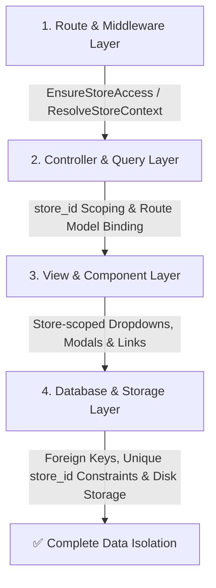

# Multi-Store Data Isolation Master Audit & Execution Plan 🛡️

> **ရည်ရွယ်ချက် (Objective)**:  
> DataPOS စနစ်အတွင်း ဆိုင်ခွဲတစ်ခုချင်းစီ (Tenant Stores) ၏ ဒေတာများ (ပစ္စည်း၊ အရောင်း၊ စတော့၊ စာရင်း၊ ငွေကြေး၊ ဝန်ထမ်းနှင့် သုံးစွဲသူများ) သည် အခြားဆိုင်ခွဲများနှင့် **လုံးဝရောထွေးမှုမရှိစေဘဲ (Zero Cross-Store Data Leakage)** သက်ဆိုင်ရာဆိုင်မှသာ လုံခြုံစိတ်ချစွာ ကြည့်ရှု/ပြင်ဆင်နိုင်စေရန် အပိုင်းလိုက်စစ်ဆေးပြင်ဆင်မည့် Master Checklist ဖြစ်ပါသည်။

---

## 🏗️ Data Isolation စစ်ဆေးရမည့် အဓိက အဆင့် ၄ ဆင့် (The 4 Isolation Layers)

စနစ်အတွင်း မည်သည့် Module/Feature မဆို အောက်ပါ အဆင့် ၄ ဆင့်ဖြင့် လုံခြုံရေး စစ်ဆေးရပါမည်-

1. **Route & Middleware Layer**: URL slug မှ `store_id` ကို မှန်ကန်စွာဖမ်းယူပြီး အခွင့်မရှိသူများအား `403 Forbidden` / `404 Not Found` ဖြင့် ပိတ်ပင်ထားခြင်း။
2. **Controller & Query Layer**: Query တိုင်းတွင် `where('store_id', $store->id)` ပါဝင်ခြင်းနှင့် အခြားဆိုင်မှ ID များကို Parameter အဖြစ် ပေးပို့လာပါက `findOrFail` ဖြင့် Block ခြင်း။
3. **View & UI Layer**: Dropdowns (Categories, Brands, Warehouses, Staff, Suppliers) များတွင် မိမိဆိုင်၏ ဒေတာများသာ ရွေးချယ်နိုင်ရန် စစ်ထုတ်ထားခြင်း။
4. **Database & File Storage Layer**: File Uploads, Database Backups, Barcode Templates များကို Store ID အလိုက် သီးခြား ခွဲခြားထားခြင်း။

---

## 📋 အပိုင်းလိုက် စစ်ဆေးပြင်ဆင်မည့် Roadmap (Phase-by-Phase Checklist)

### 🔹 အပိုင်း ၁: ကုန်ပစ္စည်းနှင့် Master Data (Phase 1: Catalog & Master Data) — ✅ စစ်ဆေးပြင်ဆင်ပြီး (100% Verified)
- [x] **Products CRUD & Search**: အခြားဆိုင်၏ Product ID ဖြင့် URL မှ လှမ်းခေါ်ခြင်း/ပြင်ဆင်ခြင်းကို တားဆီးထားခြင်း (Details/Edit/Update 403 Forbidden စစ်ဆေးပြီး)။
- [x] **Categories & Brands**: Quick Create နှင့် Dropdown များတွင် မိမိဆိုင်ခွဲဆိုင်ရာ အုပ်စုများသာ ပေါ်ခြင်း၊ Parent Category ကို အခြားဆိုင်သို့ မချိတ်ဆက်နိုင်အောင် တားဆီးထားခြင်း။
- [x] **Suppliers & Warehouses**: ပစ္စည်းသွင်းသူစာရင်းနှင့် ဂိုဒေါင်စာရင်း သီးခြားစီ ခွဲထားခြင်း၊ အခြားဆိုင်၏ ဂိုဒေါင်/ပစ္စည်းသွင်းသူ ID မသုံးနိုင်ရန် `Rule::exists(...)->where('store_id', ...)` ဖြင့် တားဆီးထားခြင်း။
- [x] **Units & Barcode Templates**: ဆိုင်ခွဲအလိုက် သတ်မှတ်ထားသော ဘားကုဒ်ဒီဇိုင်းနှင့် အတိုင်းအတာများ သီးခြားဖြစ်ခြင်း၊ Ajax search တွင် မိမိဆိုင် ပစ္စည်းများသာ ရှာဖွေနိုင်ခြင်း။
- [x] **Product Import / CSV & Bulk Operations**: CSV တင်သွင်း/ထုတ်ယူမှုနှင့် Bulk Stock/Delete/Price wizard များတွင် လက်ရှိ `store_id` သို့သာ တိကျစွာ သက်ရောက်စေခြင်း။

---

### 🔹 အပိုင်း ၂: အရောင်းကောင်တာနှင့် ဘောက်ချာစနစ် (Phase 2: POS & Sales Operations) — ✅ စစ်ဆေးပြင်ဆင်ပြီး (100% Verified)
- [x] **POS Sales & Orders**: ကောင်တာအရောင်းဘောက်ချာများ၊ ဘောက်ချာနံပါတ် (Voucher No.) ပြေးပုံများ ဆိုင်ခွဲအလိုက် သီးခြားဖြစ်ခြင်း၊ Web Order Fulfillment တွင် အခြားဆိုင်၏ Order ID ချိတ်ဆက်မရအောင် `Rule::exists('orders', 'id')->where('store_id', ...)` ဖြင့် တားဆီးထားခြင်း။
- [x] **Held Carts (ဆိုင်းငံ့ဘောက်ချာများ)**: Cashier ဆိုင်းငံ့ထားသော ခြင်းတောင်းများသည် အခြားဆိုင်ခွဲသို့ မရောက်ရှိခြင်း၊ Resume/Void ခေါ်ယူရာတွင် `store_id` တိုက်ဆိုင်စစ်ဆေးခြင်း။
- [x] **Cash Register / Shift Closing**: တစ်နေ့တာ ငွေစာရင်းပိတ်မှု (Opening/Closing Cash, Drawer Shift) များ ဆိုင်ခွဲအလိုက် သီးခြားစီ တွက်ချက်ခြင်း၊ Cashier Shift ဖွင့်ရာတွင် အခြားဆိုင်၏ `branch_id` မသုံးနိုင်ရန် တားဆီးထားခြင်း၊ Daily Closing Approval တွင် `store_id` စစ်ဆေးခြင်း။
- [x] **Returns & Buybacks**: အရောင်းပြန်သွင်းခြင်းနှင့် အဝယ်ပြန်သွင်းခြင်းများတွင် မူလဆိုင်ခွဲ၏ ဘောက်ချာမှသာ ပြန်သွင်းခွင့်ရှိခြင်း (`$sale->store_id !== $store->id` 404 စစ်ဆေးပြီး)။
- [x] **E-load Top-up & Commissions**: ဖုန်းငွေဖြည့်သွင်းမှုနှင့် အကောင့်ဖြည့်သွင်းမှု (Refill) များတွင် အခြားဆိုင်၏ `eload_account_id` အသုံးမပြုနိုင်ရန် `Rule::exists('eload_accounts', 'id')->where('store_id', ...)` ဖြင့် တားဆီးထားခြင်း။

---

### 🔹 အပိုင်း ၃: စတော့နှင့် ဂိုဒေါင် စီမံခန့်ခွဲမှု (Phase 3: Inventory & Logistics) — ✅ စစ်ဆေးပြင်ဆင်ပြီး (100% Verified)
- [x] **Stock Balance & Ledger**: ပစ္စည်းတစ်ခုချင်းစီ၏ လက်ကျန်နှင့် အဝင်/အထွက် စာရင်း (Movement Ledger) ဆိုင်ခွဲအလိုက် တိကျခြင်း၊ `inventory_balances` နှင့် `inventory_movements` တွင် `store_id` စစ်ဆေးမှု အပြည့်အဝရှိခြင်း။
- [x] **Stock Adjustments & Counts**: စတော့ အတိုး/အလျှော့ ညှိနှိုင်းခြင်း (Adjustments) နှင့် စတော့စစ်ဆေးမှု (Stock Count Sheets) များတွင် အခြားဆိုင်၏ Category, Warehouse, Branch မသုံးနိုင်ရန် `Rule::exists(...)->where('store_id', ...)` ဖြင့် တားဆီးထားခြင်း။
- [x] **Purchase Orders (အဝယ်ဘောက်ချာများ)**: ကုန်ပစ္စည်း အဝယ်စာရင်းနှင့် ကုန်သည်ပေးရန်ကျန်စာရင်း (Payables) များတွင် အခြားဆိုင်၏ Supplier နှင့် Product မသုံးနိုင်ရန် `Rule::exists(...)->where('store_id', ...)` ဖြင့် တားဆီးထားခြင်း။
- [x] **Inter-Store/Branch Transfers**: ဆိုင်ခွဲနှင့် ဂိုဒေါင်အချင်းချင်း ပစ္စည်းလွှဲပြောင်းရာတွင် `from_warehouse_id` နှင့် `to_warehouse_id` တို့အား လက်ရှိစတိုးပိုင်ဖြစ်ကြောင်း စစ်ဆေးထားခြင်း၊ အခြားစတိုး၏ Transfer ID အား ကြည့်ရှု/လွှဲပြောင်း/လက်ခံခွင့် မရှိအောင် `403 Forbidden` ဖြင့် တားဆီးထားခြင်း။

---

### 🔹 အပိုင်း ၄: သုံးစွဲသူ/ဖောက်သည်၊ အကြွေးစာရင်းနှင့် လက်ကားစနစ် (Phase 4: Customer Directory & Debt Isolation) — ✅ စစ်ဆေးပြင်ဆင်ပြီး (100% Verified)
- [x] **Customer Directory Isolation**: ဖောက်သည်စာရင်း (Retail & Wholesale) သည် ဆိုင်ခွဲအလိုက် သီးခြားဖြစ်ပြီး အခြားဆိုင်ခွဲ၏ ဖောက်သည်စာရင်း၊ ဖုန်းနံပါတ်၊ လိပ်စာများကို လုံးဝမမြင်ရခြင်း၊ `update()` တွင် စတိုး membership ရှိမှသာ ပြင်ဆင်ခွင့်ရှိအောင် စစ်ဆေးထားခြင်း။
- [x] **Customer Phone & Profile Scoping**: ဖောက်သည်တစ်ဦးသည် ဆိုင်ခွဲ ၂ ခု (ဥပမာ- Pharmacy နှင့် Mobile Shop) တွင် အကောင့်တစ်ခုတည်း ရှိနိုင်သော်လည်း မိမိဆိုင်ခွဲအတွင်း ဝယ်ယူထားသော မှတ်တမ်းနှင့် အချက်အလက်ကိုသာ သီးခြားခွဲထုတ်ထားခြင်း။
- [x] **Customer Receivables & Arrears Ledger (အကြွေးစာရင်း သီးခြားဖြစ်မှု)**: ဆိုင် A တွင် တင်ရှိသော ဖောက်သည်၏ အကြွေးစာရင်းသည် ဆိုင် B ၏ စာရင်းဇယားတွင် လုံးဝမပေါ်ဘဲ သီးခြားဖြစ်ခြင်း၊ `show`, `collect`, `statement` အားလုံးတွင် အခြားဆိုင်ဖောက်သည်အား `404 Not Found` ဖြင့် တားဆီးထားခြင်း။
- [x] **Customer Loyalty Points & Membership Tiers**: Point ရမှတ်များ၊ Tier အဆင့်များ (Silver, Gold, VIP) နှင့် အထူးလျှော့စျေးများသည် သက်ဆိုင်ရာ ဆိုင်ခွဲအတွင်း၌သာ သီးခြားသက်ရောက်ခြင်း၊ `assignTier` တွင် အခြားဆိုင်၏ tier ID မသုံးနိုင်ရန် `Rule::exists('membership_tiers', 'id')->where('store_id', ...)` ဖြင့် တားဆီးထားခြင်း။
- [x] **Wholesale Applications & Approval**: လက်ကားဖောက်သည် လျှောက်ထားမှုများနှင့် လက်ကားစျေးနှုန်း သတ်မှတ်ချက်များကို သက်ဆိုင်ရာ ဆိုင်ပိုင်ရှင်/မန်နေဂျာကသာ သီးခြားခွင့်ပြုနိုင်ခြင်း (`application->store_id !== store->id` 403 စစ်ဆေးပြီး)။

---

### 🔹 အပိုင်း ၅: ဝန်ဆောင်မှုနှင့် စက်ပြင်ဌာန (Phase 5: Services & Repairs) — ✅ စစ်ဆေးပြင်ဆင်ပြီး (100% Verified)
- [x] **Repair Job Tickets**: စက်ပြင်လက်ခံဘောက်ချာများနှင့် Serial Number မှတ်တမ်းများ ဆိုင်ခွဲအလိုက် သီးခြားဖြစ်ခြင်း၊ `ServiceJobController` တွင် `show`, `print`, `edit`, `update`, `status`, `payments`, `deduct` အားလုံး store isolation 404 စစ်ဆေးထားခြင်း။
- [x] **Spare Parts Usage**: စက်ပြင်ရာတွင် သုံးစွဲသော အပိုပစ္စည်းများ မိမိဆိုင်စတော့မှသာ အလိုအလျောက် နှုတ်ယူခြင်း (`product_id` store-scoped validation ထည့်သွင်းထားပြီး `SparePartController` မှ အခြားဆိုင်၏ စက်ပြင်ပစ္စည်းအား deduct မလုပ်နိုင်အောင် တားဆီးထားခြင်း)။
- [x] **Technician Assignment**: စက်ပြင်ဆရာ တာဝန်ပေးအပ်မှုများ မိမိဆိုင်ရှိ ဝန်ထမ်းများ (`store_user` role 'store_manager'/'staff') ထဲမှသာ ရွေးချယ်နိုင်ခြင်း။
- [x] **Public Tracking Token**: Customer ဘက်မှ Token ဖြင့် စစ်ဆေးရာတွင် မိမိအပ်နှံထားသော ဆိုင်၏ အချက်အလက်ကိုသာ ဖော်ပြခြင်း (`/store/{store_slug}/track/service/{token}` တွင် ဆိုင်မှားယွင်းလျှင် 404 ပြန်ခြင်း)။
- [x] **Device Warranty Tracker**: စက်ပစ္စည်း အာမခံမှတ်တမ်းများ (Warranties) ဆိုင်ခွဲအလိုက် သီးခြားဖြစ်ပြီး `product_id` store validation နှင့် claim, edit, certificate အားလုံး store scoped ဖြစ်ခြင်း။

---

### 🔹 အပိုင်း ၆: ငွေကြေး၊ အသုံးစရိတ်နှင့် စာရင်းရှင်းတမ်း (Phase 6: Finance & Accounting) — ✅ စစ်ဆေးပြင်ဆင်ပြီး (100% Verified)
- [x] **Daily Expenses & Categories**: နေ့စဉ် အသုံးစရိတ်များနှင့် ကဏ္ဍခွဲများ ဆိုင်ခွဲအလိုက် သီးခြားဖြစ်ခြင်း (`ExpenseController` & `ExpenseCategoryController` store-scoped validation & 404 access control)။
- [x] **Profit & Loss (အရှုံး/အမြတ် ရှင်းတမ်း)**: ဝင်ငွေ၊ ထွက်ငွေ၊ ကုန်ကျစရိတ်နှင့် အသားတင်အမြတ် ဆိုင်ခွဲအလိုက် သီးခြားစီ တွက်ချက်ခြင်း (`ProfitLossService` strictly scoped to `$store->id`)။
- [x] **Cash & Bank Accounts (KPay/Wave) & Shifts**: ဆိုင်ခွဲအလိုက် သတ်မှတ်ထားသော ဘဏ်အကောင့်နှင့် KPay နံပါတ်များ၊ Cashier Shifts & Cash Events များ သီးခြားဖြစ်ခြင်း။
- [x] **Sales Analytics & Cash Flow Reports**: အရောင်းဇယားနှင့် ငွေစီးဆင်းမှု မှတ်တမ်းများ သီးခြားဖြစ်ခြင်း (`SalesAnalyticsService` & `PosReportService` strictly scoped to `$store->id`)။

---

### 🔹 အပိုင်း ၇: eCommerce Storefront နှင့် အွန်လိုင်းအရောင်း (Phase 7: eCommerce Storefront & Public Online Ordering) — ✅ စစ်ဆေးပြင်ဆင်ပြီး (100% Verified)
- [x] **Storefront Catalog & Search Isolation**: Online Shop တွင် လက်ရှိဆိုင်ခွဲ၏ Active ကုန်ပစ္စည်းများ၊ Brand များနှင့် အမျိုးအစားများသာ ပေါ်ပြီး အခြားဆိုင်ခွဲမှ ပစ္စည်းများ ရှာမရခြင်း (`CatalogController` & `BrowseController` strictly scoped by `$store->id`)။
- [x] **Shopping Cart & Session Isolation**: ဆိုင်ခွဲ A (ဥပမာ- ဆေးဆိုင်) တွင် ခြင်းတောင်းထဲ ပစ္စည်းထည့်ထားပါက ဆိုင်ခွဲ B (မိုဘိုင်းဆိုင်) သို့ သွားရောက်ကြည့်ရှုရာတွင် မရောထွေးစေဘဲ Store Context အလိုက် ခြင်းတောင်း သီးခြားဖြစ်ခြင်း။
- [x] **Online Order Checkout & Placement**: Customer များ အွန်လိုင်းမှ အော်ဒါတင်သည့်အခါ သက်ဆိုင်ရာ ဆိုင်ခွဲ၏ `orders` စာရင်းထဲသို့သာ တိကျစွာ ရောက်ရှိခြင်း (`OrderController` `product_id` store-scoped validation)။
- [x] **Storefront Home Banners & Sliders**: Online Store ပင်မစာမျက်နှာရှိ ကြော်ငြာ Banner များ၊ Promotion ပုံများသည် သက်ဆိုင်ရာ ဆိုင်ခွဲအတွက်သာ သီးခြားပေါ်ခြင်း (`HomeBannerController` store isolation)။
- [x] **Product Reviews & Ratings (သုံးသပ်ချက်များ)**: ကုန်ပစ္စည်း Review များနှင့် Rating ကြယ်ပွင့်များသည် သက်ဆိုင်ရာ ဆိုင်ခွဲ၏ ပစ္စည်းများ၌သာ သီးခြားဖော်ပြခြင်း။
- [x] **Checkout Payment Methods (KPay/Wave/Cash)**: အော်ဒါတင်ရာတွင် ငွေလွှဲရမည့် KPay / CB / AYA / Wave အကောင့်အမည်နှင့် နံပါတ်များသည် သက်ဆိုင်ရာ ဆိုင်ခွဲ၏ အကောင့်များသာ ပေါ်ခြင်း။
- [x] **Shipping Rates & Delivery Zones**: ပို့ဆောင်ခ နှုန်းထားများနှင့် ပို့ဆောင်သည့် မြို့နယ်ဇယားများ ဆိုင်ခွဲအလိုက် သီးခြားဖြစ်ခြင်း။
- [x] **Floating Chat & Contact Channels**: Storefront ရှိ Viber, Telegram, Phone, Facebook Messenger ခလုတ်များသည် သက်ဆိုင်ရာ ဆိုင်ခွဲ၏ ဆက်သွယ်ရန်လိပ်စာသို့သာ တိုက်ရိုက်ရောက်ရှိခြင်း။
- [x] **Storefront Branding & SEO Meta**: ဆိုင်ခွဲအလိုက် ဆိုင်အမည်၊ Logo၊ Favicon၊ Tagline နှင့် Social Share (OpenGraph) ပုံရိပ်များ သီးခြားဖြစ်ခြင်း။

---

### 🔹 အပိုင်း ၈: လုံခြုံရေး၊ ဝန်ထမ်းရာထူးနှင့် ဒေတာထိန်းသိမ်းမှု (Phase 8: Security & Maintenance) — ✅ စစ်ဆေးပြင်ဆင်ပြီး (100% Verified)
- [x] **Store Owner vs Manager Rights**: ဆိုင်ပိုင်ရှင်နှင့် မန်နေဂျာ လုပ်ပိုင်ခွင့်များ တိကျစွာ ခွဲခြားထားခြင်း (`UserManagementController` store_owner guard)။
- [x] **Staff Roles & Permissions**: ဝန်ထမ်းရာထူးများနှင့် ခွင့်ပြုချက်များ ဆိုင်ခွဲအလိုက် သီးခြားစီ သတ်မှတ်နိုင်ခြင်း (`StaffRoleController` store isolation)။
- [x] **System Alert Center**: စတော့နည်းခြင်းနှင့် အရေးကြီးသတိပေးချက်များ မိမိဆိုင်ခွဲအတွက်သာ တက်လာခြင်း (`SystemAlertCenterController` store queries)။
- [x] **Audit Trail Logs**: ဝန်ထမ်းများ၏ လုပ်ဆောင်ချက်မှတ်တမ်း (Activity Logs) များ ဆိုင်ခွဲအလိုက် သီးခြားဖြစ်ခြင်း (`AuditLogController` 403 authorization guard)။
- [x] **Database & Backup Files**: ဒေတာ Backup ဖိုင်များနှင့် Maintenance Tools များသည် သက်ဆိုင်ရာ ဆိုင်ခွဲ၏ မန်နေဂျာ/ပိုင်ရှင်သာ ထိန်းသိမ်းခွင့်ရှိခြင်း (`BackupController` & `DatabaseToolController`)။

---

## 🛠️ စစ်ဆေးဆောင်ရွက်မည့် နည်းလမ်း (Testing & Validation Workflow)

အပိုင်းတစ်ခုချင်းစီ စစ်ဆေးသည့်အခါ အောက်ပါအချက် ၃ ချက်ဖြင့် အတည်ပြုပါမည်-
1. **Automated Feature Test**: Cross-store access ကို တားဆီးထားကြောင်း Unit/Feature Test ရေးသားစစ်ဆေးခြင်း။
2. **Browser Subagent Test**: ဆိုင်ခွဲ A မှ အကောင့်ဖြင့် ဝင်ရောက်ပြီး ဆိုင်ခွဲ B ၏ ဒေတာ URL/API သို့ လှမ်းတောင်းကြည့်၍ ပိတ်ပင်မှု ရှိ/မရှိ စစ်ဆေးခြင်း။
3. **Database Assertion**: Database table များတွင် `store_id` ကော်လံများ ပြည့်စုံစွာ ပါဝင်ပြီး မှန်ကန်စွာ ချိတ်ဆက်မှု ရှိ/မရှိ စစ်ဆေးခြင်း။

---

*မှတ်ချက် - ဤ Roadmap အတိုင်း အပိုင်းလိုက် စနစ်တကျ တစ်ခုချင်းစီ ဆက်လက်စစ်ဆေးပြင်ဆင်သွားပါမည်။*
