# DataPOS — Voucher & Document Print Standard Specification
**ဘောက်ချာနှင့် ပုံနှိပ်ထုတ်ဝေမှု စံသတ်မှတ်ချက် နည်းပညာလမ်းညွှန်မှတ်တမ်း**

> **Version:** 1.0 (Production Standard)  
> **Reference Implementations:**  
> - Admin Repair Print: [`resources/views/admin/repairs/print.blade.php`](file:///d:/xmapp/htdocs/DataPOS/resources/views/admin/repairs/print.blade.php)  
> - Storefront Service Tracking Print: [`resources/views/storefront/service_tracking/print.blade.php`](file:///d:/xmapp/htdocs/DataPOS/resources/views/storefront/service_tracking/print.blade.php)  
> - Audit Report: [`docs/ADMIN_PRINT_AUDIT_REPORT.md`](file:///d:/xmapp/htdocs/DataPOS/docs/ADMIN_PRINT_AUDIT_REPORT.md)  
> **Last Updated:** 2026-09-12

---

## ၁။ နိဒါန်းနှင့် ရည်ရွယ်ချက် (Introduction & Purpose)

DataPOS စနစ်အတွင်းရှိ ဘောက်ချာ/ပြေစာ ထုတ်ဝေမှုများ (POS Receipts, Repair Slips, Closing Z-Reports, Invoices, Certificates) ကို ခေတ်မီပြီး အသုံးပြုရ လွယ်ကူချောမွေ့သော **End-to-End Production Standard** အဖြစ် အဆင့်မြှင့်တင်ရန်အတွက် Service/Repair Voucher တွင် အောင်မြင်စွာ တည်ဆောက်ခဲ့သော ဗိသုကာပုံစံ (Architecture Blueprint) ကို နောင်တွင် အခြား Print နေရာများ၌ တသမတ်တည်း ပြန်လည်အသုံးပြုနိုင်ရန် စနစ်တကျ မှတ်တမ်းတင်ထားခြင်း ဖြစ်ပါသည်။

---

## ၂။ အဓိက အစိတ်အပိုင်းကြီး (၅) ရပ် (Core Architecture Pillars)

```mermaid
graph TD
    A[Voucher / Document Print View] --> B[1. Interactive Studio Toolbar]
    A --> C[2. Direct Clipboard JPG Copy]
    A --> D[3. Pixel-Perfect PDF with QR Stamping]
    A --> E[4. Multi-Channel Social Sharing Modal]
    A --> F[5. Tri-lingual & Currency Formatting]
    
    B --> B1[Paper Size Switcher 58mm/80mm/A5/A4]
    B --> B2[Native Print & Quick Actions]
    
    C --> C1[html2canvas to Blob]
    C --> C2[navigator.clipboard.write]
    C --> C3[Instant Ctrl+V into WeChat/Viber/Telegram]
    
    D --> D1[initQrCanvas SVG Pre-rasterization]
    D --> D2[worker.toContainer Rect Measurement]
    D --> D3[Canvas Uniform Scale Stamping]
    
    E --> E1[Viber / Telegram / WhatsApp Intents]
    E --> E2[Formatted Text Copy & Link Copy]
    
    F --> F1[format_currency without hardcoded Ks]
    F --> F2[format_quantity without .000]
    F --> F3[Myanmar / English / Chinese Full Coverage]
```



---

## ၃။ အသေးစိတ် စံသတ်မှတ်ချက်များနှင့် နည်းပညာဆိုင်ရာ အကောင်အထည်ဖော်မှုများ

### Pillar 1: Modern Interactive Studio Toolbar (မျက်နှာပြင် အထက်ပိုင်း Toolbar)

ပုံနှိပ်မျက်နှာပြင်တိုင်းတွင် စာရွက်အရွယ်အစားကို အချိန်နှင့်တပြေးညီ ရွေးချယ်နိုင်ပြီး Print, PDF, JPG, Share ခလုတ်များကို စုစည်းပေးသော Sticky Toolbar ပါဝင်ရမည်။

```html
<!-- Toolbar HTML Structure Standard -->
<div class="print-toolbar no-print">
    <div class="toolbar-inner">
        <!-- ဘယ်ဘက်: ခေါင်းစဉ်နှင့် နောက်ပြန်လှည့်ရန် ခလုတ် -->
        <div class="toolbar-left">
            <a href="{{ $backUrl }}" class="btn-back">
                ← <span>{{ __('messages.back') }}</span>
            </a>
            <span class="toolbar-title">{{ $documentTitle }}</span>
        </div>

        <!-- အလယ်: စက္ကူအရွယ်အစား Switcher (58mm, 80mm, A5, A4) -->
        <div class="toolbar-center">
            <div class="paper-selector-wrap">
                <select id="paperSizeSelect" class="paper-select">
                    <option value="?paper_size=58mm" {{ $paperSize === '58mm' ? 'selected' : '' }}>58mm (Thermal)</option>
                    <option value="?paper_size=80mm" {{ $paperSize === '80mm' ? 'selected' : '' }}>80mm (Standard)</option>
                    <option value="?paper_size=a5" {{ $paperSize === 'a5' ? 'selected' : '' }}>A5 (Half Sheet)</option>
                    <option value="?paper_size=a4" {{ $paperSize === 'a4' ? 'selected' : '' }}>A4 (Full Sheet)</option>
                </select>
            </div>
        </div>

        <!-- ညာဘက်: လုပ်ဆောင်ချက် ခလုတ်များ -->
        <div class="toolbar-right">
            <!-- ၁။ မူရင်း Browser Print ခလုတ် -->
            <button type="button" id="btnPrint" class="tool-btn btn-print">
                🖨️ <span>{{ __('messages.print') }}</span>
            </button>
            <!-- ၂။ PDF သိမ်းဆည်းရန် ခလုတ် -->
            <button type="button" id="btnDownloadPdf" class="tool-btn btn-pdf">
                📄 <span>{{ __('messages.vouchers_save_pdf') }}</span>
            </button>
            <!-- ၃။ JPG ပုံ ကော်ပီကူးယူရန် ခလုတ် -->
            <button type="button" id="btnShareJpg" class="tool-btn btn-jpg">
                🖼️ <span>{{ __('messages.vouchers_share_jpg') }}</span>
            </button>
            <!-- ၄။ အခြား Social သို့ မျှဝေရန် Modal ဖွင့်ခလုတ် -->
            <button type="button" id="btnShare" class="tool-btn btn-share">
                📲 <span>{{ __('messages.share') }}</span>
            </button>
        </div>
    </div>
</div>
```

---

### Pillar 2: Direct Clipboard JPG Image Copy (`shareJpgDirectly`)

#### ပြဿနာနှင့် ဖြေရှင်းချက် (Why & How):
* **ယခင်ပြဿနာ:** ဖုန်း သို့မဟုတ် Desktop တွင် WebShare API ခေါ်ယူသည့်အခါ WeChat / Viber စသည့် External App များက Session Logout ဖြစ်သွားခြင်း၊ ဖိုင်သိမ်းဆည်းရသည့် အဆင့်များ ရှုပ်ထွေးခြင်းများ ဖြစ်ပေါ်ခဲ့သည်။
* **စံသတ်မှတ်ချက်:** ခလုတ်တစ်ချက် နှိပ်ရုံဖြင့် ဘောက်ချာတစ်ခုလုံးကို PNG/JPG ပုံရိပ်အဖြစ် Canvas မှ Render လုပ်ပြီး **Clipboard ထဲသို့ တိုက်ရိုက် ရေးသွင်း (Direct Clipboard Write)** ပေးသည်။ သုံးစွဲသူသည် မိမိပို့လိုသော Chat Box (WeChat, Viber, Telegram, Messenger, Facebook) တွင် **Ctrl + V (Paste)** နှိပ်ရုံဖြင့် တန်းပို့နိုင်ပါသည်။

```javascript
// Direct Clipboard Image Copy Implementation
async function shareJpgDirectly() {
    var ticket = document.getElementById('ticketDocument');
    var btn = document.getElementById('btnShareJpg');
    var originalText = btn ? btn.innerHTML : '';
    if (btn) {
        btn.disabled = true;
        btn.innerHTML = '⏳ <span>Generating...</span>';
    }

    try {
        var worker = html2pdf().set({
            ...pdfConfig,
            margin: 0,
            image: { type: 'png', quality: 1.0 },
            html2canvas: { scale: 2, useCORS: true, backgroundColor: '#ffffff', logging: false }
        }).from(ticket);

        await worker.toCanvas();
        var canvas = worker.prop.canvas;

        // Stamp QR code if required (same scale math)
        var wrap = ticket.querySelector('.qr-svg-wrap');
        var qrSource = wrap ? (wrap.querySelector('canvas.qr-code-canvas') || wrap.querySelector('img')) : null;
        if (canvas && qrSource && wrap) {
            var ticketRect = ticket.getBoundingClientRect();
            var wrapRect = wrap.getBoundingClientRect();
            var scale = canvas.width / ticketRect.width;
            var boxX = (wrapRect.left - ticketRect.left) * scale;
            var boxY = (wrapRect.top - ticketRect.top) * scale;
            var boxW = wrapRect.width * scale;
            var boxH = wrapRect.height * scale;
            var imgW = (qrSource.offsetWidth || 72) * scale;
            var imgH = (qrSource.offsetHeight || 72) * scale;
            var imgX = boxX + (boxW - imgW) / 2;
            var imgY = boxY + (boxH - imgH) / 2;

            var ctx = canvas.getContext('2d');
            ctx.setTransform(1, 0, 0, 1, 0, 0);
            ctx.imageSmoothingEnabled = false;
            ctx.drawImage(qrSource, imgX, imgY, imgW, imgH);
        }

        var dataUri = canvas.toDataURL('image/png');
        var blob = dataUriToBlob(dataUri);
        var imageFilename = pdfConfig.filename.replace(/\.pdf$/i, '.png');
        var file = new File([blob], imageFilename, { type: 'image/png' });

        // 1. Direct Clipboard Copy (Desktop & Supported Mobile)
        var copied = false;
        if (navigator.clipboard && navigator.clipboard.write) {
            try {
                await navigator.clipboard.write([
                    new ClipboardItem({ 'image/png': blob })
                ]);
                copied = true;
                showToast("{{ __('messages.vouchers_jpg_copied') }}");
            } catch (clipErr) {
                console.warn('Clipboard image write failed, falling back:', clipErr);
                copied = false;
            }
        }

        // 2. Fallback: WebShare on mobile or Direct Download
        if (!copied) {
            var isMobile = /Android|iPhone|iPad|iPod/i.test(navigator.userAgent);
            if (isMobile && navigator.canShare && navigator.canShare({ files: [file] })) {
                await navigator.share({
                    title: 'Voucher #' + jobNumber,
                    files: [file]
                });
                return;
            }
            downloadBlob(blob, imageFilename);
            showToast("{{ __('messages.vouchers_jpg_copied') }}");
        }
    } catch (err) {
        if (err.name !== 'AbortError') {
            console.error('Share JPG error:', err);
            showToast('Failed to generate image');
        }
    } finally {
        if (btn) {
            btn.disabled = false;
            btn.innerHTML = originalText;
        }
    }
}
```

---

### Pillar 3: Pixel-Perfect QR Code & PDF Canvas Stamping

#### နည်းပညာဆိုင်ရာ အဓိက အချက်များ (Technical Gotchas):
1. **HTML2Canvas SVG Bug:** `html2canvas` သည် Cloned Iframe အတွင်း Data-URI Base64 SVG ပုံများကို မှန်ကန်စွာ Rasterize မလုပ်နိုင်ဘဲ အကွက်လွတ် (Empty White Box) အဖြစ် ထွက်သွားတတ်သည်။
   - **ဖြေရှင်းနည်း:** `DOMContentLoaded` အချိန်တွင် SVG ကို `<canvas class="qr-code-canvas">` အဖြစ် ကြိုတင်ဆွဲထားရမည် (`initQrCanvas()`)။
2. **Y-Offset Misalignment Bug:** `(wr.top - tr.top) / tr.height * canvas.height` စသည့် ရာခိုင်နှုန်းတွက်ချက်မှုများသည် PDF Margins ကြောင့် 105px မှ 130px ခန့် အပေါ်သို့ လွဲချော်သွားစေသည်။
   - **ဖြေရှင်းနည်း:** `worker.toContainer()` အဆင့်တွင် Cloned Root Container ၏ အမှန်တကယ် Rendered Coordinate `getBoundingClientRect()` ကို ယူ၍ Uniform Scale စနစ်ဖြင့် Canvas ပေါ်သို့ တိုက်ရိုက် Stamping ပြုလုပ်ရမည်။

```javascript
// Step 1: Pre-render SVG to hidden canvas
function initQrCanvas() {
    var wraps = document.querySelectorAll('.qr-svg-wrap');
    wraps.forEach(function(wrap) {
        var img = wrap.querySelector('img');
        var canvas = wrap.querySelector('canvas.qr-code-canvas');
        if (img && canvas) {
            var render = function() {
                var w = img.naturalWidth || 180;
                var h = img.naturalHeight || 180;
                canvas.width = w;
                canvas.height = h;
                var ctx = canvas.getContext('2d');
                ctx.imageSmoothingEnabled = false;
                ctx.drawImage(img, 0, 0, w, h);
                canvas.style.display = 'block';
                img.style.display = 'none';
            };
            if (img.complete && img.naturalWidth > 0) render();
            else img.onload = render;
        }
    });
}

// Step 2: Accurate Canvas Stamping Function
function stampQrOnPdfCanvas(worker, ticket, rootRect, cwRect) {
    var canvas = worker.prop ? worker.prop.canvas : null;
    var qrSource = ticket.querySelector('.qr-svg-wrap img') || ticket.querySelector('.qr-svg-wrap canvas');

    if (canvas && rootRect && cwRect && qrSource) {
        // Uniform scale relative to cloned container
        var scale = canvas.width / rootRect.width;
        var boxX = (cwRect.left - rootRect.left) * scale;
        var boxY = (cwRect.top - rootRect.top) * scale;
        var boxW = cwRect.width * scale;
        var boxH = cwRect.height * scale;

        // 4px internal padding for clean visual aesthetics
        var pad = 4 * scale;
        var drawW = boxW - pad * 2;
        var drawH = boxH - pad * 2;
        var drawX = boxX + pad;
        var drawY = boxY + pad;

        var ctx = canvas.getContext('2d');
        ctx.setTransform(1, 0, 0, 1, 0, 0); // Reset transform matrix
        ctx.imageSmoothingEnabled = false;
        ctx.drawImage(qrSource, drawX, drawY, drawW, drawH);
    }
}

// Step 3: Proper PDF Generation Lifecycle Execution
async function downloadPdf() {
    var btn = document.getElementById('btnDownloadPdf');
    var originalText = btn ? btn.innerHTML : '';
    var ticket = document.getElementById('ticketDocument');

    if (window.html2pdf && ticket) {
        if (btn) { btn.disabled = true; btn.innerHTML = '⏳ Generating...'; }
        try {
            initQrCanvas();
            var worker = html2pdf().set(pdfConfig).from(ticket);
            
            // 1. Cloned DOM တည်ဆောက်ခြင်း
            await worker.toContainer();
            var container = worker.prop.container;
            var containerWrap = container ? container.querySelector('.qr-svg-wrap') : null;
            var rootRect = container ? container.getBoundingClientRect() : null;
            var cwRect = containerWrap ? containerWrap.getBoundingClientRect() : null;

            // 2. Canvas သို့ ရေးဆွဲပြီး QR Code ကို တိကျစွာ Stamping ပြုလုပ်ခြင်း
            await worker.toCanvas();
            stampQrOnPdfCanvas(worker, ticket, rootRect, cwRect);

            // 3. PDF အဖြစ် ပြောင်းလဲသိမ်းဆည်းခြင်း
            await worker.toPdf();
            await worker.save();
        } catch (err) {
            console.error('PDF error:', err);
            window.print();
        } finally {
            if (btn) { btn.disabled = false; btn.innerHTML = originalText; }
        }
    } else {
        window.print();
    }
}
```

---

### Pillar 4: Multi-Channel Social Sharing Modal (လူမှုကွန်ရက် မျှဝေမှု စနစ်)

သုံးစွဲသူထံသို့ ဘောက်ချာအကျဉ်းချုပ် စာသား၊ စစ်ဆေးရန် Tracking Link နှင့် တိုက်ရိုက် Chat Application ချိတ်ဆက်မှုများကို Modal တစ်ခုတည်းတွင် ပံ့ပိုးပေးရမည်။

```html
<!-- Share Modal Dialog Standard -->
<div id="shareModal" class="share-modal-overlay no-print" onclick="if(event.target===this)closeShareModal()">
    <div class="share-modal-card">
        <div class="share-modal-header">
            <h3>📲 {{ __('messages.repair_share_title') }}</h3>
            <button type="button" class="btn-close-modal" onclick="closeShareModal()">✕</button>
        </div>
        <div class="share-modal-body">
            <!-- ၁။ စာသားအကျဉ်း ကော်ပီကူးယူခြင်း -->
            <button type="button" class="share-channel-row" onclick="copyVoucherText()">
                <div class="channel-icon bg-slate">📋</div>
                <div class="channel-info">
                    <div class="channel-name" id="copyVoucherTextLabel">{{ __('messages.repair_copy_voucher_text') }}</div>
                    <div class="channel-desc">{{ __('messages.repair_copy_voucher_text_desc') }}</div>
                </div>
            </button>

            <!-- ၂။ JPG ဓာတ်ပုံ တိုက်ရိုက် ကော်ပီကူးခြင်း -->
            <button type="button" class="share-channel-row" id="modalBtnShareJpg" onclick="shareJpgDirectly()">
                <div class="channel-icon bg-amber">🖼️</div>
                <div class="channel-info">
                    <div class="channel-name">{{ __('messages.vouchers_share_jpg') }}</div>
                    <div class="channel-desc">{{ __('messages.vouchers_share_jpg_desc') }}</div>
                </div>
            </button>

            <!-- ၃။ PDF တိုက်ရိုက်မျှဝေခြင်း -->
            <button type="button" class="share-channel-row" onclick="shareNativePdf()">
                <div class="channel-icon bg-red">📄</div>
                <div class="channel-info">
                    <div class="channel-name">{{ __('messages.repair_share_pdf') }}</div>
                    <div class="channel-desc">{{ __('messages.repair_share_pdf_desc') }}</div>
                </div>
            </button>

            <!-- ၄။ Viber သို့ တိုက်ရိုက်ပို့ခြင်း -->
            <button type="button" class="share-channel-row" onclick="shareToViber()">
                <div class="channel-icon bg-purple">💬</div>
                <div class="channel-info">
                    <div class="channel-name">Viber</div>
                    <div class="channel-desc">{{ __('messages.repair_share_viber_desc') }}</div>
                </div>
            </button>

            <!-- ၅။ Telegram သို့ တိုက်ရိုက်ပို့ခြင်း -->
            <button type="button" class="share-channel-row" onclick="shareToTelegram()">
                <div class="channel-icon bg-blue">✈️</div>
                <div class="channel-info">
                    <div class="channel-name">Telegram</div>
                    <div class="channel-desc">{{ __('messages.repair_share_telegram_desc') }}</div>
                </div>
            </button>

            <!-- ၆။ WhatsApp သို့ တိုက်ရိုက်ပို့ခြင်း -->
            <button type="button" class="share-channel-row" onclick="shareToWhatsApp()">
                <div class="channel-icon bg-emerald">🟢</div>
                <div class="channel-info">
                    <div class="channel-name">WhatsApp</div>
                    <div class="channel-desc">{{ __('messages.repair_share_whatsapp_desc') }}</div>
                </div>
            </button>

            <!-- ၇။ Tracking Link ကော်ပီကူးယူခြင်း -->
            <button type="button" class="share-channel-row" onclick="copyTrackingLink()">
                <div class="channel-icon bg-sky">🔗</div>
                <div class="channel-info">
                    <div class="channel-name" id="copyLinkText">{{ __('messages.repair_copy_track_link') }}</div>
                    <div class="channel-desc">{{ __('messages.repair_copy_track_link_desc') }}</div>
                </div>
            </button>
        </div>
    </div>
</div>
```

---

### Pillar 5: Tri-lingual & Currency/Quantity Formatting Standards

1. **ငွေကြေးဖော်ပြမှု စံနှုန်း (No Hardcoded 'Ks'):**
   - ဘယ်နေရာတွင်မှ `Ks` ဟု Hardcode မရေးရ။
   - Blade ထဲတွင် `{{ format_currency($amount, $store) }}` သာ သုံးရမည်။
   - Header/Label များတွင် `(Ks)` သို့မဟုတ် `Amount (Ks)` ဟု မထည့်ရ။
2. **အရေအတွက်နှင့် စတော့လက်ကျန် စံနှုန်း (Clean Quantity):**
   - စတော့အရေအတွက်များတွင် `.000` အပိုများ မပါစေရန် `format_quantity($qty, $store)` သို့မဟုတ် `$fmtQty` ဖြင့်သာ သန့်ရှင်းစွာ ပြသရမည် (ဥပမာ- `10` အစား `10.000` မပြရ)။
3. **ဘာသာစကား ၃ မျိုး ပြည့်စုံမှု (Tri-lingual Invariance):**
   - `lang/my/messages.php` (သဘာဝကျသော မြန်မာစကား၊ ကွင်းစကွင်းပိတ်အပိုများ မပါရ)
   - `lang/en/messages.php` (Standard English)
   - `lang/zh_CN/messages.php` (Simplified Chinese)
   - Translation keys အားလုံးကို ဘာသာစကား ၃ မျိုးစလုံးတွင် တစ်ပြိုင်နက်တည်း ဖြည့်သွင်းရမည်။

---

## ၄။ နောင်တွင် အခြား Print နေရာများ ပြင်ဆင်သည့်အခါ လိုက်နာရမည့် စစ်ဆေးရမည့်စာရင်း (Replication Checklist)

အခြား ပုံနှိပ်ထုတ်ဝေမှုများဖြစ်သည့် **POS အရောင်းပြေစာ (Sales Receipt)**၊ **နေ့စဉ်စာရင်းချုပ် (Daily Closing)**၊ **အင်ဗွိုက်စ် (Online Order Invoice)** စသည်တို့ကို ပြင်ဆင်သည့်အခါ အောက်ပါအဆင့် ၇ ဆင့်အတိုင်း ဆောင်ရွက်ရမည်-

- [ ] **Step 1:** View ဖိုင်ထဲတွင် `no-print` class ပါသော `print-toolbar` ထည့်သွင်းပြီး စက္ကူအရွယ်အစား Dropdown (`58mm`, `80mm`, `A5`, `A4`) ချိတ်ဆက်ပါ။
- [ ] **Step 2:** Print Dialog သီးသန့်ဖြစ်စေရန် `@media print` တွင် `.no-print`, `.print-toolbar` များကို `display: none !important;` ပြုလုပ်ပြီး စက္ကူအရွယ်အစားအလိုက် မာဂျင်ရှင်းပါ။
- [ ] **Step 3:** `html2pdf.bundle.min.js` ကို Header သို့မဟုတ် Layout တွင် Import လုပ်ထားခြင်း ရှိ/မရှိ စစ်ဆေးပါ။
- [ ] **Step 4:** QR Code ပါဝင်ပါက `initQrCanvas()` ဖြင့် SVG မှ Canvas သို့ Pre-render လုပ်ပြီး၊ PDF ထုတ်ယူရာတွင် `worker.toContainer()` မှ Bounding Rect ကို ယူကာ `stampQrOnPdfCanvas()` ဖြင့် Uniform Scale တိုက်ရိုက် Stamping ပြုလုပ်ပါ။
- [ ] **Step 5:** `shareJpgDirectly()` ခလုတ် ထည့်သွင်းပြီး `navigator.clipboard.write()` ဖြင့် ဖောက်သည်ထံ ပုံရိုက်မပို့မီ တိုက်ရိုက် ကော်ပီကူးယူနိုင်အောင် စီမံပါ။
- [ ] **Step 6:** အရေးကြီး စာသားအကျဉ်းနှင့် Social Share Links (Viber, Telegram, WhatsApp) ပါဝင်သော `shareModal` ကို တပ်ဆင်ပါ။
- [ ] **Step 7:** `format_currency()` စစ်ဆေးပြီး ဘာသာစကား ၃ မျိုး (`my`, `en`, `zh_CN`) Translation Keys များ ထည့်သွင်းပြီးစီးကြောင်း အတည်ပြုပါ။

---

## ၅။ နိဂုံးချုပ် (Conclusion)

ဤနည်းပညာစံနှုန်းသည် DataPOS ၏ ပုံနှိပ်စနစ်တစ်ခုလုံးကို Desktop ပရင်တာ၊ POS Thermal ပရင်တာနှင့် Mobile/Tablet သုံးစွဲသူများအတွက်ပါ အပြစ်အနာအဆာကင်းစွာ အလုပ်လုပ်နိုင်စေသည့် **Gold Standard Blueprint** ဖြစ်ပါသည်။ နောင်တွင် အခြားဘောက်ချာများကို အဆင့်မြှင့်တင်ရာတွင် ဤလမ်းညွှန်ချက်အတိုင်း ပုံတူကူးယူ အကောင်အထည်ဖော်ခြင်းဖြင့် အချိန်ကုန်သက်သာစေပြီး အမှားအယွင်းကင်းဝေးစေမည် ဖြစ်ပါသည်။
