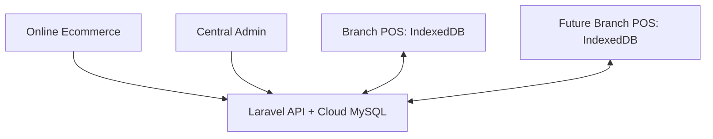

# 06 Source Of Truth History

> Consolidated edition. Each embedded source is preserved below with its original path and SHA-256 digest.


---

## Source 1: `archive/source-of-truth-history/AlinnThit_Mobile_Offline_POS_Project_Source_of_Truth_20260731.md`

**SHA-256:** `c80cb8e4a672f7e7841d4c0765e8fbd14274722c4c25d694cce1e605b1264b93`

# AlinnThit Mobile Ecommerce + Offline POS Project — Source of Truth

> **Document status:** Approved baseline for planning and implementation
> **Version:** 1.0
> **Baseline date:** 2026-07-31
> **Decision owner:** Project Owner
> **Purpose:** Prevent scope drift, incorrect assumptions, and conflicting implementations when humans or AI Agents work on this project.

---

## 1. How to Use This Document

This file is the primary project reference for architecture, business rules, data integrity, offline behavior, and implementation order.

Every developer or AI Agent must:

1. Read this document before proposing or changing code.
2. Inspect the existing Laravel repository and database before implementation.
3. Treat items marked **Confirmed** as requirements, not suggestions.
4. Treat items marked **Open Decision** as questions for the owner; do not invent an answer.
5. Keep existing Ecommerce behavior working unless a change is explicitly approved.
6. Update this document whenever the owner approves a material requirement or architecture change.

If code, old spreadsheets, AppSheet configuration, and this document disagree, stop and report the conflict before changing production data.

### Decision priority

1. The owner's latest explicit instruction
2. This Source of Truth
3. Approved Architecture Decision Records (ADRs)
4. Current application behavior and automated tests
5. Legacy AppSheet/Google Sheets behavior
6. Developer or AI assumptions

---

## 2. Business Goal — Confirmed

Build a reliable multi-branch system for AlinnThit Mobile with:

- An online Ecommerce website.
- An installable, offline-first POS for Windows PCs and Android devices.
- Inventory, purchasing, returns, exchanges, adjustments, transfers, service jobs, debt, expenses, finance, and daily closing.
- Support for branches in different cities.
- Support for future branches without redesigning the database.
- Safe temporary migration from AppSheet and Google Sheets to Laravel.

The system must continue selling during unreliable internet service and synchronize safely after connectivity returns.

---

## 3. Confirmed System Boundary

### 3.1 One Laravel application

Use the existing Laravel Ecommerce repository as the foundation. Do **not** create a second independent Laravel POS codebase at this stage.

| URL | Responsibility |
|---|---|
| `shop-domain.com` | Public Ecommerce storefront |
| `shop-domain.com/admin` | Ecommerce and central management |
| `shop-domain.com/pos` | Installable offline-first POS PWA |
| `shop-domain.com/pos/admin` | POS, Inventory, Service, Finance, and operational management |

Use one cloud MySQL database as the central source of truth. POS devices also maintain a branch-scoped local IndexedDB store for offline operation.

### 3.2 Existing project foundation

The supplied Ecommerce project already contains useful foundations such as stores, store-user access, products, orders, order items, and store-context middleware. Reuse compatible foundations after an audit; do not assume they already satisfy POS requirements.

### 3.3 PWA scope

The POS service worker and offline cache must be scoped to `/pos/`. It must not cache or intercept the Ecommerce storefront.



---

## 4. Ecommerce and POS Relationship — Confirmed

Phase 1 deliberately keeps Ecommerce and POS loosely coupled.

- Ecommerce remains online-only.
- Ecommerce `In Stock` / `Out of Stock` is maintained manually at first.
- Online orders are confirmed through Viber/Telegram using the current business process.
- Confirmed online orders are manually entered into POS.
- POS sales include a `sale_source` field:
  - `Walk-in`
  - `Ecommerce`
  - `Viber`
  - `Telegram`
  - `Facebook`
  - `Other`
- An optional Ecommerce order reference and customer details may be recorded.
- Automatic Ecommerce inventory synchronization is out of scope for Phase 1.

Do not reuse the Ecommerce `orders` table as the only POS sales table. Ecommerce orders and completed POS sales have different lifecycle, offline, payment, stock, and audit requirements.

---

## 5. Branch Model — Confirmed

Do not hardcode Shop 1, Shop 2, or a fixed branch type into business logic. Store branches as data and assign capabilities.

Examples:

| Branch profile | Enabled capabilities |
|---|---|
| Service-only | Service, service-parts inventory, debt, finance, daily closing |
| Sales-only | POS sales, inventory, purchasing, returns, exchanges, finance, daily closing |
| Sales + Service | All applicable sales and service capabilities |

Minimum capability keys:

- `pos_sales`
- `inventory`
- `service`
- `purchasing`
- `customer_debt`
- `stock_transfer`
- `online_fulfillment`
- `daily_closing`
- `finance`

Recommended normalized tables:

- `branches`
- `capabilities`
- `branch_capabilities`
- `user_branch_roles`
- `warehouses`

A user may act only when all three conditions are true:

`branch access AND branch capability AND role permission`

Hiding a menu is not authorization. Every API endpoint and server-side action must enforce the same rules.

---

## 6. Roles and Permissions — Confirmed Baseline

Minimum roles:

| Role | Baseline responsibility |
|---|---|
| Owner | Full business and configuration access |
| Admin | Operational administration across assigned branches |
| Manager | Approvals and operational control for assigned branches |
| Cashier | Add/update permitted transactions within assigned branch |
| Read-only | View permitted branch data; no mutation |

Exact permissions must be expressed as policies/permissions, not scattered email checks or role-name checks in UI code.

Sensitive actions requiring Manager or higher approval include:

- Inventory adjustments entered by a cashier.
- Voiding or reversing posted transactions.
- Exceptional price/discount overrides above an approved limit.
- Device handoff when unsynchronized work exists.
- Backdated operational changes where allowed.

---

## 7. Offline Device Policy — Confirmed

### 7.1 Supported devices

- Windows PC: primary POS device.
- Android: backup POS device.

### 7.2 One active offline writer per branch

Only one POS device may be the active offline sales device for a branch at a time. Windows and Android must not both create offline sales simultaneously for the same branch.

Device handoff requires:

1. The current device synchronizes all pending transactions.
2. The server confirms zero pending items and no unresolved error.
3. A Manager activates the replacement device.
4. The previous device is revoked or changed to non-writing mode.

If the current device is lost or damaged with unsynchronized transactions, the Manager must use an exceptional recovery workflow. The system must warn that unsynchronized local transactions may not be recoverable.

### 7.3 Local data

- Use IndexedDB for durable offline operational data.
- Cache only data needed by the assigned branch.
- Display connection, last-sync time, pending count, failed count, and active-device status prominently.
- Do not store passwords, server secrets, or privileged API credentials in the client.
- Devices must be registered, identifiable, and revocable.

---

## 8. Identifiers and Voucher Numbers — Confirmed

Every transaction needs two different identifiers:

1. **Internal immutable ID:** ULID or UUID generated safely offline.
2. **Human-readable voucher number:** used on receipts and by staff/customers.

Example voucher format:

`S1-20260731-W01-000001`

- `S1`: branch code
- `20260731`: local transaction date
- `W01`: registered Windows device code
- `000001`: device-local sequence

An Android backup may use a different registered code such as `A01`.

Requirements:

- A voucher number is unique within the whole business.
- The internal ID is the database primary reference.
- A manually supplied paper voucher number may be recorded as a separate optional reference.
- `client_transaction_id` must be globally unique and used as an idempotency key.
- Identifiers become immutable after creation.
- A staff member may enter an optional voucher number on initial service creation, but `Job_ID` and internal IDs must not be editable later.

Never use spreadsheet row number, auto-increment alone, timestamp alone, or `MAX(number)+1` across offline devices as the unique transaction identity.

---

## 9. Required Operational Modules — Confirmed

1. POS Sales
2. Purchases / Goods Receiving
3. Purchase Returns
4. Sales Returns
5. Exchanges
6. Inventory Adjustments
7. Stock Transfers
8. Stock Counts
9. Service Jobs
10. Customer Receivables
11. Supplier Payables
12. Expenses and other finance transactions
13. Daily Closing
14. Audit Logs and Approval History
15. Reports

Modules may be disabled per branch through capabilities; they must not require different application builds.

---

## 10. Inventory Architecture — Confirmed

### 10.1 Ledger is the source of truth

Do not use only `products.quantity` as inventory truth. Every stock change creates an immutable stock movement.

Recommended core entities:

- `products`
- `product_variants` or SKUs where required
- `warehouses`
- `inventory_movements`
- `inventory_balances` as a derived/cache table
- `stock_counts` and `stock_count_lines`
- `stock_transfers` and `stock_transfer_lines`

Minimum movement types:

| Movement | Quantity effect |
|---|---:|
| `opening_balance` | + |
| `purchase_received` | + |
| `purchase_returned` | − |
| `pos_sale` | − |
| `sales_return` | + |
| `exchange_return` | + |
| `exchange_sale` | − |
| `service_consumption` | − |
| `service_part_return` | + |
| `transfer_out` | − |
| `transfer_in` | + |
| `adjustment_in` | + |
| `adjustment_out` | − |
| `internal_use` | − |

Every movement should include at least:

- immutable ID
- branch and warehouse
- product/SKU
- signed quantity or direction + quantity
- unit cost where applicable
- source document type and ID
- reason code
- creator, approver where required
- offline creation and server sync timestamps

### 10.2 Warehouses and inventory states

Each branch has one or more warehouses. Future states may include:

- Retail stock
- Service parts
- Damaged
- Warranty
- Quarantine
- Scrap

Do not represent these states with ad hoc negative quantities or unstructured notes.

### 10.3 Negative stock

Default behavior: block a sale that would cause negative available stock. Any approved exception must be an explicit business setting, logged, and restricted to authorized roles.

---

## 11. Transaction Rules — Confirmed

### 11.1 Posted documents are immutable

Drafts may be edited according to permission. Once posted:

- Do not edit or delete financial/stock-impacting lines directly.
- Correct mistakes through void, reversal, return, exchange, or adjustment documents.
- Preserve the original transaction and link the corrective document.
- Require a reason and audit event.

### 11.2 Sales

A posted sale atomically creates:

- sale header
- sale lines
- payment records
- inventory movements
- finance transaction/ledger entries
- audit record

### 11.3 Returns

- Reference the original sale when available.
- Record item condition and destination warehouse/state.
- Refund or credit must match the approved business rule.
- Returning an item to damaged/quarantine stock must not increase sellable stock.

### 11.4 Exchanges

An exchange is not a direct overwrite of the original sale. It contains:

- returned item movement (`exchange_return`)
- replacement item movement (`exchange_sale`)
- price difference payment or refund
- reference to the original sale
- reason, user, and approval where required

### 11.5 Purchases and purchase returns

- A purchase order alone does not increase stock.
- Goods receipt increases stock.
- Purchase return reduces stock and creates/updates supplier settlement records as applicable.
- Partial receiving and partial returns must be supported.

### 11.6 Inventory adjustments

- Require reason, counted quantity, expected quantity, and difference.
- Cashier-submitted adjustments require Manager approval.
- Approval creates stock movements; rejected requests do not change stock.

### 11.7 Stock transfers

Required workflow:

`Requested → Approved → Dispatched → In Transit → Partially Received/Received → Completed`

- Dispatch creates `transfer_out` from the source.
- Receipt creates `transfer_in` at the destination.
- Shortage, damage, and excess must be recorded and resolved, never silently hidden.
- Different-city branches require explicit in-transit quantity.

---

## 12. Service Module — Confirmed

A service job represents a customer-owned device and repair/service work. The customer-owned device is **not inventory**.

Minimum service concepts:

- immutable `service_job_id`
- optional human/paper `voucher_no`
- branch
- customer and contact information
- device type/model/serial or IMEI where applicable
- reported problem and intake condition
- accessories received
- diagnosis
- technician
- status history
- estimated and final charges
- payments and outstanding debt
- used parts
- warranty/return notes
- created/updated user and timestamps
- change reason and audit history

Suggested status flow:

`Received → Diagnosing → Awaiting Approval/Parts → In Repair → Ready → Delivered`

Cancellation and unrepairable states should be explicit.

Service parts consumed create `service_consumption`. An unused part returned to sellable/service stock creates `service_part_return`. These movements must reference the service job.

The optional `Voucher_No` is visible during initial creation when a paper voucher is provided. The internal service ID is always generated automatically. IDs must not be editable after creation.

---

## 13. Debt and Finance — Confirmed

Finance must use transaction/ledger records, not manually edited totals.

Required transaction categories include:

- Income
- Expense
- Salary advance
- New customer debt
- Customer debt collection
- Supplier payable and payment
- Refund
- Account/branch transfer
- Opening balance

Initial payment methods/accounts should accommodate:

- Cash
- KBZ
- Wave
- CB
- MMQR
- Bank or other configured accounts

Requirements:

- Customer receivables and supplier payables remain separate ledgers.
- Each debt entry references its source sale/service/purchase when applicable.
- A collection/payment reduces a ledger balance through a new transaction; staff do not edit the current balance directly.
- Branch accounts and central accounts are distinguishable.
- Cross-branch or account transfers require paired, traceable entries.
- Refunds reference the source transaction.
- Opening balances are imported once with migration batch metadata.
- Posted finance entries are corrected by reversal, not destructive editing.

### Daily closing

Daily closing should capture:

- branch, business date, and closing user
- opening amount
- expected totals by payment method
- counted totals by payment method
- difference and explanation
- pending offline transaction count
- approval status and approver
- closed and approved timestamps

Do not approve a final closing while unresolved pending offline sales exist, unless an Owner-approved exceptional procedure is used and logged.

---

## 14. Offline Synchronization Contract — Confirmed

### 14.1 Required metadata

Every offline-created operational record must carry:

- `store_id` where applicable
- `branch_id`
- `device_id`
- `created_by`
- `client_transaction_id`
- `created_offline_at`
- `synced_at`
- local payload/schema version
- server record version/status

### 14.2 Idempotency

Repeating the same sync request must not create duplicate sales, payments, stock movements, finance records, or audits.

The server must enforce a unique constraint on `client_transaction_id` in the proper tenant/store scope. A retry returns the already-created server result.

### 14.3 Atomic server commit

For a sale, the server must persist all related records in one database transaction. Conceptually:

```php
DB::transaction(function () {
    // sale header and lines
    // payments
    // inventory movements
    // finance entries
    // audit event
});
```

Partial posting is forbidden.

### 14.4 Queue states

Recommended local states:

`draft → ready → syncing → synced`

Error states:

- `retryable_error`
- `validation_error`
- `conflict`
- `manual_review`

Do not silently discard a failed queue item. Staff must see the failure and Manager/Admin must have a recovery path.

### 14.5 Conflict policy

- Immutable posted transactions use append-only correction, so field-level merging should normally be unnecessary.
- Master data updates use server versioning and explicit conflict handling.
- Server authorization is rechecked at sync time.
- A locally accepted action may be rejected if permission/device status was revoked; keep it for review and do not duplicate it.

---

## 15. Audit and Change Reasons — Confirmed

The owner must be able to know who changed what, when, where, and why.

Record audit events for:

- create, update, submit, approve, reject
- post, void, reverse, return, exchange
- payment/refund/debt collection
- stock adjustment and transfer status changes
- service status/charge/parts changes
- permission and device changes

Minimum audit fields:

- actor user ID
- actor role at the time
- branch and device
- action
- entity type and ID
- before/after values or a structured diff
- required change reason where applicable
- offline event time and server time
- approval actor and time where applicable

`Change_Reason` must be required when an existing operational record is materially changed. It should not be required for the normal initial creation unless the business process explicitly requires it.

Audit logs are append-only and unavailable for ordinary staff edits/deletes.

---

## 16. Suggested Domain/Table Groups

Exact names may change after the repository audit, but responsibilities must remain separated.

| Domain | Suggested tables/entities |
|---|---|
| Organization | stores, branches, warehouses, capabilities, branch_capabilities |
| Identity | users, roles, permissions, user_branch_roles, devices |
| Catalog | products, variants/SKUs, barcodes, categories, brands, prices |
| POS | sales, sale_lines, payments, returns, exchanges |
| Inventory | inventory_movements, inventory_balances, stock_counts, transfers |
| Purchasing | suppliers, purchases, receipts, purchase_returns |
| Service | service_jobs, service_status_history, service_parts, service_payments |
| Debt | customer_receivables, supplier_payables, settlements |
| Finance | financial_accounts, finance_transactions, transfers, daily_closings |
| Sync | sync_batches, sync_items, idempotency records, device checkpoints |
| Governance | approvals, audit_logs, reason_codes, migration_batches |

Avoid a single giant transaction table containing unrelated nullable fields for every module.

---

## 17. Data Migration from AppSheet and Google Sheets

AppSheet and the supplied spreadsheets are temporary/legacy sources during migration. Laravel becomes the single master only after reconciliation and cutover.

Relevant legacy concepts include:

- `Sales_Tran`
- `Service_Tran`
- voucher/job identifiers
- customer debts and collections
- purchases and expenses
- transfers
- daily closings
- users/staff/branch access
- opening balances
- multiple payment accounts
- change reasons and approvals

Required migration process:

1. Freeze and back up source files.
2. Profile columns, types, blank keys, duplicate keys, orphan references, invalid dates, and inconsistent branch/user names.
3. Define explicit source-to-target mappings.
4. Create immutable migration batch IDs.
5. Import master data first.
6. Import opening inventory and finance balances through ledger entries.
7. Import open debts and active service jobs with source references.
8. Import historical transactions only to the approved depth.
9. Reconcile totals per branch, product, customer, supplier, account, and date.
10. Obtain owner sign-off.
11. Set AppSheet to read-only, then retire it after a stabilization period.

Never allow AppSheet and Laravel to act as simultaneous writable masters for the same transaction set.

### Migration checks

- No blank or duplicated immutable IDs.
- No sale/service/payment without a valid branch.
- No line item without a valid parent and product/service reference.
- Opening stock totals reconcile by branch/warehouse/SKU.
- Receivables and payables reconcile by party.
- Cash/payment-account balances reconcile by branch.
- Historical edits retain actor and reason where available.
- Unknown or invalid source rows go to a review report; they are not silently dropped.

---

## 18. Security Baseline — Confirmed

- Authenticate every POS user and registered device.
- Authorize on the server, not only in the UI.
- Scope all operational queries by store/tenant and permitted branch.
- Never trust client-supplied prices, roles, branch access, totals, or approval status without validation.
- Protect against mass assignment and cross-branch record access.
- Use encrypted transport and secure token storage appropriate to PWA limitations.
- Do not embed database credentials, API secrets, or administrator tokens in frontend code.
- Revoke lost devices and sessions.
- Keep backups and test restoration.
- Audit privileged configuration and permission changes.

---

## 19. Implementation Phases — Approved Order

### Phase 0 — Repository and data audit

- Inventory existing Laravel version, packages, modules, routes, models, migrations, policies, tests, and deployment environment.
- Map existing `stores`, users, products, orders, and middleware to the target domains.
- Profile supplied AppSheet/Google Sheets data.
- Produce gap analysis and migration plan.
- Do not begin broad refactoring before owner review.

### Phase 1 — Foundation

- Branches, warehouses, capabilities
- User branch roles and policies
- Device registration/revocation
- SKU/barcode normalization
- Inventory movement ledger and derived balances
- Audit and approval foundations

### Phase 2 — Online POS

- Cart, pricing, payments, receipt
- Posted sale transaction
- Stock and finance integration
- Returns, void/reversal, and audit
- Initially online to validate core integrity before offline complexity

### Phase 3 — Offline PWA

- Installable `/pos` application
- IndexedDB branch dataset
- Offline queue and status UI
- Idempotent sync API
- Conflict/error recovery
- Active-device handoff
- Windows and Android field testing

### Phase 4 — Operations

- Purchases and purchase returns
- Adjustments and stock counts
- Inter-branch transfers
- Service jobs and parts
- Customer debt and supplier payable
- Expenses, finance, and daily closing
- Reports

### Phase 5 — Migration and cutover

- Clean and import approved AppSheet/Sheet data
- Reconcile opening balances, inventory, debts, and active jobs
- Staff training and parallel validation
- Controlled cutover
- AppSheet read-only and retirement

Future automation of Ecommerce inventory/order integration requires a separate approved phase.

---

## 20. Testing Requirements

Minimum automated coverage:

- Unit tests for totals, taxes/discounts if used, stock effects, debt balances, and permissions.
- Feature tests for every posting workflow and unauthorized cross-branch request.
- Database tests for unique idempotency keys and balanced/linked ledger records.
- Sync tests for duplicate delivery, reordered delivery, timeout after server commit, validation failure, revoked device, and retry.
- Offline browser tests for install, reload, device restart, pending queue, reconnect, and update migration.
- Return/exchange/transfer/service workflow tests.
- Migration reconciliation tests.

Critical scenarios:

1. Internet fails immediately before sync.
2. Internet fails after the server commits but before the client receives the response.
3. The same sale is submitted repeatedly.
4. A device is revoked while offline.
5. Stock changed centrally before an offline sale syncs.
6. Android backup attempts to write while Windows is active.
7. Partial transfer receipt has shortage/damage.
8. Cashier attempts a forbidden adjustment or cross-branch access.
9. Daily closing starts with pending sync items.
10. Database restore and reconciliation are performed successfully.

---

## 21. Definition of Done

A feature is not done until:

- Business rules and permissions are documented.
- Database migration and rollback behavior are safe.
- API validation and branch scope are enforced.
- Stock/finance side effects are atomic and auditable.
- Offline behavior is defined where relevant.
- Idempotency is proven for offline writes.
- Automated tests pass.
- Errors are visible and recoverable.
- Existing Ecommerce behavior is regression-tested.
- User-facing Burmese/English labels are reviewed where applicable.
- Operational documentation and migration notes are updated.
- The owner accepts the workflow on actual Windows and Android devices.

---

## 22. Prohibited Shortcuts

AI Agents and developers must not:

- Create a separate Laravel POS project without a new approved architecture decision.
- Treat `products.quantity` as the sole stock source of truth.
- Use Ecommerce orders as the entire POS transaction model.
- Directly edit/delete posted stock or finance transactions.
- Allow ordinary staff to overwrite balances.
- Hardcode Shop 1/Shop 2, staff emails, or branch types in business logic.
- Rely only on hidden views or frontend checks for security.
- Run two offline-writing devices concurrently in one branch.
- Generate offline IDs with `MAX()+1` or timestamp alone.
- Retry synchronization without an idempotency key.
- Silently ignore failed sync or migration rows.
- Cache Ecommerce pages in the POS service worker.
- Automate Ecommerce stock in Phase 1.
- Make AppSheet and Laravel simultaneous writable masters.
- Perform an unreviewed bulk rewrite of the existing Ecommerce application.
- commit secrets, credentials, production data, or personal customer information into source control or AI prompts.

---

## 23. AI Agent Working Protocol

Every AI Agent task must state:

- Target phase and module
- Confirmed requirement being implemented
- Files/tables affected
- Data migration impact
- Offline impact
- Stock/finance impact
- Security/permission impact
- Tests and acceptance criteria

### Before editing

1. Read this document and repository instructions.
2. Check the working tree and preserve unrelated user changes.
3. Inspect relevant code, schema, tests, and existing conventions.
4. Report conflicts or missing decisions.
5. Propose the smallest coherent change.

### During implementation

- Use database transactions for multi-ledger posting.
- Add constraints and indexes that enforce invariants.
- Reuse existing conventions only when they are safe.
- Keep branch/tenant scope explicit.
- Add tests with each behavior change.
- Avoid unrelated refactoring.

### After implementation

- Run focused and relevant regression tests.
- Report exactly what changed, assumptions made, and remaining risks.
- Provide migration/rollback and deployment notes.
- Update this document or create an ADR for approved architectural changes.

### Required stop conditions

Stop and ask the owner when:

- A requirement marked Open Decision affects schema or user workflow.
- Existing production behavior contradicts this document.
- Historical data cannot be mapped without loss.
- A change could corrupt stock, finance, debt, or audit history.
- The requested work would expand beyond the approved phase.

---

## 24. Open Decisions — Owner Input Required

Do not guess these values during implementation:

1. Final production domain and canonical application/business name.
2. Exact branch codes, names, addresses, and initial capabilities.
3. Exact warehouse layout for each branch.
4. Receipt printer model, paper width, connection method, and cash drawer requirements.
5. Barcode scanner and label printer models.
6. Whether taxes are used and how prices/discounts are calculated.
7. Negative-stock exception policy, if any.
8. Return/exchange time limits and item-condition rules.
9. Service warranty rules and required intake fields.
10. Customer-credit limits and debt approval rules.
11. Supplier payable workflow.
12. Historical migration depth and official cutover date.
13. Exact daily-closing approval and discrepancy thresholds.
14. Offline retention duration and local-device privacy policy.
15. Hosting/server capacity, backup frequency, and recovery targets.
16. Burmese/English terminology and final receipt layout.

Record each approved answer in this document or an ADR before building the dependent feature.

---

## 25. First AI Agent Assignment

The first implementation assignment is **Phase 0: Audit only**.

Expected deliverables:

1. Existing Laravel architecture and dependency inventory.
2. Current database schema map.
3. Reusable versus replace/refactor assessment.
4. Security and data-integrity risk list.
5. AppSheet/Google Sheets data-quality report.
6. Proposed target migrations in dependency order.
7. Phase 1 task breakdown with acceptance tests.

The audit Agent must not implement the full POS, rewrite Ecommerce, or modify production data.

---

## 26. Change Log

| Version | Date | Summary | Approved by |
|---|---|---|---|
| 1.0 | 2026-07-31 | Initial approved architecture and implementation baseline | Project Owner |

---

## Source 2: `archive/source-of-truth-history/ALINN_THIT_Ecommerce_Product_SKU_Logic_Original.md`

**SHA-256:** `58fb7d2885628018db90169a70f3aec5234881221692c650400c00a8b69e5620`

# ALINN THIT Ecommerce Product SKU Logic — Master Instruction for AI Agent

## Project Goal

Google Sheet ထဲက `Products` tab ကို cleanup / normalize လုပ်ရန်ဖြစ်သည်။

အဓိကအားဖြင့် SKU ကို **source of truth** အဖြစ် အသုံးပြုပြီး အောက်ပါ columns များကို မှန်ကန်စွာ စစ်ဆေး၊ ပြင်ဆင်၊ ဖြည့်စွက်ရန်ဖြစ်သည်။

- Name
- Category
- Parent Category
- Brand
- Variants
- Variant Name(s)
- Variant SKU(s)

**အရေးကြီးသည်:** SKU ကို ပြန်မရေးပါနှင့်။ ရှိပြီးသား SKU ကို decoding လုပ်၍ အခြား columns များကို ပြင်ရမည်။

---

# 1. SKU Structure

ALINN THIT SKU အများစု၏ အခြေခံ structure သည် —

`BRAND - MODEL - PRODUCT TYPE - EXTRA / CONNECTOR / QUALITY - COLOR`

သို့မဟုတ် product အမျိုးအစားအလိုက် —

`BRAND - MODEL - PRODUCT TYPE - VARIANT 1 - VARIANT 2`

ဖြစ်သည်။

SKU တိုင်းတွင် segments အရေအတွက် တိတိကျကျတူမနေပါ။ Product အလိုက် optional segments ရှိနိုင်သည်။

ဥပမာ:

`168-L009-CB-MC-BLK`

Meaning:

- `168` = Brand
- `L009` = Model No.
- `CB` = Cable
- `MC` = Micro USB
- `BLK` = Black

ဒီ product ၏ customer-facing Name ကို:

`L009 Cable`

ဟုထားရမည်။

`Micro USB` နှင့် `Black` ကို Name ထဲမထည့်ဘဲ **Variants** အဖြစ်သုံးရမည်။

---

# 2. Product Name Rule

## Name တွင် Brand မထည့်ပါနှင့်။

Name ကို တိုတို၊ သန့်ရှင်းပြီး ecommerce product card တွင် အဆင်ပြေစေရန်:

`Model + Product Type`

ပုံစံကို အဓိကအသုံးပြုပါ။

ဥပမာ:

`168-L009-CB-MC-BLK`
→ `L009 Cable`

`AB-A19-CHS-TC`
→ `A19 Charger Set`

`CAR-C305-USB-BLK`
→ `C305 Car Charger`

`BVT-X10-PB-(10000mAh)`
→ `X10 Power Bank`

`DENMEN-DR06-EP-WHT`
→ `DR06 Earphone`

Name ထဲတွင် ပုံမှန်အားဖြင့် အောက်ပါတို့ကို မထည့်ပါနှင့်။

- Brand
- Color
- Connector
- Quality
- Capacity
- Variant-specific attributes

၎င်းတို့ကို Variant data အဖြစ်ခွဲရန်ဖြစ်သည်။

သို့သော် model identity အတွက် အရေးကြီးသော `4G`, `5G`, `Pro`, `Plus`, `Lite`, `Max`, model year စသည်တို့ကို Name တွင်ထားနိုင်သည်။

ဥပမာ:

`Note 14 5G Screen Protector`

သည်မှန်သည်။

---

# 3. Product Type Codes

အောက်ပါ SKU codes များကို အခြေခံ product type အဖြစ်ယူပါ။

- `CB` = Cable
- `CH` = Charger
- `CHS` = Charger Set
- `CCH` = Car Charger
- `EP` = Earphone
- `BEP` = Bluetooth Earphone
- `SPK` = Bluetooth Speaker / Speaker
- `Mic` = Microphone
- `BT` = Battery
- `PB` = Power Bank
- `SG` = Screen Protector
- `TL` = Touch LCD
- `TS` = Touch Screen
- `GLS` = Glass / Front Glass / OCA Glass depending on following quality code
- `CV` = Phone Case
- `BC` = Mobile Phone Body/Back Cover depending on product context
- `BD` = Body Frame
- `HS` = Body Frame / Housing
- `USB FIX` = Charging Port
- `Power Swift` = Power Switch
- `SD` = Memory Card
- `Mouse` = Mouse
- `FAN` = Fan
- `ST` may represent holder/stick/accessory depending on product context
- CCTV-related codes should map to CCTV products according to Name/SKU context

Do not blindly assume one token if the surrounding SKU and Name clearly establish another product.

---

# 4. Special Confirmed SKU Meanings

These meanings have been explicitly confirmed by the store owner.

## `TS`

`TS` = **Touch Screen**

Meaning:

ဖုန်းမှန်ကွဲသွားသောအခါ လဲလှယ်အသုံးပြုသော အပေါ်မှန်သီးသန့် Touch Screen.

However, old inventory data may occasionally use TS inconsistently.

Therefore:

If SKU says `TS` but existing Name clearly says `Front Glass`, inspect nearby products/model patterns before changing blindly.

---

## `BC`

`BC` = Mobile Phone **Body Cover / Back Cover** context.

For mobile spare parts it usually maps to:

Category:
`Back Cover`

Parent:
`Body & Back Cover`

However, legacy SKU may contain exceptions.

Example:

`5a-A-004-BC-WHT`

Existing Product Name says Cable.

This is a legacy/anomalous SKU and must not automatically become Back Cover purely because of `BC`.

Use SKU + existing Name + surrounding product pattern together.

---

## `CAR...USB`

Example:

`CAR-C305-USB-BLK`

This is a charger plugged into a car cigarette-lighter socket and provides a USB charging port.

Therefore:

Name:
`C305 Car Charger`

Category:
`Car Charger`

Parent Category:
`Cable & Charger`

Do not classify this as USB Cable.

---

# 5. Connector Codes → Variants

Connector information must normally NOT be included in the main Name.

Use it as Variant data.

Typical mappings:

- `MC` = Micro USB
- `Micro` = Micro USB
- `TC` = Type-C
- `IP` = Lightning / iPhone connector
- `3.5MM` = 3.5mm
- `3IN1` = 3-in-1

Example:

`UW-L009-CB-TC-WHT`

Name:
`L009 Cable`

Variant:
- Connector = Type-C
- Color = White

Another SKU for same model:

`UW-L009-CB-IP-WHT`

Name:
`L009 Cable`

Variant:
- Connector = Lightning
- Color = White

These may eventually be merged into one product with multiple variants where appropriate.

---

# 6. Quality Codes → Variants / Category Logic

Quality codes may include:

- `ORG` = Original
- `AAA` = AAA quality
- `MA` = MA quality
- `OCA` = OCA
- other quality codes may exist

Quality information should generally be placed in Variant data, but it can also determine Category where taxonomy explicitly distinguishes Original vs Standard products.

---

# 7. Battery Category Logic

For battery SKU:

`...-BT-ORG`

Category:
`Original Battery`

Parent Category:
`Battery`

Battery without Original code:

`...-BT`
`...-BT-BLK`
`...-BT-WHT`

Category:
`Standard Battery`

Parent Category:
`Battery`

Example:

`HW-GR5(HB3864)-BT-ORG`

→ Category: `Original Battery`
→ Parent: `Battery`

Example:

`HW-G730-BT`

→ Category: `Standard Battery`
→ Parent: `Battery`

---

# 8. Touch LCD Logic

## Original Touch LCD

If:

`TL + ORG`

Category:
`Original Touch LCD`

Parent:
`Screen & LCD`

Example:

`HW-NOVA2I-TL-ORG-WHT`

→ `Original Touch LCD`
→ `Screen & LCD`

## Non-original / other quality Touch LCD

Examples:

`TL`
`TL-MA`
`TL-AAA`

Category:
`Touch LCD`

Parent:
`Screen & LCD`

Quality itself should be stored as Variant where appropriate.

---

# 9. Touch Screen Logic

SKU contains:

`TS`

Normally:

Category:
`Touch Screen`

Parent:
`Screen & LCD`

Example:

`HW-GR5(17)-TS-GLD`

→ Touch Screen
→ Screen & LCD

But older SKUs can contain inconsistent naming. Do not automatically overwrite clearly established legacy Front Glass products without cross-checking.

---

# 10. Glass Logic

Glass products require looking at both `GLS` and quality token.

Typical logic:

`GLS-OCA`
→ `OCA Glass`

`GLS-AAA`
→ `Front Glass`

Parent:
`Screen & LCD`

Examples:

`RM-N5-GLS-OCA-BLK`
→ OCA Glass

`RM-N5-GLS-AAA-BLK`
→ Front Glass

If legacy product Name and SKU quality disagree, inspect similar SKUs for the same brand/model before modifying.

---

# 11. Screen Protector

SKU:

`SG`

Category:
`Screen Protector`

Screen Protector is NOT the same thing as:

- Touch Screen
- Touch LCD
- Front Glass
- OCA Glass

Do not mix these categories.

For the final taxonomy, every row should have an intentional Parent Category. If the current project requires no blank Parent Category values, use the agreed hierarchy rather than leaving Parent blank.

---

# 12. Phone Case

SKU:

`CV`

Category:
`Phone Case`

Do not confuse Phone Case with:

- Back Cover
- Body Frame
- Screen Protector

Variant tokens after `CV` can describe case type/style.

Examples may include:

- `SIL` = Silicone
- `CLR` = Clear
- `PLA` = Plastic
- `BTY`
- `CAT`
- `CAR`
- `VNO`

These are **case styles/variants**, not Category changes, unless explicitly verified otherwise.

---

# 13. Back Cover / Body Parts

Back Cover:

Category:
`Back Cover`

Parent:
`Body & Back Cover`

Body Frame / Housing:

Category:
`Body Frame`

Parent:
`Body & Back Cover`

Typical codes:

- `BC` = Back/Body Cover
- `BD` = Body Frame
- `HS` = Housing / Body Frame

Use product context for legacy exceptions.

---

# 14. Cable & Charger Taxonomy

Categories:

- Cable
- Charger
- Charger Set
- Car Charger

Parent Category:

`Cable & Charger`

Examples:

`CB`
→ Cable

`CH`
→ Charger

`CHS`
→ Charger Set

Car charging products
→ Car Charger

---

# 15. Audio Taxonomy

Parent:

`Audio`

Categories include:

- Earphone
- Bluetooth Earphone
- Bluetooth Speaker
- Microphone

Important:

`EP` = wired/normal Earphone

`BEP` = Bluetooth Earphone

Example:

`YK-D810-BEP-BLK`

must be:

Category:
`Bluetooth Earphone`

not normal Earphone.

---

# 16. Power & Storage

Parent:

`Power & Storage`

Categories:

- Power Bank
- Memory Card

`PB` = Power Bank

Capacity such as:

`10000mAh`
`20000mAh`

should be Variant/attribute, NOT part of canonical Name.

Example:

`BVT-X30-PB-(20000mAh)`

Name:
`X30 Power Bank`

Variant:
`Capacity = 20000mAh`

---

# 17. Phone Spare Parts

Parent:

`Phone Spare Parts`

Categories include:

- Charging Port
- Power Switch
- Other Spare Parts

Examples:

`USB FIX`
→ Charging Port

`Power Swift`
→ Power Switch

---

# 18. Electronic

Parent:

`Electronic`

Examples:

- LED Light
- Mouse
- Fan

---

# 19. CCTV

Parent:

`CCTV`

Categories can include:

- CCTV Camera
- CCTV Accessory

Examples:

camera unit
→ CCTV Camera

Power supply, Balun, CCTV supply cable
→ CCTV Accessory

---

# 20. Variant Rules

The following should normally become Variants rather than being embedded in Product Name:

- Connector
- Color
- Quality
- Capacity
- Size
- Case style
- other option-specific SKU tokens

Examples:

Color mappings:

- `BLK` = Black
- `WHT` = White
- `BLU` = Blue
- `RED` = Red
- `GLD` = Gold
- `SLV` = Silver
- `GRAY` / `Gray` = Gray
- `PUR` = Purple

Additional codes should be interpreted carefully from existing products.

Do not guess unknown codes.

---

# 21. Variant Columns

The spreadsheet already contains:

- `Variants`
- `Variant Name(s)`
- `Variant SKU(s)`

Use these existing fields.

Do not create duplicate Variant columns unnecessarily.

Each variant must preserve the original SKU associated with that option.

If multiple rows represent exactly the same product model with only Connector / Color / Quality / Capacity differences, they can be treated as variants of the same product **only when confidently matched**.

Do not merge products merely because names are similar.

---

# 22. Brand Handling

Brand should stay in the dedicated `Brand` column.

**Do not put Brand in Product Name.**

Examples:

Brand:
`Huawei`

Name:
`Nova 2i Touch LCD`

NOT:

`Huawei Nova 2i Touch LCD`

Brand:
`Redmi`

Name:
`Note 10 5G Phone Case`

NOT:

`Redmi Note 10 5G Phone Case`

Exceptions may exist where the apparent brand word is actually part of the model identity. Inspect context before removing it.

---

# 23. Category Hierarchy

Use a consistent Parent → Category system.

Known parent groups include:

### Battery
- Original Battery
- Standard Battery

### Cable & Charger
- Cable
- Charger
- Charger Set
- Car Charger

### Audio
- Earphone
- Bluetooth Earphone
- Bluetooth Speaker
- Microphone

### Screen & LCD
- Original Touch LCD
- Touch LCD
- Touch Screen
- Front Glass
- OCA Glass

### Body & Back Cover
- Back Cover
- Body Frame

### Electronic
- LED Light
- Mouse
- Fan

### Power & Storage
- Power Bank
- Memory Card

### Phone Accessories
Typical accessory categories can include:
- Phone Holder
- Sticker
- Waterproof Pouch
- Phone Case / Screen Protector if this is the agreed final hierarchy

### Phone Spare Parts
- Charging Port
- Power Switch
- Other Spare Parts

### CCTV
- CCTV Camera
- CCTV Accessory

The objective is that Category and Parent Category always reflect the same hierarchy.

Do not leave accidental blanks.

---

# 24. Critical Safety Rule for Data Editing

Do NOT blindly rewrite all 1000+ rows from a single regex.

Process should be:

1. Read SKU.
2. Decode Brand.
3. Decode Model.
4. Identify Product Type.
5. Inspect Extra / Connector / Quality / Color.
6. Compare with existing Name.
7. Compare with existing Category.
8. Compare similar SKU patterns in the sheet.
9. Generate corrected Name.
10. Generate correct Category.
11. Generate correct Parent Category.
12. Generate Variants.
13. Preserve original SKU.
14. Flag unresolved anomalies instead of guessing.

---

# 25. Unknown / Ambiguous SKU Rule

If any SKU token cannot be confidently understood:

**DO NOT GUESS.**

Do not silently change the product.

Instead flag the entire row for review, preferably with red highlighting or a review note.

Provide the user with:

- Row number
- SKU
- Existing Name
- Existing Category
- Unknown token
- Your suspected meaning, if any

Then ask the store owner for clarification.

Once the owner explains the code, add that rule to the SKU logic and continue.

---

# 26. Legacy SKU Exception Rule

This inventory contains historical SKU formats.

Therefore SKU is the primary logic, but **SKU token alone is not always sufficient**.

Example:

`5a-A-004-BC-WHT`

Although `BC` normally means Body/Back Cover, this existing product is known as:

`5A A-004 Cable`

Therefore treat this as a legacy exception unless the owner explicitly requests SKU correction.

Likewise, products where `TS`, `GLS`, `BT`, etc. conflict with an otherwise strongly established Name/product family should be reviewed rather than automatically overwritten.

---

# 27. Final Verification

Before telling the user the cleanup is complete, verify:

- No accidental blank Category
- No accidental blank Parent Category where hierarchy requires one
- Category ↔ Parent Category mapping is consistent
- Brand is not duplicated in Name
- Product Name is concise
- Variant details are not unnecessarily duplicated in Name
- Connector is stored as Variant
- Color is stored as Variant
- Quality is stored as Variant
- Capacity is stored as Variant
- Original SKUs are preserved
- No unrelated columns were damaged
- Unknown SKU codes are flagged, not guessed

After editing, re-read the modified ranges from the live Google Sheet.

Do not say “completed” until the live values have been verified.

---

# 28. Core Principle

**SKU tells us what the product is.
Name tells the customer what the base product is.
Brand stays in Brand.
Category tells the product family.
Parent Category tells the higher-level family.
Connector / Quality / Color / Capacity belong in Variants.**

When there is uncertainty:

**Ask first. Do not invent data.**

---

## Source 3: `archive/source-of-truth-history/DataPOS_Mobile_Offline_POS_Project_Source_of_Truth_v1_EN.md`

**SHA-256:** `4b03681d13dd9bb762497648e8c9a6088b718f9f7982eb8c9d77d078579b0c6b`

# DataPOS Ecommerce + Offline POS Project — Source of Truth

> **Document status:** Approved baseline for planning and implementation
> **Version:** 1.0
> **Baseline date:** 2026-07-31
> **Decision owner:** Project Owner
> **Purpose:** Prevent scope drift, incorrect assumptions, and conflicting implementations when humans or AI Agents work on this project.

---

## 1. How to Use This Document

This file is the primary project reference for architecture, business rules, data integrity, offline behavior, and implementation order.

Every developer or AI Agent must:

1. Read this document before proposing or changing code.
2. Inspect the existing Laravel repository and database before implementation.
3. Treat items marked **Confirmed** as requirements, not suggestions.
4. Treat items marked **Open Decision** as questions for the owner; do not invent an answer.
5. Keep existing Ecommerce behavior working unless a change is explicitly approved.
6. Update this document whenever the owner approves a material requirement or architecture change.

If code, old spreadsheets, AppSheet configuration, and this document disagree, stop and report the conflict before changing production data.

### Decision priority

1. The owner's latest explicit instruction
2. This Source of Truth
3. Approved Architecture Decision Records (ADRs)
4. Current application behavior and automated tests
5. Legacy AppSheet/Google Sheets behavior
6. Developer or AI assumptions

---

## 2. Business Goal — Confirmed

Build a reliable multi-branch system for DataPOS with:

- An online Ecommerce website.
- An installable, offline-first POS for Windows PCs and Android devices.
- Inventory, purchasing, returns, exchanges, adjustments, transfers, service jobs, debt, expenses, finance, and daily closing.
- Support for branches in different cities.
- Support for future branches without redesigning the database.
- Safe temporary migration from AppSheet and Google Sheets to Laravel.

The system must continue selling during unreliable internet service and synchronize safely after connectivity returns.

---

## 3. Confirmed System Boundary

### 3.1 One Laravel application

Use the existing Laravel Ecommerce repository as the foundation. Do **not** create a second independent Laravel POS codebase at this stage.

| URL | Responsibility |
|---|---|
| `shop-domain.com` | Public Ecommerce storefront |
| `shop-domain.com/admin` | Ecommerce and central management |
| `shop-domain.com/pos` | Installable offline-first POS PWA |
| `shop-domain.com/pos/admin` | POS, Inventory, Service, Finance, and operational management |

Use one cloud MySQL database as the central source of truth. POS devices also maintain a branch-scoped local IndexedDB store for offline operation.

### 3.2 Existing project foundation

The supplied Ecommerce project already contains useful foundations such as stores, store-user access, products, orders, order items, and store-context middleware. Reuse compatible foundations after an audit; do not assume they already satisfy POS requirements.

### 3.3 PWA scope

The POS service worker and offline cache must be scoped to `/pos/`. It must not cache or intercept the Ecommerce storefront.


---

## 4. Ecommerce and POS Relationship — Confirmed

> **Amendment (2026-08-10, Owner Approved):** Ecommerce and POS share the **same Inventory Ledger** as the source of truth (§10). `products.stock_status` is **derived** from the ledger — it may remain only as a cache/compatibility field during migration and must never be an independent competing source of truth.

- Ecommerce remains online-only.
- Online-order lifecycle enters the ledger through an **adapter/service** using `online_reserve` / `online_confirm` / `online_cancel` movement types (§10.1) — part of the Phase 1 foundation.
- Online orders may still be confirmed through Viber/Telegram using the current business process; a confirmed order is posted to the ledger via a confirmation movement, not a manual POS entry.
- POS and Ecommerce share the same stock, so overselling must be prevented.
- POS sales include a `sale_source` field:
  - `Walk-in`
  - `Ecommerce`
  - `Viber`
  - `Telegram`
  - `Facebook`
  - `Other`
- An optional Ecommerce order reference and customer details may be recorded.
- Manual, separate Ecommerce stock maintenance is discontinued — the inventory adapter (Phase 1 foundation) feeds the ledger automatically.

Do not reuse the Ecommerce `orders` table as the only POS sales table. Ecommerce orders and completed POS sales have different lifecycle, offline, payment, stock, and audit requirements.

---

## 5. Branch Model — Confirmed

Do not hardcode Shop 1, Shop 2, or a fixed branch type into business logic. Store branches as data and assign capabilities.

Examples:

| Branch profile | Enabled capabilities |
|---|---|
| Service-only | Service, service-parts inventory, debt, finance, daily closing |
| Sales-only | POS sales, inventory, purchasing, returns, exchanges, finance, daily closing |
| Sales + Service | All applicable sales and service capabilities |

Minimum capability keys:

- `pos_sales`
- `inventory`
- `service`
- `purchasing`
- `customer_debt`
- `stock_transfer`
- `online_fulfillment`
- `daily_closing`
- `finance`

Recommended normalized tables:

- `branches`
- `capabilities`
- `branch_capabilities`
- `user_branch_roles`
- `warehouses`

A user may act only when all three conditions are true:

`branch access AND branch capability AND role permission`

Hiding a menu is not authorization. Every API endpoint and server-side action must enforce the same rules.

---

## 6. Roles and Permissions — Confirmed Baseline

Minimum roles:

| Role | Baseline responsibility |
|---|---|
| Owner | Full business and configuration access |
| Admin | Operational administration across assigned branches |
| Manager | Approvals and operational control for assigned branches |
| Cashier | Add/update permitted transactions within assigned branch |
| Read-only | View permitted branch data; no mutation |

Exact permissions must be expressed as policies/permissions, not scattered email checks or role-name checks in UI code.

Sensitive actions requiring Manager or higher approval include:

- Inventory adjustments entered by a cashier.
- Voiding or reversing posted transactions.
- Exceptional price/discount overrides above an approved limit.
- Device handoff when unsynchronized work exists.
- Backdated operational changes where allowed.

---

## 7. Offline Device Policy — Confirmed

### 7.1 Supported devices

- Windows PC: primary POS device.
- Android: backup POS device.

### 7.2 One active offline writer per branch

Only one POS device may be the active offline sales device for a branch at a time. Windows and Android must not both create offline sales simultaneously for the same branch.

Device handoff requires:

1. The current device synchronizes all pending transactions.
2. The server confirms zero pending items and no unresolved error.
3. A Manager activates the replacement device.
4. The previous device is revoked or changed to non-writing mode.

If the current device is lost or damaged with unsynchronized transactions, the Manager must use an exceptional recovery workflow. The system must warn that unsynchronized local transactions may not be recoverable.

### 7.3 Local data

- Use IndexedDB for durable offline operational data.
- Cache only data needed by the assigned branch.
- Display connection, last-sync time, pending count, failed count, and active-device status prominently.
- Do not store passwords, server secrets, or privileged API credentials in the client.
- Devices must be registered, identifiable, and revocable.

---

## 8. Identifiers and Voucher Numbers — Confirmed

Every transaction needs two different identifiers:

1. **Internal immutable ID:** ULID or UUID generated safely offline.
2. **Human-readable voucher number:** used on receipts and by staff/customers.

Example voucher format:

`S1-20260731-W01-000001`

- `S1`: branch code
- `20260731`: local transaction date
- `W01`: registered Windows device code
- `000001`: device-local sequence

An Android backup may use a different registered code such as `A01`.

Requirements:

- A voucher number is unique within the whole business.
- The internal ID is the database primary reference.
- A manually supplied paper voucher number may be recorded as a separate optional reference.
- `client_transaction_id` must be globally unique and used as an idempotency key.
- Identifiers become immutable after creation.
- A staff member may enter an optional voucher number on initial service creation, but `Job_ID` and internal IDs must not be editable later.

Never use spreadsheet row number, auto-increment alone, timestamp alone, or `MAX(number)+1` across offline devices as the unique transaction identity.

---

## 9. Required Operational Modules — Confirmed

1. POS Sales
2. Purchases / Goods Receiving
3. Purchase Returns
4. Sales Returns
5. Exchanges
6. Inventory Adjustments
7. Stock Transfers
8. Stock Counts
9. Service Jobs
10. Customer Receivables
11. Supplier Payables
12. Expenses and other finance transactions
13. Daily Closing
14. Audit Logs and Approval History
15. Reports

Modules may be disabled per branch through capabilities; they must not require different application builds.

---

## 10. Inventory Architecture — Confirmed

### 10.1 Ledger is the source of truth

Do not use only `products.quantity` as inventory truth. Every stock change creates an immutable stock movement.

The ledger is the source of truth for **both POS and Ecommerce** (not a POS-only stock system). Ecommerce orders are integrated through an adapter/service so both channels cannot oversell the same stock.

Recommended core entities:

- `products`
- `product_variants` or SKUs where required
- `warehouses`
- `inventory_movements`
- `inventory_balances` as a derived/cache table
- `stock_counts` and `stock_count_lines`
- `stock_transfers` and `stock_transfer_lines`

Minimum movement types:

| Movement | Quantity effect |
|---|---:|
| `opening_balance` | + |
| `purchase_received` | + |
| `purchase_returned` | − |
| `pos_sale` | − |
| `sales_return` | + |
| `exchange_return` | + |
| `exchange_sale` | − |
| `service_consumption` | − |
| `service_part_return` | + |
| `transfer_out` | − |
| `transfer_in` | + |
| `adjustment_in` | + |
| `adjustment_out` | − |
| `internal_use` | − |
| `online_reserve` | − (reserve hold — removes from available) |
| `online_confirm` | 0 (reserve → committed; no double decrement) |
| `online_cancel` | + (releases reserve — back to available) |

Every movement should include at least:

- immutable ID
- branch and warehouse
- product/SKU
- signed quantity or direction + quantity
- unit cost where applicable
- source document type and ID
- reason code
- creator, approver where required
- offline creation and server sync timestamps

### 10.2 Warehouses and inventory states

Each branch has one or more warehouses. Future states may include:

- Retail stock
- Service parts
- Damaged
- Warranty
- Quarantine
- Scrap

Do not represent these states with ad hoc negative quantities or unstructured notes.

### 10.3 Negative stock

Default behavior: block a sale that would cause negative available stock. Any approved exception must be an explicit business setting, logged, and restricted to authorized roles.

### 10.4 Inventory valuation — weighted-average costing (2026-08-10 Owner Approved)

- Unit cost uses **weighted-average** costing.
- Receiving recalculates the average: `(current qty × current avg cost + incoming qty × incoming unit cost) ÷ (total qty)`
- Returns and adjustments are valued at the **current average cost**.
- Serial/IMEI-specific items may retain **specific cost** where necessary.
- **Negative stock must define its effect on average-cost calculation** — negative stock is blocked by default (§10.3). A specifically authorized manager override may be designed later; every override must be audited and visibly reported.
- Never use floating point for money or inventory quantities — store MMK as integer kyat and quantities as DECIMAL (Open Decision #6 — partially resolved 2026-08-10).

---

## 11. Transaction Rules — Confirmed

### 11.1 Posted documents are immutable

Drafts may be edited according to permission. Once posted:

- Do not edit or delete financial/stock-impacting lines directly.
- Correct mistakes through void, reversal, return, exchange, or adjustment documents.
- Preserve the original transaction and link the corrective document.
- Require a reason and audit event.

### 11.2 Sales

A posted sale atomically creates:

- sale header
- sale lines
- payment records
- inventory movements
- finance transaction/ledger entries
- audit record

### 11.3 Returns

- Reference the original sale when available.
- Record item condition and destination warehouse/state.
- Refund or credit must match the approved business rule.
- Returning an item to damaged/quarantine stock must not increase sellable stock.

### 11.4 Exchanges

An exchange is not a direct overwrite of the original sale. It contains:

- returned item movement (`exchange_return`)
- replacement item movement (`exchange_sale`)
- price difference payment or refund
- reference to the original sale
- reason, user, and approval where required

### 11.5 Purchases and purchase returns

- A purchase order alone does not increase stock.
- Goods receipt increases stock.
- Purchase return reduces stock and creates/updates supplier settlement records as applicable.
- Partial receiving and partial returns must be supported.

### 11.6 Inventory adjustments

- Require reason, counted quantity, expected quantity, and difference.
- Cashier-submitted adjustments require Manager approval.
- Approval creates stock movements; rejected requests do not change stock.

### 11.7 Stock transfers

Required workflow:

`Requested → Approved → Dispatched → In Transit → Partially Received/Received → Completed`

- Dispatch creates `transfer_out` from the source.
- Receipt creates `transfer_in` at the destination.
- Shortage, damage, and excess must be recorded and resolved, never silently hidden.
- Different-city branches require explicit in-transit quantity.

---

## 12. Service Module — Confirmed

A service job represents a customer-owned device and repair/service work. The customer-owned device is **not inventory**.

Minimum service concepts:

- immutable `service_job_id`
- optional human/paper `voucher_no`
- branch
- customer and contact information
- device type/model/serial or IMEI where applicable
- reported problem and intake condition
- accessories received
- diagnosis
- technician
- status history
- estimated and final charges
- payments and outstanding debt
- used parts
- warranty/return notes
- created/updated user and timestamps
- change reason and audit history

Suggested status flow:

`Received → Diagnosing → Awaiting Approval/Parts → In Repair → Ready → Delivered`

Cancellation and unrepairable states should be explicit.

Service parts consumed create `service_consumption`. An unused part returned to sellable/service stock creates `service_part_return`. These movements must reference the service job.

The optional `Voucher_No` is visible during initial creation when a paper voucher is provided. The internal service ID is always generated automatically. IDs must not be editable after creation.

---

## 13. Debt and Finance — Confirmed

Finance must use transaction/ledger records, not manually edited totals.

Required transaction categories include:

- Income
- Expense
- Salary advance
- New customer debt
- Customer debt collection
- Supplier payable and payment
- Refund
- Account/branch transfer
- Opening balance

Initial payment methods/accounts should accommodate:

- Cash
- KBZ
- Wave
- CB
- MMQR
- Bank or other configured accounts

Requirements:

- Customer receivables and supplier payables remain separate ledgers.
- Each debt entry references its source sale/service/purchase when applicable.
- A collection/payment reduces a ledger balance through a new transaction; staff do not edit the current balance directly.
- Branch accounts and central accounts are distinguishable.
- Cross-branch or account transfers require paired, traceable entries.
- Refunds reference the source transaction.
- Opening balances are imported once with migration batch metadata.
- Posted finance entries are corrected by reversal, not destructive editing.

### Daily closing

Daily closing should capture:

- branch, business date, and closing user
- opening amount
- expected totals by payment method
- counted totals by payment method
- difference and explanation
- pending offline transaction count
- approval status and approver
- closed and approved timestamps

Do not approve a final closing while unresolved pending offline sales exist, unless an Owner-approved exceptional procedure is used and logged.

---

## 14. Offline Synchronization Contract — Confirmed

### 14.1 Required metadata

Every offline-created operational record must carry:

- `store_id` where applicable
- `branch_id`
- `device_id`
- `created_by`
- `client_transaction_id`
- `created_offline_at`
- `synced_at`
- local payload/schema version
- server record version/status

### 14.2 Idempotency

Repeating the same sync request must not create duplicate sales, payments, stock movements, finance records, or audits.

The server must enforce a unique constraint on `client_transaction_id` in the proper tenant/store scope. A retry returns the already-created server result.

### 14.3 Atomic server commit

For a sale, the server must persist all related records in one database transaction. Conceptually:

```php
DB::transaction(function () {
    // sale header and lines
    // payments
    // inventory movements
    // finance entries
    // audit event
});
```

Partial posting is forbidden.

### 14.4 Queue states

Recommended local states:

`draft → ready → syncing → synced`

Error states:

- `retryable_error`
- `validation_error`
- `conflict`
- `manual_review`

Do not silently discard a failed queue item. Staff must see the failure and Manager/Admin must have a recovery path.

### 14.5 Conflict policy

- Immutable posted transactions use append-only correction, so field-level merging should normally be unnecessary.
- Master data updates use server versioning and explicit conflict handling.
- Server authorization is rechecked at sync time.
- A locally accepted action may be rejected if permission/device status was revoked; keep it for review and do not duplicate it.

---

## 15. Audit and Change Reasons — Confirmed

The owner must be able to know who changed what, when, where, and why.

Record audit events for:

- create, update, submit, approve, reject
- post, void, reverse, return, exchange
- payment/refund/debt collection
- stock adjustment and transfer status changes
- service status/charge/parts changes
- permission and device changes

Minimum audit fields:

- actor user ID
- actor role at the time
- branch and device
- action
- entity type and ID
- before/after values or a structured diff
- required change reason where applicable
- offline event time and server time
- approval actor and time where applicable

`Change_Reason` must be required when an existing operational record is materially changed. It should not be required for the normal initial creation unless the business process explicitly requires it.

Audit logs are append-only and unavailable for ordinary staff edits/deletes.

---

## 16. Suggested Domain/Table Groups

Exact names may change after the repository audit, but responsibilities must remain separated.

| Domain | Suggested tables/entities |
|---|---|
| Organization | stores, branches, warehouses, capabilities, branch_capabilities |
| Identity | users, roles, permissions, user_branch_roles, devices |
| Catalog | products, variants/SKUs, barcodes, categories, brands, prices |
| POS | sales, sale_lines, payments, returns, exchanges |
| Inventory | inventory_movements, inventory_balances, stock_counts, transfers |
| Purchasing | suppliers, purchases, receipts, purchase_returns |
| Service | service_jobs, service_status_history, service_parts, service_payments |
| Debt | customer_receivables, supplier_payables, settlements |
| Finance | financial_accounts, finance_transactions, transfers, daily_closings |
| Sync | sync_batches, sync_items, idempotency records, device checkpoints |
| Governance | approvals, audit_logs, reason_codes, migration_batches |

Avoid a single giant transaction table containing unrelated nullable fields for every module.

---

## 17. Data Migration from AppSheet and Google Sheets

AppSheet and the supplied spreadsheets are temporary/legacy sources during migration. Laravel becomes the single master only after reconciliation and cutover.

Relevant legacy concepts include:

- `Sales_Tran`
- `Service_Tran`
- voucher/job identifiers
- customer debts and collections
- purchases and expenses
- transfers
- daily closings
- users/staff/branch access
- opening balances
- multiple payment accounts
- change reasons and approvals

Required migration process:

1. Freeze and back up source files.
2. Profile columns, types, blank keys, duplicate keys, orphan references, invalid dates, and inconsistent branch/user names.
3. Define explicit source-to-target mappings.
4. Create immutable migration batch IDs.
5. Import master data first.
6. Import opening inventory and finance balances through ledger entries.
7. Import open debts and active service jobs with source references.
8. Import historical transactions only to the approved depth.
9. Reconcile totals per branch, product, customer, supplier, account, and date.
10. Obtain owner sign-off.
11. Set AppSheet to read-only, then retire it after a stabilization period.

Never allow AppSheet and Laravel to act as simultaneous writable masters for the same transaction set.

### Migration checks

- No blank or duplicated immutable IDs.
- No sale/service/payment without a valid branch.
- No line item without a valid parent and product/service reference.
- Opening stock totals reconcile by branch/warehouse/SKU.
- Receivables and payables reconcile by party.
- Cash/payment-account balances reconcile by branch.
- Historical edits retain actor and reason where available.
- Unknown or invalid source rows go to a review report; they are not silently dropped.

---

## 18. Security Baseline — Confirmed

- Authenticate every POS user and registered device.
- Authorize on the server, not only in the UI.
- Scope all operational queries by store/tenant and permitted branch.
- Never trust client-supplied prices, roles, branch access, totals, or approval status without validation.
- Protect against mass assignment and cross-branch record access.
- Use encrypted transport and secure token storage appropriate to PWA limitations.
- Do not embed database credentials, API secrets, or administrator tokens in frontend code.
- Revoke lost devices and sessions.
- Keep backups and test restoration.
- Audit privileged configuration and permission changes.

---

## 19. Implementation Phases — Approved Order

### Phase 0 — Architecture decisions and risk removal

- Tenancy/deployment decision (Cloud SaaS vs Local install — 02-target-design §2.3).
- Store/domain resolver fix (`CHANGELOG.md`).
- Shared Ecommerce/POS inventory source of truth design (§4, §10).
- Money and rounding policy (Open Decision #6 — resolved).
- Weighted-average inventory valuation (§10.4).
- Negative-stock policy (§10.3).
- Offline-mode separation (Cloud PWA queue vs Local LAN — §14, 02-target-design §2.12).
- Permission matrix — store modules / branch capabilities / user roles / approvals (§6).
- Data-quality audit.
- Architecture Decision Records (ADR).
- Detailed acceptance tests.
- Do not begin broad refactoring before owner review.

### Phase 1 — Minimum shared foundation

- Default branch/warehouse (auto-created per store — 02-target-design §2.11)
- Store module middleware — static routes + module/capability enforcement (route:cache compatible)
- Branch roles and policies
- Device registration/revocation
- SKU/barcode/UOM normalization
- Customers and suppliers
- Inventory movement ledger and derived balances
- Opening stock (`opening_balance`)
- Ecommerce inventory adapter (`orders` → ledger: reserve / confirm / cancel)
- Audit and approval foundations
- Concurrency and idempotency tests

### Phase 2 — Usable Online POS MVP

- Cashier shifts and opening cash
- Barcode/HID scanner input
- Product and variant search
- Cart with hold/resume
- Retail and wholesale pricing
- Split payments — Cash / KPay / WavePay / CB Pay / MMQR
- **Customer credit/debt**
- Receipt and reprint
- Sale return/refund/reversal
- Simple stock receiving
- Opening stock
- Inventory adjustment (manager approval)
- **Daily closing** (expected vs actual cash)
- Minimal sales/cash/stock reports
- Audit trail
- Atomic posted sale (sale + payments + movements + finance in one transaction)
- Initially online to validate core integrity before offline complexity

### Phase 2.5 — AlinnThit production pilot

- Clean product/customer/supplier data
- Opening-stock reconciliation
- Debt opening balances
- AppSheet/Google Sheets parallel validation
- Real cashier workflow
- Returns/refunds, customer debt, and daily closing
- Backup and restore test
- Performance and store-isolation tests
- Several weeks of observed real usage
- Written recovery/cutover runbook

Do not sell to external customers before the pilot workflow is stable.

### Phase 3 — Cloud PWA offline queue (Cloud SaaS only)

- Installable `/pos` application
- IndexedDB branch dataset
- Offline queue and status UI
- Idempotent sync API
- Conflict/error recovery
- Active-device handoff
- Windows and Android field testing

### Phase 4 — Operations modules

- Full purchasing and purchase returns
- Supplier payables
- Adjustments and stock counts
- Inter-branch transfers
- Service jobs and parts
- Expenses and finance ledger
- Finance/accounting period closing
- Advanced reports

### Phase 5 — Local LAN/SQLite edition and resale readiness

**5a. Local installation, backup, restore, update**
- SQLite single-tenant install (Model B — 02-target-design §2.3)
- Browser devices over LAN/Wi-Fi
- Versioned backup/restore — WAL checkpoint, consistent snapshot, assets, manifest, checksums, integrity verify, restore dry-run, pre-restore backup, version compatibility
- Versioned update workflow
- No central cloud sync in the first Local release

**5b. Provisioning, plans, licensing, support, monitoring**
- Offline license — signed payload verified by public key; never include the private signing key in customer installations
- Tenant provisioning tooling (Cloud) + plan gating
- Store Support Mode — reason/time/audit (02-target-design §2.13)
- Monitoring, error reporting, and measurable upgrade triggers (02-target-design §2.16)
- Resale documentation and training

### Phase 6 — Customer-driven industry packs

Build only for validated customer demand — Pharmacy / Gold Shop / Grocery / Restaurant / Fuel / Fashion matrix.

> Cloud PWA offline sync (§14) and Local LAN/SQLite mode are **two different systems** — do not combine them into one phase.

---

## 20. Testing Requirements

Minimum automated coverage:

- Unit tests for totals, taxes/discounts if used, stock effects, debt balances, and permissions.
- Feature tests for every posting workflow and unauthorized cross-branch request.
- Database tests for unique idempotency keys and balanced/linked ledger records.
- Sync tests for duplicate delivery, reordered delivery, timeout after server commit, validation failure, revoked device, and retry.
- Offline browser tests for install, reload, device restart, pending queue, reconnect, and update migration.
- Return/exchange/transfer/service workflow tests.
- Migration reconciliation tests.

Critical scenarios:

1. Internet fails immediately before sync.
2. Internet fails after the server commits but before the client receives the response.
3. The same sale is submitted repeatedly.
4. A device is revoked while offline.
5. Stock changed centrally before an offline sale syncs.
6. Android backup attempts to write while Windows is active.
7. Partial transfer receipt has shortage/damage.
8. Cashier attempts a forbidden adjustment or cross-branch access.
9. Daily closing starts with pending sync items.
10. Database restore and reconciliation are performed successfully.

---

## 21. Definition of Done

A feature is not done until:

- Business rules and permissions are documented.
- Database migration and rollback behavior are safe.
- API validation and branch scope are enforced.
- Stock/finance side effects are atomic and auditable.
- Offline behavior is defined where relevant.
- Idempotency is proven for offline writes.
- Automated tests pass.
- Errors are visible and recoverable.
- Existing Ecommerce behavior is regression-tested.
- User-facing Burmese/English labels are reviewed where applicable.
- Operational documentation and migration notes are updated.
- The owner accepts the workflow on actual Windows and Android devices.

---

## 22. Prohibited Shortcuts

AI Agents and developers must not:

- Create a separate Laravel POS project without a new approved architecture decision.
- Treat `products.quantity` as the sole stock source of truth.
- Use Ecommerce orders as the entire POS transaction model.
- Directly edit/delete posted stock or finance transactions.
- Allow ordinary staff to overwrite balances.
- Hardcode Shop 1/Shop 2, staff emails, or branch types in business logic.
- Rely only on hidden views or frontend checks for security.
- Run two offline-writing devices concurrently in one branch.
- Generate offline IDs with `MAX()+1` or timestamp alone.
- Retry synchronization without an idempotency key.
- Silently ignore failed sync or migration rows.
- Cache Ecommerce pages in the POS service worker.
- Automate Ecommerce stock in Phase 1.
- Make AppSheet and Laravel simultaneous writable masters.
- Perform an unreviewed bulk rewrite of the existing Ecommerce application.
- commit secrets, credentials, production data, or personal customer information into source control or AI prompts.

---

## 23. AI Agent Working Protocol

Every AI Agent task must state:

- Target phase and module
- Confirmed requirement being implemented
- Files/tables affected
- Data migration impact
- Offline impact
- Stock/finance impact
- Security/permission impact
- Tests and acceptance criteria

### Before editing

1. Read this document and repository instructions.
2. Check the working tree and preserve unrelated user changes.
3. Inspect relevant code, schema, tests, and existing conventions.
4. Report conflicts or missing decisions.
5. Propose the smallest coherent change.

### During implementation

- Use database transactions for multi-ledger posting.
- Add constraints and indexes that enforce invariants.
- Reuse existing conventions only when they are safe.
- Keep branch/tenant scope explicit.
- Add tests with each behavior change.
- Avoid unrelated refactoring.

### After implementation

- Run focused and relevant regression tests.
- Report exactly what changed, assumptions made, and remaining risks.
- Provide migration/rollback and deployment notes.
- Update this document or create an ADR for approved architectural changes.

### Required stop conditions

Stop and ask the owner when:

- A requirement marked Open Decision affects schema or user workflow.
- Existing production behavior contradicts this document.
- Historical data cannot be mapped without loss.
- A change could corrupt stock, finance, debt, or audit history.
- The requested work would expand beyond the approved phase.

---

## 24. Open Decisions — Owner Input Required

Do not guess these values during implementation:

1. Final production domain and canonical application/business name.
2. Exact branch codes, names, addresses, and initial capabilities.
3. Exact warehouse layout for each branch.
4. Receipt printer model, paper width, connection method, and cash drawer requirements.
5. Barcode scanner and label printer models.
6. Whether taxes are used and how prices/discounts are calculated. — **PARTIALLY RESOLVED 2026-08-10 (Owner):** money/rounding policy defined — no floats, MMK integer (kyat), DECIMAL quantity, discount → tax → grand-total order, receipt rounding only at the final step, immutable posted-sale totals (02-target-design §2.6, §10.4). Whether taxes are used at all remains open.
7. Negative-stock exception policy, if any.
8. Return/exchange time limits and item-condition rules.
9. Service warranty rules and required intake fields.
10. Customer-credit limits and debt approval rules.
11. Supplier payable workflow.
12. Historical migration depth and official cutover date.
13. Exact daily-closing approval and discrepancy thresholds.
14. Offline retention duration and local-device privacy policy.
15. Hosting/server capacity, backup frequency, and recovery targets. — **RESOLVED 2026-08-04 (Owner):** **Hostinger Unlimited Web Hosting**, 48-month term on the owner's own account (~$181.92 upfront ≈ $3.79/mo; renews at $16.99/mo) with MySQL. Backup: Hostinger daily backups plus the documented restore procedure (`docs/ops/DEPLOYMENT.md`). This plan covers Phase 1–3 (single Laravel app serving storefront + `/pos` PWA + sync API; offline devices sync in bursts which suits shared hosting). **Planned upgrade path: switch to a VPS when the 48-month term expires** (or earlier if Phase 4–5 multi-branch workload requires it) — the Laravel + MySQL stack is portable and `docs/archive/deployment-runbook.md` is repeatable.
16. Burmese/English terminology and final receipt layout.

Record each approved answer in this document or an ADR before building the dependent feature.

---

## 25. First AI Agent Assignment

The first implementation assignment is **Phase 0: Audit only**.

Expected deliverables:

1. Existing Laravel architecture and dependency inventory.
2. Current database schema map.
3. Reusable versus replace/refactor assessment.
4. Security and data-integrity risk list.
5. AppSheet/Google Sheets data-quality report.
6. Proposed target migrations in dependency order.
7. Phase 1 task breakdown with acceptance tests.

The audit Agent must not implement the full POS, rewrite Ecommerce, or modify production data.

---

## 26. Change Log

| Version | Date | Summary | Approved by |
|---|---|---|---|
| 1.0 | 2026-07-31 | Initial approved architecture and implementation baseline | Project Owner |
| 1.1 | 2026-08-04 | Hosting decision recorded — Hostinger Unlimited 48-month shared plan + MySQL, VPS upgrade path after expiry (Open Decision #15 resolved); MySQL compatibility verified (suite green on SQLite and MySQL) | Project Owner |
| 1.2 | 2026-08-08 | Performance + admin redesign shipped: fonts→WOFF2 subsets (793KB→180KB), favicon 207KB→11KB + iOS PNG, admin CSS bundle split (226KB→112KB), admin clean/full-width/borderless redesign (33 pages), admin font-size 12px+, post-deploy stale-asset cleanup in deploy-datapos.sh, live deploy to datapos.com verified (HTTP 200, new assets live) | Project Owner |
| 1.3 | 2026-08-08 | Admin UI refactor shipped + live: shell breakpoint md→lg (tablet drawer, desktop visible sidebar + collapse), mobile header overflow → "More actions" menu, 44×44px touch targets, safe-area insets, drawer :inert/Escape/backdrop, dashboard grouped KPI hierarchy (Primary/Order Status/Inventory/Business) with hairline-divided grids, compact empty chart state, calm quick actions (1 violet primary), recent-activity natural heights, quiet dividers, toolbar 44px controls, admin design system classes (admin-hairline-*, admin-stat-*, admin-empty-*, admin-primary/secondary-btn, admin-section-*); tests 268 pass (3 pre-existing storefront failures); deploy #2 DEPLOY_OK with manifest hash match + cleanup verified | Project Owner |


---

# Design Decision — Customer Model: shared ecommerce + POS list (2026-08-17)

**Decision (confirmed):** One shared customer identity per phone number, with
**per-store membership** — NOT a separate database per store, and NOT a separate
customer table for POS vs ecommerce.

## Model

```
users (one person = one record; phone is the identity key)
  └─ store_user pivot (store_id, user_id, role, status)
       ├─ retail_customer / wholesale_customer → visible in that store's POS
       └─ store_manager / staff → never claimable as a customer
       └─ customer_ledger_entries (store_id + customer_id) → per-store debt
       └─ pos_sales / orders (store_id) → per-store history
```

## Rules (implemented)

1. **Ecommerce registration** (`/register`) resolves the store and attaches a
   `retail_customer, active` membership — an online shopper immediately appears
   in that store's POS customer list (previously invisible: no pivot was created).
2. **POS quick-add** (`POST /store/{slug}/pos/customers`) creates the user (or
   reuses by normalized phone) and attaches a membership for **that store only**.
3. **Phone dedup is normalized**: `09 123 456 789` / `09123456789` /
   `+95 912 345 6789` → the same person (`User::normalizePhone()` +
   `findByNormalizedPhone()`). One user record, multiple per-store memberships.
4. **No cross-store list leak**: store B's POS only shows store B members; a
   store-A customer becomes a store-B customer only when store B's cashier
   quick-adds them (same user, new pivot).
5. **Merge on register**: an account first created by a POS quick-add (random
   password) is claimed on online registration — password set, still one record.
6. **Staff guard**: staff / manager / owner phone numbers are never claimable as
   customers (422 / validation error).

## Why not separate databases

- Per-store isolation is already achieved by the `store_user` pivot — each store
  sees only its own list, while the platform keeps one identity per person.
- Debt and sales ledgers are already per-store (`store_id`), so cross-store
  money is never mixed; a store-A receivable is not visible at store B.
- A separate DB per store would force rebuilding auth, the shared users table
  and every ledger join, and would make cross-store analytics/loyalty impossible.
- Exception that WOULD justify separate DBs: franchise contracts legally
  requiring absolute data isolation — not the case for this project.

---

## Design Decision — POS cart customer resolution (logged-in shopper tier)

The POS cart customer resolves in this order:

1. **Explicit cashier choice always wins** — attach (search hit / quick-add)
   uses that customer's tier; detach stores an explicit *walk-in* sentinel so
   it survives the fallback below.
2. **Logged-in customer fallback** — when nothing is explicitly set, the cart
   customer is the authenticated user **if they are an active retail/wholesale
   customer of this store**. A wholesale shopper who logged into the storefront
   therefore keeps their **wholesale tier** at the register without the cashier
   re-selecting them (grid, variant picker, cart, and posted sale all price at
   the tier; the posted sale records the resolved `customer_id`).

Staff / managers / the platform owner are never auto-attached — they have no
customer membership, so the register stays walk-in (retail) as before. Rule #6
(staff phone never claimable) is unaffected.

---

## Source 4: `archive/source-of-truth-history/Source_of_Truth_MM_v2.md`

**SHA-256:** `433bc3dfb11d6dda5c5673b450bd0e1a5767f7b5645c84032545bd150fc897f8`

# DataPOS — Ecommerce + Offline POS Project
# Source of Truth

**Document Status:** Approved Baseline for Planning & Implementation
**Version:** 2.0-MM
**Original Baseline Date:** 2026-07-31
**Current Revision:** 2026-08-07
**Decision Owner:** Project Owner
**Project Name:** DataPOS
**Project Path:** `D:\xmapp\htdocs\data_ecommerce`

> **ရည်ရွယ်ချက်**
>
> လူ Developer များ၊ AI Coding Agent များနှင့် Project Owner တို့အကြား Scope Drift, Incorrect Assumption, Duplicate Implementation နှင့် Conflicting Architecture မဖြစ်စေရန် ဤဖိုင်ကို Project ၏ အဓိက Business + Architecture Source of Truth အဖြစ် အသုံးပြုရန်ဖြစ်သည်။

---

# 1. ဤ Document ကို အသုံးပြုရမည့်ပုံ

ဤဖိုင်သည် DataPOS Project အတွက် အောက်ပါအရာများ၏ အဓိက Reference ဖြစ်သည်။

- System Architecture
- Business Rules
- Data Integrity
- Inventory
- POS
- Offline Behavior
- Synchronization
- Finance
- Permissions
- Security
- Implementation Order

Developer သို့မဟုတ် AI Agent တိုင်းသည်—

1. Code အသစ်ရေးခြင်း၊ ပြင်ခြင်း၊ ဖျက်ခြင်း၊ Refactor လုပ်ခြင်း မပြုမီ ဤဖိုင်ကို ဖတ်ရမည်။
2. Existing Laravel Repository, Database Schema, Tests နှင့် Current Behavior ကို အရင်စစ်ရမည်။
3. **Confirmed** ဟု သတ်မှတ်ထားသော Rule များကို Suggestion မဟုတ်ဘဲ Requirement အဖြစ်ယူရမည်။
4. **Open Decision** ဟု သတ်မှတ်ထားသောအချက်များကို ကိုယ့်သဘောဖြင့် အဖြေမထုတ်ရ။
5. Existing Ecommerce Behavior ကို Explicit Approval မရှိဘဲ မဖျက်ရ၊ မပြောင်းရ။
6. Material Business Rule သို့မဟုတ် Architecture Rule ပြောင်းလဲမှုကို Owner အတည်ပြုပြီးမှ ဤ Document ကို Update လုပ်ရမည်။
7. Existing Code, Legacy Spreadsheet, AppSheet Rule နှင့် ဤ Source of Truth မကိုက်ညီပါက Production Data ကို မပြင်မီ Conflict ကို Report လုပ်ရမည်။

---

## 1.1 Decision Priority

ဆုံးဖြတ်ချက်ပဋိပက္ခဖြစ်ပါက ဦးစားပေးအစဉ်—

1. Project Owner ၏ နောက်ဆုံး Explicit Instruction
2. `Source_of_Truth.md`
3. Approved Architecture Decision Records — ADR
4. `DataPOS_AI_Agent_Instructions_MM.md`
5. `CHANGELOG.md`
6. `Testing_check.md`
7. Current Application Behavior + Automated Tests
8. Legacy AppSheet / Google Sheets Behavior
9. Developer / AI Assumption

AI Agent သည် အောက်ဆုံးအဆင့်ရှိ Assumption ကို အပေါ်ဆုံး Requirement ထက် ဦးစားမပေးရ။

---

# 2. Project Technical Stack — Confirmed

## Backend

- Laravel 12
- PHP 8.2
- SQLite — Local Development
- MySQL — Production / Hosting

## Frontend

- Blade Templates
- Alpine.js via CDN
- Tailwind CSS v4

## မသုံးရ

- Livewire
- jQuery

## Development Server

```bash
php artisan serve --host=0.0.0.0 --port=8502
```

`Port 8000` သည် Project အဟောင်းဖြစ်သည်။

DataPOS အတွက် `8502` ကိုသာ အသုံးပြုရမည်။

---

# 3. Business Goal — Confirmed

DataPOS သည် Multi-Branch Commerce + POS System ဖြစ်ရမည်။

အဓိကရည်ရွယ်ချက်—

- Online Ecommerce Website
- Windows PC တွင် Install လုပ်နိုင်သော Offline-first POS
- Android Backup POS
- Inventory
- Purchasing
- Purchase Returns
- Sales Returns
- Exchanges
- Inventory Adjustments
- Stock Transfers
- Service Jobs
- Customer Debt
- Supplier Payable
- Expenses
- Finance
- Daily Closing
- Audit Logs
- Reporting
- Future Branch Expansion

Internet မတည်ငြိမ်သည့်အခြေအနေတွင်လည်း Branch POS သည် အရောင်းဆက်လုပ်နိုင်ရမည်။

Internet ပြန်ရလာသည့်အခါ Safe Synchronization ပြုလုပ်ရမည်။

---

# 4. Confirmed System Boundary

## 4.1 Laravel Application တစ်ခုတည်း

Existing Ecommerce Laravel Repository ကို Foundation အဖြစ် အသုံးပြုရမည်။

လက်ရှိအဆင့်တွင် Separate Laravel POS Project အသစ် မတည်ဆောက်ရ။

Target Structure—

| URL | Responsibility |
|---|---|
| `shop-domain.com` | Public Ecommerce Storefront |
| `shop-domain.com/admin` | Ecommerce + Central Management |
| `shop-domain.com/pos` | Installable Offline-first POS PWA |
| `shop-domain.com/pos/admin` | POS / Inventory / Service / Finance Operations |

Central Server အတွက် Cloud MySQL Database တစ်ခု အသုံးပြုရမည်။

Offline POS Device များသည် Branch-scoped Local IndexedDB Data Store ရှိရမည်။

---

## 4.2 Existing Ecommerce Foundation

Existing Ecommerce Project ထဲတွင်—

- Stores
- Store-user access
- Products
- Orders
- Order Items
- Store Context Middleware

စသည့် Reusable Foundations များရှိသည်။

POS Requirement အားလုံးနဲ့ ကိုက်ညီနေပြီးသားဟု မယူဆရ။

Reuse မလုပ်မီ Audit လုပ်ရမည်။

---

## 4.3 PWA Scope

POS Service Worker နှင့် Offline Cache ကို—

`/pos/`

အတွင်းသာ Scope လုပ်ရမည်။

Ecommerce Storefront Pages ကို POS Service Worker က Cache သို့မဟုတ် Intercept မလုပ်ရ။


---

# 5. Ecommerce နှင့် POS ဆက်နွယ်မှု — Confirmed

> **Amendment (2026-08-10, Owner Approved):** Ecommerce နှင့် POS သည် **တူညီသော Inventory Ledger** ကို Source of Truth အဖြစ် သုံးရမည် (§14)။ `products.stock_status` သည် Ledger မှ **Derived** ဖြစ်သည် — migration ကာလအတွင်း Cache / Compatibility Field အဖြစ်သာ ထားနိုင်ပြီး သီးခြား Competing Source of Truth အဖြစ် မသုံးရ။

- Ecommerce သည် Online-only ဖြစ်မည်။
- Online Order Lifecycle ကို **Adapter / Service** မှတစ်ဆင့် Ledger သို့ ထည့်ရမည် — `online_reserve` / `online_confirm` / `online_cancel` Movement Types (§14.1) — Phase 1 Foundation ထဲ ပါ။
- Online Order များကို Viber / Telegram မှတစ်ဆင့် လက်ရှိ Business Process အတိုင်း Confirm လုပ်နိုင်သည် — Confirm ဖြစ်သော Order ကို Ledger သို့ Confirmation Movement ဖြင့် ထည့်မည် (Manual Entry ဖြင့် မဟုတ်)။
- POS နှင့် Ecommerce သည် တူညီသော Stock ကို မျှဝေသုံးစွဲသောကြောင့် **Oversell မဖြစ်စေရ**။
- POS Sale တွင် `sale_source` Field ရှိရမည်။

Values—

- `Walk-in`
- `Ecommerce`
- `Viber`
- `Telegram`
- `Facebook`
- `Other`

Optional—

- Ecommerce Order Reference
- Customer Information

Ecommerce Inventory ကို POS နှင့် သီးခြား Manual Maintain လုပ်ခြင်းသည် မရှိတော့ပါ — Inventory Adapter (Phase 1 Foundation) မှ Ledger သို့ အလိုအလျောက် ထည့်ရမည်။

Ecommerce `orders` table ကို POS Sales အတွက် တစ်ခုတည်းသော Transaction Table အဖြစ် မသုံးရ။

POS Sale နှင့် Ecommerce Order တို့တွင်—

- Lifecycle
- Offline Requirements
- Stock Effects
- Payments
- Audit Requirements

မတူညီသောကြောင့် သီးခြား Domain Model လိုအပ်သည်။

---

# 6. Store Context — Critical Confirmed Rule

Landing Page မှလွဲပြီး Store-specific Route အားလုံးတွင်—

`store_slug`

Context ရှိရမည်။

Store A သည် Store B ၏ Data ကို—

- View
- Edit
- Update
- Delete
- Export
- API Fetch

မလုပ်နိုင်ရ။

Store Isolation ကို—

```text
Route
↓
Middleware
↓
Controller
↓
Service
↓
Query
↓
Model / Policy
```

အဆင့်တိုင်းတွင် စဉ်းစားရမည်။

UI မှာ Record မပြခြင်းတစ်ခုတည်းကို Security အဖြစ် မယူဆရ။

IDOR / Cross-store Access ကို Server-side မှတားရမည်။

---

# 7. Branch Model — Confirmed

Business Logic ထဲတွင်—

- Shop 1
- Shop 2
- Service Shop
- Sales Shop

စသဖြင့် Hardcode မလုပ်ရ။

Branches များကို Data အဖြစ်သိမ်းပြီး Capabilities ဖြင့် လုပ်ဆောင်နိုင်စွမ်း သတ်မှတ်ရမည်။

ဥပမာ—

| Branch Profile | Enabled Capabilities |
|---|---|
| Service-only | Service, Service Parts Inventory, Debt, Finance, Daily Closing |
| Sales-only | POS Sales, Inventory, Purchasing, Returns, Exchanges, Finance, Daily Closing |
| Sales + Service | Relevant Sales + Service Modules အားလုံး |

Minimum Capability Keys—

- `pos_sales`
- `inventory`
- `service`
- `purchasing`
- `customer_debt`
- `stock_transfer`
- `online_fulfillment`
- `daily_closing`
- `finance`

Recommended Tables—

- `branches`
- `capabilities`
- `branch_capabilities`
- `user_branch_roles`
- `warehouses`

User တစ်ယောက် Action တစ်ခုလုပ်နိုင်ရန်—

`branch access AND branch capability AND role permission`

သုံးခုလုံးမှန်ရမည်။

Menu Hide လုပ်ထားခြင်းသည် Authorization မဟုတ်။

API Endpoint နှင့် Server-side Action တိုင်းတွင် တူညီသော Permission Rule ကို Enforce လုပ်ရမည်။

---

# 8. Roles and Permissions — Confirmed Baseline

Minimum Roles—

| Role | Responsibility |
|---|---|
| Owner | Full Business + Configuration Access |
| Admin | Assigned Branches အတွက် Operational Administration |
| Manager | Approval + Operational Control |
| Cashier | ခွင့်ပြုထားသော Branch Transactions |
| Read-only | View Only |

Permission Logic ကို—

- Email Check
- UI Role Name Check
- Hardcoded User

ပုံစံများဖြင့် မထားရ။

Policies / Permissions System ဖြင့် ဖော်ပြရမည်။

Manager သို့မဟုတ် Higher Approval လိုနိုင်သော Actions—

- Cashier Inventory Adjustment
- Posted Transaction Void / Reverse
- Approved Limit ကျော် Price / Discount Override
- Pending Offline Data ရှိစဉ် Device Handoff
- Backdated Operational Changes

---

# 9. Offline Device Policy — Confirmed

## 9.1 Supported Devices

Primary—

- Windows PC POS

Backup—

- Android POS

---

## 9.2 Branch တစ်ခုလျှင် Active Offline Writer တစ်ခု

Branch တစ်ခုအတွက် Windows + Android နှစ်လုံးစလုံး Offline Sale တပြိုင်နက် မရေးရ။

တစ်ချိန်တည်းတွင် Active Offline Writer Device တစ်လုံးသာရှိရမည်။

Device Handoff Workflow—

1. လက်ရှိ Device ၏ Pending Transactions အားလုံး Sync လုပ်ရမည်။
2. Server က Pending = 0 နှင့် Unresolved Error မရှိကြောင်း Confirm လုပ်ရမည်။
3. Manager က Replacement Device ကို Activate လုပ်ရမည်။
4. Previous Device ကို Revoke သို့မဟုတ် Non-writing Mode ပြောင်းရမည်။

Device ပျောက်ဆုံးခြင်း / ပျက်စီးခြင်းကြောင့် Unsynced Transactions ကျန်ပါက Exceptional Recovery Workflow လိုအပ်သည်။

Recover မလုပ်နိုင်သည့် Unsynced Data ရှိနိုင်ကြောင်း System က Warning ပြရမည်။

---

## 9.3 Local Data

Offline Operational Data အတွက် IndexedDB အသုံးပြုရမည်။

Assigned Branch အတွက် လိုအပ်သော Data ကိုသာ Cache လုပ်ရမည်။

POS တွင်—

- Connection Status
- Last Sync Time
- Pending Count
- Failed Count
- Active Device Status

ကို မြင်သာစွာ ပြရမည်။

Client တွင် မသိမ်းရ—

- Passwords
- Server Secrets
- Privileged API Credentials

Device တိုင်း—

- Registered
- Identifiable
- Revocable

ဖြစ်ရမည်။

---

# 10. Identifiers နှင့် Voucher Numbers — Confirmed

Transaction တိုင်းတွင် Identifier နှစ်မျိုးရှိရမည်။

1. Internal Immutable ID
2. Human-readable Voucher Number

Internal ID အတွက်—

- ULID
- UUID

ကဲ့သို့ Offline-safe Identifier အသုံးပြုရမည်။

Example Voucher—

`S1-20260731-W01-000001`

Meaning—

- `S1` — Branch Code
- `20260731` — Local Transaction Date
- `W01` — Windows Device Code
- `000001` — Device-local Sequence

Android Backup—

`A01`

လို Registered Code သုံးနိုင်သည်။

Rules—

- Voucher Number သည် Business တစ်ခုလုံးအတွင်း Unique ဖြစ်ရမည်။
- Internal ID သည် Database Primary Reference ဖြစ်ရမည်။
- Paper Voucher No ကို Optional Reference အဖြစ် သိမ်းနိုင်သည်။
- `client_transaction_id` ကို Globally Unique Idempotency Key အဖြစ် အသုံးပြုရမည်။
- ID များ Create ပြီးနောက် Immutable ဖြစ်ရမည်။
- Service Create အစတွင် Optional Paper Voucher ထည့်နိုင်သည်။
- Internal `Job_ID` နှင့် System ID ကို နောက်ပိုင်း Edit မလုပ်ရ။

မသုံးရ—

- Spreadsheet Row Number
- Auto Increment တစ်ခုတည်း
- Timestamp တစ်ခုတည်း
- `MAX(number)+1` across offline devices

---

# 11. Nested Category Architecture — Confirmed

Category System သည်—

`parent_id`

ကိုအသုံးပြုသော Main → Sub Hierarchy ဖြစ်သည်။

Example—

```text
Mobile Phones
├── Apple
├── Samsung
├── Xiaomi
└── OPPO
```

အောက်ပါနေရာများအားလုံး Main + Sub Tree / Optgroup Structure ကို ထိန်းထားရမည်။

- Product Create / Edit
- Admin Filters
- Storefront Filters
- Product Import
- Product Export
- Search
- Bulk Operations

Reference Implementation—

`Item 107`

Flat-only Category Selector ကို ပြန်မသုံးရ။

---

# 12. Product Variant Architecture — Confirmed

Variants သည် Grouped `attributes` JSON Structure အသုံးပြုသည်။

Example—

```json
{
    "Color": ["Black", "Blue"],
    "Storage": ["128GB", "256GB"]
}
```

Old Flat Variant Data များအတွက် Backward Compatibility ရှိရမည်။

Reference—

`Item 53`

Approval မရှိဘဲ Legacy Variant Data မဖျက်ရ။

---

# 13. Required Operational Modules — Confirmed

1. POS Sales
2. Purchases / Goods Receiving
3. Purchase Returns
4. Sales Returns
5. Exchanges
6. Inventory Adjustments
7. Stock Transfers
8. Stock Counts
9. Service Jobs
10. Customer Receivables
11. Supplier Payables
12. Expenses / Finance Transactions
13. Daily Closing
14. Audit Logs + Approval History
15. Reports

Branch Capability အလိုက် Module Disable လုပ်နိုင်ရမည်။

Different Branch အတွက် Different Application Build မလိုရ။

---

# 14. Inventory Architecture — Confirmed

## 14.1 Ledger သည် Source of Truth

`products.quantity`

တစ်ခုတည်းကို Inventory Truth အဖြစ် မသုံးရ။

Ledger သည် **POS ရော Ecommerce ရော** နှစ်ခုလုံး၏ Source of Truth ဖြစ်သည် (POS-only Stock System မဟုတ်)။ Ecommerce Order များကို Adapter / Service မှတစ်ဆင့် ထည့်ရမည်။

Stock Change တိုင်း Immutable Inventory Movement တစ်ခု ဖန်တီးရမည်။

Recommended Entities—

- `products`
- `product_variants`
- `warehouses`
- `inventory_movements`
- `inventory_balances`
- `stock_counts`
- `stock_count_lines`
- `stock_transfers`
- `stock_transfer_lines`

Minimum Movement Types—

| Movement | Quantity Effect |
|---|---:|
| `opening_balance` | + |
| `purchase_received` | + |
| `purchase_returned` | − |
| `pos_sale` | − |
| `sales_return` | + |
| `exchange_return` | + |
| `exchange_sale` | − |
| `service_consumption` | − |
| `service_part_return` | + |
| `transfer_out` | − |
| `transfer_in` | + |
| `adjustment_in` | + |
| `adjustment_out` | − |
| `internal_use` | − |
| `online_reserve` | − (reserve hold — available မှ ပိတ်) |
| `online_confirm` | 0 (reserve → committed သို့ ပြောင်း — နှစ်ထပ်မနုတ်) |
| `online_cancel` | + (reserve ကို ပြန်လွှတ် — available ပြန်) |

Movement တိုင်းတွင် အနည်းဆုံး—

- Immutable ID
- Branch
- Warehouse
- Product / SKU
- Quantity
- Unit Cost if applicable
- Source Document Type
- Source Document ID
- Reason Code
- Creator
- Approver if applicable
- Offline Created Timestamp
- Server Sync Timestamp

ရှိရမည်။

---

## 14.2 Warehouses / Inventory States

Branch တစ်ခုတွင် Warehouse တစ်ခု သို့မဟုတ် အများကြီး ရှိနိုင်သည်။

Possible States—

- Retail Stock
- Service Parts
- Damaged
- Warranty
- Quarantine
- Scrap

ဒီ State များကို Negative Quantity သို့မဟုတ် Free-text Note ဖြင့် မဖော်ပြရ။

---

## 14.3 Negative Stock

Default—

Negative Available Stock ဖြစ်စေမည့် Sale ကို Block လုပ်ရမည်။

Exception လိုပါက—

- Explicit Business Setting
- Authorized Role
- Audit Log

မဖြစ်မနေ ရှိရမည်။

---

## 14.4 Inventory Valuation — Weighted-Average Costing (2026-08-10 Owner Approved)

- Unit Cost ကို **Weighted-Average** ဖြင့် တွက်ရမည်။
- Receiving ပြုလုပ်ချိန်တွင် Average Cost ပြန်တွက်: `(လက်ရှိ qty × လက်ရှိ avg cost + အဝင် qty × အဝင် unit cost) ÷ (စုစုပေါင်း qty)`
- Return / Adjustment များသည် **Current Average Cost** ဖြင့် သတ်မှတ်ရမည်။
- Serial / IMEI-specific Item များသည် လိုအပ်ပါက **Specific Cost** ထားနိုင်သည် (retain specific cost where necessary)။
- **Negative Stock ဖြစ်ပါက Average Cost Calculation ကို ရှင်းလင်းစွာ သတ်မှတ်ရမည်** — Default က Negative Stock ကို Block (§14.3)။ Authorized Manager Override ကို နောက်မှ ဒီဇိုင်းလုပ်နိုင်ပြီး Override တိုင်း **Audit + မြင်သာစွာ Report** လုပ်ရမည်။
- Money / Quantity အတွက် Float မသုံးရ — MMK ကို Integer (ကျပ်) ဖြင့် သိမ်း၊ Quantity ကို DECIMAL ဖြင့် သိမ်းရမည် (Open Decision #15 — Resolved 2026-08-10)။

---

# 15. Transaction Rules — Confirmed

## 15.1 Posted Document များ Immutable

Draft ကို Permission အလိုက် Edit လုပ်နိုင်သည်။

Posted ပြီးလျှင်—

- Stock / Finance Impacting Line ကို Direct Edit မလုပ်ရ။
- Delete မလုပ်ရ။
- Error Correction အတွက်—

  - Void
  - Reversal
  - Return
  - Exchange
  - Adjustment

သုံးရမည်။

Original Transaction ကို ထိန်းထားပြီး Corrective Transaction ကို Link လုပ်ရမည်။

Reason + Audit Event မဖြစ်မနေ ရှိရမည်။

---

## 15.2 Sales

Posted Sale တစ်ခုသည် Atomic Operation အဖြစ်—

- Sale Header
- Sale Lines
- Payment Records
- Inventory Movements
- Finance Ledger Entries
- Audit Record

အားလုံး ဖန်တီးရမည်။

တစ်ဝက်တစ်ပျက် မဖြစ်ရ။

---

## 15.3 Returns

- Original Sale ကို ဖြစ်နိုင်လျှင် Reference လုပ်ရမည်။
- Item Condition မှတ်တမ်းတင်ရမည်။
- Destination Warehouse / State သတ်မှတ်ရမည်။
- Refund / Credit ကို Approved Rule အတိုင်းလုပ်ရမည်။
- Damaged / Quarantine Return သည် Sellable Stock ကို မတိုးစေရ။

---

## 15.4 Exchanges

Original Sale ကို Overwrite မလုပ်ရ။

Exchange တစ်ခုတွင်—

- `exchange_return`
- `exchange_sale`
- Price Difference Payment / Refund
- Original Sale Reference
- Reason
- User
- Approval if needed

ရှိရမည်။

---

## 15.5 Purchases / Purchase Returns

- Purchase Order တင်ထားရုံနဲ့ Stock မတိုးရ။
- Goods Receipt ဖြစ်မှ Stock တိုးရ။
- Purchase Return သည် Stock လျော့ပြီး Supplier Settlement ကို Update လုပ်ရမည်။
- Partial Receiving Support ရှိရမည်။
- Partial Returns Support ရှိရမည်။

---

## 15.6 Inventory Adjustments

လိုအပ်သော Fields—

- Reason
- Counted Quantity
- Expected Quantity
- Difference

Cashier Submit လုပ်သော Adjustment ကို Manager Approval လိုရမည်။

Approved မှ Inventory Movement ဖန်တီးရမည်။

Rejected Adjustment သည် Stock မပြောင်းရ။

---

## 15.7 Stock Transfers

Workflow—

`Requested → Approved → Dispatched → In Transit → Partially Received / Received → Completed`

Rules—

- Dispatch → `transfer_out`
- Receipt → `transfer_in`
- Shortage / Damage / Excess ကို Record + Resolve လုပ်ရမည်။
- Silently Ignore မလုပ်ရ။
- Different-city Transfer တွင် In-transit Quantity Explicit ဖြစ်ရမည်။

---

# 16. Service Module — Confirmed

Service Job သည် Customer-owned Device ကို ကိုယ်စားပြုသည်။

Customer Device ကို Inventory အဖြစ် မတွက်ရ။

Minimum Concepts—

- Immutable `service_job_id`
- Optional Paper `voucher_no`
- Branch
- Customer
- Contact
- Device Type
- Model
- Serial / IMEI
- Reported Problem
- Intake Condition
- Accessories Received
- Diagnosis
- Technician
- Status History
- Estimated Charge
- Final Charge
- Payments
- Outstanding Debt
- Used Parts
- Warranty Notes
- Created / Updated User
- Change Reason
- Audit History

Suggested Workflow—

`Received → Diagnosing → Awaiting Approval / Parts → In Repair → Ready → Delivered`

Cancellation / Unrepairable State ကို Explicit ရှိရမည်။

Used Part—

`service_consumption`

Unused Part ပြန်သွင်း—

`service_part_return`

Movement တိုင်း Service Job ကို Reference လုပ်ရမည်။

---

# 17. Debt and Finance — Confirmed

Finance တွင် manually edited total မသုံးရ။

Ledger / Transaction Records ကို အသုံးပြုရမည်။

Required Categories—

- Income
- Expense
- Salary Advance
- New Customer Debt
- Customer Debt Collection
- Supplier Payable
- Supplier Payment
- Refund
- Account Transfer
- Branch Transfer
- Opening Balance

Initial Payment Methods / Accounts—

- Cash
- KBZ
- Wave
- CB
- MMQR
- Bank
- Configured Other Accounts

Rules—

- Customer Receivable နှင့် Supplier Payable ကို Separate Ledger အဖြစ်ထားရမည်။
- Debt Entry သည် Source Sale / Service / Purchase ကို ဖြစ်နိုင်သလောက် Reference လုပ်ရမည်။
- Debt Collection သည် Balance ကို Direct Edit မလုပ်ဘဲ New Transaction ဖြင့် လျှော့ရမည်။
- Branch Account နှင့် Central Account ခွဲသိနိုင်ရမည်။
- Transfer တွင် Paired, Traceable Entries ရှိရမည်။
- Refund သည် Source Transaction ကို Reference လုပ်ရမည်။
- Opening Balance သည် Migration Batch Metadata နှင့်တစ်ခါသာ Import လုပ်ရမည်။
- Posted Finance Entry ကို Edit မလုပ်ဘဲ Reversal ဖြင့် Correct လုပ်ရမည်။

---

# 18. Daily Closing — Confirmed

Daily Closing တွင်—

- Branch
- Business Date
- Closing User
- Opening Amount
- Expected Totals by Payment Method
- Counted Totals by Payment Method
- Difference
- Explanation
- Pending Offline Transaction Count
- Approval Status
- Approver
- Closed Timestamp
- Approved Timestamp

ရှိရမည်။

Unresolved Pending Offline Sale ရှိနေချိန် Final Closing မApprove ရ။

Owner-approved Exceptional Procedure ရှိပြီး Audit Log လုပ်ထားမှ ခြွင်းချက်ပြုနိုင်သည်။

---

# 19. Offline Synchronization Contract — Confirmed

## 19.1 Required Metadata

Offline-created Operational Record တိုင်းတွင်—

- `store_id` where applicable
- `branch_id`
- `device_id`
- `created_by`
- `client_transaction_id`
- `created_offline_at`
- `synced_at`
- Payload / Schema Version
- Server Record Version / Status

ရှိရမည်။

---

## 19.2 Idempotency

Same Sync Request ကို ထပ်ပို့ခြင်းကြောင့်—

- Duplicate Sale
- Duplicate Payment
- Duplicate Stock Movement
- Duplicate Finance Entry
- Duplicate Audit

မဖြစ်ရ။

Server တွင် Proper Store / Tenant Scope အတွင်း—

`client_transaction_id`

အတွက် Unique Constraint ရှိရမည်။

Retry ဖြစ်ပါက Existing Server Result ကို Return လုပ်ရမည်။

---

## 19.3 Atomic Server Commit

Sale Processing ကို Transaction တစ်ခုအတွင်း လုပ်ရမည်။

```php
DB::transaction(function () {
    // sale header and lines
    // payments
    // inventory movements
    // finance entries
    // audit event
});
```

Partial Posting မခွင့်ပြုရ။

---

## 19.4 Queue States

Recommended—

`draft → ready → syncing → synced`

Error States—

- `retryable_error`
- `validation_error`
- `conflict`
- `manual_review`

Failed Queue Item ကို Silently Drop မလုပ်ရ။

Staff က Error ကိုမြင်နိုင်ရမည်။

Manager / Admin အတွက် Recovery Path ရှိရမည်။

---

## 19.5 Conflict Policy

- Posted Immutable Transaction ကို Field-level Merge မလုပ်ရ။
- Correction Document ဖြင့် ဖြေရှင်းရမည်။
- Master Data Update တွင် Server Versioning + Explicit Conflict Handling ရှိရမည်။
- Sync ပြန်လုပ်ချိန် Server Authorization ကို Recheck လုပ်ရမည်။
- Offline တုန်းက ခွင့်ပြုခဲ့သော်လည်း Server ဘက် Permission / Device Status Revoke ဖြစ်သွားပါက Reject + Review လုပ်ရမည်။
- Duplicate မဖန်တီးရ။

---

# 20. Audit and Change Reasons — Confirmed

Owner သည်—

- ဘယ်သူ
- ဘာပြောင်း
- ဘယ်အချိန်
- ဘယ် Branch
- ဘယ် Device
- ဘာကြောင့်

ကို သိနိုင်ရမည်။

Audit Events—

- Create
- Update
- Submit
- Approve
- Reject
- Post
- Void
- Reverse
- Return
- Exchange
- Payment
- Refund
- Debt Collection
- Adjustment
- Transfer Status Change
- Service Status
- Service Charge
- Service Parts
- Permission Change
- Device Change

Minimum Audit Fields—

- Actor User ID
- Actor Role
- Branch
- Device
- Action
- Entity Type
- Entity ID
- Before / After Values or Structured Diff
- Change Reason
- Offline Event Time
- Server Time
- Approval Actor
- Approval Time

Existing Operational Record ကို Materially Change လုပ်ပါက `Change_Reason` Required ဖြစ်ရမည်။

Normal Initial Creation တွင် Business Process မလိုပါက Change Reason မတောင်းရ။

Audit Logs သည် Append-only ဖြစ်ရမည်။

Ordinary Staff သည် Audit Log ကို Edit / Delete မလုပ်နိုင်ရ။

---

# 21. Suggested Domain / Table Groups

Exact Table Name ပြောင်းနိုင်သော်လည်း Responsibility Separation ကို ထိန်းရမည်။

| Domain | Suggested Entities |
|---|---|
| Organization | stores, branches, warehouses, capabilities, branch_capabilities |
| Identity | users, roles, permissions, user_branch_roles, devices |
| Catalog | products, variants/SKUs, barcodes, categories, brands, prices |
| POS | sales, sale_lines, payments, returns, exchanges |
| Inventory | inventory_movements, inventory_balances, stock_counts, transfers |
| Purchasing | suppliers, purchases, receipts, purchase_returns |
| Service | service_jobs, service_status_history, service_parts, service_payments |
| Debt | customer_receivables, supplier_payables, settlements |
| Finance | financial_accounts, finance_transactions, transfers, daily_closings |
| Sync | sync_batches, sync_items, idempotency records, device checkpoints |
| Governance | approvals, audit_logs, reason_codes, migration_batches |

Unrelated Nullable Fields အများကြီးပါတဲ့ Giant Transaction Table တစ်ခု မဖန်တီးရ။

---

# 22. Data Migration from AppSheet / Google Sheets

AppSheet နှင့် Google Sheets များသည် Migration Period အတွက် Legacy / Temporary Source များဖြစ်သည်။

Reconciliation + Cutover ပြီးမှ Laravel ကို Single Master အဖြစ် သတ်မှတ်ရမည်။

Legacy Concepts—

- `Sales_Tran`
- `Service_Tran`
- Voucher / Job IDs
- Customer Debts
- Collections
- Purchases
- Expenses
- Transfers
- Daily Closings
- Users / Staff
- Branch Access
- Opening Balances
- Payment Accounts
- Change Reasons
- Approvals

Migration Process—

1. Source Files Freeze + Backup
2. Columns / Types / Blank Keys / Duplicate Keys / Orphans / Invalid Dates စစ်
3. Source-to-target Mapping
4. Immutable Migration Batch IDs
5. Master Data Import
6. Opening Inventory / Finance Balance ကို Ledger Entry ဖြင့် Import
7. Open Debts / Active Service Jobs Import
8. Historical Transaction ကို Approved Depth အတိုင်း Import
9. Branch / Product / Customer / Supplier / Account / Date အလိုက် Reconcile
10. Owner Sign-off
11. AppSheet Read-only
12. Stabilization ပြီးမှ Retire

AppSheet နှင့် Laravel ကို Same Transaction Set အတွက် Simultaneous Writable Master အဖြစ် မထားရ။

---

## 22.1 Migration Checks

- Blank Immutable ID မရှိရ
- Duplicate Immutable ID မရှိရ
- Sale / Service / Payment တိုင်း Valid Branch ရှိရ
- Line Item တိုင်း Valid Parent + Product / Service Reference ရှိရ
- Opening Stock ကို Branch / Warehouse / SKU အလိုက် Reconcile လုပ်ရ
- Receivables / Payables Reconcile လုပ်ရ
- Payment Account Balance Reconcile လုပ်ရ
- Historical Change Actor / Reason ရနိုင်သလောက် ထိန်းရ
- Invalid Source Rows ကို Review Report ထဲပို့ရ
- Silently Drop မလုပ်ရ

---

# 23. Frontend Architecture — Confirmed

Frontend Interaction အတွက်—

- Blade
- Alpine.js
- Tailwind CSS v4

ကိုသာ အဓိကအသုံးပြုရမည်။

မသုံးရ—

- Livewire
- jQuery

Existing Components / UI Patterns ကို Reuse လုပ်ရမည်။

Admin Table အသစ်အတွက် reference—

- `admin/brands/index.blade.php`
- `admin/categories/index.blade.php`

Storefront Filter အတွက် reference—

- `CatalogController@index`
- `resources/views/storefront/catalog/index.blade.php`

UI Change သည် Existing Behavior ကို မပျက်စေရ။

Responsive—

- Mobile
- Tablet
- Desktop

သုံးမျိုးလုံး စဉ်းစားရမည်။

---

# 24. Localization — Confirmed

Blade တွင် User-facing English Text Hardcode မလုပ်ရ။

Wrong—

```blade
<button>Save</button>
```

Correct—

```blade
<button>{{ __('messages.save') }}</button>
```

Translation Key အသစ်ပါက—

- `lang/en/messages.php`
- `lang/my/messages.php`
- `lang/zh_CN/messages.php`

သုံးဖိုင်လုံး Update လုပ်ရမည်။

Myanmar / English / Chinese Text Length ကွာခြားမှုကြောင့် UI မပျက်စေရ။

---

# 25. Security Baseline — Confirmed

- POS User တိုင်း Authenticate လုပ်ရမည်။
- Registered Device ကို Authenticate / Validate လုပ်ရမည်။
- Authorization ကို Server မှလုပ်ရမည်။
- Operational Query တိုင်း Store / Tenant + Branch Scope ရှိရမည်။
- Client-supplied Price, Role, Branch Access, Total, Approval Status ကို မယုံရ။
- Mass Assignment ကာကွယ်ရမည်။
- Cross-store / Cross-branch Access ကာကွယ်ရမည်။
- Encrypted Transport သုံးရမည်။
- Client-side မှာ Secret မထည့်ရ။
- Lost Device / Session ကို Revoke လုပ်နိုင်ရမည်။
- Backup + Restore Test လုပ်ရမည်။
- Privileged Configuration / Permission Change ကို Audit လုပ်ရမည်။

Additional Security Checks—

- Authentication
- Authorization
- CSRF
- XSS
- SQL Injection
- IDOR
- File Upload Validation
- Sensitive Data Exposure

---

# 26. Database Rules — Confirmed

Local—

`SQLite`

Production—

`MySQL`

Code နှင့် Migration တိုင်း DB Compatibility ကို စဉ်းစားရမည်။

Prefer—

- Foreign Keys
- Indexes
- Unique Constraints
- Transactions
- Soft Deletes where appropriate
- Referential Integrity

Production တွင် Run ပြီးသား Migration ကို Schema Change အတွက် Direct Modify မလုပ်ရ။

Migration အသစ်ဖန်တီးရမည်။

Migration အသစ်ရှိပါက—

```bash
php artisan migrate
```

သတိပေးရမည်။

Seeder များ Idempotent ဖြစ်ရမည်။

Prefer—

```php
Model::updateOrCreate(...)
```

သို့မဟုတ်—

```php
Model::firstOrCreate(...)
```

---

# 27. Performance Baseline

Database-heavy Feature တိုင်း—

- N+1 Query
- Missing Eager Loading
- Missing Index
- Large Unpaginated Query
- Repeated Query
- Expensive Blade Query
- Excessive Client Data

စစ်ရမည်။

Product Catalog အကြီးကြီးကို Alpine.js ထဲ တစ်ခါတည်း Load မလုပ်ရ။

လိုအပ်ပါက Server-side Filtering / Pagination အသုံးပြုရမည်။

---

# 28. Implementation Phases — Approved Order

## Phase 0 — Architecture Decisions & Risk Removal

- Tenancy / Deployment Decision (Cloud SaaS vs Local Install — 02-target-design §2.3)
- Store / Domain Resolver Fix (`CHANGELOG.md`)
- Shared Ecommerce / POS Inventory Source of Truth Design (§5, §14)
- Money & Rounding Policy (Open Decision #15 — Resolved)
- Weighted-Average Inventory Valuation (§14.4)
- Negative-Stock Policy (§14.3)
- Offline Mode Separation (Cloud PWA Queue vs Local LAN — §19, 02-target-design §2.12)
- Permission Matrix — Store Modules / Branch Capabilities / User Roles / Approvals (§8)
- Data-Quality Audit
- Architecture Decision Records (ADR)
- Detailed Acceptance Tests

Broad Refactor မလုပ်မီ Owner Review လိုရမည်။

---

## Phase 1 — Minimum Shared Foundation

- Default Branch / Warehouse (Store တိုင်းတွင် auto-create — 02-target-design §2.11)
- Store Module Middleware — Static Routes + Module/Capability Enforcement (route:cache compatible)
- Branch Roles & Policies
- Device Registration / Revocation
- SKU / Barcode / UOM Normalization
- Customers & Suppliers
- Inventory Movement Ledger + Derived Balances
- Opening Stock (`opening_balance`)
- Ecommerce Inventory Adapter (`orders` → ledger: reserve / confirm / cancel)
- Audit Foundation
- Approval Foundation
- Concurrency & Idempotency Tests

---

## Phase 2 — Usable Online POS MVP

- Cashier Shifts + Opening Cash
- Barcode / HID Scanner Input
- Product & Variant Search
- Cart + Hold / Resume Sale
- Retail & Wholesale Pricing
- Split Payments — Cash / KPay / WavePay / CB Pay / MMQR
- **Customer Credit / Debt**
- Receipt & Reprint
- Sale Return / Refund / Reversal
- Simple Stock Receiving
- Opening Stock
- Inventory Adjustment (Manager Approval)
- **Daily Closing** (Expected vs Actual Cash)
- Minimal Sales / Cash / Stock Reports
- Audit Trail
- Posted Sale — Atomic (Sale + Payments + Movements + Finance in one transaction)

Offline Complexity မထည့်မီ Online Integrity ကို အရင် Validate လုပ်ရမည်။

---

## Phase 2.5 — AlinnThit Production Pilot

- Clean Product / Customer / Supplier Data
- Opening-Stock Reconciliation
- Debt Opening Balances
- AppSheet / Google Sheets Parallel Validation
- Real Cashier Workflow
- Returns / Refunds + Customer Debt + Daily Closing
- Backup & Restore Test
- Performance + Store-Isolation Test
- Several Weeks of Observed Real Usage
- Written Recovery / Cutover Runbook

Pilot Workflow မတည်မငြိမ်ခင် ပြင်ပဖောက်သည်ကို မရောင်းရ။

---

## Phase 3 — Cloud PWA Offline Queue (Cloud SaaS အတွက်သာ)

- Installable `/pos`
- IndexedDB Branch Dataset
- Offline Queue
- Sync Status UI
- Idempotent Sync API
- Conflict Recovery
- Error Recovery
- Active-device Handoff
- Windows Testing
- Android Testing

---

## Phase 4 — Operations Modules

- Full Purchasing
- Purchase Returns
- Supplier Payables
- Adjustments
- Stock Counts
- Transfers
- Service Jobs
- Service Parts
- Expenses
- Finance Ledger
- Finance / Accounting Period Closing
- Advanced Reports

---

## Phase 5 — Local LAN/SQLite Edition & Resale Readiness

### 5a. Local Installation, Backup, Restore, Update
- SQLite Single-tenant Install (Model B — 02-target-design §2.3)
- Browser Devices → LAN / Wi-Fi
- **Versioned Backup / Restore** — WAL checkpoint, consistent snapshot, assets, manifest, checksums, integrity verify, restore dry-run, pre-restore backup, version compatibility
- Versioned Update Workflow
- ပထမ Local Release တွင် Central Cloud Sync မပါ

### 5b. Provisioning, Plans, Licensing, Support, Monitoring
- Offline License — Signed Payload, Public-Key Verify — **Private Key ကို Install ထဲ မထည့်ရ**
- Tenant Provisioning (Cloud) + Plan Gating
- Store Support Mode — Reason / Time / Audit (02-target-design §2.13)
- Monitoring + Error Reporting + Measurable Upgrade Triggers (02-target-design §2.16)
- Resale Documentation + Training

---

## Phase 6 — Customer-driven Industry Packs

Validated Demand ရှိမှသာ ဆောက်မည် — Pharmacy / Gold Shop / Grocery / Restaurant / Fuel / Fashion Matrix

> Cloud PWA Offline Sync (§19) နှင့် Local LAN/SQLite Mode သည် **မတူညီသော System နှစ်ခု** — Phase တစ်ခုထဲ မရော။

---

# 29. Testing Requirements

Minimum Automated Coverage—

- Totals
- Discounts / Taxes if used
- Stock Effects
- Debt Balances
- Permissions
- Posting Workflows
- Unauthorized Cross-branch Requests
- Unique Idempotency
- Ledger Integrity
- Duplicate Sync
- Reordered Sync
- Timeout after Server Commit
- Validation Failure
- Revoked Device
- Retry
- Offline Install
- Offline Reload
- Device Restart
- Pending Queue
- Reconnect
- Browser Data Migration
- Returns
- Exchanges
- Transfers
- Service
- Migration Reconciliation

Critical Scenarios—

1. Internet ပျက်သွားခြင်း immediately before sync
2. Server commit ပြီး Client Response မရမီ Internet ပျက်ခြင်း
3. Same Sale ထပ်တင်ခြင်း
4. Device Offline နေစဉ် Revoke ဖြစ်ခြင်း
5. Offline Sale Sync မလုပ်မီ Central Stock ပြောင်းခြင်း
6. Windows Active နေစဉ် Android Write လုပ်ရန်ကြိုးစားခြင်း
7. Transfer Partial Receipt + Shortage / Damage
8. Cashier Forbidden Adjustment
9. Cross-branch Access Attempt
10. Pending Sync ရှိစဉ် Daily Closing
11. Database Restore + Reconciliation

---

# 30. UI / UX Testing Requirements

UI Change အတွက် သက်ဆိုင်ရာအတိုင်း—

- Desktop
- Tablet
- Mobile
- Form Submit
- Validation
- Search
- Filter
- Sort
- Pagination
- Dropdown
- Modal
- Accordion
- Alpine.js Events
- Long Burmese Text
- English
- Chinese
- Empty State
- Loading State

စစ်ရမည်။

UI Change ကြောင့် Existing Functionality မပျက်စေရ။

---

# 31. Tailwind CSS v4 Rule

Tailwind Class အသစ်၊ Dynamic Class သို့မဟုတ် Arbitrary Class ထည့်ပါက Production CSS Build ကို စစ်ရမည်။

ဥပမာ—

- `w-[95px]`
- `bottom-[100px]`

လို Class အသစ်ပါက Final Response တွင်—

```bash
npm run build
```

ကို သတိပေးရမည်။

---

# 32. Definition of Done

Feature / Bug Fix / UI Change တစ်ခုသည် အောက်ပါအချက်များ မပြီးမချင်း `DONE` မဟုတ်။

- Business Rule Documentation
- Permission Rule
- Safe Migration / Rollback
- API Validation
- Store Scope
- Branch Scope
- Atomic Stock / Finance Effects
- Audit
- Offline Behavior if applicable
- Idempotency if applicable
- Automated / Relevant Tests
- Visible / Recoverable Errors
- Ecommerce Regression Check
- Burmese / English / Chinese Labels
- Deployment Notes
- Operational Documentation
- Migration Notes where applicable

Project-specific Completion Formula—

```text
Code Changed
+
Relevant Testing / Verification
+
CHANGELOG.md Updated
+
Testing_check.md Updated if applicable
+
Source_of_Truth.md Updated if a Business / Architecture Rule changed
=
DONE
```

---

# 33. Documentation Rules — Mandatory

## `CHANGELOG.md`

Meaningful Code Change တိုင်း Update လုပ်ရမည်။

Examples—

- Feature
- Bug Fix
- UI Change
- Refactor
- Database Change
- Security Change
- Behavior Change
- Removal

Existing Item Number ကို ဆက်ရေးရမည်။

---

## `Testing_check.md`

Bug Status / Test Status ပြောင်းပါက Update လုပ်ရမည်။

Suggested Status—

- 🔴 Critical
- 🟠 Needs Fix
- 🟡 Needs Review
- 🧪 Testing
- ✅ Verified

---

## `Source_of_Truth.md`

Minor Code Fix တိုင်း မပြင်ရ။

အောက်ပါ Material Change များ Owner Approve ဖြစ်မှ Update လုပ်ရမည်။

- Business Rule
- Architecture
- Inventory Rule
- Store Ownership
- Sync Contract
- Variant Architecture
- Category Architecture
- Order Workflow
- Finance Rule
- Permission Rule

---

# 34. Prohibited Shortcuts

AI Agent / Developer များ မလုပ်ရ—

- Separate Laravel POS Project အသစ်လုပ်ခြင်း
- `products.quantity` ကို Sole Inventory Truth သတ်မှတ်ခြင်း
- Ecommerce Orders ကို POS Entire Transaction Model အဖြစ်သုံးခြင်း
- Posted Stock / Finance Record Direct Edit / Delete
- Ordinary Staff Balance Overwrite
- Shop 1 / Shop 2 Hardcode
- Staff Email Hardcode
- Branch Type Hardcode
- UI Hide တစ်ခုတည်းကို Security အဖြစ်သုံးခြင်း
- Branch တစ်ခုတွင် Offline Writers နှစ်လုံး Active လုပ်ခြင်း
- Offline ID ကို `MAX()+1` ဖြင့် Generate လုပ်ခြင်း
- Timestamp Alone Identifier
- Sync Retry Without Idempotency
- Failed Sync Silently Ignore
- Migration Row Silently Drop
- POS Service Worker ဖြင့် Ecommerce Cache လုပ်ခြင်း
- Phase 1 တွင် Ecommerce Stock Automation
- AppSheet + Laravel Dual Writable Master
- Unreviewed Bulk Rewrite
- Secrets / Credentials / Production Customer Data ကို Source Control / AI Prompt ထဲထည့်ခြင်း
- Livewire ထည့်ခြင်း
- jQuery ထည့်ခြင်း
- Existing Category Tree ကို Flat-only ပြန်လုပ်ခြင်း
- Legacy Variant Compatibility ဖျက်ခြင်း

---

# 35. AI Agent Working Protocol

AI Agent Task တိုင်း အနည်းဆုံး စဉ်းစားရမည့်အချက်—

- Target Phase
- Module
- Confirmed Requirement
- Files / Tables Affected
- Migration Impact
- Offline Impact
- Stock / Finance Impact
- Security / Permission Impact
- Tests
- Acceptance Criteria

---

## 35.1 Before Editing

1. `DataPOS_AI_Agent_Instructions_MM.md` ဖတ်
2. `Source_of_Truth.md` ဖတ်
3. `CHANGELOG.md` စစ်
4. `Testing_check.md` စစ်
5. Working Tree စစ်
6. Unrelated User Changes မပျက်စေရ
7. Relevant Code / Schema / Tests ဖတ်
8. Existing Conventions စစ်
9. Conflicts / Missing Decision Report
10. Smallest Coherent Change ကို ရွေး

---

## 35.2 During Implementation

- Existing Pattern Reuse
- DB Transaction for Multi-ledger Posting
- Constraints + Indexes
- Explicit Store / Branch Scope
- Tests with Behavior Changes
- Avoid Unrelated Refactoring
- Preserve Backward Compatibility
- Maintain Localization
- Maintain UI Consistency

---

## 35.3 After Implementation

- Focused Tests Run
- Relevant Regression Test
- Exact Changes Report
- Assumptions Report
- Remaining Risks Report
- Migration / Rollback Notes
- Deployment Notes
- Documentation Update

---

# 36. Large Change Stop Condition

အောက်ပါအခြေအနေများတွင် Full Implementation မစမီ Owner Confirmation လိုရမည်။

- 5 files နှင့်အထက် ထိခိုက်မည်
- Complex Database Schema Change
- Inventory Architecture ထိမည်
- Finance / Accounting Logic ထိမည်
- Debt Logic ထိမည်
- Audit History ထိမည်
- Store Isolation Architecture ထိမည်
- Offline Sync Contract ထိမည်

အရင်ဖော်ပြရမည့်အချက်—

- Affected Files
- Proposed Approach
- Risks
- Migration Impact
- Rollback Considerations

---

# 37. Required Stop Conditions

AI Agent သည် အောက်ပါအခြေအနေတွင် ရပ်ပြီး Owner ကို မေးရမည်။

- Open Decision က Schema ကို ထိမည်
- Open Decision က User Workflow ကို ထိမည်
- Existing Production Behavior နှင့် Source of Truth မကိုက်ညီ
- Historical Data ကို Data Loss မရှိဘဲ Map မလုပ်နိုင်
- Stock Corruption Risk
- Finance Corruption Risk
- Debt Corruption Risk
- Audit History Corruption Risk
- Approved Phase ထက် Scope ကျော်သွားမည်

---

# 38. Open Decisions — Owner Input Required

အောက်ပါအချက်များကို Implementation တွင် မခန့်မှန်းရ။

1. Final Production Domain
2. Canonical Business Display Name
3. Exact Branch Codes
4. Branch Names
5. Branch Addresses
6. Initial Capabilities
7. Exact Warehouse Layout
8. Receipt Printer Model
9. Paper Width
10. Printer Connection Method
11. Cash Drawer Requirement
12. Barcode Scanner Model
13. Label Printer Model
14. Tax Usage
15. Price / Discount Calculation Rules — **RESOLVED 2026-08-10 (Owner):** Money/rounding policy — Float မသုံး၊ MMK integer (ကျပ်)၊ quantity DECIMAL၊ discount → tax → grand total စဉ်၊ receipt round ကို final step တစ်ခါတည်း၊ posted sale totals immutable (02-target-design §2.6, §14.4)
16. Negative Stock Exception Policy
17. Return / Exchange Time Limits
18. Item Condition Rules
19. Service Warranty Rules
20. Required Service Intake Fields
21. Customer Credit Limits
22. Debt Approval Rules
23. Supplier Payable Workflow
24. Historical Migration Depth
25. Official Cutover Date
26. Daily Closing Approval Threshold
27. Closing Discrepancy Threshold
28. Offline Retention Duration
29. Local-device Privacy Policy
30. Final Burmese / English / Chinese Terminology
31. Final Receipt Layout

---

## Hosting Decision — Resolved

Production Hosting အတွက်—

- Hostinger Unlimited Web Hosting
- MySQL
- 48-month plan
- Daily Backups
- Restore Procedure via `docs/ops/DEPLOYMENT.md`

Phase 1–3 အတွက် Shared Hosting အသုံးပြုနိုင်သည်။

Future Upgrade Path—

Phase 4–5 Multi-branch workload တိုးလာသောအခါ သို့မဟုတ် 48-month term ပြီးချိန်တွင် VPS သို့ Upgrade လုပ်ရန် စီစဉ်ထားသည်။

Laravel + MySQL Stack သည် Portable ဖြစ်ရမည်။

Deployment Process ကို Repeatable ဖြစ်အောင်—

`docs/archive/deployment-runbook.md`

အသုံးပြုရမည်။

---

# 39. Historical Initial AI Assignment

Original First AI Assignment သည် Phase 0 Audit-only ဖြစ်ခဲ့သည်။

Historical Deliverables—

- Existing Laravel Architecture Audit
- Dependency Inventory
- Database Schema Map
- Reusable / Refactor Assessment
- Security Risk List
- Data Integrity Risk List
- AppSheet / Sheet Data Quality Report
- Target Migration Order
- Phase 1 Task Breakdown
- Acceptance Tests

ဤ Section ကို Historical Reference အဖြစ်သာ သတ်မှတ်သည်။

Current Implementation Task များသည် Owner ၏ နောက်ဆုံး Instruction နှင့် Approved Current Phase ကိုလိုက်နာရမည်။

---

# 40. Final Core Principle

DataPOS ကို Separate Features စုပေါင်းထားသော System မဟုတ်ဘဲ Consistent Commerce Platform တစ်ခုအဖြစ် ထိန်းရမည်။

AI Agent / Developer Workflow—

```text
Understand Existing System
        ↓
Read Source of Truth
        ↓
Read Implementation History
        ↓
Reuse Existing Pattern
        ↓
Make Minimal Safe Change
        ↓
Test
        ↓
Check Regression
        ↓
Update Documentation
        ↓
Done
```

Code များများရေးနိုင်ခြင်းကို မဦးစားပေးရ။

ဦးစားပေးရမည့်အရာ—

**Smallest Correct + Secure + Maintainable + Production-ready Change**

---

# 41. Change Log

| Version | Date | Summary | Approved By |
|---|---|---|---|
| 1.0 | 2026-07-31 | Initial Approved Architecture + Implementation Baseline | Project Owner |
| 1.1 | 2026-08-04 | Hostinger Shared Hosting + MySQL Decision, VPS Upgrade Path, MySQL Compatibility | Project Owner |
| 2.0-MM | 2026-08-07 | Burmese Source of Truth revision; current DataPOS stack, store_slug isolation, nested categories, grouped variants, localization, documentation completion gate, UI rules, current AI Agent protocol integrated | Project Owner |
# 📋 DataPOS — Source of Truth (2026-08-07 Updated)

> ဒီဖိုင်က **Project ရဲ့ လက်ရှိ အခြေအနေ အကျဉ်းချုပ်** — Codebase, DB schema, deployment အချက်အလက်များ

---

## 🔧 Tech Stack

| အချက် | အသေးစိတ် |
|---------|-----------|
| Framework | Laravel 12.64 (PHP 8.2, SQLite) |
| Frontend | Tailwind CSS v4 + Alpine.js + Vite |
| Store slug | `datapos-mobile` |
| Dev server | `php artisan serve --host=0.0.0.0 --port=8500` |
| Local test URL | `http://127.0.0.1:8500/?store_slug=datapos-mobile` |
| Network test URL | `http://192.168.10.161:8500/?store_slug=datapos-mobile` |

---

## 👤 Admin Users

| Name | Phone | Role | Password |
|------|-------|------|----------|
| KoKoLInn | 09784343151 | platform_owner | `password` |
| Shwe pyi Thit | 09254343151 | (owner) | — |

---

## 📦 Key DB Tables

| Table | Purpose |
|-------|---------|
| `products` | Products with variants, prices, sale dates (`old_price`, `sale_starts_at`, `sale_ends_at`) |
| `categories` | Hierarchical (parent_id), 4 Main → 33 Sub (Spare Part/Accessories/Electronic/CCTV) |
| `brands` | 61 brands |
| `glass_finder_items` | 591 items (Glass code → Phone model mapping) |
| `storefront_settings` | JSON blob: payment_info, delivery_info, footer_ad_text, etc. |
| `orders` + `order_items` | Order Builder cart system |
| `banners` | Homepage + Glass Finder carousel banners |
| `blog_posts` | Blog system |

---

## 🗂️ Key Files

| File | Purpose |
|------|---------|
| `resources/views/layouts/storefront/app.blade.php` | Main layout (header, footer, bottom nav, floating widgets) |
| `resources/views/components/product-card.blade.php` | Product card (heart toggle, sale badge, action bar) |
| `resources/views/components/product-card-list.blade.php` | List-view product card (4-button row) |
| `resources/views/components/language-switcher.blade.php` | Language flag icon dropdown |
| `resources/views/storefront/browse/index.blade.php` | AliExpress-style two-pane category browser (/browse) |
| `app/Http/Controllers/Storefront/BrowseController.php` | Browse page — rail categories + panel brands/subs |
| `resources/views/storefront/glass_finder/index.blade.php` | Glass Finder page (banner, search, results) |
| `resources/views/storefront/catalog/index.blade.php` | Product catalog (filters, search, category sidebar) |
| `resources/views/customer/account/favorites.blade.php` | Favorites page (full-name cards + image tiles) |
| `app/Http/Controllers/Admin/StoreSettingController.php` | Admin settings (delivery, payment, footer) |

---

## 🌐 Footer Design (Shopee-style, 2026-08-07)

- Full-width, dark bg (slate-900), 3-column: Service / Contact+Map / Payment+Social
- Payment icons: KPay, WavePay, CB Pay, MMQR, COD (SVG inline)
- Google Map link auto-generated from address
- Admin `payment_info`/`delivery_info` shows if configured

---

## 🔑 Sale Discount System

- `products.old_price` = original price (higher than retail)
- `products.sale_starts_at` = when sale begins
- `products.sale_ends_at` = when sale ends
- `Product::isOnSale()` checks: old_price > retail, starts_at in past, ends_at in future
- `Product::isFutureSale()` checks: old_price > retail, starts_at in future
- Product card shows: strikethrough old price + discount % badge + sale window label

---

## 🧪 Test Suite Status (2026-08-07 — evening)

- **380 tests passed / 1910 assertions / 0 failures** (full suite, 11.35s)
- Key test classes: GlassFinderTest (16), StorefrontNavigationContextTest (7), CustomerAccountTest (5), StoreSettingsAndBrandingTest (7), **StorefrontBrowseTest (4 — new)**
- Admin features: localization parity, import/export, category hierarchy, brand admin, product form

---

## 📝 Changelog (Items 114–153, 2026-08-07)

| Item | Feature |
|------|---------|
| 114 | Header: Menu & Favorites swap (menu far right) |
| 115 | Header: Language + Dark icons on all viewports |
| 116 | Header: Language/Theme removed from drawer |
| 117 | Product Card: Heart red→green toggle (CSS cascade fix) |
| 118 | Sale Discounts: 15 products (10 active + 5 upcoming) |
| 119 | Footer: Shopee full-blead dark design |
| 120 | Footer: Payment SVG icons + Google Map link |
| 121 | Glass Finder: Banner-search gap 5px |
| 122 | Glass Finder: Banner header-flush (noMainPadding) |
| 123 | Glass Finder: Banner height 200px mobile / 280px desktop |
| 124 | Glass Finder: Rounded corners removed |
| 125 | Glass Finder: Card rounded-2xl + gap reduced |
| 126 | Admin: KoKoLInn password reset |
| 127 | Glass Finder: toolbar fully responsive (390/768/1280 verified) |
| 128 | Home: banner same as Glass Finder (header-flush, 5px gap, no rounded) |
| 129 | **AliExpress redesign (Mockup v4): /browse two-pane browser + full-bleed cards + hairline grid** |
| 130 | Product card: full-bleed image + tap-to-reveal action bar + SKU removed |
| 131 | Catalog: hairline grid (gap-px) + Grid/List toggle + localStorage |
| 132 | Home: product cards same style as products page |
| 133 | Product card: favorite icon top-right on every card |
| 134 | List card: keeps 4-button row |
| 135 | Mobile full-bleed: px-1 (4px) side padding site-wide |
| 136 | Bottom nav: AliExpress edge-to-edge + bold tab colors |
| 137 | Font sizes: 9–11px → 12–14px + contrast fixes |
| 138 | Product images: lazy-load (mobile speed) |
| 139 | Mobile header: rewrite + favorite count icon + /browse shortcut |
| 140 | Mobile menu ☰: left-drawer + swipe gesture |
| 141 | Live search suggestions: name + price dropdown (mobile + desktop) |
| 142 | Suggestions: category/brand sections + trending searches chips |
| 143 | /browse: fully responsive rewrite (mobile/tablet/desktop) |
| 144 | Desktop Categories flyout → AliExpress mega menu (rail + panel) |
| 145 | Responsive columns: products 4/3/2 · browse list 2-col · glass 2/3/4 |
| 146 | Glass Finder: List View + Table View toggle (replaces grid) |
| 147 | Glass Finder: actions once per glass code (Add/Fav/Viber/TG) |
| 148 | Favorites: code-level glass favorites display fix (rich name + cart id) |
| 149 | Favorites: full-name cards grid (Mobile 2 / Tablet 3 / Desktop 4) |
| 150 | Favorites cards: image/placeholder tiles (brandHue gradients) |
| 151 | StorefrontBrowseTest: 4 new tests (browse page + list view + hairline) |
| 152 | Full suite: 380 tests / 1910 assertions / 0 failures |
| 153 | Preview live checks: 390/768/1280 no overflow, console 0, localStorage ✓ |

---

# Design Decision — Customer Model: ecommerce + POS အတူတူ list (2026-08-17)

**ဆုံးဖြတ်ချက် (အတည်ပြုပြီး):** ဖောက်သည်တစ်ယောက်ကို ဖုန်းနံပါတ်တစ်ခုတည်းနဲ့
မှတ်ပြီး **store အလိုက် membership** နဲ့ ကိုင်တယ် — store တစ်ခုချင်းစီ
သီးသန့် database မထားဘူး၊ POS နဲ့ ecommerce အတွက် သီးသန့် customer table
လည်း မထားဘူး။

## Model

```
users (လူတစ်ယောက် = record တစ်ခု; phone က identity key)
  └─ store_user pivot (store_id, user_id, role, status)
       ├─ retail_customer / wholesale_customer → အဲဒီ store ရဲ့ POS မှာ ပေါ်
       └─ store_manager / staff → ဘယ်တော့မှ customer အဖြစ် claim လို့မရ
       └─ customer_ledger_entries (store_id + customer_id) → store အလိုက် အကြွေး
       └─ pos_sales / orders (store_id) → store အလိုက် မှတ်တမ်း
```

## စည်းမျဉ်းများ (အကောင်အထည်ဖော်ပြီးပြီ)

1. **Ecommerce registration** (`/register`) က store ကို resolve ပြီး
   `retail_customer, active` membership attach — online ကနေ register လုပ်တဲ့
   ဖောက်သည်က အဲဒီ store ရဲ့ POS list မှာ ချက်ချင်း ပေါ်တယ်။
   (အရင်က pivot မရှိလို့ လုံးဝ မပေါ်ခဲ့ဘူး)
2. **POS quick-add** (`POST /store/{slug}/pos/customers`) က user ဖန်တီး (သို့)
   ရှိပြီးသား normalized phone နဲ့ ပြန်သုံးပြီး **အဲဒီ store တစ်ခုတည်းအတွက်**
   membership attach လုပ်တယ်။
3. **Phone dedup က normalized**: `09 123 456 789` / `09123456789` /
   `+95 912 345 6789` → တစ်ယောက်တည်း (`User::normalizePhone()` +
   `findByNormalizedPhone()`) — user record တစ်ခုတည်း, store membership အများကြီး။
4. **Store တစ်ခုရဲ့ list က နောက် store ကို auto မပေါက်**: store B ရဲ့ POS က
   store B ရဲ့ members တွေပဲ ပြတယ်။ store A ရဲ့ ဖောက်သည်ကို store B မှာ
   ထည့်ချင်ရင် store B ရဲ့ cashier က quick-add လုပ်မှ ဝင်တယ် (user အတူတူ,
   pivot အသစ်)။
5. **Register မှာ merge**: POS quick-add နဲ့ အရင်ဖန်တီးထားတဲ့ account
   (random password) ကို online register လုပ်တဲ့အခါ password ထည့်ပြီး claim —
   record တစ်ခုတည်း ဆက်တယ်။
6. **Staff guard**: staff / manager / owner ရဲ့ ဖုန်းနံပါတ်ကို customer အဖြစ်
   ဘယ်တော့မှ မသိမ်းနိုင်ဘူး (422 / validation error)။

## သီးသန့် database မထားတဲ့ အကြောင်းရင်း

- Store တစ်ခုချင်းစီ သီးသန့်ဖြစ်တာက `store_user` pivot နဲ့ ပြီးပြီ — store
  တစ်ခုချင်းစီက ကိုယ့် list ပဲ မြင်တယ်, platform ကတော့ လူတစ်ယောက်ကို
  record တစ်ခုတည်းနဲ့ ထားတယ်။
- အကြွေး / ရောင်းမှတ်တမ်းတွေက store အလိုက် (`store_id`) ဖြစ်ပြီးသား — store A
  ရဲ့ အကြွေးက store B မှာ မပေါ်ဘူး။
- Store တစ်ခုချင်းစီ DB ခွဲရင် auth + shared users table + ledger joins အကုန်
  ပြန်ရေးရမယ်၊ cross-store analytics/loyalty မလုပ်နိုင်တော့ဘူး။
- ချွင်းချက်: franchise စာချုပ်အရ absolute data isolation ကို ဥပဒေအရ
  လိုအပ်မှသာ — ဒီ project အတွက် မလို။

---

## Design Decision — POS cart customer ရှာဖွေမှု (logged-in shopper tier)

POS cart ရဲ့ ဖောက်သည် ကို ဒီလို အစဉ်လိုက် ဆုံးဖြတ်တယ်:

1. **Cashier ရဲ့ တိုက်ရိုက်ရွေးချယ်မှု က အမြဲ အနိုင်ရတယ်** — attach (search/
   quick-add) လုပ်ရင် အဲဒီဖောက်သည်ရဲ့ ဈေးနှုန်း၊ detach လုပ်ရင် *walk-in*
   sentinel သိမ်းပြီး အောက်က fallback ကို မသုံးတော့ဘူး။
2. **Logged-in ဖောက်သည် fallback** — တိုက်ရိုက်ရွေးထားတာ မရှိရင် cart
   customer က authenticated user ဖြစ်ပြီး **ဒီ store ရဲ့ active
   retail/wholesale customer ဖြစ်ရင်** အဲဒီသူပဲ။ ဆိုတော့ storefront မှာ
   ဝင်ထားတဲ့ လက်ကားဝယ်သူက ဆိုင်မှာ လာဝယ်ရင် cashier က ပြန်ရှာစရာမလိုဘဲ
   **လက်ကားဈေး** ရတယ် (grid, variant picker, cart, posted sale အကုန် —
   posted sale မှာ resolved `customer_id` ပါ မှတ်တမ်းဝင်တယ်)။

Staff / manager / platform owner ကတော့ ဘယ်တော့မှ auto-attach မဖြစ်ဘူး —
customer membership မရှိလို့ register က walk-in (retail) အတိုင်းပဲ။
