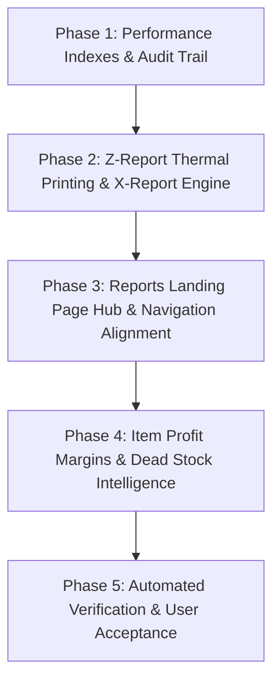

# DataPOS — Comprehensive Reporting Suite Architectural Review & Implementation Plan v2

**Document Reference:** `docs/reports_implementation_plan_v2.md`  
**Repository:** `https://github.com/shwepyithit568-commits/DataPOS`  
**Target Market:** Myanmar Retail, Mobile/Electronics, Repair/Service, Wholesale & SME Businesses  
**Review Date:** 2026-09-10  
**Baseline Git Branch:** `main`  
**Baseline Git HEAD SHA:** `2728c477c6670e159df779773bc6b03ab49430d2`  
**Working Tree Status:** Clean (`git status --short` = 0 uncommitted files)  
**Lead Architect:** Antigravity (Senior Laravel Architect & Myanmar SME Systems Specialist)  
**Status:** Approved master plan with Phase 2 Daily Closing/X–Z implementation partially delivered after this historical baseline
**Current-use note:** The baseline SHA and test output below are point-in-time planning evidence. Before further implementation, compare this plan with current code and tests. Do not treat planned Reports Hub, profitability, dead-stock or consolidation work as implemented.

---

## Baseline Verification Commands & Evidence

Targeted automated reporting test baseline executed in the local PHP 8.2 environment:

```text
$ .\vendor\bin\phpunit tests\Feature\PosReportsRevampTest.php tests\Feature\SalesAnalyticsTest.php tests\Feature\Admin\DebtAgingTest.php tests\Feature\Admin\InventoryValuationTest.php tests\Feature\POS\CashierShiftTest.php tests\Feature\POS\CommercialTaxTest.php tests\Feature\POS\DailyClosingTest.php tests\Feature\POS\PaymentMethodReconciliationTest.php tests\Feature\POS\PosReportTest.php

PHPUnit 11.5.56 by Sebastian Bergmann and contributors.
Runtime:       PHP 8.2.12
Configuration: D:\xmapp\htdocs\DataPOS\phpunit.xml

................................................................. 65 / 81 ( 80%)
................                                                  81 / 81 (100%)

Time: 00:06.793, Memory: 76.00 MB
OK (81 tests, 332 assertions)
```

---

## 1. Current-State Inventory of Reports

| Report Name | Route Name | Current Status | Findings & Deficiencies |
|:---|:---|:---:|:---|
| **POS Sales Invoices** | `pos.reports.sales` | **Implemented** | Functional listing of sales invoices, cashier filter, and date ranges. Includes an embedded `$methods` payment summary array, overlapping with the payments report. |
| **Payment Method Reconciliation** | `pos.reports.payments` | **Duplicate / Overlapping** | Reconciles payments across sales and refunds. 80% redundant with `pos.reports.sales` summary. |
| **Cashier Shifts / Register** | `pos.reports.cash` | **Implemented** | Lists shift open/close times, opening float, cash sales, cash-in, cash-out, and drawer discrepancy. |
| **Stock Balances** | `pos.reports.stock` | **Duplicate / Overlapping** | Lists on-hand inventory, unit cost, and retail price. Heavily overlaps with `inventory_valuation`. |
| **Service & Repairs** | `pos.reports.services` | **Implemented** | Displays repair job tickets, parts used, labor charge, and technician revenue. Gated by `service.repair_jobs`. |
| **Commercial Tax** | `pos.reports.tax` | **Implemented** | Calculates taxable sales, tax-exempt sales, total tax collected, and net sales with TIN badge and Excel/CSV export. |
| **Business Reconciliation** | `pos.reports.reconciliation` | **Implemented** | Single-Source-of-Truth audit verifying stock equation ($\Delta = 0$) and cash drawer equation. |
| **Sales Analytics & Charts** | `store.admin.sales_analytics.index` | **Implemented** | Hourly peak sales heatmap, category breakdowns, day-of-week trends, and CSV export. |
| **Inventory Valuation** | `store.admin.inventory_valuation.index` | **Implemented** | Moving-average/WAC cost valuation, potential retail revenue, unrealized profit margin, and category/brand breakdown. |
| **Debt Aging (AR)** | `store.admin.debt_aging.index` | **Implemented** | Customer receivables aging (Current, 31-60, 61-90, 90+ days), debt collection history, and print view. |
| **Profit & Loss (P&L)** | `store.admin.profit_loss.index` | **Implemented** | Revenue, COGS, gross profit, operating expenses, and net profit. Currently isolated in Finance sidebar group. |
| **Daily Closing (Z-Report)** | `pos.closing.index` | **Partial** | Backend service (`DailyClosingService`) and drawer math are robust, but lacks 80mm/58mm ESC/POS thermal printing and is hidden in POS sales submenu instead of Reports. |
| **Item-wise Profit Margins** | *None* | **Missing** | No report currently breaks down Gross Profit and Margin % per individual SKU/Product. |
| **Dead Stock & Reorder** | *None* | **Missing** | No report identifies dead stock (items with zero sales over 30/60/90 days) tying up capital, or low stock reorder advice. |

---

## 2. Exhaustive Route → Controller → Model → View → Permission → Test Mapping

| Route URI | Named Route | Controller & Action | Service / Domain Layer | Primary Models & Tables | Blade View | Required Permission / Capability | Test Suite |
|:---|:---|:---|:---|:---|:---|:---|:---|
| `/store/{s}/pos/reports/sales` | `pos.reports.sales` | `PosReportController@sales` | `PosReportService@salesReport` | `PosSale`, `PosPayment`, `PosSaleItem` | `pos.reports.sales` | `reports_sales.view` | `PosReportTest` |
| `/store/{s}/pos/reports/payments` | `pos.reports.payments` | `PosReportController@payments` | `PosReportService@paymentMethodReconciliation` | `PosPayment`, `PosReturnPayment` | `pos.reports.payments` | `reports_sales.view` | `PaymentMethodReconciliationTest` |
| `/store/{s}/pos/reports/cash` | `pos.reports.cash` | `PosReportController@cash` | `PosReportService@cashReport` | `CashierShift`, `CashMovement` | `pos.reports.cash` | `reports_cash.view` | `PosReportTest` |
| `/store/{s}/pos/reports/stock` | `pos.reports.stock` | `PosReportController@stock` | `PosReportService@stockReport` | `InventoryBalance`, `Product` | `pos.reports.stock` | `stock_balance.view` | `PosReportTest` |
| `/store/{s}/pos/reports/services` | `pos.reports.services` | `PosReportController@services` | `PosReportService@serviceJobsReport` | `ServiceJob`, `ServiceJobItem` | `pos.reports.services` | `reports_services.view`<br>`cap:service.repair_jobs` | `PosReportTest` |
| `/store/{s}/pos/reports/tax` | `pos.reports.tax` | `PosReportController@tax` | `PosReportService@taxReport` | `PosSale`, `PosSaleItem` | `pos.reports.tax` | `reports_sales.view` | `CommercialTaxTest` |
| `/store/{s}/pos/reports/reconciliation` | `pos.reports.reconciliation` | `PosReportController@reconciliation` | `BusinessReconciliationService` | `InventoryMovement`, `CashierShift` | `pos.reports.reconciliation` | `stock_reconciliation.view` | `PosReportTest` |
| `/store/{s}/admin/reports/sales-analytics` | `store.admin.sales_analytics.index` | `SalesAnalyticsController@index` | Direct Eloquent Query | `PosSale`, `PosSaleItem`, `Category` | `admin.sales_analytics.index` | `sales_analytics.view` | `SalesAnalyticsTest` |
| `/store/{s}/admin/reports/inventory-valuation` | `store.admin.inventory_valuation.index` | `InventoryValuationController@index` | `InventoryValuationService` | `InventoryBalance`, `Product`, `Category` | `admin.inventory_valuation.index` | `inventory_valuation.view` | `InventoryValuationTest` |
| `/store/{s}/admin/reports/debt-aging` | `store.admin.debt_aging.index` | `DebtAgingController@index` | `CustomerDebtService` | `CustomerDebt`, `CustomerDebtPayment` | `admin.debt_aging.index` | `debt_aging.view` | `DebtAgingTest` |
| `/store/{s}/admin/profit-loss` | `store.admin.profit_loss.index` | `ProfitLossController@index` | `ProfitLossService` | `PosSale`, `Expense`, `InventoryMovement` | `admin.profit_loss.index` | `profit_loss.view`<br>`role:store_owner,store_manager` | `PosReportsRevampTest` |
| `/store/{s}/pos/closing` | `pos.closing.index` | `DailyClosingController@index` | `DailyClosingService`<br>`PeriodLockService` | `DailyClosing`, `CashierShift`, `PosPayment` | `pos.closing` | `pos_closing.view`<br>`cap:operations.cashier_shifts` | `DailyClosingTest` |

---

## 3. Single Source-of-Truth Financial Definitions

All financial calculations must utilize PHP `bcmath` with strict 2-decimal precision (4-decimal for unit cost) in Myanmar Kyats (MMK):

$$\begin{aligned}
\text{Gross Sales} &= \sum_{\text{posted sales}} \left( \sum_{\text{items}} (\text{unit\_price} \times \text{quantity}) \right) \\
\text{Order Discounts} &= \sum_{\text{posted sales}} \text{pos\_sales.discount} \\
\text{Price Override Discounts} &= \sum_{\text{posted items}} \left( (\text{original\_unit\_price} - \text{unit\_price}) \times \text{quantity} \right) \quad \text{where } \text{unit\_price} < \text{original} \\
\text{Total Discounts} &= \text{Order Discounts} + \text{Price Override Discounts} \\
\text{Returns / Refunds} &= \sum_{\text{posted returns}} \text{pos\_returns.total} \\
\text{Commercial Tax (Exclusive)} &= \sum_{\text{taxable items}} \left( \text{line\_total} \times \frac{\text{tax\_rate}}{100} \right) \\
\text{Commercial Tax (Inclusive)} &= \sum_{\text{taxable items}} \left( \text{line\_total} \times \frac{\text{tax\_rate}}{100 + \text{tax\_rate}} \right) \\
\text{Net Sales (Revenue)} &= \text{Gross Sales} - \text{Total Discounts} - \text{Returns} - \text{Tax (Exclusive)} \\
\text{COGS (Cost of Goods Sold)} &= \sum_{\text{posted sales}} (\text{pos\_sale\_items.unit\_cost} \times \text{quantity}) - \sum_{\text{posted returns}} (\text{pos\_return\_items.unit\_cost} \times \text{quantity}) \\
\text{Gross Profit} &= \text{Net Sales} - \text{COGS} \\
\text{Gross Profit Margin \%} &= \begin{cases} \left( \frac{\text{Gross Profit}}{\text{Net Sales}} \right) \times 100 & \text{if Net Sales} > 0 \\ 0.00\% & \text{otherwise} \end{cases} \\
\text{Expected Drawer Cash} &= \text{Opening Float} + \text{Cash Sales} + \text{Cash Debt Collections} + \text{Cash In} - \text{Cash Refunds} - \text{Drawer Expenses} - \text{Cash Out} \\
\text{Counted Cash} &= \text{Physical currency counted by Cashier at shift/day close} \\
\text{Cash Variance} &= \text{Counted Cash} - \text{Expected Drawer Cash} \quad (\text{Over if } > 0, \text{Short if } < 0)
\end{aligned}$$

---

## 4. Architectural Distinction: X-Report vs. Z-Report

| Dimension | X-Report (Midday / Shift Reading) | Z-Report (Daily Closing & Period Lock) |
|:---|:---|:---|
| **Purpose** | Interim snapshot of drawer and sales during active business hours. | Final fiscal sign-off and legal record of the complete business day. |
| **Frequency** | On-demand; repeatable multiple times per shift or day without side-effects. | Executed exactly **once** per business date per store. |
| **System Mutability** | **Read-Only:** Does not lock any records; transactions continue uninterrupted. | **Period-Locking:** Invokes `PeriodLockService::assertDateNotLocked`, freezing the business date. |
| **Approval Flow** | Cashier self-service; no managerial approval required. | Submitted by Cashier $\rightarrow$ Verified & Approved by Store Manager/Owner. |
| **Database State** | Ephemeral calculation in memory; no database row committed. | Persisted in `daily_closings` table with JSON snapshots of counted, expected, and variance. |
| **Output Media** | 58mm/80mm ESC/POS slip marked `"*** X-REPORT (READING ONLY) ***"`. | 80mm ESC/POS slip or signed A4 sheet marked `"*** Z-REPORT (FINAL CLOSING) ***"`. |
| **Reopening Policy** | N/A (Nothing is closed). | Requires Store Manager password, written justification ($\ge 5$ chars), and audit log entry. |

---

## 5. Myanmar Payment-Method Reconciliation Design

### 5.1 Authoritative Payment Methods Present in Repository
Based strictly on existing database schema and migrations (`pos_payments`, `daily_closings`, `cashier_shifts`, and `pos_returns`):
1. `cash` — Physical Myanmar Kyat banknotes in cash drawer.
2. `kpay` (KBZPay) — Mobile wallet / merchant QR transaction.
3. `wavepay` — Wave Money wallet transaction.
4. `cb_pay` — CB Bank Pay mobile transaction.
5. `mmqr` — Universal Myanmar Standard QR payment.
6. `bank_transfer` — Direct bank account wire transfer (KBZ, AYA, CB).
7. `credit` — Customer accounts receivable (Store Credit / Debt).

### 5.2 Split Payments & Audit Trail
Every posted `PosSale` relates to one or more `PosPayment` rows:
- `PosPayment` stores `method`, `amount`, `change_given`, `reference` (Transaction ID / Last 4 digits), and `created_by`.
- Reconciliation aggregates all payments by method, subtracts refunds from `pos_return_payments`, and displays them alongside transaction reference numbers to permit 1-to-1 matching against KBZPay/WavePay merchant app statements.

---

## 6. Proposed Three-Section Reports Landing Page Architecture

To avoid creating an unusable, deeply nested three-level sidebar, the system will maintain a clean 2-level sidebar:
`အစီရင်ခံစာနှင့် စာရင်းအင်း` (Reports & Analytics) in the sidebar will link directly to a unified **Reports Hub Dashboard** (`/store/{slug}/admin/reports`) featuring three intuitive, card-based operational sections:

```text
┌────────────────────────────────────────────────────────────────────────────────────────┐
│                          📊 REPORTS & ANALYTICS DASHBOARD                             │
├────────────────────────────────────────────────────────────────────────────────────────┤
│                                                                                        │
│  [ SECTION 1: နေ့စဉ် အရောင်းနှင့် ငွေစာရင်း (Daily Sales & Cash Operations) ]                 │
│  ┌─────────────────────────┐ ┌─────────────────────────┐ ┌─────────────────────────┐  │
│  │ 📅 နေ့စဉ် စာရင်းချုပ်       │ │ 🧾 အရောင်းနှင့် ငွေလက်ခံမှု  │ │ 💵 ငွေစာရင်း အဝင်အထွက်  │  │
│  │ (Daily Closing / Z-Rep) │ │ (Sales & Payments)      │ │ (Cashier Shift Register)│  │
│  └─────────────────────────┘ └─────────────────────────┘ └─────────────────────────┘  │
│                                                                                        │
│  [ SECTION 2: စတော့နှင့် အမြတ်အစွန်း (Inventory, Valuation & Margins) ]                   │
│  ┌─────────────────────────┐ ┌─────────────────────────┐ ┌─────────────────────────┐  │
│  │ 📦 လက်ကျန်စတော့နှင့် တန်ဖိုး │ │ 📈 ပစ္စည်းအလိုက် အမြတ်    │ │ ⚡ အရောင်းသွက်/စတော့သေ │  │
│  │ (Stock Valuation)       │ │ (Item Profit Margins)   │ │ (Fast & Dead Stock)     │  │
│  └─────────────────────────┘ └─────────────────────────┘ └─────────────────────────┘  │
│                                                                                        │
│  [ SECTION 3: စာရင်းချုပ်၊ အခွန် နှင့် အကြွေး (Audit, Tax & Financial Health) ]              │
│  ┌─────────────────────────┐ ┌─────────────────────────┐ ┌─────────────────────────┐  │
│  │ 👥 ဖောက်သည် အကြွေးစာရင်း   │ │ 🏛️ ကုန်သွယ်လုပ်ငန်းခွန်     │ │ ⚖️ လုပ်ငန်းတွက်ချက်မှု  │  │
│  │ (Customer Debt Aging)   │ │ (Commercial Tax 5%)     │ │ (Business Reconciliation│  │
│  └─────────────────────────┘ └─────────────────────────┘ └─────────────────────────┘  │
└────────────────────────────────────────────────────────────────────────────────────────┘
```

The sidebar will expose top-frequency operational shortcuts (`Daily Closing`, `Sales`, `Stock Valuation`, `Commercial Tax`) without visual clutter.

---

## 7. Consolidation & Backward-Compatible Redirect Strategy

To preserve existing cashier bookmarks, browser history, and automated test suites, **zero existing named routes will be removed**:

1. **`pos.reports.payments` $\rightarrow$ Unified Sales & Payment View:**
   - URL `/store/{slug}/pos/reports/payments` continues to resolve with HTTP 200.
   - The view integrates with `pos.reports.sales` under a dedicated "Payment Method Settlement" tab.
2. **`pos.reports.stock` $\rightarrow$ Inventory Valuation Consolidation:**
   - `/store/{slug}/pos/reports/stock` and `/store/{slug}/admin/reports/inventory-valuation` remain active aliases pointing to the unified stock and valuation dataset.
3. **`pos.closing.index` $\rightarrow$ Elevation to Reports Navigation:**
   - Keep route `pos.closing.index` at `/store/{slug}/pos/closing` while adding alias `/store/{slug}/admin/reports/daily-closing`.

---

## 8. Historical COGS Feasibility & Proof

### 8.1 Empirical Verification
Inspection of migration `2026_08_11_000006_create_pos_sales_tables.php` and `PosSaleService.php` confirms:
- Table `pos_sale_items` contains an explicit column:
  ```php
  $table->decimal('unit_cost', 14, 4)->nullable(); // COGS carried at posting
  ```
- During sale posting (`PosSaleService::post()`, line 1149):
  ```php
  $unitCost = $this->costing->resolveUnitCost(...);
  PosSaleItem::create([
      ...
      'unit_cost' => $unitCost,
  ]);
  ```
- Corresponding `inventory_movements` record of type `pos_sale` carries the exact identical `$unitCost`.

### 8.2 Architectural Rule for Historical Profit
**Strict Policy:** Historical profit calculations must **NEVER** query `products.purchase_cost` (which represents current replacement price).
- **Rule 1:** Use `pos_sale_items.unit_cost` as the primary authoritative source.
- **Rule 2:** If `pos_sale_items.unit_cost` is `NULL` (legacy uncosted items pre-dating weighted-average costing), look up the matching `inventory_movements.unit_cost` where `source_type = 'pos_sale'` and `source_id = sale.id`.
- **Rule 3:** If no movement cost exists, flag the item as `Uncosted Historical Record` with `cost = 0.00` and display an audit warning badge rather than corrupting ledger history.

---

## 9. Dead Stock Definition & Data Feasibility

### 9.1 Mathematical Definition
An inventory item is classified as **Dead Stock** if and only if:
1. Current On-Hand Balance $> 0$ (`inventory_balances.quantity_on_hand > 0`).
2. The product has **zero posted sales** within a configurable inactivity window ($N \in \{30, 60, 90, 180\}$ calendar days):
   $$\text{Last Sold Date} < (\text{Current Date} - N \text{ days}) \quad \lor \quad (\text{No Sales Recorded} \land \text{Created Date} < (\text{Current Date} - N \text{ days}))$$
3. Tied-Up Capital is computed as:
   $$\text{Tied-Up Capital} = \text{inventory\_balances.quantity\_on\_hand} \times \text{inventory\_balances.unit\_cost}$$

### 9.2 SQL Feasibility (SQLite & MySQL Compatible)
No new tables required. Query utilizes existing `products`, `inventory_balances`, and `pos_sale_items`:
```sql
SELECT 
    p.id, p.name, p.sku, b.quantity_on_hand, b.unit_cost,
    (b.quantity_on_hand * b.unit_cost) AS capital_tied_up,
    MAX(s.posted_at) AS last_sale_at,
    CAST(ROUND(JULIANDAY('now') - JULIANDAY(COALESCE(MAX(s.posted_at), p.created_at))) AS INTEGER) AS days_idle
FROM products p
JOIN inventory_balances b ON b.product_id = p.id
LEFT JOIN pos_sale_items psi ON psi.product_id = p.id
LEFT JOIN pos_sales s ON s.id = psi.pos_sale_id AND s.status = 'posted'
WHERE p.store_id = :store_id 
  AND b.quantity_on_hand > 0
GROUP BY p.id, p.name, p.sku, b.quantity_on_hand, b.unit_cost, p.created_at
HAVING last_sale_at IS NULL OR last_sale_at < :cutoff_date
ORDER BY capital_tied_up DESC;
```

---

## 10. Store-Configured Tax Formula & Dynamic Labeling

### 10.1 Zero Hardcoding Rule
- Commercial tax rates must **NEVER** be hardcoded as `5%` in PHP classes, Blade views, or translation strings.
- The tax rate is dynamically retrieved from store settings:
  ```php
  $taxRate = (float) $store->setting?->getPosSetting('default_tax_rate', 5.0);
  $taxType = (string) $store->setting?->getPosSetting('tax_type', 'exclusive');
  $tinNumber = (string) $store->setting?->getPosSetting('tax_id_number', '');
  ```
- Individual products can override the rate via `products.tax_rate` or declare exemption via `products.is_taxable = false`.

### 10.2 Dynamic Labels
- Translation key: `messages.commercial_tax_with_rate` $\rightarrow$ `:name (:rate%)`.
- Renders as `ကုန်သွယ်လုပ်ငန်းခွန် (5%)` or `Commercial Tax (5%)` based on actual store configuration.

---

## 11. Store Scope, Roles, Permissions & Channel Isolation

1. **Store-Scope Isolation:**
   - Every report query strictly filters by `store_id = $store->id`.
   - Middleware `StoreContext` guarantees that cashier/manager tokens cannot access peer-store data across multi-tenant deployments.
2. **Role & Permission Matrix:**
   - `Cashier / Staff`: Restricted to `pos.closing.index` (Count submission & X-Report view), `pos.reports.sales` (own shift only).
   - `Store Manager`: Full access to all reports, daily closing approval, date reopening, and variance sign-off.
   - `Store Owner`: Access to Profit & Loss, ledger reconciliation, and tax exports.
3. **Channel Guarding:**
   - POS reports verify `required_channel => Store::CHANNEL_POS`.
   - Storefront web sales are distinguished by `channel = 'storefront'`.

---

## 12. Required Database Migrations & Performance Indexes

To ensure sub-second reporting speed when querying hundreds of thousands of historical records, the following composite indexes must be added:

### 12.1 Proposed Migration: `add_performance_indexes_to_reporting_tables`
```php
Schema::table('pos_sales', function (Blueprint $table) {
    // Accelerates date-range reporting filtered by store and status
    $table->index(['store_id', 'status', 'posted_at'], 'idx_sales_report_lookup');
    $table->index(['store_id', 'cashier_id', 'posted_at'], 'idx_sales_cashier_lookup');
});

Schema::table('pos_payments', function (Blueprint $table) {
    // Accelerates payment-method reconciliation across date spans
    $table->index(['pos_sale_id', 'method'], 'idx_payments_method_lookup');
});

Schema::table('pos_sale_items', function (Blueprint $table) {
    // Accelerates item-wise profit and best-seller analysis
    $table->index(['product_id', 'created_at'], 'idx_items_product_velocity');
});
```

### 12.2 Rollback & Data Preservation Guarantee
- Down migration safely drops indexes via `dropIndex()` without dropping tables or altering columns.
- Zero column removals or destructive schema mutations.

---

## 13. Phased File-Level Implementation Roadmap



### Phase 1: Database Optimization & Historical Integrity
- Create migration `2026_09_10_000002_add_reporting_composite_indexes.php`.
- Audit `pos_sale_items.unit_cost` fallback logic in `PosReportService`.

### Phase 2: Z-Report Thermal Slip & X-Report Engine
- Update `app/POS/Services/DailyClosingService.php` to generate ESC/POS bytes for 80mm and 58mm thermal printers.
- Update `resources/views/pos/closing.blade.php` to add printable X-Reading slip and formal Z-Closing voucher.

### Phase 3: Reports Landing Page Hub & Sidebar Consolidation
- Create `resources/views/admin/reports/index.blade.php` (Three-section card hub).
- Create `app/Http/Controllers/Admin/ReportHubController.php`.
- Update `app/Services/AdminNavigationService.php` to link cleanly to the Hub.

### Phase 4: High-Value SME Profit & Stock Velocity Reports
- Add `itemProfitMarginsReport()` and `deadStockReport()` to `app/POS/Services/PosReportService.php`.
- Create Blade views `resources/views/pos/reports/profit_margins.blade.php` and `resources/views/pos/reports/dead_stock.blade.php`.

### Phase 5: Verification & Localization
- Add complete translation keys in `lang/my/messages.php`, `lang/en/messages.php`, and `lang/zh_CN/messages.php`.
- Run full PHPUnit suite and browser verification subagents.

---

## 14. Complete Automated Test & Browser QA Matrix

### 14.1 Automated Test Matrix
1. `Tests\Feature\POS\DailyClosingTest`:
   - `test_cashier_can_submit_daily_closing_counts`
   - `test_manager_approval_locks_business_date`
   - `test_x_report_reading_does_not_lock_period`
   - `test_locked_period_blocks_new_sales_and_returns`
2. `Tests\Feature\POS\PosReportTest`:
   - `test_sales_and_payment_reconciliation_exact_match`
   - `test_item_profit_margins_uses_snapshotted_unit_cost`
   - `test_dead_stock_identifies_inactive_inventory_accurately`
   - `test_large_date_range_queries_utilize_composite_indexes`
3. `Tests\Feature\POS\CommercialTaxTest`:
   - `test_commercial_tax_calculates_dynamically_from_store_rate`
   - `test_tax_exempt_products_excluded_from_taxable_base`

### 14.2 Browser QA Matrix
1. **Responsive Viewport Test:** Verify 1280px Desktop, 768px Tablet, and 390px Mobile layout for all report screens.
2. **Thermal Receipt Test:** Trigger 80mm and 58mm daily closing slips and verify raw byte layout.
3. **Excel & CSV Export Test:** Download `.xlsx` and `.csv` files and verify UTF-8 BOM encoding and Burmese font rendering in Microsoft Excel.

---

## 15. Known Limitations, Ambiguities & Decisions Requiring Owner Approval

> [!IMPORTANT]
> ### Decisions Requiring Store Owner / Project Owner Approval:
> 
> 1. **Dead Stock Default Cutoff:** Should the default inactivity threshold for dead stock be set to **60 days** or **90 days** for Myanmar mobile and electronics shops?
> 2. **X-Report Cashier Permission:** Should junior Cashiers be allowed to print an X-Reading slip midday, or should this require Manager PIN authorization to prevent drawer skimming?
> 3. **Consolidation Timing:** Do you approve consolidating the standalone `Payments` link into the `Sales & Collections` tabbed view, preserving all existing URLs as aliases?
> 
> **Approval Gate:** In compliance with the Master Plan and Strict Craftsmanship Policy, no source code, migrations, or database changes will occur until Boss approves this plan.
